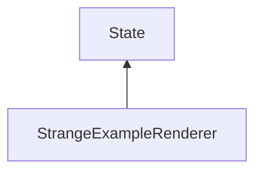

| public |
{:.api_label}

#### Inheritance Graph

## Description

[ [StrangeExampleRenderer](classMinSG_1_1StrangeExampleRenderer) ]|> [ [State](classMinSG_1_1State) ]

## Public Functions

|
| ------: | ----------------- |
|  | |
|  | **[StrangeExampleRenderer](#classMinSG_1_1StrangeExampleRenderer_1a1ebbdc998b63bcf69ddb4518974e13e1)**() |
|  | |
|  | **[~StrangeExampleRenderer](#classMinSG_1_1StrangeExampleRenderer_1a7804a5be0e20427da1c909b0191a1c7e)**() |
|  | |
| [StrangeExampleRenderer](classMinSG_1_1StrangeExampleRenderer) * | **[clone](#classMinSG_1_1StrangeExampleRenderer_1aa927c0b9e1d0c645033539f603e5e2ac)**() const   Create a duplicate of this [State](classMinSG_1_1State) object. |
{: .nohead .nowrap1 .api_section }

-------------------------------------------------------------------

## Documentation

### <small>function</small>  MinSG::StrangeExampleRenderer::StrangeExampleRenderer {#classMinSG_1_1StrangeExampleRenderer_1a1ebbdc998b63bcf69ddb4518974e13e1}

| public |
{:.api_label}

|
| ------: | ----------------- |
|  |
|  **[StrangeExampleRenderer](#classMinSG_1_1StrangeExampleRenderer_1a1ebbdc998b63bcf69ddb4518974e13e1)**( |  ) |
{: .nohead .nowrap1 .api_doc }

Defined in `MinSG/Ext/States/StrangeExampleRenderer.h:27`{:style="float: right"}

-------------------------------------------------------------------

### <small>function</small>  MinSG::StrangeExampleRenderer::~StrangeExampleRenderer {#classMinSG_1_1StrangeExampleRenderer_1a7804a5be0e20427da1c909b0191a1c7e}

| public | virtual |
{:.api_label}

|
| ------: | ----------------- |
|  |
|  **[~StrangeExampleRenderer](#classMinSG_1_1StrangeExampleRenderer_1a7804a5be0e20427da1c909b0191a1c7e)**( |  ) |
{: .nohead .nowrap1 .api_doc }

Defined in `MinSG/Ext/States/StrangeExampleRenderer.h:28`{:style="float: right"}

-------------------------------------------------------------------

### <small>function</small>  MinSG::StrangeExampleRenderer::clone {#classMinSG_1_1StrangeExampleRenderer_1aa927c0b9e1d0c645033539f603e5e2ac}

| public | const | virtual |
{:.api_label}

|
| ------: | ----------------- |
|  |
| [StrangeExampleRenderer](classMinSG_1_1StrangeExampleRenderer) * **[clone](#classMinSG_1_1StrangeExampleRenderer_1aa927c0b9e1d0c645033539f603e5e2ac)**( |  ) const |
{: .nohead .nowrap1 .api_doc }

Create a duplicate of this [State](classMinSG_1_1State) object.

Defined in `MinSG/Ext/States/StrangeExampleRenderer.h:30`{:style="float: right"}

-------------------------------------------------------------------

