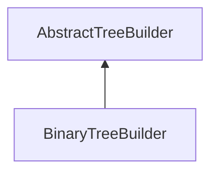

| public |
{:.api_label}

#### Inheritance Graph

## Description

## Public Functions

|
| ------: | ----------------- |
|  | |
|  | **[BinaryTreeBuilder](#classMinSG_1_1TreeBuilder_1_1BinaryTreeBuilder_1a2e34f6951371fe2b6e5509da438b3c40)**( [Util::GenericAttributeMap](classUtil_1_1GenericAttributeMap) & options) |
|  | |
|  | **[~BinaryTreeBuilder](#classMinSG_1_1TreeBuilder_1_1BinaryTreeBuilder_1a5c4e3a449a637c6a88dc3a08983b9764)**() |
{: .nohead .nowrap1 .api_section }

## Protected Functions

|
| ------: | ----------------- |
|  | |
| [list_t](classMinSG_1_1TreeBuilder_1_1AbstractTreeBuilder#classMinSG_1_1TreeBuilder_1_1AbstractTreeBuilder_1a4d08192ec6664e44803fec38be3c5dbf) | **[split](#classMinSG_1_1TreeBuilder_1_1BinaryTreeBuilder_1a247de6d3cdb39dbe1bd61f9c72452367)**( [NodeWrapper](structMinSG_1_1TreeBuilder_1_1AbstractTreeBuilder_1_1NodeWrapper) & source) |
{: .nohead .nowrap1 .api_section }

-------------------------------------------------------------------

## Documentation

### <small>function</small>  MinSG::TreeBuilder::BinaryTreeBuilder::BinaryTreeBuilder {#classMinSG_1_1TreeBuilder_1_1BinaryTreeBuilder_1a2e34f6951371fe2b6e5509da438b3c40}

| public |
{:.api_label}

|
| ------: | ----------------- |
|  |
|  **[BinaryTreeBuilder](#classMinSG_1_1TreeBuilder_1_1BinaryTreeBuilder_1a2e34f6951371fe2b6e5509da438b3c40)**( |  [Util::GenericAttributeMap](classUtil_1_1GenericAttributeMap) & | **options** ) |
{: .nohead .nowrap1 .api_doc }

Defined in `MinSG/Ext/TreeBuilder/BinaryTreeBuilder.h:25`{:style="float: right"}

-------------------------------------------------------------------

### <small>function</small>  MinSG::TreeBuilder::BinaryTreeBuilder::~BinaryTreeBuilder {#classMinSG_1_1TreeBuilder_1_1BinaryTreeBuilder_1a5c4e3a449a637c6a88dc3a08983b9764}

| public | virtual |
{:.api_label}

|
| ------: | ----------------- |
|  |
|  **[~BinaryTreeBuilder](#classMinSG_1_1TreeBuilder_1_1BinaryTreeBuilder_1a5c4e3a449a637c6a88dc3a08983b9764)**( |  ) |
{: .nohead .nowrap1 .api_doc }

Defined in `MinSG/Ext/TreeBuilder/BinaryTreeBuilder.h:26`{:style="float: right"}

-------------------------------------------------------------------

### <small>function</small>  MinSG::TreeBuilder::BinaryTreeBuilder::split {#classMinSG_1_1TreeBuilder_1_1BinaryTreeBuilder_1a247de6d3cdb39dbe1bd61f9c72452367}

| protected | virtual |
{:.api_label}

|
| ------: | ----------------- |
|  |
| [list_t](classMinSG_1_1TreeBuilder_1_1AbstractTreeBuilder#classMinSG_1_1TreeBuilder_1_1AbstractTreeBuilder_1a4d08192ec6664e44803fec38be3c5dbf) **[split](#classMinSG_1_1TreeBuilder_1_1BinaryTreeBuilder_1a247de6d3cdb39dbe1bd61f9c72452367)**( |  [NodeWrapper](structMinSG_1_1TreeBuilder_1_1AbstractTreeBuilder_1_1NodeWrapper) & | **source** ) |
{: .nohead .nowrap1 .api_doc }

method to split the source should not set up the relationships between source an new created group nodes

Defined in `MinSG/Ext/TreeBuilder/BinaryTreeBuilder.h:30`{:style="float: right"}

-------------------------------------------------------------------

