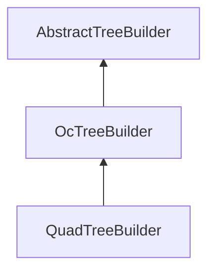

| public |
{:.api_label}

#### Inheritance Graph

## Description

## Protected Attributes

|
| ------: | ----------------- |
|  | |
| bool | **[exactCubes](#classMinSG_1_1TreeBuilder_1_1OcTreeBuilder_1ab075a032b1f8248142dd0deaf2b746d1)**  |
{: .nohead .nowrap1 .api_section }

## Public Functions

|
| ------: | ----------------- |
|  | |
|  | **[OcTreeBuilder](#classMinSG_1_1TreeBuilder_1_1OcTreeBuilder_1a2bc2eb2c8a013acd19f73f84a3d517be)**( [Util::GenericAttributeMap](classUtil_1_1GenericAttributeMap) & options) |
|  | |
|  | **[~OcTreeBuilder](#classMinSG_1_1TreeBuilder_1_1OcTreeBuilder_1a269c4791b1c254ed9a05bda433dba190)**() |
{: .nohead .nowrap1 .api_section }

## Protected Functions

|
| ------: | ----------------- |
|  | |
| [list_t](classMinSG_1_1TreeBuilder_1_1AbstractTreeBuilder#classMinSG_1_1TreeBuilder_1_1AbstractTreeBuilder_1a4d08192ec6664e44803fec38be3c5dbf) | **[split](#classMinSG_1_1TreeBuilder_1_1OcTreeBuilder_1a91262413147213859b6506b61e371a6f)**( [NodeWrapper](structMinSG_1_1TreeBuilder_1_1AbstractTreeBuilder_1_1NodeWrapper) & source) |
{: .nohead .nowrap1 .api_section }

-------------------------------------------------------------------

## Documentation

### <small>variable</small>  MinSG::TreeBuilder::OcTreeBuilder::exactCubes {#classMinSG_1_1TreeBuilder_1_1OcTreeBuilder_1ab075a032b1f8248142dd0deaf2b746d1}

| protected |
{:.api_label}

|
| ------: | ----------------- |
|  |
| bool **[exactCubes](#classMinSG_1_1TreeBuilder_1_1OcTreeBuilder_1ab075a032b1f8248142dd0deaf2b746d1)**  |
{: .nohead .nowrap1 .api_doc }

Defined in `MinSG/Ext/TreeBuilder/OcTreeBuilder.h:32`{:style="float: right"}

-------------------------------------------------------------------

### <small>function</small>  MinSG::TreeBuilder::OcTreeBuilder::OcTreeBuilder {#classMinSG_1_1TreeBuilder_1_1OcTreeBuilder_1a2bc2eb2c8a013acd19f73f84a3d517be}

| public |
{:.api_label}

|
| ------: | ----------------- |
|  |
|  **[OcTreeBuilder](#classMinSG_1_1TreeBuilder_1_1OcTreeBuilder_1a2bc2eb2c8a013acd19f73f84a3d517be)**( |  [Util::GenericAttributeMap](classUtil_1_1GenericAttributeMap) & | **options** ) |
{: .nohead .nowrap1 .api_doc }

Defined in `MinSG/Ext/TreeBuilder/OcTreeBuilder.h:25`{:style="float: right"}

-------------------------------------------------------------------

### <small>function</small>  MinSG::TreeBuilder::OcTreeBuilder::~OcTreeBuilder {#classMinSG_1_1TreeBuilder_1_1OcTreeBuilder_1a269c4791b1c254ed9a05bda433dba190}

| public | virtual |
{:.api_label}

|
| ------: | ----------------- |
|  |
|  **[~OcTreeBuilder](#classMinSG_1_1TreeBuilder_1_1OcTreeBuilder_1a269c4791b1c254ed9a05bda433dba190)**( |  ) |
{: .nohead .nowrap1 .api_doc }

Defined in `MinSG/Ext/TreeBuilder/OcTreeBuilder.h:26`{:style="float: right"}

-------------------------------------------------------------------

### <small>function</small>  MinSG::TreeBuilder::OcTreeBuilder::split {#classMinSG_1_1TreeBuilder_1_1OcTreeBuilder_1a91262413147213859b6506b61e371a6f}

| protected | virtual |
{:.api_label}

|
| ------: | ----------------- |
|  |
| [list_t](classMinSG_1_1TreeBuilder_1_1AbstractTreeBuilder#classMinSG_1_1TreeBuilder_1_1AbstractTreeBuilder_1a4d08192ec6664e44803fec38be3c5dbf) **[split](#classMinSG_1_1TreeBuilder_1_1OcTreeBuilder_1a91262413147213859b6506b61e371a6f)**( |  [NodeWrapper](structMinSG_1_1TreeBuilder_1_1AbstractTreeBuilder_1_1NodeWrapper) & | **source** ) |
{: .nohead .nowrap1 .api_doc }

method to split the source should not set up the relationships between source an new created group nodes

Defined in `MinSG/Ext/TreeBuilder/OcTreeBuilder.h:30`{:style="float: right"}

-------------------------------------------------------------------

