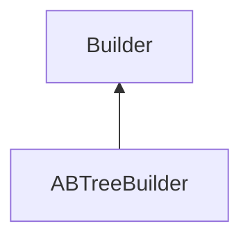

| public |
{:.api_label}

#### Inheritance Graph

## Description

Class that creates a [kDTree](classMinSG_1_1TriangleTrees_1_1kDTree) from a [MinSG](namespaceMinSG) scene given by its root node. It extracts the triangles needed by the [kDTree](classMinSG_1_1TriangleTrees_1_1kDTree) from meshes of the GeometryNodes inside the scene.

**Author**: Benjamin Eikel

**Date**: 2009-06-29

## Public Functions

|
| ------: | ----------------- |
|  | |
|  | **[ABTreeBuilder](#classMinSG_1_1TriangleTrees_1_1ABTreeBuilder_1aa7e84053233f90d6e55390504795ecbb)**(std::size_t _trianglesPerNode, float _allowedBBEnlargement) |
|  | |
| [TriangleTree](classMinSG_1_1TriangleTrees_1_1TriangleTree) * | **[buildTriangleTree](#classMinSG_1_1TriangleTrees_1_1ABTreeBuilder_1ad71f51753efe3c80dba968025ac7bede)**( [Rendering::Mesh](classRendering_1_1Mesh) * mesh) |
{: .nohead .nowrap1 .api_section }

-------------------------------------------------------------------

## Documentation

### <small>function</small>  MinSG::TriangleTrees::ABTreeBuilder::ABTreeBuilder {#classMinSG_1_1TriangleTrees_1_1ABTreeBuilder_1aa7e84053233f90d6e55390504795ecbb}

| public | inline | explicit |
{:.api_label}

|
| ------: | ----------------- |
|  |
|  **[ABTreeBuilder](#classMinSG_1_1TriangleTrees_1_1ABTreeBuilder_1aa7e84053233f90d6e55390504795ecbb)**( | std::size_t | **_trianglesPerNode**, |
| | float | **_allowedBBEnlargement** |
|   ) |
{: .nohead .nowrap1 .api_doc }

Defined in `MinSG/Ext/TriangleTrees/ABTreeBuilder.h:34`{:style="float: right"}

-------------------------------------------------------------------

### <small>function</small>  MinSG::TriangleTrees::ABTreeBuilder::buildTriangleTree {#classMinSG_1_1TriangleTrees_1_1ABTreeBuilder_1ad71f51753efe3c80dba968025ac7bede}

| public | virtual |
{:.api_label}

|
| ------: | ----------------- |
|  |
| [TriangleTree](classMinSG_1_1TriangleTrees_1_1TriangleTree) * **[buildTriangleTree](#classMinSG_1_1TriangleTrees_1_1ABTreeBuilder_1ad71f51753efe3c80dba968025ac7bede)**( |  [Rendering::Mesh](classRendering_1_1Mesh) * | **mesh** ) |
{: .nohead .nowrap1 .api_doc }

Create an [ABTree](classMinSG_1_1TriangleTrees_1_1ABTree) root by extracting geometry from*mesh*.

#### Parameters
**mesh**
:  Mesh containing geometry.

#### Returns
Root node of constructed [ABTree](classMinSG_1_1TriangleTrees_1_1ABTree) .

*See also*:  [ABTree::ABTree()](classMinSG_1_1TriangleTrees_1_1ABTree#classMinSG_1_1TriangleTrees_1_1ABTree_1abc3964ee5bd2bcdac1e69d75ac7efa88) 

Defined in `MinSG/Ext/TriangleTrees/ABTreeBuilder.h:45`{:style="float: right"}

-------------------------------------------------------------------

