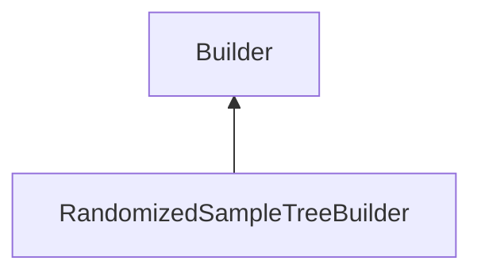

| public |
{:.api_label}

#### Inheritance Graph

## Description

Class that creates a randomized sample tree.

**Author**: Benjamin Eikel

**Date**: 2011-08-01

## Public Functions

|
| ------: | ----------------- |
|  | |
|  | **[RandomizedSampleTreeBuilder](#classMinSG_1_1TriangleTrees_1_1RandomizedSampleTreeBuilder_1af0023f25b1730727d513a96dcc9ede8a)**() |
|  | |
| [TriangleTree](classMinSG_1_1TriangleTrees_1_1TriangleTree) * | **[buildTriangleTree](#classMinSG_1_1TriangleTrees_1_1RandomizedSampleTreeBuilder_1ad180709d79fdab66c35d1f382cca808d)**( [Rendering::Mesh](classRendering_1_1Mesh) * mesh) |
{: .nohead .nowrap1 .api_section }

-------------------------------------------------------------------

## Documentation

### <small>function</small>  MinSG::TriangleTrees::RandomizedSampleTreeBuilder::RandomizedSampleTreeBuilder {#classMinSG_1_1TriangleTrees_1_1RandomizedSampleTreeBuilder_1af0023f25b1730727d513a96dcc9ede8a}

| public | inline | explicit |
{:.api_label}

|
| ------: | ----------------- |
|  |
|  **[RandomizedSampleTreeBuilder](#classMinSG_1_1TriangleTrees_1_1RandomizedSampleTreeBuilder_1af0023f25b1730727d513a96dcc9ede8a)**( |  ) |
{: .nohead .nowrap1 .api_doc }

Defined in `MinSG/Ext/TriangleTrees/RandomizedSampleTreeBuilder.h:31`{:style="float: right"}

-------------------------------------------------------------------

### <small>function</small>  MinSG::TriangleTrees::RandomizedSampleTreeBuilder::buildTriangleTree {#classMinSG_1_1TriangleTrees_1_1RandomizedSampleTreeBuilder_1ad180709d79fdab66c35d1f382cca808d}

| public | virtual |
{:.api_label}

|
| ------: | ----------------- |
|  |
| [TriangleTree](classMinSG_1_1TriangleTrees_1_1TriangleTree) * **[buildTriangleTree](#classMinSG_1_1TriangleTrees_1_1RandomizedSampleTreeBuilder_1ad180709d79fdab66c35d1f382cca808d)**( |  [Rendering::Mesh](classRendering_1_1Mesh) * | **mesh** ) |
{: .nohead .nowrap1 .api_doc }

Create a randomized sample tree root by extracting geometry from*mesh*.

#### Parameters
**mesh**
:  Mesh containing geometry.

#### Returns
Root node of constructed randomized sample tree.

*See also*:  [RandomizedSampleTree::RandomizedSampleTree()](classMinSG_1_1TriangleTrees_1_1RandomizedSampleTree#classMinSG_1_1TriangleTrees_1_1RandomizedSampleTree_1a34f694a1b362fc6ef92315b08b214a9a) 

Defined in `MinSG/Ext/TriangleTrees/RandomizedSampleTreeBuilder.h:41`{:style="float: right"}

-------------------------------------------------------------------

