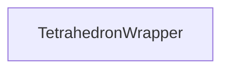

| public |
{:.api_label}

#### Inheritance Graph

## Description

## Public Types

|
| ------: | ----------------- |
|  | |
| typedef Point_t::vector_t::value_t | **[number_t](#classMinSG_1_1Triangulation_1_1TetrahedronWrapper_1a08517706ed7ced8c6279e5ea968c789a)**  |
{: .nohead .nowrap1 .api_section }

## Public Functions

|
| ------: | ----------------- |
|  | |
|  | **[TetrahedronWrapper](#classMinSG_1_1Triangulation_1_1TetrahedronWrapper_1a9241d92dda48f775629dbf41f2749c4d)**(const Point_t * p1, const Point_t * p2, const Point_t * p3, const Point_t * p4) |
|  | |
| const Point_t * | **[getA](#classMinSG_1_1Triangulation_1_1TetrahedronWrapper_1a3e80f4d233839f833add25318103b349)**() const |
|  | |
| const Point_t * | **[getB](#classMinSG_1_1Triangulation_1_1TetrahedronWrapper_1a872d0a4e8b4e8ce3f653c08b026cd576)**() const |
|  | |
| const Point_t * | **[getC](#classMinSG_1_1Triangulation_1_1TetrahedronWrapper_1a20f12fb2633e6ca4e466289eab417aa8)**() const |
|  | |
| const Point_t * | **[getD](#classMinSG_1_1Triangulation_1_1TetrahedronWrapper_1a17b3686fb9efd286922b4263841c01e6)**() const |
|  | |
| const [Geometry::Tetrahedron](classGeometry_1_1Tetrahedron) < [number_t](classMinSG_1_1Triangulation_1_1TetrahedronWrapper#classMinSG_1_1Triangulation_1_1TetrahedronWrapper_1a08517706ed7ced8c6279e5ea968c789a) > & | **[getTetrahedron](#classMinSG_1_1Triangulation_1_1TetrahedronWrapper_1a8f770106a79007292c983f3d8dabb62c)**() const |
{: .nohead .nowrap1 .api_section }

-------------------------------------------------------------------

## Documentation

### <small>typedef</small>  MinSG::Triangulation::TetrahedronWrapper::number_t {#classMinSG_1_1Triangulation_1_1TetrahedronWrapper_1a08517706ed7ced8c6279e5ea968c789a}

| public |
{:.api_label}

|
| ------: | ----------------- |
|  |
| typedef Point_t::vector_t::value_t **[number_t](#classMinSG_1_1Triangulation_1_1TetrahedronWrapper_1a08517706ed7ced8c6279e5ea968c789a)**  |
{: .nohead .nowrap1 .api_doc }

Defined in `MinSG/Ext/Triangulation/TetrahedronWrapper.h:26`{:style="float: right"}

-------------------------------------------------------------------

### <small>function</small>  MinSG::Triangulation::TetrahedronWrapper::TetrahedronWrapper {#classMinSG_1_1Triangulation_1_1TetrahedronWrapper_1a9241d92dda48f775629dbf41f2749c4d}

| public | inline |
{:.api_label}

|
| ------: | ----------------- |
|  |
|  **[TetrahedronWrapper](#classMinSG_1_1Triangulation_1_1TetrahedronWrapper_1a9241d92dda48f775629dbf41f2749c4d)**( | const Point_t * | **p1**, |
| | const Point_t * | **p2**, |
| | const Point_t * | **p3**, |
| | const Point_t * | **p4** |
|   ) |
{: .nohead .nowrap1 .api_doc }

Defined in `MinSG/Ext/Triangulation/TetrahedronWrapper.h:28`{:style="float: right"}

-------------------------------------------------------------------

### <small>function</small>  MinSG::Triangulation::TetrahedronWrapper::getA {#classMinSG_1_1Triangulation_1_1TetrahedronWrapper_1a3e80f4d233839f833add25318103b349}

| public | const | inline |
{:.api_label}

|
| ------: | ----------------- |
|  |
| const Point_t * **[getA](#classMinSG_1_1Triangulation_1_1TetrahedronWrapper_1a3e80f4d233839f833add25318103b349)**( |  ) const |
{: .nohead .nowrap1 .api_doc }

Defined in `MinSG/Ext/Triangulation/TetrahedronWrapper.h:44`{:style="float: right"}

-------------------------------------------------------------------

### <small>function</small>  MinSG::Triangulation::TetrahedronWrapper::getB {#classMinSG_1_1Triangulation_1_1TetrahedronWrapper_1a872d0a4e8b4e8ce3f653c08b026cd576}

| public | const | inline |
{:.api_label}

|
| ------: | ----------------- |
|  |
| const Point_t * **[getB](#classMinSG_1_1Triangulation_1_1TetrahedronWrapper_1a872d0a4e8b4e8ce3f653c08b026cd576)**( |  ) const |
{: .nohead .nowrap1 .api_doc }

Defined in `MinSG/Ext/Triangulation/TetrahedronWrapper.h:47`{:style="float: right"}

-------------------------------------------------------------------

### <small>function</small>  MinSG::Triangulation::TetrahedronWrapper::getC {#classMinSG_1_1Triangulation_1_1TetrahedronWrapper_1a20f12fb2633e6ca4e466289eab417aa8}

| public | const | inline |
{:.api_label}

|
| ------: | ----------------- |
|  |
| const Point_t * **[getC](#classMinSG_1_1Triangulation_1_1TetrahedronWrapper_1a20f12fb2633e6ca4e466289eab417aa8)**( |  ) const |
{: .nohead .nowrap1 .api_doc }

Defined in `MinSG/Ext/Triangulation/TetrahedronWrapper.h:50`{:style="float: right"}

-------------------------------------------------------------------

### <small>function</small>  MinSG::Triangulation::TetrahedronWrapper::getD {#classMinSG_1_1Triangulation_1_1TetrahedronWrapper_1a17b3686fb9efd286922b4263841c01e6}

| public | const | inline |
{:.api_label}

|
| ------: | ----------------- |
|  |
| const Point_t * **[getD](#classMinSG_1_1Triangulation_1_1TetrahedronWrapper_1a17b3686fb9efd286922b4263841c01e6)**( |  ) const |
{: .nohead .nowrap1 .api_doc }

Defined in `MinSG/Ext/Triangulation/TetrahedronWrapper.h:53`{:style="float: right"}

-------------------------------------------------------------------

### <small>function</small>  MinSG::Triangulation::TetrahedronWrapper::getTetrahedron {#classMinSG_1_1Triangulation_1_1TetrahedronWrapper_1a8f770106a79007292c983f3d8dabb62c}

| public | const | inline |
{:.api_label}

|
| ------: | ----------------- |
|  |
| const [Geometry::Tetrahedron](classGeometry_1_1Tetrahedron) < [number_t](classMinSG_1_1Triangulation_1_1TetrahedronWrapper#classMinSG_1_1Triangulation_1_1TetrahedronWrapper_1a08517706ed7ced8c6279e5ea968c789a) > & **[getTetrahedron](#classMinSG_1_1Triangulation_1_1TetrahedronWrapper_1a8f770106a79007292c983f3d8dabb62c)**( |  ) const |
{: .nohead .nowrap1 .api_doc }

Defined in `MinSG/Ext/Triangulation/TetrahedronWrapper.h:57`{:style="float: right"}

-------------------------------------------------------------------

