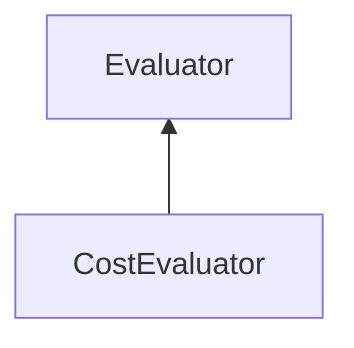

| public |
{:.api_label}

#### Inheritance Graph

## Description

Evaluator to test the visibility of objects and return a map with rendering costs, where each key in this map is the identifier of an object and the value is it's rendering cost.

**Author**: Benjamin Eikel

**Date**: 2009-01-25

## Public Functions

|
| ------: | ----------------- |
|  | |
|  | **[CostEvaluator](#classMinSG_1_1VisibilitySubdivision_1_1CostEvaluator_1ad5acb750d1249bdcf8daa7bbab409041)**( [DirectionMode](classMinSG_1_1Evaluators_1_1Evaluator#classMinSG_1_1Evaluators_1_1Evaluator_1addbbec5e92458641beb8a715f7904b1b)  mode) |
|  | |
|  | **[~CostEvaluator](#classMinSG_1_1VisibilitySubdivision_1_1CostEvaluator_1adaf02536e6f780c9c9c4503875b9ec2d)**() |
|  | |
| void | **[beginMeasure](#classMinSG_1_1VisibilitySubdivision_1_1CostEvaluator_1a72cbab1e007eba893cddd1975df11932)**() |
|  | |
| void | **[measure](#classMinSG_1_1VisibilitySubdivision_1_1CostEvaluator_1af501ff171ee9a1ef1ecccf5aa5e16684)**( [FrameContext](classMinSG_1_1FrameContext) & context,  [Node](classMinSG_1_1Node) & node, const [Geometry::Rect](namespaceGeometry#namespaceGeometry_1acedeea2f6bddd99f077df6f73901a875) & r) |
|  | |
| void | **[endMeasure](#classMinSG_1_1VisibilitySubdivision_1_1CostEvaluator_1ac5b6fa0440a24338ffb5a7df133863a3)**( [FrameContext](classMinSG_1_1FrameContext) & void) |
{: .nohead .nowrap1 .api_section }

-------------------------------------------------------------------

## Documentation

### <small>function</small>  MinSG::VisibilitySubdivision::CostEvaluator::CostEvaluator {#classMinSG_1_1VisibilitySubdivision_1_1CostEvaluator_1ad5acb750d1249bdcf8daa7bbab409041}

| public |
{:.api_label}

|
| ------: | ----------------- |
|  |
|  **[CostEvaluator](#classMinSG_1_1VisibilitySubdivision_1_1CostEvaluator_1ad5acb750d1249bdcf8daa7bbab409041)**( |  [DirectionMode](classMinSG_1_1Evaluators_1_1Evaluator#classMinSG_1_1Evaluators_1_1Evaluator_1addbbec5e92458641beb8a715f7904b1b)  | **mode** ) |
{: .nohead .nowrap1 .api_doc }

Defined in `MinSG/Ext/VisibilitySubdivision/CostEvaluator.h:37`{:style="float: right"}

-------------------------------------------------------------------

### <small>function</small>  MinSG::VisibilitySubdivision::CostEvaluator::~CostEvaluator {#classMinSG_1_1VisibilitySubdivision_1_1CostEvaluator_1adaf02536e6f780c9c9c4503875b9ec2d}

| public | virtual |
{:.api_label}

|
| ------: | ----------------- |
|  |
|  **[~CostEvaluator](#classMinSG_1_1VisibilitySubdivision_1_1CostEvaluator_1adaf02536e6f780c9c9c4503875b9ec2d)**( |  ) |
{: .nohead .nowrap1 .api_doc }

Defined in `MinSG/Ext/VisibilitySubdivision/CostEvaluator.h:38`{:style="float: right"}

-------------------------------------------------------------------

### <small>function</small>  MinSG::VisibilitySubdivision::CostEvaluator::beginMeasure {#classMinSG_1_1VisibilitySubdivision_1_1CostEvaluator_1a72cbab1e007eba893cddd1975df11932}

| public | virtual |
{:.api_label}

|
| ------: | ----------------- |
|  |
| void **[beginMeasure](#classMinSG_1_1VisibilitySubdivision_1_1CostEvaluator_1a72cbab1e007eba893cddd1975df11932)**( |  ) |
{: .nohead .nowrap1 .api_doc }

Defined in `MinSG/Ext/VisibilitySubdivision/CostEvaluator.h:40`{:style="float: right"}

-------------------------------------------------------------------

### <small>function</small>  MinSG::VisibilitySubdivision::CostEvaluator::measure {#classMinSG_1_1VisibilitySubdivision_1_1CostEvaluator_1af501ff171ee9a1ef1ecccf5aa5e16684}

| public | virtual |
{:.api_label}

|
| ------: | ----------------- |
|  |
| void **[measure](#classMinSG_1_1VisibilitySubdivision_1_1CostEvaluator_1af501ff171ee9a1ef1ecccf5aa5e16684)**( |  [FrameContext](classMinSG_1_1FrameContext) & | **context**, |
| |  [Node](classMinSG_1_1Node) & | **node**, |
| | const [Geometry::Rect](namespaceGeometry#namespaceGeometry_1acedeea2f6bddd99f077df6f73901a875) & | **r** |
|   ) |
{: .nohead .nowrap1 .api_doc }

Defined in `MinSG/Ext/VisibilitySubdivision/CostEvaluator.h:41`{:style="float: right"}

-------------------------------------------------------------------

### <small>function</small>  MinSG::VisibilitySubdivision::CostEvaluator::endMeasure {#classMinSG_1_1VisibilitySubdivision_1_1CostEvaluator_1ac5b6fa0440a24338ffb5a7df133863a3}

| public | virtual |
{:.api_label}

|
| ------: | ----------------- |
|  |
| void **[endMeasure](#classMinSG_1_1VisibilitySubdivision_1_1CostEvaluator_1ac5b6fa0440a24338ffb5a7df133863a3)**( |  [FrameContext](classMinSG_1_1FrameContext) & | **void** ) |
{: .nohead .nowrap1 .api_doc }

Defined in `MinSG/Ext/VisibilitySubdivision/CostEvaluator.h:42`{:style="float: right"}

-------------------------------------------------------------------

