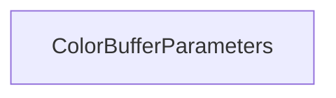

| public |
{:.api_label}

#### Inheritance Graph

## Description

Parameters of color buffer.

Abstraction layer class for the color buffer configuration. The OpenGL functions working with the color buffer settings are encapsulated inside.

**Author**: Benjamin Eikel

**Date**: 2012-02-16

*See also*: `glColorMask`

## Public Functions

|
| ------: | ----------------- |
|  | |
|  | **[ColorBufferParameters](#classRendering_1_1ColorBufferParameters_1abedced520e28fe49374e564d7be14b5d)**()   Create [ColorBufferParameters](classRendering_1_1ColorBufferParameters) representing the default OpenGL state. |
|  | |
|  | **[ColorBufferParameters](#classRendering_1_1ColorBufferParameters_1aa642fa401a9f24d459744a6339fcf417)**(bool redWritingEnabled, bool greenWritingEnabled, bool blueWritingEnabled, bool alphaWritingEnabled)   Create [ColorBufferParameters](classRendering_1_1ColorBufferParameters) with the given values. |
|  | |
| bool | **[operator==](#classRendering_1_1ColorBufferParameters_1a565c3c959eeda2980d7e77525824dd77)**(const [ColorBufferParameters](classRendering_1_1ColorBufferParameters) & other) const   Return`true`if the whole set of parameters is**equal**to the*other*set. |
|  | |
| bool | **[operator!=](#classRendering_1_1ColorBufferParameters_1a462483eb9a3e819553a10d8032e03011)**(const [ColorBufferParameters](classRendering_1_1ColorBufferParameters) & other) const   Return`true`if the whole set of parameters is**unequal**to the*other*set. |
|  | |
| bool | **[isRedWritingEnabled](#classRendering_1_1ColorBufferParameters_1adefe3fcec616221083653b6521f760c4)**() const |
|  | |
| bool | **[isGreenWritingEnabled](#classRendering_1_1ColorBufferParameters_1ac7c0d3b25e1903ab9c9f95839dc74e06)**() const |
|  | |
| bool | **[isBlueWritingEnabled](#classRendering_1_1ColorBufferParameters_1ad9495973a3d32c6bd49b934fd054e77a)**() const |
|  | |
| bool | **[isAlphaWritingEnabled](#classRendering_1_1ColorBufferParameters_1a3de2998e3581c31fe02ed9e40eef7c91)**() const |
|  | |
| bool | **[isAnyWritingEnabled](#classRendering_1_1ColorBufferParameters_1a83aff4bdc287fc93203634ca4f621bab)**() const |
{: .nohead .nowrap1 .api_section }

-------------------------------------------------------------------

## Documentation

### <small>function</small>  Rendering::ColorBufferParameters::ColorBufferParameters {#classRendering_1_1ColorBufferParameters_1abedced520e28fe49374e564d7be14b5d}

| public | inline | explicit |
{:.api_label}

|
| ------: | ----------------- |
|  |
|  **[ColorBufferParameters](#classRendering_1_1ColorBufferParameters_1abedced520e28fe49374e564d7be14b5d)**( |  ) |
{: .nohead .nowrap1 .api_doc }

Create [ColorBufferParameters](classRendering_1_1ColorBufferParameters) representing the default OpenGL state.

Defined in `Rendering/RenderingContext/RenderingParameters.h:343`{:style="float: right"}

-------------------------------------------------------------------

### <small>function</small>  Rendering::ColorBufferParameters::ColorBufferParameters {#classRendering_1_1ColorBufferParameters_1aa642fa401a9f24d459744a6339fcf417}

| public | inline | explicit |
{:.api_label}

|
| ------: | ----------------- |
|  |
|  **[ColorBufferParameters](#classRendering_1_1ColorBufferParameters_1aa642fa401a9f24d459744a6339fcf417)**( | bool | **redWritingEnabled**, |
| | bool | **greenWritingEnabled**, |
| | bool | **blueWritingEnabled**, |
| | bool | **alphaWritingEnabled** |
|   ) |
{: .nohead .nowrap1 .api_doc }

Create [ColorBufferParameters](classRendering_1_1ColorBufferParameters) with the given values.

Defined in `Rendering/RenderingContext/RenderingParameters.h:350`{:style="float: right"}

-------------------------------------------------------------------

### <small>function</small>  Rendering::ColorBufferParameters::operator== {#classRendering_1_1ColorBufferParameters_1a565c3c959eeda2980d7e77525824dd77}

| public | const | inline |
{:.api_label}

|
| ------: | ----------------- |
|  |
| bool **[operator==](#classRendering_1_1ColorBufferParameters_1a565c3c959eeda2980d7e77525824dd77)**( | const [ColorBufferParameters](classRendering_1_1ColorBufferParameters) & | **other** ) const |
{: .nohead .nowrap1 .api_doc }

Return`true`if the whole set of parameters is**equal**to the*other*set.

Defined in `Rendering/RenderingContext/RenderingParameters.h:361`{:style="float: right"}

-------------------------------------------------------------------

### <small>function</small>  Rendering::ColorBufferParameters::operator!= {#classRendering_1_1ColorBufferParameters_1a462483eb9a3e819553a10d8032e03011}

| public | const | inline |
{:.api_label}

|
| ------: | ----------------- |
|  |
| bool **[operator!=](#classRendering_1_1ColorBufferParameters_1a462483eb9a3e819553a10d8032e03011)**( | const [ColorBufferParameters](classRendering_1_1ColorBufferParameters) & | **other** ) const |
{: .nohead .nowrap1 .api_doc }

Return`true`if the whole set of parameters is**unequal**to the*other*set.

Defined in `Rendering/RenderingContext/RenderingParameters.h:368`{:style="float: right"}

-------------------------------------------------------------------

### <small>function</small>  Rendering::ColorBufferParameters::isRedWritingEnabled {#classRendering_1_1ColorBufferParameters_1adefe3fcec616221083653b6521f760c4}

| public | const | inline |
{:.api_label}

|
| ------: | ----------------- |
|  |
| bool **[isRedWritingEnabled](#classRendering_1_1ColorBufferParameters_1adefe3fcec616221083653b6521f760c4)**( |  ) const |
{: .nohead .nowrap1 .api_doc }

Defined in `Rendering/RenderingContext/RenderingParameters.h:375`{:style="float: right"}

-------------------------------------------------------------------

### <small>function</small>  Rendering::ColorBufferParameters::isGreenWritingEnabled {#classRendering_1_1ColorBufferParameters_1ac7c0d3b25e1903ab9c9f95839dc74e06}

| public | const | inline |
{:.api_label}

|
| ------: | ----------------- |
|  |
| bool **[isGreenWritingEnabled](#classRendering_1_1ColorBufferParameters_1ac7c0d3b25e1903ab9c9f95839dc74e06)**( |  ) const |
{: .nohead .nowrap1 .api_doc }

Defined in `Rendering/RenderingContext/RenderingParameters.h:378`{:style="float: right"}

-------------------------------------------------------------------

### <small>function</small>  Rendering::ColorBufferParameters::isBlueWritingEnabled {#classRendering_1_1ColorBufferParameters_1ad9495973a3d32c6bd49b934fd054e77a}

| public | const | inline |
{:.api_label}

|
| ------: | ----------------- |
|  |
| bool **[isBlueWritingEnabled](#classRendering_1_1ColorBufferParameters_1ad9495973a3d32c6bd49b934fd054e77a)**( |  ) const |
{: .nohead .nowrap1 .api_doc }

Defined in `Rendering/RenderingContext/RenderingParameters.h:381`{:style="float: right"}

-------------------------------------------------------------------

### <small>function</small>  Rendering::ColorBufferParameters::isAlphaWritingEnabled {#classRendering_1_1ColorBufferParameters_1a3de2998e3581c31fe02ed9e40eef7c91}

| public | const | inline |
{:.api_label}

|
| ------: | ----------------- |
|  |
| bool **[isAlphaWritingEnabled](#classRendering_1_1ColorBufferParameters_1a3de2998e3581c31fe02ed9e40eef7c91)**( |  ) const |
{: .nohead .nowrap1 .api_doc }

Defined in `Rendering/RenderingContext/RenderingParameters.h:384`{:style="float: right"}

-------------------------------------------------------------------

### <small>function</small>  Rendering::ColorBufferParameters::isAnyWritingEnabled {#classRendering_1_1ColorBufferParameters_1a83aff4bdc287fc93203634ca4f621bab}

| public | const | inline |
{:.api_label}

|
| ------: | ----------------- |
|  |
| bool **[isAnyWritingEnabled](#classRendering_1_1ColorBufferParameters_1a83aff4bdc287fc93203634ca4f621bab)**( |  ) const |
{: .nohead .nowrap1 .api_doc }

Defined in `Rendering/RenderingContext/RenderingParameters.h:387`{:style="float: right"}

-------------------------------------------------------------------

