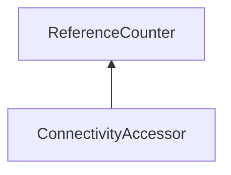

| public |
{:.api_label}

#### Inheritance Graph



## Description


Allows to get connectivity informations of vertices and triangles of a mesh.

Based on 'Random-Accessible Compressed Triangle Meshes' by Yoon et al.

*See also*: [http://dx.doi.org/10.1109/TVCG.2007.70585](http://dx.doi.org/10.1109/TVCG.2007.70585)


**Author**: Sascha Brandt

```
*      v2
*       X
*      / \
*     / c1\      /
*    /-----\____/
*   /  t0  /\c2/
*  /      /c0\/
* X------/----X
* v0          v1
*
* t0 - triangle (see getTriangle)
* v0,v1,v2 - vertices (see getVertex)
* c0,c1,c2 - corners (see getCorner)
* c0 - corner of v1 and t0 (see getCorner, getVertexCorner, getCornerVertex, getTriangleCorner, getCornerTriangle)
* c1 - corner of t0 and next triangle corner of c0 (see getNextTriangleCorner)
* c2 - corner of v1 and next vertex corner of c0 (see getNextVertexCorner)
*
```


## Protected Functions

|
| ------: | ----------------- |
|  | |
| void | **[assertCornerRange](#classRendering_1_1MeshUtils_1_1ConnectivityAccessor_1a222f955ab3ccbddfa2d292fe53aec9b1)**(uint32_t cIndex) const |
|  | |
| void | **[assertVertexRange](#classRendering_1_1MeshUtils_1_1ConnectivityAccessor_1a0b58f46f2deeefd7ea759df9bed8ecc8)**(uint32_t vIndex) const |
|  | |
| void | **[assertTriangleRange](#classRendering_1_1MeshUtils_1_1ConnectivityAccessor_1abe3f14e082ca5cf17d8edb40f6950f45)**(uint32_t tIndex) const |
|  | |
|  | **[ConnectivityAccessor](#classRendering_1_1MeshUtils_1_1ConnectivityAccessor_1a9776bed5f208542adebecd8319e3873c)**( [Mesh](classRendering_1_1Mesh) * mesh) |
{: .nohead .nowrap1 .api_section }


## Public Static Functions

|
| ------: | ----------------- |
|  | |
| [Util::Reference](classUtil_1_1Reference) < [ConnectivityAccessor](classRendering_1_1MeshUtils_1_1ConnectivityAccessor) > | **[create](#classRendering_1_1MeshUtils_1_1ConnectivityAccessor_1ab76f44e1e19e413ae231c99ceb9efbb4)**( [Mesh](classRendering_1_1Mesh) * mesh) |
{: .nohead .nowrap1 .api_section }


## Public Functions

|
| ------: | ----------------- |
|  | |
|  | **[~ConnectivityAccessor](#classRendering_1_1MeshUtils_1_1ConnectivityAccessor_1a4d2f67662c531619398799e2a35c882f)**() |
|  | |
| [Geometry::Vec3](namespaceGeometry#namespaceGeometry_1ab29e4544da9b15b5bf224cbf5b691313) | **[getVertex](#classRendering_1_1MeshUtils_1_1ConnectivityAccessor_1a62ac2c6b4fe51396518b87c6c11a52ef)**(uint32_t vIndex) const |
|  | |
| [TriangleAccessor::TriangleIndices_t](classRendering_1_1MeshUtils_1_1TriangleAccessor#classRendering_1_1MeshUtils_1_1TriangleAccessor_1a9823a13b48f0f7d541fcc2ccd670e06a) | **[getTriangle](#classRendering_1_1MeshUtils_1_1ConnectivityAccessor_1aa25eddc299a329f234cc78e63e6585e6)**(uint32_t tIndex) const |
|  | |
| uint32_t | **[getCorner](#classRendering_1_1MeshUtils_1_1ConnectivityAccessor_1a0441c80c7c070973d73b1a9cdb316f03)**(uint32_t vIndex, uint32_t tIndex) const |
|  | |
| uint32_t | **[getVertexCorner](#classRendering_1_1MeshUtils_1_1ConnectivityAccessor_1ac608d59916bf1a735d4a3b76c9eddc37)**(uint32_t vIndex) const |
|  | |
| uint32_t | **[getTriangleCorner](#classRendering_1_1MeshUtils_1_1ConnectivityAccessor_1a266b2fad916313ce9f0bfcd2c9eee7ce)**(uint32_t tIndex) const |
|  | |
| uint32_t | **[getCornerVertex](#classRendering_1_1MeshUtils_1_1ConnectivityAccessor_1aac2b49fe7f45f66d11adf544aec080e6)**(uint32_t cIndex) const |
|  | |
| uint32_t | **[getCornerTriangle](#classRendering_1_1MeshUtils_1_1ConnectivityAccessor_1ae489fea635ddd453ee9b8d83c170c13c)**(uint32_t cIndex) const |
|  | |
| uint32_t | **[getNextVertexCorner](#classRendering_1_1MeshUtils_1_1ConnectivityAccessor_1a7b2d36aeee8cedb094c58eab74399678)**(uint32_t cIndex) const |
|  | |
| uint32_t | **[getNextTriangleCorner](#classRendering_1_1MeshUtils_1_1ConnectivityAccessor_1a357b11aa4d28d3d88b6a66a331599872)**(uint32_t cIndex) const |
|  | |
| std::vector< uint32_t > | **[getVertexAdjacentTriangles](#classRendering_1_1MeshUtils_1_1ConnectivityAccessor_1afccfd4a769e01b24658b8021cd0c4c85)**(uint32_t vIndex) const |
|  | |
| std::vector< uint32_t > | **[getVertexAdjacentVertices](#classRendering_1_1MeshUtils_1_1ConnectivityAccessor_1a2bb84314d8e24a7c39a354ff3df53819)**(uint32_t vIndex) const |
|  | |
| std::vector< uint32_t > | **[getAdjacentTriangles](#classRendering_1_1MeshUtils_1_1ConnectivityAccessor_1a91c859528f211aafb5fbfb942e77b258)**(uint32_t tIndex) const |
|  | |
| bool | **[isBorderEdge](#classRendering_1_1MeshUtils_1_1ConnectivityAccessor_1a04557d22087f14999a8574926333360f)**(uint32_t vIndex1, uint32_t vIndex2) const |
|  | |
| bool | **[isBorderTriangle](#classRendering_1_1MeshUtils_1_1ConnectivityAccessor_1aceb9c976200afb2cc4337fe122a117f3)**(uint32_t tIndex) const |
{: .nohead .nowrap1 .api_section }


-------------------------------------------------------------------

## Documentation

### <small>function</small><br/> Rendering::MeshUtils::ConnectivityAccessor::assertCornerRange {#classRendering_1_1MeshUtils_1_1ConnectivityAccessor_1a222f955ab3ccbddfa2d292fe53aec9b1}

| protected | const |
{:.api_label}

|
| ------: | ----------------- |
|  |
| void **[assertCornerRange](#classRendering_1_1MeshUtils_1_1ConnectivityAccessor_1a222f955ab3ccbddfa2d292fe53aec9b1)**( | uint32_t | **cIndex** ) const |
{: .nohead .nowrap1 .api_doc }


<sub>Defined in `Rendering/MeshUtils/ConnectivityAccessor.h:73`</sub>{:style="float: right"}

-------------------------------------------------------------------

### <small>function</small><br/> Rendering::MeshUtils::ConnectivityAccessor::assertVertexRange {#classRendering_1_1MeshUtils_1_1ConnectivityAccessor_1a0b58f46f2deeefd7ea759df9bed8ecc8}

| protected | const |
{:.api_label}

|
| ------: | ----------------- |
|  |
| void **[assertVertexRange](#classRendering_1_1MeshUtils_1_1ConnectivityAccessor_1a0b58f46f2deeefd7ea759df9bed8ecc8)**( | uint32_t | **vIndex** ) const |
{: .nohead .nowrap1 .api_doc }


<sub>Defined in `Rendering/MeshUtils/ConnectivityAccessor.h:74`</sub>{:style="float: right"}

-------------------------------------------------------------------

### <small>function</small><br/> Rendering::MeshUtils::ConnectivityAccessor::assertTriangleRange {#classRendering_1_1MeshUtils_1_1ConnectivityAccessor_1abe3f14e082ca5cf17d8edb40f6950f45}

| protected | const |
{:.api_label}

|
| ------: | ----------------- |
|  |
| void **[assertTriangleRange](#classRendering_1_1MeshUtils_1_1ConnectivityAccessor_1abe3f14e082ca5cf17d8edb40f6950f45)**( | uint32_t | **tIndex** ) const |
{: .nohead .nowrap1 .api_doc }


<sub>Defined in `Rendering/MeshUtils/ConnectivityAccessor.h:75`</sub>{:style="float: right"}

-------------------------------------------------------------------

### <small>function</small><br/> Rendering::MeshUtils::ConnectivityAccessor::ConnectivityAccessor {#classRendering_1_1MeshUtils_1_1ConnectivityAccessor_1a9776bed5f208542adebecd8319e3873c}

| protected |
{:.api_label}

|
| ------: | ----------------- |
|  |
|  **[ConnectivityAccessor](#classRendering_1_1MeshUtils_1_1ConnectivityAccessor_1a9776bed5f208542adebecd8319e3873c)**( |  [Mesh](classRendering_1_1Mesh) * | **mesh** ) |
{: .nohead .nowrap1 .api_doc }


<sub>Defined in `Rendering/MeshUtils/ConnectivityAccessor.h:76`</sub>{:style="float: right"}

-------------------------------------------------------------------

### <small>function</small><br/> Rendering::MeshUtils::ConnectivityAccessor::create {#classRendering_1_1MeshUtils_1_1ConnectivityAccessor_1ab76f44e1e19e413ae231c99ceb9efbb4}

| public | static |
{:.api_label}

|
| ------: | ----------------- |
|  |
| [Util::Reference](classUtil_1_1Reference) < [ConnectivityAccessor](classRendering_1_1MeshUtils_1_1ConnectivityAccessor) > **[create](#classRendering_1_1MeshUtils_1_1ConnectivityAccessor_1ab76f44e1e19e413ae231c99ceb9efbb4)**( |  [Mesh](classRendering_1_1Mesh) * | **mesh** ) |
{: .nohead .nowrap1 .api_doc }


(static factory) Create a [ConnectivityAccessor](classRendering_1_1MeshUtils_1_1ConnectivityAccessor) for the given [Mesh](classRendering_1_1Mesh) . If no Accessor can be created, an std::invalid_argument exception is thrown.


<sub>Defined in `Rendering/MeshUtils/ConnectivityAccessor.h:81`</sub>{:style="float: right"}

-------------------------------------------------------------------

### <small>function</small><br/> Rendering::MeshUtils::ConnectivityAccessor::~ConnectivityAccessor {#classRendering_1_1MeshUtils_1_1ConnectivityAccessor_1a4d2f67662c531619398799e2a35c882f}

| public | inline | virtual |
{:.api_label}

|
| ------: | ----------------- |
|  |
|  **[~ConnectivityAccessor](#classRendering_1_1MeshUtils_1_1ConnectivityAccessor_1a4d2f67662c531619398799e2a35c882f)**( |  ) |
{: .nohead .nowrap1 .api_doc }


<sub>Defined in `Rendering/MeshUtils/ConnectivityAccessor.h:83`</sub>{:style="float: right"}

-------------------------------------------------------------------

### <small>function</small><br/> Rendering::MeshUtils::ConnectivityAccessor::getVertex {#classRendering_1_1MeshUtils_1_1ConnectivityAccessor_1a62ac2c6b4fe51396518b87c6c11a52ef}

| public | const |
{:.api_label}

|
| ------: | ----------------- |
|  |
| [Geometry::Vec3](namespaceGeometry#namespaceGeometry_1ab29e4544da9b15b5bf224cbf5b691313) **[getVertex](#classRendering_1_1MeshUtils_1_1ConnectivityAccessor_1a62ac2c6b4fe51396518b87c6c11a52ef)**( | uint32_t | **vIndex** ) const |
{: .nohead .nowrap1 .api_doc }


Return the coordinates of a vertex.
#### Parameters
**vIndex**
:  the vertex index


#### Returns
the vertex position


<sub>Defined in `Rendering/MeshUtils/ConnectivityAccessor.h:90`</sub>{:style="float: right"}

-------------------------------------------------------------------

### <small>function</small><br/> Rendering::MeshUtils::ConnectivityAccessor::getTriangle {#classRendering_1_1MeshUtils_1_1ConnectivityAccessor_1aa25eddc299a329f234cc78e63e6585e6}

| public | const |
{:.api_label}

|
| ------: | ----------------- |
|  |
| [TriangleAccessor::TriangleIndices_t](classRendering_1_1MeshUtils_1_1TriangleAccessor#classRendering_1_1MeshUtils_1_1TriangleAccessor_1a9823a13b48f0f7d541fcc2ccd670e06a) **[getTriangle](#classRendering_1_1MeshUtils_1_1ConnectivityAccessor_1aa25eddc299a329f234cc78e63e6585e6)**( | uint32_t | **tIndex** ) const |
{: .nohead .nowrap1 .api_doc }


Return the three vertex indices of a triangle.
#### Parameters
**tIndex**
:  the triangle index


#### Returns
a tuple of 3 vertex indices


<sub>Defined in `Rendering/MeshUtils/ConnectivityAccessor.h:97`</sub>{:style="float: right"}

-------------------------------------------------------------------

### <small>function</small><br/> Rendering::MeshUtils::ConnectivityAccessor::getCorner {#classRendering_1_1MeshUtils_1_1ConnectivityAccessor_1a0441c80c7c070973d73b1a9cdb316f03}

| public | const |
{:.api_label}

|
| ------: | ----------------- |
|  |
| uint32_t **[getCorner](#classRendering_1_1MeshUtils_1_1ConnectivityAccessor_1a0441c80c7c070973d73b1a9cdb316f03)**( | uint32_t | **vIndex**, |
| | uint32_t | **tIndex** |
|   ) const |
{: .nohead .nowrap1 .api_doc }


Return the corner joining a vertex with a triangle
#### Parameters
**vIndex**
:  the vertex index


**tIndex**
:  the triangle index


#### Returns
the corner index joining the vertex with the triangle


<sub>Defined in `Rendering/MeshUtils/ConnectivityAccessor.h:105`</sub>{:style="float: right"}

-------------------------------------------------------------------

### <small>function</small><br/> Rendering::MeshUtils::ConnectivityAccessor::getVertexCorner {#classRendering_1_1MeshUtils_1_1ConnectivityAccessor_1ac608d59916bf1a735d4a3b76c9eddc37}

| public | const |
{:.api_label}

|
| ------: | ----------------- |
|  |
| uint32_t **[getVertexCorner](#classRendering_1_1MeshUtils_1_1ConnectivityAccessor_1ac608d59916bf1a735d4a3b76c9eddc37)**( | uint32_t | **vIndex** ) const |
{: .nohead .nowrap1 .api_doc }


Return one of the corners incident to a vertex
#### Parameters
**vIndex**
:  the vertex index


#### Returns
the corner index incident to the vertex


<sub>Defined in `Rendering/MeshUtils/ConnectivityAccessor.h:112`</sub>{:style="float: right"}

-------------------------------------------------------------------

### <small>function</small><br/> Rendering::MeshUtils::ConnectivityAccessor::getTriangleCorner {#classRendering_1_1MeshUtils_1_1ConnectivityAccessor_1a266b2fad916313ce9f0bfcd2c9eee7ce}

| public | const |
{:.api_label}

|
| ------: | ----------------- |
|  |
| uint32_t **[getTriangleCorner](#classRendering_1_1MeshUtils_1_1ConnectivityAccessor_1a266b2fad916313ce9f0bfcd2c9eee7ce)**( | uint32_t | **tIndex** ) const |
{: .nohead .nowrap1 .api_doc }


Return one of the corners of a triangle.
#### Parameters
**tIndex**
:  the triangle index


#### Returns
the corner index incident to the triangle


<sub>Defined in `Rendering/MeshUtils/ConnectivityAccessor.h:119`</sub>{:style="float: right"}

-------------------------------------------------------------------

### <small>function</small><br/> Rendering::MeshUtils::ConnectivityAccessor::getCornerVertex {#classRendering_1_1MeshUtils_1_1ConnectivityAccessor_1aac2b49fe7f45f66d11adf544aec080e6}

| public | const |
{:.api_label}

|
| ------: | ----------------- |
|  |
| uint32_t **[getCornerVertex](#classRendering_1_1MeshUtils_1_1ConnectivityAccessor_1aac2b49fe7f45f66d11adf544aec080e6)**( | uint32_t | **cIndex** ) const |
{: .nohead .nowrap1 .api_doc }


Return the vertex associated with a corner.
#### Parameters
**cIndex**
:  the corner index


#### Returns
the vertex index associated with the corner.


<sub>Defined in `Rendering/MeshUtils/ConnectivityAccessor.h:126`</sub>{:style="float: right"}

-------------------------------------------------------------------

### <small>function</small><br/> Rendering::MeshUtils::ConnectivityAccessor::getCornerTriangle {#classRendering_1_1MeshUtils_1_1ConnectivityAccessor_1ae489fea635ddd453ee9b8d83c170c13c}

| public | const |
{:.api_label}

|
| ------: | ----------------- |
|  |
| uint32_t **[getCornerTriangle](#classRendering_1_1MeshUtils_1_1ConnectivityAccessor_1ae489fea635ddd453ee9b8d83c170c13c)**( | uint32_t | **cIndex** ) const |
{: .nohead .nowrap1 .api_doc }


Return the triangle associated with a corner.
#### Parameters
**cIndex**
:  the corner index


#### Returns
the triangle index associated with the corner.


<sub>Defined in `Rendering/MeshUtils/ConnectivityAccessor.h:133`</sub>{:style="float: right"}

-------------------------------------------------------------------

### <small>function</small><br/> Rendering::MeshUtils::ConnectivityAccessor::getNextVertexCorner {#classRendering_1_1MeshUtils_1_1ConnectivityAccessor_1a7b2d36aeee8cedb094c58eab74399678}

| public | const |
{:.api_label}

|
| ------: | ----------------- |
|  |
| uint32_t **[getNextVertexCorner](#classRendering_1_1MeshUtils_1_1ConnectivityAccessor_1a7b2d36aeee8cedb094c58eab74399678)**( | uint32_t | **cIndex** ) const |
{: .nohead .nowrap1 .api_doc }


Return the next corner incident on the vertex associated with a corner.
#### Parameters
**cIndex**
:  the corner index


#### Returns
the next corner index incident on the vertex associated with the corner


<sub>Defined in `Rendering/MeshUtils/ConnectivityAccessor.h:140`</sub>{:style="float: right"}

-------------------------------------------------------------------

### <small>function</small><br/> Rendering::MeshUtils::ConnectivityAccessor::getNextTriangleCorner {#classRendering_1_1MeshUtils_1_1ConnectivityAccessor_1a357b11aa4d28d3d88b6a66a331599872}

| public | const |
{:.api_label}

|
| ------: | ----------------- |
|  |
| uint32_t **[getNextTriangleCorner](#classRendering_1_1MeshUtils_1_1ConnectivityAccessor_1a357b11aa4d28d3d88b6a66a331599872)**( | uint32_t | **cIndex** ) const |
{: .nohead .nowrap1 .api_doc }


Return the next corner within the triangle associated with a corner.
#### Parameters
**cIndex**
:  the corner index


#### Returns
the next corner within the triangle associated with the corner.


<sub>Defined in `Rendering/MeshUtils/ConnectivityAccessor.h:147`</sub>{:style="float: right"}

-------------------------------------------------------------------

### <small>function</small><br/> Rendering::MeshUtils::ConnectivityAccessor::getVertexAdjacentTriangles {#classRendering_1_1MeshUtils_1_1ConnectivityAccessor_1afccfd4a769e01b24658b8021cd0c4c85}

| public | const |
{:.api_label}

|
| ------: | ----------------- |
|  |
| std::vector< uint32_t > **[getVertexAdjacentTriangles](#classRendering_1_1MeshUtils_1_1ConnectivityAccessor_1afccfd4a769e01b24658b8021cd0c4c85)**( | uint32_t | **vIndex** ) const |
{: .nohead .nowrap1 .api_doc }


Return the triangles that are adjacent to a vertex.
#### Parameters
**vIndex**
:  the vertex index


#### Returns
list of adjacent triangle indices


<sub>Defined in `Rendering/MeshUtils/ConnectivityAccessor.h:154`</sub>{:style="float: right"}

-------------------------------------------------------------------

### <small>function</small><br/> Rendering::MeshUtils::ConnectivityAccessor::getVertexAdjacentVertices {#classRendering_1_1MeshUtils_1_1ConnectivityAccessor_1a2bb84314d8e24a7c39a354ff3df53819}

| public | const |
{:.api_label}

|
| ------: | ----------------- |
|  |
| std::vector< uint32_t > **[getVertexAdjacentVertices](#classRendering_1_1MeshUtils_1_1ConnectivityAccessor_1a2bb84314d8e24a7c39a354ff3df53819)**( | uint32_t | **vIndex** ) const |
{: .nohead .nowrap1 .api_doc }


Return the vertices that are adjacent to a vertex.
#### Parameters
**vIndex**
:  the vertex index


#### Returns
list of adjacent vertex indices


<sub>Defined in `Rendering/MeshUtils/ConnectivityAccessor.h:161`</sub>{:style="float: right"}

-------------------------------------------------------------------

### <small>function</small><br/> Rendering::MeshUtils::ConnectivityAccessor::getAdjacentTriangles {#classRendering_1_1MeshUtils_1_1ConnectivityAccessor_1a91c859528f211aafb5fbfb942e77b258}

| public | const |
{:.api_label}

|
| ------: | ----------------- |
|  |
| std::vector< uint32_t > **[getAdjacentTriangles](#classRendering_1_1MeshUtils_1_1ConnectivityAccessor_1a91c859528f211aafb5fbfb942e77b258)**( | uint32_t | **tIndex** ) const |
{: .nohead .nowrap1 .api_doc }


Return the triangles that share an edge with a triangle. Triangles are only adjacent, if the directions of the shared edge are opposite to each other.
#### Parameters
**tIndex**
:  the triangle index


#### Returns
list of adjacent triangle indices


<sub>Defined in `Rendering/MeshUtils/ConnectivityAccessor.h:169`</sub>{:style="float: right"}

-------------------------------------------------------------------

### <small>function</small><br/> Rendering::MeshUtils::ConnectivityAccessor::isBorderEdge {#classRendering_1_1MeshUtils_1_1ConnectivityAccessor_1a04557d22087f14999a8574926333360f}

| public | const |
{:.api_label}

|
| ------: | ----------------- |
|  |
| bool **[isBorderEdge](#classRendering_1_1MeshUtils_1_1ConnectivityAccessor_1a04557d22087f14999a8574926333360f)**( | uint32_t | **vIndex1**, |
| | uint32_t | **vIndex2** |
|   ) const |
{: .nohead .nowrap1 .api_doc }


Tests if an edge is a border edge. An edge is a border edge if it is not shared with an edge in opposite direction.
#### Parameters
**vIndex1**
:  the first vertex index


**vIndex2**
:  the second vertex index


#### Returns
true, if the edge is a border edge (and is, in fact, an edge)


<sub>Defined in `Rendering/MeshUtils/ConnectivityAccessor.h:178`</sub>{:style="float: right"}

-------------------------------------------------------------------

### <small>function</small><br/> Rendering::MeshUtils::ConnectivityAccessor::isBorderTriangle {#classRendering_1_1MeshUtils_1_1ConnectivityAccessor_1aceb9c976200afb2cc4337fe122a117f3}

| public | const |
{:.api_label}

|
| ------: | ----------------- |
|  |
| bool **[isBorderTriangle](#classRendering_1_1MeshUtils_1_1ConnectivityAccessor_1aceb9c976200afb2cc4337fe122a117f3)**( | uint32_t | **tIndex** ) const |
{: .nohead .nowrap1 .api_doc }


Tests if a triangle is a border triangle. A triangle is a border triangle if it has at least one border edge.
#### Parameters
**tIndex**
:  the triangle index


#### Returns
true, if the triangle is a border triangle.


<sub>Defined in `Rendering/MeshUtils/ConnectivityAccessor.h:186`</sub>{:style="float: right"}

-------------------------------------------------------------------

