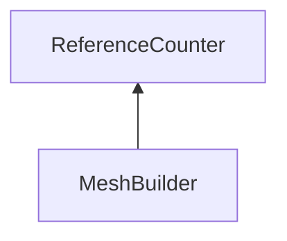

| public |
{:.api_label}

#### Inheritance Graph

## Description

Utility class that allows building meshes

## Public Static Functions

|
| ------: | ----------------- |
|  | |
| [Mesh](classRendering_1_1Mesh) * | **[createBox](#classRendering_1_1MeshUtils_1_1MeshBuilder_1ad4644d03c850539349a795d45d3070ff)**(const [VertexDescription](classRendering_1_1VertexDescription) & vd, const [Geometry::Box](namespaceGeometry#namespaceGeometry_1a02eb80497cc2daa40fba114c929f877a) & box)   Deprecated. |
|  | |
| void | **[addBox](#classRendering_1_1MeshUtils_1_1MeshBuilder_1ad24bbd7e26844ddc46c9a3660ec4b54d)**( [MeshBuilder](classRendering_1_1MeshUtils_1_1MeshBuilder) & mb, const [Geometry::Box](namespaceGeometry#namespaceGeometry_1a02eb80497cc2daa40fba114c929f877a) & box)   Deprecated. |
|  | |
| [Mesh](classRendering_1_1Mesh) * | **[createDome](#classRendering_1_1MeshUtils_1_1MeshBuilder_1a3c69b26f84cd89f1f26fdecb05ea1b1f)**(const double radius, const int horiRes, const int vertRes, const double halfSphereFraction, const double imagePercentage)   Deprecated. |
|  | |
| [Mesh](classRendering_1_1Mesh) * | **[createSphere](#classRendering_1_1MeshUtils_1_1MeshBuilder_1abf8ba4b5d37af9bcf3d4028fc47fa2ef)**(const [VertexDescription](classRendering_1_1VertexDescription) & vd, uint32_t inclinationSegments, uint32_t azimuthSegments)   Deprecated. |
|  | |
| void | **[addSphere](#classRendering_1_1MeshUtils_1_1MeshBuilder_1a6cf9fdeff53cb24ab4e6b1d3c958ad6d)**( [MeshBuilder](classRendering_1_1MeshUtils_1_1MeshBuilder) & mb, const [Geometry::Sphere_f](namespaceGeometry#namespaceGeometry_1a652026bcf8da8be261079731c22e7321) & sphere, uint32_t inclinationSegments, uint32_t azimuthSegments)   Deprecated. |
|  | |
| [Mesh](classRendering_1_1Mesh) * | **[createDiscSector](#classRendering_1_1MeshUtils_1_1MeshBuilder_1a2190f6a4c599e7b68ead39f7f50db9de)**(float radius, uint8_t numSegments, float angle)   Deprecated. |
|  | |
| [Mesh](classRendering_1_1Mesh) * | **[createRingSector](#classRendering_1_1MeshUtils_1_1MeshBuilder_1a4236043ba69e1c8886a958d280822c83)**(float innerRadius, float outerRadius, uint8_t numSegments, float angle)   Deprecated. |
|  | |
| [Mesh](classRendering_1_1Mesh) * | **[createCone](#classRendering_1_1MeshUtils_1_1MeshBuilder_1a496895c2d0d3402907d8910ee9924abc)**(float radius, float height, uint8_t numSegments)   Deprecated. |
|  | |
| [Mesh](classRendering_1_1Mesh) * | **[createConicalFrustum](#classRendering_1_1MeshUtils_1_1MeshBuilder_1ae8750d101a922490ffa05cbcb8181ce7)**(float radiusBottom, float radiusTop, float height, uint8_t numSegments)   Deprecated. |
|  | |
| [Mesh](classRendering_1_1Mesh) * | **[createArrow](#classRendering_1_1MeshUtils_1_1MeshBuilder_1aa3020488eceff11055993bf8e1b27510)**(float radius, float length)   Deprecated. |
|  | |
| [Mesh](classRendering_1_1Mesh) * | **[createRectangle](#classRendering_1_1MeshUtils_1_1MeshBuilder_1a632e8d7324e66dd5748970cf301d472b)**(const [VertexDescription](classRendering_1_1VertexDescription) & vd, float width, float height)   Deprecated. |
|  | |
| [Mesh](classRendering_1_1Mesh) * | **[createMeshFromBitmaps](#classRendering_1_1MeshUtils_1_1MeshBuilder_1a1a91e48d111deb7adcce7bfb70d1d94e)**(const [VertexDescription](classRendering_1_1VertexDescription) & vd,  [Util::Reference](classUtil_1_1Reference) < [Util::Bitmap](classUtil_1_1Bitmap) > depth,  [Util::Reference](classUtil_1_1Reference) < [Util::Bitmap](classUtil_1_1Bitmap) > color,  [Util::Reference](classUtil_1_1Reference) < [Util::Bitmap](classUtil_1_1Bitmap) > normals)   Deprecated. |
|  | |
| [Mesh](classRendering_1_1Mesh) * | **[createHexGrid](#classRendering_1_1MeshUtils_1_1MeshBuilder_1ab47d9acae7640fa3f4ec124c8ec96873)**(const [VertexDescription](classRendering_1_1VertexDescription) & vd, float width, float height, uint32_t rows, uint32_t columns)   Deprecated. |
|  | |
| [Mesh](classRendering_1_1Mesh) * | **[createVoxelMesh](#classRendering_1_1MeshUtils_1_1MeshBuilder_1acfecba6aa1fb288c05749f75f6a2145d)**(const [VertexDescription](classRendering_1_1VertexDescription) & vd, const [Util::PixelAccessor](classUtil_1_1PixelAccessor) & colorAcc, uint32_t depth)   Deprecated. |
|  | |
| [Mesh](classRendering_1_1Mesh) * | **[createTorus](#classRendering_1_1MeshUtils_1_1MeshBuilder_1a37f08a0fd4e321202e65af04606bf9cb)**(const [VertexDescription](classRendering_1_1VertexDescription) & vd, float innerRadius, float outerRadius, uint32_t majorSegments, uint32_t minorSegments)   Deprecated. |
|  | |
| void | **[addTorus](#classRendering_1_1MeshUtils_1_1MeshBuilder_1a57c437a9944ae149b882e704b21b24b7)**( [MeshBuilder](classRendering_1_1MeshUtils_1_1MeshBuilder) & mb, float innerRadius, float outerRadius, uint32_t majorSegments, uint32_t minorSegments)   Deprecated. |
{: .nohead .nowrap1 .api_section }

## Public Functions

|
| ------: | ----------------- |
|  | |
|  | **[MeshBuilder](#classRendering_1_1MeshUtils_1_1MeshBuilder_1ac931bc914bace939159a17b6b5013cca)**() |
|  | |
|  | **[MeshBuilder](#classRendering_1_1MeshUtils_1_1MeshBuilder_1af1cdbccbdb7c7ba188b6b939cc3b15ca)**( [VertexDescription](classRendering_1_1VertexDescription)  description) |
|  | |
|  | **[~MeshBuilder](#classRendering_1_1MeshUtils_1_1MeshBuilder_1a905e82846a8da828c5d1f3ea5f4e0609)**() |
|  | |
| bool | **[isEmpty](#classRendering_1_1MeshUtils_1_1MeshBuilder_1ac03061c34c5ac0775cdd5d01b46e1ced)**() const |
|  | |
| [Mesh](classRendering_1_1Mesh) * | **[buildMesh](#classRendering_1_1MeshUtils_1_1MeshBuilder_1a4fd60a434bb3704a77556988fdfd9fbf)**()   Build a new mesh using the internal vertex and index buffer. |
|  | |
| void | **[position](#classRendering_1_1MeshUtils_1_1MeshBuilder_1af65d5eda5d70609d28fa3db5f41b556c)**(const [Geometry::Vec2](namespaceGeometry#namespaceGeometry_1aa9c56320691770d4bc53916868f15e6d) & v, const [Util::StringIdentifier](classUtil_1_1StringIdentifier) & attr) |
|  | |
| void | **[position](#classRendering_1_1MeshUtils_1_1MeshBuilder_1acfd54c4cfc4652ca0410fcf36674026a)**(const [Geometry::Vec3f](namespaceGeometry#namespaceGeometry_1a5b269b6a82917f18e344231ecf8e6566) & v, const [Util::StringIdentifier](classUtil_1_1StringIdentifier) & attr) |
|  | |
| void | **[position](#classRendering_1_1MeshUtils_1_1MeshBuilder_1aafe5803499442339d83a5079d7d5ade4)**(const [Geometry::Vec4](namespaceGeometry#namespaceGeometry_1a614faae341f42d801f11bc4485771860) & v, const [Util::StringIdentifier](classUtil_1_1StringIdentifier) & attr) |
|  | |
| void | **[normal](#classRendering_1_1MeshUtils_1_1MeshBuilder_1a6bb66a5527bb703440e6786f415f2b3f)**(const [Geometry::Vec3f](namespaceGeometry#namespaceGeometry_1a5b269b6a82917f18e344231ecf8e6566) & n, const [Util::StringIdentifier](classUtil_1_1StringIdentifier) & attr) |
|  | |
| void | **[normal](#classRendering_1_1MeshUtils_1_1MeshBuilder_1a61ab785dfc61eb1243d1fb48999a7c28)**(const [Geometry::Vec3b](namespaceGeometry#namespaceGeometry_1a4e13fecd9ad825bc22ecdcd3ec89fc62) & n, const [Util::StringIdentifier](classUtil_1_1StringIdentifier) & attr) |
|  | |
| void | **[color](#classRendering_1_1MeshUtils_1_1MeshBuilder_1acd4211a453889aa218933b45adcdabf8)**(const [Util::Color4f](classUtil_1_1Color4f) & c, const [Util::StringIdentifier](classUtil_1_1StringIdentifier) & attr) |
|  | |
| void | **[color](#classRendering_1_1MeshUtils_1_1MeshBuilder_1ad338e7e63af1c21f190e0ddd270fd596)**(const [Util::Color4ub](classUtil_1_1Color4ub) & c, const [Util::StringIdentifier](classUtil_1_1StringIdentifier) & attr) |
|  | |
| void | **[texCoord0](#classRendering_1_1MeshUtils_1_1MeshBuilder_1a8a92e09cfaf5d04726cf80746be09c6d)**(const [Geometry::Vec2](namespaceGeometry#namespaceGeometry_1aa9c56320691770d4bc53916868f15e6d) & uv, const [Util::StringIdentifier](classUtil_1_1StringIdentifier) & attr) |
|  | |
| void | **[values](#classRendering_1_1MeshUtils_1_1MeshBuilder_1afd8a1c76c100e202a75e2242a8fde9fc)**(const std::vector< float > & v, const [Util::StringIdentifier](classUtil_1_1StringIdentifier) & attr) |
|  | |
| void | **[values](#classRendering_1_1MeshUtils_1_1MeshBuilder_1a718bc5673e5dd3c2dee492b35771bb48)**(const std::vector< uint32_t > & v, const [Util::StringIdentifier](classUtil_1_1StringIdentifier) & attr) |
|  | |
| void | **[value](#classRendering_1_1MeshUtils_1_1MeshBuilder_1abe336adf7031157ea5dc621b0191fed8)**(float v, const [Util::StringIdentifier](classUtil_1_1StringIdentifier) & attr) |
|  | |
| void | **[value](#classRendering_1_1MeshUtils_1_1MeshBuilder_1ac15b29eff67da0dbb5b488947354421a)**(uint32_t v, const [Util::StringIdentifier](classUtil_1_1StringIdentifier) & attr) |
|  | |
| uint32_t | **[addVertex](#classRendering_1_1MeshUtils_1_1MeshBuilder_1ae9259a147be7f6da7e4772a8649bd062)**() |
|  | |
| uint32_t | **[addVertex](#classRendering_1_1MeshUtils_1_1MeshBuilder_1a219f715bcecd86d1b5867e86c6d231d6)**(const [Geometry::Vec3](namespaceGeometry#namespaceGeometry_1ab29e4544da9b15b5bf224cbf5b691313) & pos, const [Geometry::Vec3](namespaceGeometry#namespaceGeometry_1ab29e4544da9b15b5bf224cbf5b691313) & n, float r, float g, float b, float a, float u, float v) |
|  | |
| void | **[addIndex](#classRendering_1_1MeshUtils_1_1MeshBuilder_1a3547fe69e0085b944fe77339e76d8934)**(uint32_t idx) |
|  | |
| void | **[addQuad](#classRendering_1_1MeshUtils_1_1MeshBuilder_1a85a5af54ec460011d2a97d9a2a36ac94)**(uint32_t idx0, uint32_t idx1, uint32_t idx2, uint32_t idx3) |
|  | |
| void | **[addTriangle](#classRendering_1_1MeshUtils_1_1MeshBuilder_1a77b906c2fd9f8396367027ddfcedba51)**(uint32_t idx0, uint32_t idx1, uint32_t idx2) |
|  | |
| uint32_t | **[getNextIndex](#classRendering_1_1MeshUtils_1_1MeshBuilder_1abd0161490502206b3fb09df456dac005)**() const |
|  | |
| void | **[addMesh](#classRendering_1_1MeshUtils_1_1MeshBuilder_1af42f605eb46982c46d92a059fca7549e)**( [Mesh](classRendering_1_1Mesh) * mesh)   Add entire mesh to meshBuilder. |
|  | |
| [Geometry::Matrix4x4](namespaceGeometry#namespaceGeometry_1a1dec338534190ba5915a7dc75b38fcbe) | **[getTransformation](#classRendering_1_1MeshUtils_1_1MeshBuilder_1a6e96bc0ba4371c87952d6c8f60150945)**() const   Get the current transformation. |
|  | |
| void | **[setTransformation](#classRendering_1_1MeshUtils_1_1MeshBuilder_1ad92513f6b304ab575060b1d2436300a9)**(const [Geometry::Matrix4x4](namespaceGeometry#namespaceGeometry_1a1dec338534190ba5915a7dc75b38fcbe) & m)   The transformation is applied to following 'position' and 'normal' calls. |
|  | |
| void | **[setTransformation](#classRendering_1_1MeshUtils_1_1MeshBuilder_1a2c46a2fbce90e0e13b755900ab27a65a)**(const [Geometry::SRT](namespaceGeometry#namespaceGeometry_1acbf1a7ed1b25571b97a1d7c2f14ae848) & s) |
|  | |
| void | **[transform](#classRendering_1_1MeshUtils_1_1MeshBuilder_1a38fa5e43156423f7cd15cdb90d2ae309)**(const [Geometry::Matrix4x4](namespaceGeometry#namespaceGeometry_1a1dec338534190ba5915a7dc75b38fcbe) & m)   Multiply on current transform. |
{: .nohead .nowrap1 .api_section }

-------------------------------------------------------------------

## Documentation

### <small>function</small>  Rendering::MeshUtils::MeshBuilder::createBox {#classRendering_1_1MeshUtils_1_1MeshBuilder_1ad4644d03c850539349a795d45d3070ff}

| public | static |
{:.api_label}

|
| ------: | ----------------- |
|  |
| [Mesh](classRendering_1_1Mesh) * **[createBox](#classRendering_1_1MeshUtils_1_1MeshBuilder_1ad4644d03c850539349a795d45d3070ff)**( | const [VertexDescription](classRendering_1_1VertexDescription) & | **vd**, |
| | const [Geometry::Box](namespaceGeometry#namespaceGeometry_1a02eb80497cc2daa40fba114c929f877a) & | **box** |
|   ) |
{: .nohead .nowrap1 .api_doc }

Deprecated.

*See also*:  [MeshUtils::createBox](group%5F%5Fmesh%5F%5Fbuilder#group%5F%5Fmesh%5F%5Fbuilder_1gadcabbacfabfe221004d11494c8ef60c0) (...)

Defined in `Rendering/MeshUtils/MeshBuilder.h:72`{:style="float: right"}

-------------------------------------------------------------------

### <small>function</small>  Rendering::MeshUtils::MeshBuilder::addBox {#classRendering_1_1MeshUtils_1_1MeshBuilder_1ad24bbd7e26844ddc46c9a3660ec4b54d}

| public | static |
{:.api_label}

|
| ------: | ----------------- |
|  |
| void **[addBox](#classRendering_1_1MeshUtils_1_1MeshBuilder_1ad24bbd7e26844ddc46c9a3660ec4b54d)**( |  [MeshBuilder](classRendering_1_1MeshUtils_1_1MeshBuilder) & | **mb**, |
| | const [Geometry::Box](namespaceGeometry#namespaceGeometry_1a02eb80497cc2daa40fba114c929f877a) & | **box** |
|   ) |
{: .nohead .nowrap1 .api_doc }

Deprecated.

*See also*:  [MeshUtils::addBox](group%5F%5Fmesh%5F%5Fbuilder#group%5F%5Fmesh%5F%5Fbuilder_1ga2183404b9b165fe88049c25436357893) (...)

Defined in `Rendering/MeshUtils/MeshBuilder.h:74`{:style="float: right"}

-------------------------------------------------------------------

### <small>function</small>  Rendering::MeshUtils::MeshBuilder::createDome {#classRendering_1_1MeshUtils_1_1MeshBuilder_1a3c69b26f84cd89f1f26fdecb05ea1b1f}

| public | static |
{:.api_label}

|
| ------: | ----------------- |
|  |
| [Mesh](classRendering_1_1Mesh) * **[createDome](#classRendering_1_1MeshUtils_1_1MeshBuilder_1a3c69b26f84cd89f1f26fdecb05ea1b1f)**( | const double | **radius**, |
| | const int | **horiRes**, |
| | const int | **vertRes**, |
| | const double | **halfSphereFraction**, |
| | const double | **imagePercentage** |
|   ) |
{: .nohead .nowrap1 .api_doc }

Deprecated.

*See also*:  [MeshUtils::createDome](group%5F%5Fmesh%5F%5Fbuilder#group%5F%5Fmesh%5F%5Fbuilder_1gaf7c627bb2e97719739291bef42697831) (...)

Defined in `Rendering/MeshUtils/MeshBuilder.h:76`{:style="float: right"}

-------------------------------------------------------------------

### <small>function</small>  Rendering::MeshUtils::MeshBuilder::createSphere {#classRendering_1_1MeshUtils_1_1MeshBuilder_1abf8ba4b5d37af9bcf3d4028fc47fa2ef}

| public | static |
{:.api_label}

|
| ------: | ----------------- |
|  |
| [Mesh](classRendering_1_1Mesh) * **[createSphere](#classRendering_1_1MeshUtils_1_1MeshBuilder_1abf8ba4b5d37af9bcf3d4028fc47fa2ef)**( | const [VertexDescription](classRendering_1_1VertexDescription) & | **vd**, |
| | uint32_t | **inclinationSegments**, |
| | uint32_t | **azimuthSegments** |
|   ) |
{: .nohead .nowrap1 .api_doc }

Deprecated.

*See also*:  [MeshUtils::createSphere](group%5F%5Fmesh%5F%5Fbuilder#group%5F%5Fmesh%5F%5Fbuilder_1ga276dcbfddaf2a3e66360ab3c4253df17) (...)

Defined in `Rendering/MeshUtils/MeshBuilder.h:78`{:style="float: right"}

-------------------------------------------------------------------

### <small>function</small>  Rendering::MeshUtils::MeshBuilder::addSphere {#classRendering_1_1MeshUtils_1_1MeshBuilder_1a6cf9fdeff53cb24ab4e6b1d3c958ad6d}

| public | static |
{:.api_label}

|
| ------: | ----------------- |
|  |
| void **[addSphere](#classRendering_1_1MeshUtils_1_1MeshBuilder_1a6cf9fdeff53cb24ab4e6b1d3c958ad6d)**( |  [MeshBuilder](classRendering_1_1MeshUtils_1_1MeshBuilder) & | **mb**, |
| | const [Geometry::Sphere_f](namespaceGeometry#namespaceGeometry_1a652026bcf8da8be261079731c22e7321) & | **sphere**, |
| | uint32_t | **inclinationSegments**, |
| | uint32_t | **azimuthSegments** |
|   ) |
{: .nohead .nowrap1 .api_doc }

Deprecated.

*See also*:  [MeshUtils::addSphere](group%5F%5Fmesh%5F%5Fbuilder#group%5F%5Fmesh%5F%5Fbuilder_1ga917791c7db3b90fe0d0b91db7c0d67b8) (...)

Defined in `Rendering/MeshUtils/MeshBuilder.h:80`{:style="float: right"}

-------------------------------------------------------------------

### <small>function</small>  Rendering::MeshUtils::MeshBuilder::createDiscSector {#classRendering_1_1MeshUtils_1_1MeshBuilder_1a2190f6a4c599e7b68ead39f7f50db9de}

| public | static |
{:.api_label}

|
| ------: | ----------------- |
|  |
| [Mesh](classRendering_1_1Mesh) * **[createDiscSector](#classRendering_1_1MeshUtils_1_1MeshBuilder_1a2190f6a4c599e7b68ead39f7f50db9de)**( | float | **radius**, |
| | uint8_t | **numSegments**, |
| | float | **angle** |
|   ) |
{: .nohead .nowrap1 .api_doc }

Deprecated.

*See also*:  [MeshUtils::createDiscSector](group%5F%5Fmesh%5F%5Fbuilder#group%5F%5Fmesh%5F%5Fbuilder_1ga21a3ff8668f01e398a984be62515324f) (...)

Defined in `Rendering/MeshUtils/MeshBuilder.h:82`{:style="float: right"}

-------------------------------------------------------------------

### <small>function</small>  Rendering::MeshUtils::MeshBuilder::createRingSector {#classRendering_1_1MeshUtils_1_1MeshBuilder_1a4236043ba69e1c8886a958d280822c83}

| public | static |
{:.api_label}

|
| ------: | ----------------- |
|  |
| [Mesh](classRendering_1_1Mesh) * **[createRingSector](#classRendering_1_1MeshUtils_1_1MeshBuilder_1a4236043ba69e1c8886a958d280822c83)**( | float | **innerRadius**, |
| | float | **outerRadius**, |
| | uint8_t | **numSegments**, |
| | float | **angle** |
|   ) |
{: .nohead .nowrap1 .api_doc }

Deprecated.

*See also*:  [MeshUtils::createRingSector](group%5F%5Fmesh%5F%5Fbuilder#group%5F%5Fmesh%5F%5Fbuilder_1gac23e60d0b06f0a52fc99d35e1b971dee) (...)

Defined in `Rendering/MeshUtils/MeshBuilder.h:84`{:style="float: right"}

-------------------------------------------------------------------

### <small>function</small>  Rendering::MeshUtils::MeshBuilder::createCone {#classRendering_1_1MeshUtils_1_1MeshBuilder_1a496895c2d0d3402907d8910ee9924abc}

| public | static |
{:.api_label}

|
| ------: | ----------------- |
|  |
| [Mesh](classRendering_1_1Mesh) * **[createCone](#classRendering_1_1MeshUtils_1_1MeshBuilder_1a496895c2d0d3402907d8910ee9924abc)**( | float | **radius**, |
| | float | **height**, |
| | uint8_t | **numSegments** |
|   ) |
{: .nohead .nowrap1 .api_doc }

Deprecated.

*See also*:  [MeshUtils::createCone](group%5F%5Fmesh%5F%5Fbuilder#group%5F%5Fmesh%5F%5Fbuilder_1ga1c81f86476d156fb842570da8a113e4d) (...)

Defined in `Rendering/MeshUtils/MeshBuilder.h:86`{:style="float: right"}

-------------------------------------------------------------------

### <small>function</small>  Rendering::MeshUtils::MeshBuilder::createConicalFrustum {#classRendering_1_1MeshUtils_1_1MeshBuilder_1ae8750d101a922490ffa05cbcb8181ce7}

| public | static |
{:.api_label}

|
| ------: | ----------------- |
|  |
| [Mesh](classRendering_1_1Mesh) * **[createConicalFrustum](#classRendering_1_1MeshUtils_1_1MeshBuilder_1ae8750d101a922490ffa05cbcb8181ce7)**( | float | **radiusBottom**, |
| | float | **radiusTop**, |
| | float | **height**, |
| | uint8_t | **numSegments** |
|   ) |
{: .nohead .nowrap1 .api_doc }

Deprecated.

*See also*:  [MeshUtils::createConicalFrustum](group%5F%5Fmesh%5F%5Fbuilder#group%5F%5Fmesh%5F%5Fbuilder_1ga1cac118ebebeeb679262355a4b27168e) (...)

Defined in `Rendering/MeshUtils/MeshBuilder.h:88`{:style="float: right"}

-------------------------------------------------------------------

### <small>function</small>  Rendering::MeshUtils::MeshBuilder::createArrow {#classRendering_1_1MeshUtils_1_1MeshBuilder_1aa3020488eceff11055993bf8e1b27510}

| public | static |
{:.api_label}

|
| ------: | ----------------- |
|  |
| [Mesh](classRendering_1_1Mesh) * **[createArrow](#classRendering_1_1MeshUtils_1_1MeshBuilder_1aa3020488eceff11055993bf8e1b27510)**( | float | **radius**, |
| | float | **length** |
|   ) |
{: .nohead .nowrap1 .api_doc }

Deprecated.

*See also*:  [MeshUtils::createArrow](group%5F%5Fmesh%5F%5Fbuilder#group%5F%5Fmesh%5F%5Fbuilder_1ga14e9f46ef2ca5ca6d1db5dc3095f4d3a) (...)

Defined in `Rendering/MeshUtils/MeshBuilder.h:90`{:style="float: right"}

-------------------------------------------------------------------

### <small>function</small>  Rendering::MeshUtils::MeshBuilder::createRectangle {#classRendering_1_1MeshUtils_1_1MeshBuilder_1a632e8d7324e66dd5748970cf301d472b}

| public | static |
{:.api_label}

|
| ------: | ----------------- |
|  |
| [Mesh](classRendering_1_1Mesh) * **[createRectangle](#classRendering_1_1MeshUtils_1_1MeshBuilder_1a632e8d7324e66dd5748970cf301d472b)**( | const [VertexDescription](classRendering_1_1VertexDescription) & | **vd**, |
| | float | **width**, |
| | float | **height** |
|   ) |
{: .nohead .nowrap1 .api_doc }

Deprecated.

*See also*:  [MeshUtils::createRectangle](group%5F%5Fmesh%5F%5Fbuilder#group%5F%5Fmesh%5F%5Fbuilder_1gaab5326a8ec8f50c74733ac6b7553ec30) (...)

Defined in `Rendering/MeshUtils/MeshBuilder.h:92`{:style="float: right"}

-------------------------------------------------------------------

### <small>function</small>  Rendering::MeshUtils::MeshBuilder::createMeshFromBitmaps {#classRendering_1_1MeshUtils_1_1MeshBuilder_1a1a91e48d111deb7adcce7bfb70d1d94e}

| public | static |
{:.api_label}

|
| ------: | ----------------- |
|  |
| [Mesh](classRendering_1_1Mesh) * **[createMeshFromBitmaps](#classRendering_1_1MeshUtils_1_1MeshBuilder_1a1a91e48d111deb7adcce7bfb70d1d94e)**( | const [VertexDescription](classRendering_1_1VertexDescription) & | **vd**, |
| |  [Util::Reference](classUtil_1_1Reference) < [Util::Bitmap](classUtil_1_1Bitmap) > | **depth**, |
| |  [Util::Reference](classUtil_1_1Reference) < [Util::Bitmap](classUtil_1_1Bitmap) > | **color**, |
| |  [Util::Reference](classUtil_1_1Reference) < [Util::Bitmap](classUtil_1_1Bitmap) > | **normals** |
|   ) |
{: .nohead .nowrap1 .api_doc }

Deprecated.

*See also*:  [MeshUtils::createMeshFromBitmaps](group%5F%5Fmesh%5F%5Fbuilder#group%5F%5Fmesh%5F%5Fbuilder_1ga3f653c2a76a2df80fd785b1cc143d367) (...)

Defined in `Rendering/MeshUtils/MeshBuilder.h:94`{:style="float: right"}

-------------------------------------------------------------------

### <small>function</small>  Rendering::MeshUtils::MeshBuilder::createHexGrid {#classRendering_1_1MeshUtils_1_1MeshBuilder_1ab47d9acae7640fa3f4ec124c8ec96873}

| public | static |
{:.api_label}

|
| ------: | ----------------- |
|  |
| [Mesh](classRendering_1_1Mesh) * **[createHexGrid](#classRendering_1_1MeshUtils_1_1MeshBuilder_1ab47d9acae7640fa3f4ec124c8ec96873)**( | const [VertexDescription](classRendering_1_1VertexDescription) & | **vd**, |
| | float | **width**, |
| | float | **height**, |
| | uint32_t | **rows**, |
| | uint32_t | **columns** |
|   ) |
{: .nohead .nowrap1 .api_doc }

Deprecated.

*See also*:  [MeshUtils::createHexGrid](group%5F%5Fmesh%5F%5Fbuilder#group%5F%5Fmesh%5F%5Fbuilder_1ga5633c20fe3bda852434912b8f3c90a36) (...)

Defined in `Rendering/MeshUtils/MeshBuilder.h:96`{:style="float: right"}

-------------------------------------------------------------------

### <small>function</small>  Rendering::MeshUtils::MeshBuilder::createVoxelMesh {#classRendering_1_1MeshUtils_1_1MeshBuilder_1acfecba6aa1fb288c05749f75f6a2145d}

| public | static |
{:.api_label}

|
| ------: | ----------------- |
|  |
| [Mesh](classRendering_1_1Mesh) * **[createVoxelMesh](#classRendering_1_1MeshUtils_1_1MeshBuilder_1acfecba6aa1fb288c05749f75f6a2145d)**( | const [VertexDescription](classRendering_1_1VertexDescription) & | **vd**, |
| | const [Util::PixelAccessor](classUtil_1_1PixelAccessor) & | **colorAcc**, |
| | uint32_t | **depth** |
|   ) |
{: .nohead .nowrap1 .api_doc }

Deprecated.

*See also*:  [MeshUtils::createVoxelMesh](group%5F%5Fmesh%5F%5Fbuilder#group%5F%5Fmesh%5F%5Fbuilder_1ga486ccc4072aef040c07190d53a2fa301) (...)

Defined in `Rendering/MeshUtils/MeshBuilder.h:98`{:style="float: right"}

-------------------------------------------------------------------

### <small>function</small>  Rendering::MeshUtils::MeshBuilder::createTorus {#classRendering_1_1MeshUtils_1_1MeshBuilder_1a37f08a0fd4e321202e65af04606bf9cb}

| public | static |
{:.api_label}

|
| ------: | ----------------- |
|  |
| [Mesh](classRendering_1_1Mesh) * **[createTorus](#classRendering_1_1MeshUtils_1_1MeshBuilder_1a37f08a0fd4e321202e65af04606bf9cb)**( | const [VertexDescription](classRendering_1_1VertexDescription) & | **vd**, |
| | float | **innerRadius**, |
| | float | **outerRadius**, |
| | uint32_t | **majorSegments**, |
| | uint32_t | **minorSegments** |
|   ) |
{: .nohead .nowrap1 .api_doc }

Deprecated.

*See also*:  [MeshUtils::createTorus](group%5F%5Fmesh%5F%5Fbuilder#group%5F%5Fmesh%5F%5Fbuilder_1ga9fac437793f3677ab00265adfa509cad) (...)

Defined in `Rendering/MeshUtils/MeshBuilder.h:100`{:style="float: right"}

-------------------------------------------------------------------

### <small>function</small>  Rendering::MeshUtils::MeshBuilder::addTorus {#classRendering_1_1MeshUtils_1_1MeshBuilder_1a57c437a9944ae149b882e704b21b24b7}

| public | static |
{:.api_label}

|
| ------: | ----------------- |
|  |
| void **[addTorus](#classRendering_1_1MeshUtils_1_1MeshBuilder_1a57c437a9944ae149b882e704b21b24b7)**( |  [MeshBuilder](classRendering_1_1MeshUtils_1_1MeshBuilder) & | **mb**, |
| | float | **innerRadius**, |
| | float | **outerRadius**, |
| | uint32_t | **majorSegments**, |
| | uint32_t | **minorSegments** |
|   ) |
{: .nohead .nowrap1 .api_doc }

Deprecated.

*See also*:  [MeshUtils::addTorus](group%5F%5Fmesh%5F%5Fbuilder#group%5F%5Fmesh%5F%5Fbuilder_1gaf356cac848a1a3e0182f42a87fbc0192) (...)

Defined in `Rendering/MeshUtils/MeshBuilder.h:102`{:style="float: right"}

-------------------------------------------------------------------

### <small>function</small>  Rendering::MeshUtils::MeshBuilder::MeshBuilder {#classRendering_1_1MeshUtils_1_1MeshBuilder_1ac931bc914bace939159a17b6b5013cca}

| public |
{:.api_label}

|
| ------: | ----------------- |
|  |
|  **[MeshBuilder](#classRendering_1_1MeshUtils_1_1MeshBuilder_1ac931bc914bace939159a17b6b5013cca)**( |  ) |
{: .nohead .nowrap1 .api_doc }

Defined in `Rendering/MeshUtils/MeshBuilder.h:105`{:style="float: right"}

-------------------------------------------------------------------

### <small>function</small>  Rendering::MeshUtils::MeshBuilder::MeshBuilder {#classRendering_1_1MeshUtils_1_1MeshBuilder_1af1cdbccbdb7c7ba188b6b939cc3b15ca}

| public | explicit |
{:.api_label}

|
| ------: | ----------------- |
|  |
|  **[MeshBuilder](#classRendering_1_1MeshUtils_1_1MeshBuilder_1af1cdbccbdb7c7ba188b6b939cc3b15ca)**( |  [VertexDescription](classRendering_1_1VertexDescription)  | **description** ) |
{: .nohead .nowrap1 .api_doc }

Defined in `Rendering/MeshUtils/MeshBuilder.h:106`{:style="float: right"}

-------------------------------------------------------------------

### <small>function</small>  Rendering::MeshUtils::MeshBuilder::~MeshBuilder {#classRendering_1_1MeshUtils_1_1MeshBuilder_1a905e82846a8da828c5d1f3ea5f4e0609}

| public |
{:.api_label}

|
| ------: | ----------------- |
|  |
|  **[~MeshBuilder](#classRendering_1_1MeshUtils_1_1MeshBuilder_1a905e82846a8da828c5d1f3ea5f4e0609)**( |  ) |
{: .nohead .nowrap1 .api_doc }

Defined in `Rendering/MeshUtils/MeshBuilder.h:107`{:style="float: right"}

-------------------------------------------------------------------

### <small>function</small>  Rendering::MeshUtils::MeshBuilder::isEmpty {#classRendering_1_1MeshUtils_1_1MeshBuilder_1ac03061c34c5ac0775cdd5d01b46e1ced}

| public | const | inline |
{:.api_label}

|
| ------: | ----------------- |
|  |
| bool **[isEmpty](#classRendering_1_1MeshUtils_1_1MeshBuilder_1ac03061c34c5ac0775cdd5d01b46e1ced)**( |  ) const |
{: .nohead .nowrap1 .api_doc }

true if no no vertices were added so far.

Defined in `Rendering/MeshUtils/MeshBuilder.h:110`{:style="float: right"}

-------------------------------------------------------------------

### <small>function</small>  Rendering::MeshUtils::MeshBuilder::buildMesh {#classRendering_1_1MeshUtils_1_1MeshBuilder_1a4fd60a434bb3704a77556988fdfd9fbf}

| public |
{:.api_label}

|
| ------: | ----------------- |
|  |
| [Mesh](classRendering_1_1Mesh) * **[buildMesh](#classRendering_1_1MeshUtils_1_1MeshBuilder_1a4fd60a434bb3704a77556988fdfd9fbf)**( |  ) |
{: .nohead .nowrap1 .api_doc }

Build a new mesh using the internal vertex and index buffer.

Defined in `Rendering/MeshUtils/MeshBuilder.h:113`{:style="float: right"}

-------------------------------------------------------------------

### <small>function</small>  Rendering::MeshUtils::MeshBuilder::position {#classRendering_1_1MeshUtils_1_1MeshBuilder_1af65d5eda5d70609d28fa3db5f41b556c}

| public |
{:.api_label}

|
| ------: | ----------------- |
|  |
| void **[position](#classRendering_1_1MeshUtils_1_1MeshBuilder_1af65d5eda5d70609d28fa3db5f41b556c)**( | const [Geometry::Vec2](namespaceGeometry#namespaceGeometry_1aa9c56320691770d4bc53916868f15e6d) & | **v**, |
| | const [Util::StringIdentifier](classUtil_1_1StringIdentifier) & | **attr** |
|   ) |
{: .nohead .nowrap1 .api_doc }

Sets the current vertex data for the following vertices (like a state in OpenGL). If a tranformation is set, the position and normal are transformed accordingly before being set.

Defined in `Rendering/MeshUtils/MeshBuilder.h:117`{:style="float: right"}

-------------------------------------------------------------------

### <small>function</small>  Rendering::MeshUtils::MeshBuilder::position {#classRendering_1_1MeshUtils_1_1MeshBuilder_1acfd54c4cfc4652ca0410fcf36674026a}

| public |
{:.api_label}

|
| ------: | ----------------- |
|  |
| void **[position](#classRendering_1_1MeshUtils_1_1MeshBuilder_1acfd54c4cfc4652ca0410fcf36674026a)**( | const [Geometry::Vec3f](namespaceGeometry#namespaceGeometry_1a5b269b6a82917f18e344231ecf8e6566) & | **v**, |
| | const [Util::StringIdentifier](classUtil_1_1StringIdentifier) & | **attr** |
|   ) |
{: .nohead .nowrap1 .api_doc }

Defined in `Rendering/MeshUtils/MeshBuilder.h:118`{:style="float: right"}

-------------------------------------------------------------------

### <small>function</small>  Rendering::MeshUtils::MeshBuilder::position {#classRendering_1_1MeshUtils_1_1MeshBuilder_1aafe5803499442339d83a5079d7d5ade4}

| public |
{:.api_label}

|
| ------: | ----------------- |
|  |
| void **[position](#classRendering_1_1MeshUtils_1_1MeshBuilder_1aafe5803499442339d83a5079d7d5ade4)**( | const [Geometry::Vec4](namespaceGeometry#namespaceGeometry_1a614faae341f42d801f11bc4485771860) & | **v**, |
| | const [Util::StringIdentifier](classUtil_1_1StringIdentifier) & | **attr** |
|   ) |
{: .nohead .nowrap1 .api_doc }

Defined in `Rendering/MeshUtils/MeshBuilder.h:119`{:style="float: right"}

-------------------------------------------------------------------

### <small>function</small>  Rendering::MeshUtils::MeshBuilder::normal {#classRendering_1_1MeshUtils_1_1MeshBuilder_1a6bb66a5527bb703440e6786f415f2b3f}

| public |
{:.api_label}

|
| ------: | ----------------- |
|  |
| void **[normal](#classRendering_1_1MeshUtils_1_1MeshBuilder_1a6bb66a5527bb703440e6786f415f2b3f)**( | const [Geometry::Vec3f](namespaceGeometry#namespaceGeometry_1a5b269b6a82917f18e344231ecf8e6566) & | **n**, |
| | const [Util::StringIdentifier](classUtil_1_1StringIdentifier) & | **attr** |
|   ) |
{: .nohead .nowrap1 .api_doc }

Defined in `Rendering/MeshUtils/MeshBuilder.h:120`{:style="float: right"}

-------------------------------------------------------------------

### <small>function</small>  Rendering::MeshUtils::MeshBuilder::normal {#classRendering_1_1MeshUtils_1_1MeshBuilder_1a61ab785dfc61eb1243d1fb48999a7c28}

| public |
{:.api_label}

|
| ------: | ----------------- |
|  |
| void **[normal](#classRendering_1_1MeshUtils_1_1MeshBuilder_1a61ab785dfc61eb1243d1fb48999a7c28)**( | const [Geometry::Vec3b](namespaceGeometry#namespaceGeometry_1a4e13fecd9ad825bc22ecdcd3ec89fc62) & | **n**, |
| | const [Util::StringIdentifier](classUtil_1_1StringIdentifier) & | **attr** |
|   ) |
{: .nohead .nowrap1 .api_doc }

Defined in `Rendering/MeshUtils/MeshBuilder.h:121`{:style="float: right"}

-------------------------------------------------------------------

### <small>function</small>  Rendering::MeshUtils::MeshBuilder::color {#classRendering_1_1MeshUtils_1_1MeshBuilder_1acd4211a453889aa218933b45adcdabf8}

| public |
{:.api_label}

|
| ------: | ----------------- |
|  |
| void **[color](#classRendering_1_1MeshUtils_1_1MeshBuilder_1acd4211a453889aa218933b45adcdabf8)**( | const [Util::Color4f](classUtil_1_1Color4f) & | **c**, |
| | const [Util::StringIdentifier](classUtil_1_1StringIdentifier) & | **attr** |
|   ) |
{: .nohead .nowrap1 .api_doc }

Defined in `Rendering/MeshUtils/MeshBuilder.h:122`{:style="float: right"}

-------------------------------------------------------------------

### <small>function</small>  Rendering::MeshUtils::MeshBuilder::color {#classRendering_1_1MeshUtils_1_1MeshBuilder_1ad338e7e63af1c21f190e0ddd270fd596}

| public |
{:.api_label}

|
| ------: | ----------------- |
|  |
| void **[color](#classRendering_1_1MeshUtils_1_1MeshBuilder_1ad338e7e63af1c21f190e0ddd270fd596)**( | const [Util::Color4ub](classUtil_1_1Color4ub) & | **c**, |
| | const [Util::StringIdentifier](classUtil_1_1StringIdentifier) & | **attr** |
|   ) |
{: .nohead .nowrap1 .api_doc }

Defined in `Rendering/MeshUtils/MeshBuilder.h:123`{:style="float: right"}

-------------------------------------------------------------------

### <small>function</small>  Rendering::MeshUtils::MeshBuilder::texCoord0 {#classRendering_1_1MeshUtils_1_1MeshBuilder_1a8a92e09cfaf5d04726cf80746be09c6d}

| public |
{:.api_label}

|
| ------: | ----------------- |
|  |
| void **[texCoord0](#classRendering_1_1MeshUtils_1_1MeshBuilder_1a8a92e09cfaf5d04726cf80746be09c6d)**( | const [Geometry::Vec2](namespaceGeometry#namespaceGeometry_1aa9c56320691770d4bc53916868f15e6d) & | **uv**, |
| | const [Util::StringIdentifier](classUtil_1_1StringIdentifier) & | **attr** |
|   ) |
{: .nohead .nowrap1 .api_doc }

Defined in `Rendering/MeshUtils/MeshBuilder.h:124`{:style="float: right"}

-------------------------------------------------------------------

### <small>function</small>  Rendering::MeshUtils::MeshBuilder::values {#classRendering_1_1MeshUtils_1_1MeshBuilder_1afd8a1c76c100e202a75e2242a8fde9fc}

| public |
{:.api_label}

|
| ------: | ----------------- |
|  |
| void **[values](#classRendering_1_1MeshUtils_1_1MeshBuilder_1afd8a1c76c100e202a75e2242a8fde9fc)**( | const std::vector< float > & | **v**, |
| | const [Util::StringIdentifier](classUtil_1_1StringIdentifier) & | **attr** |
|   ) |
{: .nohead .nowrap1 .api_doc }

Defined in `Rendering/MeshUtils/MeshBuilder.h:125`{:style="float: right"}

-------------------------------------------------------------------

### <small>function</small>  Rendering::MeshUtils::MeshBuilder::values {#classRendering_1_1MeshUtils_1_1MeshBuilder_1a718bc5673e5dd3c2dee492b35771bb48}

| public |
{:.api_label}

|
| ------: | ----------------- |
|  |
| void **[values](#classRendering_1_1MeshUtils_1_1MeshBuilder_1a718bc5673e5dd3c2dee492b35771bb48)**( | const std::vector< uint32_t > & | **v**, |
| | const [Util::StringIdentifier](classUtil_1_1StringIdentifier) & | **attr** |
|   ) |
{: .nohead .nowrap1 .api_doc }

Defined in `Rendering/MeshUtils/MeshBuilder.h:126`{:style="float: right"}

-------------------------------------------------------------------

### <small>function</small>  Rendering::MeshUtils::MeshBuilder::value {#classRendering_1_1MeshUtils_1_1MeshBuilder_1abe336adf7031157ea5dc621b0191fed8}

| public |
{:.api_label}

|
| ------: | ----------------- |
|  |
| void **[value](#classRendering_1_1MeshUtils_1_1MeshBuilder_1abe336adf7031157ea5dc621b0191fed8)**( | float | **v**, |
| | const [Util::StringIdentifier](classUtil_1_1StringIdentifier) & | **attr** |
|   ) |
{: .nohead .nowrap1 .api_doc }

Defined in `Rendering/MeshUtils/MeshBuilder.h:127`{:style="float: right"}

-------------------------------------------------------------------

### <small>function</small>  Rendering::MeshUtils::MeshBuilder::value {#classRendering_1_1MeshUtils_1_1MeshBuilder_1ac15b29eff67da0dbb5b488947354421a}

| public |
{:.api_label}

|
| ------: | ----------------- |
|  |
| void **[value](#classRendering_1_1MeshUtils_1_1MeshBuilder_1ac15b29eff67da0dbb5b488947354421a)**( | uint32_t | **v**, |
| | const [Util::StringIdentifier](classUtil_1_1StringIdentifier) & | **attr** |
|   ) |
{: .nohead .nowrap1 .api_doc }

Defined in `Rendering/MeshUtils/MeshBuilder.h:128`{:style="float: right"}

-------------------------------------------------------------------

### <small>function</small>  Rendering::MeshUtils::MeshBuilder::addVertex {#classRendering_1_1MeshUtils_1_1MeshBuilder_1ae9259a147be7f6da7e4772a8649bd062}

| public |
{:.api_label}

|
| ------: | ----------------- |
|  |
| uint32_t **[addVertex](#classRendering_1_1MeshUtils_1_1MeshBuilder_1ae9259a147be7f6da7e4772a8649bd062)**( |  ) |
{: .nohead .nowrap1 .api_doc }

Add a vertex with the current data (set by position(...),normal(...) etc.). The index of the new vertex is returned.

Defined in `Rendering/MeshUtils/MeshBuilder.h:132`{:style="float: right"}

-------------------------------------------------------------------

### <small>function</small>  Rendering::MeshUtils::MeshBuilder::addVertex {#classRendering_1_1MeshUtils_1_1MeshBuilder_1a219f715bcecd86d1b5867e86c6d231d6}

| public |
{:.api_label}

|
| ------: | ----------------- |
|  |
| uint32_t **[addVertex](#classRendering_1_1MeshUtils_1_1MeshBuilder_1a219f715bcecd86d1b5867e86c6d231d6)**( | const [Geometry::Vec3](namespaceGeometry#namespaceGeometry_1ab29e4544da9b15b5bf224cbf5b691313) & | **pos**, |
| | const [Geometry::Vec3](namespaceGeometry#namespaceGeometry_1ab29e4544da9b15b5bf224cbf5b691313) & | **n**, |
| | float | **r**, |
| | float | **g**, |
| | float | **b**, |
| | float | **a**, |
| | float | **u**, |
| | float | **v** |
|   ) |
{: .nohead .nowrap1 .api_doc }

Add a vertex to the internal buffer. The index of the new vertex is returned. deprecated!!!!!

Defined in `Rendering/MeshUtils/MeshBuilder.h:135`{:style="float: right"}

-------------------------------------------------------------------

### <small>function</small>  Rendering::MeshUtils::MeshBuilder::addIndex {#classRendering_1_1MeshUtils_1_1MeshBuilder_1a3547fe69e0085b944fe77339e76d8934}

| public |
{:.api_label}

|
| ------: | ----------------- |
|  |
| void **[addIndex](#classRendering_1_1MeshUtils_1_1MeshBuilder_1a3547fe69e0085b944fe77339e76d8934)**( | uint32_t | **idx** ) |
{: .nohead .nowrap1 .api_doc }

Add a index to the interal buffer

Defined in `Rendering/MeshUtils/MeshBuilder.h:140`{:style="float: right"}

-------------------------------------------------------------------

### <small>function</small>  Rendering::MeshUtils::MeshBuilder::addQuad {#classRendering_1_1MeshUtils_1_1MeshBuilder_1a85a5af54ec460011d2a97d9a2a36ac94}

| public |
{:.api_label}

|
| ------: | ----------------- |
|  |
| void **[addQuad](#classRendering_1_1MeshUtils_1_1MeshBuilder_1a85a5af54ec460011d2a97d9a2a36ac94)**( | uint32_t | **idx0**, |
| | uint32_t | **idx1**, |
| | uint32_t | **idx2**, |
| | uint32_t | **idx3** |
|   ) |
{: .nohead .nowrap1 .api_doc }

Adds a quad to the internal buffer, clockwise.

Defined in `Rendering/MeshUtils/MeshBuilder.h:143`{:style="float: right"}

-------------------------------------------------------------------

### <small>function</small>  Rendering::MeshUtils::MeshBuilder::addTriangle {#classRendering_1_1MeshUtils_1_1MeshBuilder_1a77b906c2fd9f8396367027ddfcedba51}

| public |
{:.api_label}

|
| ------: | ----------------- |
|  |
| void **[addTriangle](#classRendering_1_1MeshUtils_1_1MeshBuilder_1a77b906c2fd9f8396367027ddfcedba51)**( | uint32_t | **idx0**, |
| | uint32_t | **idx1**, |
| | uint32_t | **idx2** |
|   ) |
{: .nohead .nowrap1 .api_doc }

Adds a three indices

Defined in `Rendering/MeshUtils/MeshBuilder.h:146`{:style="float: right"}

-------------------------------------------------------------------

### <small>function</small>  Rendering::MeshUtils::MeshBuilder::getNextIndex {#classRendering_1_1MeshUtils_1_1MeshBuilder_1abd0161490502206b3fb09df456dac005}

| public | const | inline |
{:.api_label}

|
| ------: | ----------------- |
|  |
| uint32_t **[getNextIndex](#classRendering_1_1MeshUtils_1_1MeshBuilder_1abd0161490502206b3fb09df456dac005)**( |  ) const |
{: .nohead .nowrap1 .api_doc }

Get current vertex count which is the index of next vertex added.

Defined in `Rendering/MeshUtils/MeshBuilder.h:149`{:style="float: right"}

-------------------------------------------------------------------

### <small>function</small>  Rendering::MeshUtils::MeshBuilder::addMesh {#classRendering_1_1MeshUtils_1_1MeshBuilder_1af42f605eb46982c46d92a059fca7549e}

| public |
{:.api_label}

|
| ------: | ----------------- |
|  |
| void **[addMesh](#classRendering_1_1MeshUtils_1_1MeshBuilder_1af42f605eb46982c46d92a059fca7549e)**( |  [Mesh](classRendering_1_1Mesh) * | **mesh** ) |
{: .nohead .nowrap1 .api_doc }

Add entire mesh to meshBuilder.

Defined in `Rendering/MeshUtils/MeshBuilder.h:152`{:style="float: right"}

-------------------------------------------------------------------

### <small>function</small>  Rendering::MeshUtils::MeshBuilder::getTransformation {#classRendering_1_1MeshUtils_1_1MeshBuilder_1a6e96bc0ba4371c87952d6c8f60150945}

| public | const |
{:.api_label}

|
| ------: | ----------------- |
|  |
| [Geometry::Matrix4x4](namespaceGeometry#namespaceGeometry_1a1dec338534190ba5915a7dc75b38fcbe) **[getTransformation](#classRendering_1_1MeshUtils_1_1MeshBuilder_1a6e96bc0ba4371c87952d6c8f60150945)**( |  ) const |
{: .nohead .nowrap1 .api_doc }

Get the current transformation.

Defined in `Rendering/MeshUtils/MeshBuilder.h:155`{:style="float: right"}

-------------------------------------------------------------------

### <small>function</small>  Rendering::MeshUtils::MeshBuilder::setTransformation {#classRendering_1_1MeshUtils_1_1MeshBuilder_1ad92513f6b304ab575060b1d2436300a9}

| public |
{:.api_label}

|
| ------: | ----------------- |
|  |
| void **[setTransformation](#classRendering_1_1MeshUtils_1_1MeshBuilder_1ad92513f6b304ab575060b1d2436300a9)**( | const [Geometry::Matrix4x4](namespaceGeometry#namespaceGeometry_1a1dec338534190ba5915a7dc75b38fcbe) & | **m** ) |
{: .nohead .nowrap1 .api_doc }

The transformation is applied to following 'position' and 'normal' calls.

Defined in `Rendering/MeshUtils/MeshBuilder.h:158`{:style="float: right"}

-------------------------------------------------------------------

### <small>function</small>  Rendering::MeshUtils::MeshBuilder::setTransformation {#classRendering_1_1MeshUtils_1_1MeshBuilder_1a2c46a2fbce90e0e13b755900ab27a65a}

| public |
{:.api_label}

|
| ------: | ----------------- |
|  |
| void **[setTransformation](#classRendering_1_1MeshUtils_1_1MeshBuilder_1a2c46a2fbce90e0e13b755900ab27a65a)**( | const [Geometry::SRT](namespaceGeometry#namespaceGeometry_1acbf1a7ed1b25571b97a1d7c2f14ae848) & | **s** ) |
{: .nohead .nowrap1 .api_doc }

Defined in `Rendering/MeshUtils/MeshBuilder.h:159`{:style="float: right"}

-------------------------------------------------------------------

### <small>function</small>  Rendering::MeshUtils::MeshBuilder::transform {#classRendering_1_1MeshUtils_1_1MeshBuilder_1a38fa5e43156423f7cd15cdb90d2ae309}

| public |
{:.api_label}

|
| ------: | ----------------- |
|  |
| void **[transform](#classRendering_1_1MeshUtils_1_1MeshBuilder_1a38fa5e43156423f7cd15cdb90d2ae309)**( | const [Geometry::Matrix4x4](namespaceGeometry#namespaceGeometry_1a1dec338534190ba5915a7dc75b38fcbe) & | **m** ) |
{: .nohead .nowrap1 .api_doc }

Multiply on current transform.

Defined in `Rendering/MeshUtils/MeshBuilder.h:162`{:style="float: right"}

-------------------------------------------------------------------

