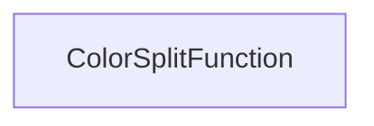

| public |
{:.api_label}

#### Inheritance Graph

## Description

Split function that only uses the color values.

## Public Functions

|
| ------: | ----------------- |
|  | |
|  | **[ColorSplitFunction](#classRendering_1_1MeshUtils_1_1QuadtreeMeshBuilder_1_1ColorSplitFunction_1ad65b08ac19b47d536e6a885e4c6631e1)**( [Util::Reference](classUtil_1_1Reference) < [Util::PixelAccessor](classUtil_1_1PixelAccessor) > colorAccessor) |
|  | |
| bool | **[operator()](#classRendering_1_1MeshUtils_1_1QuadtreeMeshBuilder_1_1ColorSplitFunction_1ae5e2a231eb9c767c966b29774c898c6f)**( [QuadTree](classRendering_1_1MeshUtils_1_1QuadtreeMeshBuilder_1_1QuadTree) * node) |
{: .nohead .nowrap1 .api_section }

-------------------------------------------------------------------

## Documentation

### <small>function</small>  Rendering::MeshUtils::QuadtreeMeshBuilder::ColorSplitFunction::ColorSplitFunction {#classRendering_1_1MeshUtils_1_1QuadtreeMeshBuilder_1_1ColorSplitFunction_1ad65b08ac19b47d536e6a885e4c6631e1}

| public |
{:.api_label}

|
| ------: | ----------------- |
|  |
|  **[ColorSplitFunction](#classRendering_1_1MeshUtils_1_1QuadtreeMeshBuilder_1_1ColorSplitFunction_1ad65b08ac19b47d536e6a885e4c6631e1)**( |  [Util::Reference](classUtil_1_1Reference) < [Util::PixelAccessor](classUtil_1_1PixelAccessor) > | **colorAccessor** ) |
{: .nohead .nowrap1 .api_doc }

#### Parameters
**colorAccessor**
:  Access to the color values

Defined in `Rendering/MeshUtils/QuadtreeMeshBuilder.h:192`{:style="float: right"}

-------------------------------------------------------------------

### <small>function</small>  Rendering::MeshUtils::QuadtreeMeshBuilder::ColorSplitFunction::operator() {#classRendering_1_1MeshUtils_1_1QuadtreeMeshBuilder_1_1ColorSplitFunction_1ae5e2a231eb9c767c966b29774c898c6f}

| public |
{:.api_label}

|
| ------: | ----------------- |
|  |
| bool **[operator()](#classRendering_1_1MeshUtils_1_1QuadtreeMeshBuilder_1_1ColorSplitFunction_1ae5e2a231eb9c767c966b29774c898c6f)**( |  [QuadTree](classRendering_1_1MeshUtils_1_1QuadtreeMeshBuilder_1_1QuadTree) * | **node** ) |
{: .nohead .nowrap1 .api_doc }

Determine whether the specified quad tree node shall be split. Only the color values are used by this function.

#### Parameters
**node**
:  Quad tree node that is to be analyzed

#### Returns
`true`if the specified quad tree node should be split,`false`otherwise

Defined in `Rendering/MeshUtils/QuadtreeMeshBuilder.h:201`{:style="float: right"}

-------------------------------------------------------------------

