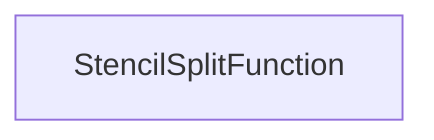

| public |
{:.api_label}

#### Inheritance Graph

## Description

Split function that only uses the stencil values.

## Public Functions

|
| ------: | ----------------- |
|  | |
|  | **[StencilSplitFunction](#classRendering_1_1MeshUtils_1_1QuadtreeMeshBuilder_1_1StencilSplitFunction_1ac53268fc52f6865aabc61f72d51be582)**( [Util::Reference](classUtil_1_1Reference) < [Util::PixelAccessor](classUtil_1_1PixelAccessor) > stencilAccessor) |
|  | |
| bool | **[operator()](#classRendering_1_1MeshUtils_1_1QuadtreeMeshBuilder_1_1StencilSplitFunction_1a6421ea7b6321bfa14aea38869f92a9fa)**( [QuadTree](classRendering_1_1MeshUtils_1_1QuadtreeMeshBuilder_1_1QuadTree) * node) |
{: .nohead .nowrap1 .api_section }

-------------------------------------------------------------------

## Documentation

### <small>function</small>  Rendering::MeshUtils::QuadtreeMeshBuilder::StencilSplitFunction::StencilSplitFunction {#classRendering_1_1MeshUtils_1_1QuadtreeMeshBuilder_1_1StencilSplitFunction_1ac53268fc52f6865aabc61f72d51be582}

| public |
{:.api_label}

|
| ------: | ----------------- |
|  |
|  **[StencilSplitFunction](#classRendering_1_1MeshUtils_1_1QuadtreeMeshBuilder_1_1StencilSplitFunction_1ac53268fc52f6865aabc61f72d51be582)**( |  [Util::Reference](classUtil_1_1Reference) < [Util::PixelAccessor](classUtil_1_1PixelAccessor) > | **stencilAccessor** ) |
{: .nohead .nowrap1 .api_doc }

#### Parameters
**stencilAccessor**
:  Access to the stencil values

Defined in `Rendering/MeshUtils/QuadtreeMeshBuilder.h:214`{:style="float: right"}

-------------------------------------------------------------------

### <small>function</small>  Rendering::MeshUtils::QuadtreeMeshBuilder::StencilSplitFunction::operator() {#classRendering_1_1MeshUtils_1_1QuadtreeMeshBuilder_1_1StencilSplitFunction_1a6421ea7b6321bfa14aea38869f92a9fa}

| public |
{:.api_label}

|
| ------: | ----------------- |
|  |
| bool **[operator()](#classRendering_1_1MeshUtils_1_1QuadtreeMeshBuilder_1_1StencilSplitFunction_1a6421ea7b6321bfa14aea38869f92a9fa)**( |  [QuadTree](classRendering_1_1MeshUtils_1_1QuadtreeMeshBuilder_1_1QuadTree) * | **node** ) |
{: .nohead .nowrap1 .api_doc }

Determine whether the specified quad tree node shall be split. Only the stencil values are used by this function.

#### Parameters
**node**
:  Quad tree node that is to be analyzed

#### Returns
`true`if the specified quad tree node should be split,`false`otherwise

Defined in `Rendering/MeshUtils/QuadtreeMeshBuilder.h:223`{:style="float: right"}

-------------------------------------------------------------------

