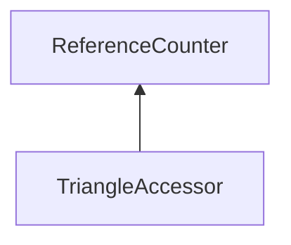

| public |
{:.api_label}

#### Inheritance Graph

## Description

Allows to get triangles of a mesh.

## Public Types

|
| ------: | ----------------- |
|  | |
| typedef std::tuple< uint32_t, uint32_t, uint32_t > | **[TriangleIndices_t](#classRendering_1_1MeshUtils_1_1TriangleAccessor_1a9823a13b48f0f7d541fcc2ccd670e06a)**  |
{: .nohead .nowrap1 .api_section }

## Protected Functions

|
| ------: | ----------------- |
|  | |
|  | **[TriangleAccessor](#classRendering_1_1MeshUtils_1_1TriangleAccessor_1a6ccc6e428da365e9c88eea4c1959cc33)**( [Mesh](classRendering_1_1Mesh) * mesh) |
|  | |
| void | **[assertRange](#classRendering_1_1MeshUtils_1_1TriangleAccessor_1a21108a66e77f54355cb3a9d4e8dcf950)**(uint32_t index) const |
{: .nohead .nowrap1 .api_section }

## Public Static Functions

|
| ------: | ----------------- |
|  | |
| [Util::Reference](classUtil_1_1Reference) < [TriangleAccessor](classRendering_1_1MeshUtils_1_1TriangleAccessor) > | **[create](#classRendering_1_1MeshUtils_1_1TriangleAccessor_1a9be066ede1f2c02dab6f36fe78a1b6a2)**( [Mesh](classRendering_1_1Mesh) * mesh) |
{: .nohead .nowrap1 .api_section }

## Public Functions

|
| ------: | ----------------- |
|  | |
|  | **[~TriangleAccessor](#classRendering_1_1MeshUtils_1_1TriangleAccessor_1a2f8e646011f05351b7b9e935210de4d5)**() |
|  | |
| [Geometry::Triangle3](namespaceGeometry#namespaceGeometry_1ab67ce21ef42d50e94619a718512215d8) | **[getTriangle](#classRendering_1_1MeshUtils_1_1TriangleAccessor_1a58587fd595c8f36a0e0fda18dcfbbb37)**(uint32_t index) const |
|  | |
| void | **[setTriangle](#classRendering_1_1MeshUtils_1_1TriangleAccessor_1acdab5340e81a4b08891f1b468c5fb843)**(uint32_t index, const [Geometry::Triangle3](namespaceGeometry#namespaceGeometry_1ab67ce21ef42d50e94619a718512215d8)  triangle) |
|  | |
| [TriangleIndices_t](classRendering_1_1MeshUtils_1_1TriangleAccessor#classRendering_1_1MeshUtils_1_1TriangleAccessor_1a9823a13b48f0f7d541fcc2ccd670e06a) | **[getIndices](#classRendering_1_1MeshUtils_1_1TriangleAccessor_1a21cf648044211b0cb3f5d68e3273b1a3)**(uint32_t index) const |
{: .nohead .nowrap1 .api_section }

-------------------------------------------------------------------

## Documentation

### <small>typedef</small>  Rendering::MeshUtils::TriangleAccessor::TriangleIndices_t {#classRendering_1_1MeshUtils_1_1TriangleAccessor_1a9823a13b48f0f7d541fcc2ccd670e06a}

| public |
{:.api_label}

|
| ------: | ----------------- |
|  |
| typedef std::tuple< uint32_t, uint32_t, uint32_t > **[TriangleIndices_t](#classRendering_1_1MeshUtils_1_1TriangleAccessor_1a9823a13b48f0f7d541fcc2ccd670e06a)**  |
{: .nohead .nowrap1 .api_doc }

Defined in `Rendering/MeshUtils/TriangleAccessor.h:49`{:style="float: right"}

-------------------------------------------------------------------

### <small>function</small>  Rendering::MeshUtils::TriangleAccessor::TriangleAccessor {#classRendering_1_1MeshUtils_1_1TriangleAccessor_1a6ccc6e428da365e9c88eea4c1959cc33}

| protected |
{:.api_label}

|
| ------: | ----------------- |
|  |
|  **[TriangleAccessor](#classRendering_1_1MeshUtils_1_1TriangleAccessor_1a6ccc6e428da365e9c88eea4c1959cc33)**( |  [Mesh](classRendering_1_1Mesh) * | **mesh** ) |
{: .nohead .nowrap1 .api_doc }

Defined in `Rendering/MeshUtils/TriangleAccessor.h:45`{:style="float: right"}

-------------------------------------------------------------------

### <small>function</small>  Rendering::MeshUtils::TriangleAccessor::assertRange {#classRendering_1_1MeshUtils_1_1TriangleAccessor_1a21108a66e77f54355cb3a9d4e8dcf950}

| protected | const |
{:.api_label}

|
| ------: | ----------------- |
|  |
| void **[assertRange](#classRendering_1_1MeshUtils_1_1TriangleAccessor_1a21108a66e77f54355cb3a9d4e8dcf950)**( | uint32_t | **index** ) const |
{: .nohead .nowrap1 .api_doc }

Defined in `Rendering/MeshUtils/TriangleAccessor.h:47`{:style="float: right"}

-------------------------------------------------------------------

### <small>function</small>  Rendering::MeshUtils::TriangleAccessor::create {#classRendering_1_1MeshUtils_1_1TriangleAccessor_1a9be066ede1f2c02dab6f36fe78a1b6a2}

| public | static |
{:.api_label}

|
| ------: | ----------------- |
|  |
| [Util::Reference](classUtil_1_1Reference) < [TriangleAccessor](classRendering_1_1MeshUtils_1_1TriangleAccessor) > **[create](#classRendering_1_1MeshUtils_1_1TriangleAccessor_1a9be066ede1f2c02dab6f36fe78a1b6a2)**( |  [Mesh](classRendering_1_1Mesh) * | **mesh** ) |
{: .nohead .nowrap1 .api_doc }

(static factory) Create a [TriangleAccessor](classRendering_1_1MeshUtils_1_1TriangleAccessor) for the given [Mesh](classRendering_1_1Mesh) . If no Accessor can be created, an std::invalid_argument exception is thrown.

Defined in `Rendering/MeshUtils/TriangleAccessor.h:54`{:style="float: right"}

-------------------------------------------------------------------

### <small>function</small>  Rendering::MeshUtils::TriangleAccessor::~TriangleAccessor {#classRendering_1_1MeshUtils_1_1TriangleAccessor_1a2f8e646011f05351b7b9e935210de4d5}

| public | inline | virtual |
{:.api_label}

|
| ------: | ----------------- |
|  |
|  **[~TriangleAccessor](#classRendering_1_1MeshUtils_1_1TriangleAccessor_1a2f8e646011f05351b7b9e935210de4d5)**( |  ) |
{: .nohead .nowrap1 .api_doc }

Defined in `Rendering/MeshUtils/TriangleAccessor.h:56`{:style="float: right"}

-------------------------------------------------------------------

### <small>function</small>  Rendering::MeshUtils::TriangleAccessor::getTriangle {#classRendering_1_1MeshUtils_1_1TriangleAccessor_1a58587fd595c8f36a0e0fda18dcfbbb37}

| public | const |
{:.api_label}

|
| ------: | ----------------- |
|  |
| [Geometry::Triangle3](namespaceGeometry#namespaceGeometry_1ab67ce21ef42d50e94619a718512215d8) **[getTriangle](#classRendering_1_1MeshUtils_1_1TriangleAccessor_1a58587fd595c8f36a0e0fda18dcfbbb37)**( | uint32_t | **index** ) const |
{: .nohead .nowrap1 .api_doc }

Defined in `Rendering/MeshUtils/TriangleAccessor.h:58`{:style="float: right"}

-------------------------------------------------------------------

### <small>function</small>  Rendering::MeshUtils::TriangleAccessor::setTriangle {#classRendering_1_1MeshUtils_1_1TriangleAccessor_1acdab5340e81a4b08891f1b468c5fb843}

| public |
{:.api_label}

|
| ------: | ----------------- |
|  |
| void **[setTriangle](#classRendering_1_1MeshUtils_1_1TriangleAccessor_1acdab5340e81a4b08891f1b468c5fb843)**( | uint32_t | **index**, |
| | const [Geometry::Triangle3](namespaceGeometry#namespaceGeometry_1ab67ce21ef42d50e94619a718512215d8)  | **triangle** |
|   ) |
{: .nohead .nowrap1 .api_doc }

Defined in `Rendering/MeshUtils/TriangleAccessor.h:59`{:style="float: right"}

-------------------------------------------------------------------

### <small>function</small>  Rendering::MeshUtils::TriangleAccessor::getIndices {#classRendering_1_1MeshUtils_1_1TriangleAccessor_1a21cf648044211b0cb3f5d68e3273b1a3}

| public | const |
{:.api_label}

|
| ------: | ----------------- |
|  |
| [TriangleIndices_t](classRendering_1_1MeshUtils_1_1TriangleAccessor#classRendering_1_1MeshUtils_1_1TriangleAccessor_1a9823a13b48f0f7d541fcc2ccd670e06a) **[getIndices](#classRendering_1_1MeshUtils_1_1TriangleAccessor_1a21cf648044211b0cb3f5d68e3273b1a3)**( | uint32_t | **index** ) const |
{: .nohead .nowrap1 .api_doc }

Defined in `Rendering/MeshUtils/TriangleAccessor.h:61`{:style="float: right"}

-------------------------------------------------------------------

