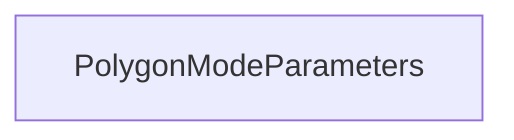

| public |
{:.api_label}

#### Inheritance Graph

## Description

## Public Types

|
| ------: | ----------------- |
|  | |
| enum | **[polygonModeMode_t](#classRendering_1_1PolygonModeParameters_1a617609ddc7f9edfd4a4ddc1b22ea03ad)** {POINT, LINE, FILL} |
{: .nohead .nowrap1 .api_section }

## Public Static Functions

|
| ------: | ----------------- |
|  | |
| std::string | **[modeToString](#classRendering_1_1PolygonModeParameters_1aaac96a4cfe055877f20477cd6058a114)**( [polygonModeMode_t](classRendering_1_1PolygonModeParameters#classRendering_1_1PolygonModeParameters_1a617609ddc7f9edfd4a4ddc1b22ea03ad)  mode) |
|  | |
| [polygonModeMode_t](classRendering_1_1PolygonModeParameters#classRendering_1_1PolygonModeParameters_1a617609ddc7f9edfd4a4ddc1b22ea03ad) | **[stringToMode](#classRendering_1_1PolygonModeParameters_1a0e513def73bbb7e01034e528241a5dee)**(const std::string & str) |
|  | |
| uint32_t | **[modeToGL](#classRendering_1_1PolygonModeParameters_1a991a80bf66eed9504d2e63d1d5139c02)**( [polygonModeMode_t](classRendering_1_1PolygonModeParameters#classRendering_1_1PolygonModeParameters_1a617609ddc7f9edfd4a4ddc1b22ea03ad)  mode) |
|  | |
| [polygonModeMode_t](classRendering_1_1PolygonModeParameters#classRendering_1_1PolygonModeParameters_1a617609ddc7f9edfd4a4ddc1b22ea03ad) | **[glToMode](#classRendering_1_1PolygonModeParameters_1a264dc0859af47ae688df3a9f8cba456b)**(uint32_t value) |
{: .nohead .nowrap1 .api_section }

## Public Functions

|
| ------: | ----------------- |
|  | |
|  | **[PolygonModeParameters](#classRendering_1_1PolygonModeParameters_1aec204a61b4e3f21f47acf421fdaffba7)**()   Create [PolygonModeParameters](classRendering_1_1PolygonModeParameters) representing the default OpenGL state. |
|  | |
|  | **[PolygonModeParameters](#classRendering_1_1PolygonModeParameters_1a73ff6a5dedbff130712a0c4f3787b476)**(const [polygonModeMode_t](classRendering_1_1PolygonModeParameters#classRendering_1_1PolygonModeParameters_1a617609ddc7f9edfd4a4ddc1b22ea03ad)  _mode)   Create [PolygonModeParameters](classRendering_1_1PolygonModeParameters) with the given values. |
|  | |
| bool | **[operator!=](#classRendering_1_1PolygonModeParameters_1a20735acd7b52ef89d7de82facc0d249f)**(const [PolygonModeParameters](classRendering_1_1PolygonModeParameters) & other) const |
|  | |
| bool | **[operator==](#classRendering_1_1PolygonModeParameters_1aabd151bd1a08b2946fad1c08afd6d0cf)**(const [PolygonModeParameters](classRendering_1_1PolygonModeParameters) & other) const |
|  | |
| [polygonModeMode_t](classRendering_1_1PolygonModeParameters#classRendering_1_1PolygonModeParameters_1a617609ddc7f9edfd4a4ddc1b22ea03ad) | **[getMode](#classRendering_1_1PolygonModeParameters_1a0979cb2f20640496d8fbe18fbe15f3c0)**() const |
|  | |
| void | **[setMode](#classRendering_1_1PolygonModeParameters_1aed558ef584d0f0997f1502fb732fb4f1)**( [polygonModeMode_t](classRendering_1_1PolygonModeParameters#classRendering_1_1PolygonModeParameters_1a617609ddc7f9edfd4a4ddc1b22ea03ad)  _mode) |
{: .nohead .nowrap1 .api_section }

-------------------------------------------------------------------

## Documentation

### <small>enum</small>  Rendering::PolygonModeParameters::polygonModeMode_t {#classRendering_1_1PolygonModeParameters_1a617609ddc7f9edfd4a4ddc1b22ea03ad}

| public |
{:.api_label}

|
| ------: | ----------------- |
|  |
| enum **[polygonModeMode_t](#classRendering_1_1PolygonModeParameters_1a617609ddc7f9edfd4a4ddc1b22ea03ad)** |
{: .nohead .nowrap1 .api_doc }

| Enumerator |     | Description | 
| ---------- | --- | ----------- | 
| Enumerator |     | Description | 
| POINT      | = 1 |             | 
| LINE       | = 2 |             | 
| FILL       | = 3 |             | 

Defined in `Rendering/RenderingContext/RenderingParameters.h:760`{:style="float: right"}

-------------------------------------------------------------------

### <small>function</small>  Rendering::PolygonModeParameters::modeToString {#classRendering_1_1PolygonModeParameters_1aaac96a4cfe055877f20477cd6058a114}

| public | static |
{:.api_label}

|
| ------: | ----------------- |
|  |
| std::string **[modeToString](#classRendering_1_1PolygonModeParameters_1aaac96a4cfe055877f20477cd6058a114)**( |  [polygonModeMode_t](classRendering_1_1PolygonModeParameters#classRendering_1_1PolygonModeParameters_1a617609ddc7f9edfd4a4ddc1b22ea03ad)  | **mode** ) |
{: .nohead .nowrap1 .api_doc }

Defined in `Rendering/RenderingContext/RenderingParameters.h:762`{:style="float: right"}

-------------------------------------------------------------------

### <small>function</small>  Rendering::PolygonModeParameters::stringToMode {#classRendering_1_1PolygonModeParameters_1a0e513def73bbb7e01034e528241a5dee}

| public | static |
{:.api_label}

|
| ------: | ----------------- |
|  |
| [polygonModeMode_t](classRendering_1_1PolygonModeParameters#classRendering_1_1PolygonModeParameters_1a617609ddc7f9edfd4a4ddc1b22ea03ad) **[stringToMode](#classRendering_1_1PolygonModeParameters_1a0e513def73bbb7e01034e528241a5dee)**( | const std::string & | **str** ) |
{: .nohead .nowrap1 .api_doc }

Defined in `Rendering/RenderingContext/RenderingParameters.h:763`{:style="float: right"}

-------------------------------------------------------------------

### <small>function</small>  Rendering::PolygonModeParameters::modeToGL {#classRendering_1_1PolygonModeParameters_1a991a80bf66eed9504d2e63d1d5139c02}

| public | static |
{:.api_label}

|
| ------: | ----------------- |
|  |
| uint32_t **[modeToGL](#classRendering_1_1PolygonModeParameters_1a991a80bf66eed9504d2e63d1d5139c02)**( |  [polygonModeMode_t](classRendering_1_1PolygonModeParameters#classRendering_1_1PolygonModeParameters_1a617609ddc7f9edfd4a4ddc1b22ea03ad)  | **mode** ) |
{: .nohead .nowrap1 .api_doc }

Defined in `Rendering/RenderingContext/RenderingParameters.h:765`{:style="float: right"}

-------------------------------------------------------------------

### <small>function</small>  Rendering::PolygonModeParameters::glToMode {#classRendering_1_1PolygonModeParameters_1a264dc0859af47ae688df3a9f8cba456b}

| public | static |
{:.api_label}

|
| ------: | ----------------- |
|  |
| [polygonModeMode_t](classRendering_1_1PolygonModeParameters#classRendering_1_1PolygonModeParameters_1a617609ddc7f9edfd4a4ddc1b22ea03ad) **[glToMode](#classRendering_1_1PolygonModeParameters_1a264dc0859af47ae688df3a9f8cba456b)**( | uint32_t | **value** ) |
{: .nohead .nowrap1 .api_doc }

Defined in `Rendering/RenderingContext/RenderingParameters.h:766`{:style="float: right"}

-------------------------------------------------------------------

### <small>function</small>  Rendering::PolygonModeParameters::PolygonModeParameters {#classRendering_1_1PolygonModeParameters_1aec204a61b4e3f21f47acf421fdaffba7}

| public | inline | explicit |
{:.api_label}

|
| ------: | ----------------- |
|  |
|  **[PolygonModeParameters](#classRendering_1_1PolygonModeParameters_1aec204a61b4e3f21f47acf421fdaffba7)**( |  ) |
{: .nohead .nowrap1 .api_doc }

Create [PolygonModeParameters](classRendering_1_1PolygonModeParameters) representing the default OpenGL state.

Defined in `Rendering/RenderingContext/RenderingParameters.h:771`{:style="float: right"}

-------------------------------------------------------------------

### <small>function</small>  Rendering::PolygonModeParameters::PolygonModeParameters {#classRendering_1_1PolygonModeParameters_1a73ff6a5dedbff130712a0c4f3787b476}

| public | inline | explicit |
{:.api_label}

|
| ------: | ----------------- |
|  |
|  **[PolygonModeParameters](#classRendering_1_1PolygonModeParameters_1a73ff6a5dedbff130712a0c4f3787b476)**( | const [polygonModeMode_t](classRendering_1_1PolygonModeParameters#classRendering_1_1PolygonModeParameters_1a617609ddc7f9edfd4a4ddc1b22ea03ad)  | **_mode** ) |
{: .nohead .nowrap1 .api_doc }

Create [PolygonModeParameters](classRendering_1_1PolygonModeParameters) with the given values.

Defined in `Rendering/RenderingContext/RenderingParameters.h:774`{:style="float: right"}

-------------------------------------------------------------------

### <small>function</small>  Rendering::PolygonModeParameters::operator!= {#classRendering_1_1PolygonModeParameters_1a20735acd7b52ef89d7de82facc0d249f}

| public | const | inline |
{:.api_label}

|
| ------: | ----------------- |
|  |
| bool **[operator!=](#classRendering_1_1PolygonModeParameters_1a20735acd7b52ef89d7de82facc0d249f)**( | const [PolygonModeParameters](classRendering_1_1PolygonModeParameters) & | **other** ) const |
{: .nohead .nowrap1 .api_doc }

Defined in `Rendering/RenderingContext/RenderingParameters.h:776`{:style="float: right"}

-------------------------------------------------------------------

### <small>function</small>  Rendering::PolygonModeParameters::operator== {#classRendering_1_1PolygonModeParameters_1aabd151bd1a08b2946fad1c08afd6d0cf}

| public | const | inline |
{:.api_label}

|
| ------: | ----------------- |
|  |
| bool **[operator==](#classRendering_1_1PolygonModeParameters_1aabd151bd1a08b2946fad1c08afd6d0cf)**( | const [PolygonModeParameters](classRendering_1_1PolygonModeParameters) & | **other** ) const |
{: .nohead .nowrap1 .api_doc }

Defined in `Rendering/RenderingContext/RenderingParameters.h:779`{:style="float: right"}

-------------------------------------------------------------------

### <small>function</small>  Rendering::PolygonModeParameters::getMode {#classRendering_1_1PolygonModeParameters_1a0979cb2f20640496d8fbe18fbe15f3c0}

| public | const | inline |
{:.api_label}

|
| ------: | ----------------- |
|  |
| [polygonModeMode_t](classRendering_1_1PolygonModeParameters#classRendering_1_1PolygonModeParameters_1a617609ddc7f9edfd4a4ddc1b22ea03ad) **[getMode](#classRendering_1_1PolygonModeParameters_1a0979cb2f20640496d8fbe18fbe15f3c0)**( |  ) const |
{: .nohead .nowrap1 .api_doc }

Defined in `Rendering/RenderingContext/RenderingParameters.h:783`{:style="float: right"}

-------------------------------------------------------------------

### <small>function</small>  Rendering::PolygonModeParameters::setMode {#classRendering_1_1PolygonModeParameters_1aed558ef584d0f0997f1502fb732fb4f1}

| public | inline |
{:.api_label}

|
| ------: | ----------------- |
|  |
| void **[setMode](#classRendering_1_1PolygonModeParameters_1aed558ef584d0f0997f1502fb732fb4f1)**( |  [polygonModeMode_t](classRendering_1_1PolygonModeParameters#classRendering_1_1PolygonModeParameters_1a617609ddc7f9edfd4a4ddc1b22ea03ad)  | **_mode** ) |
{: .nohead .nowrap1 .api_doc }

Defined in `Rendering/RenderingContext/RenderingParameters.h:786`{:style="float: right"}

-------------------------------------------------------------------

