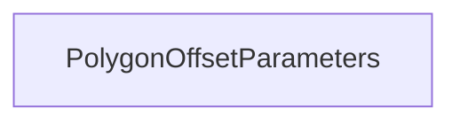

| public |
{:.api_label}

#### Inheritance Graph

## Description

Parameters of the polygon offset settings.

Abstraction layer class for polygon offsets. The OpenGL functions working with the polygon offset are encapsulated inside.

**Author**: Benjamin Eikel

**Date**: 2012-02-14

## Public Functions

|
| ------: | ----------------- |
|  | |
|  | **[PolygonOffsetParameters](#classRendering_1_1PolygonOffsetParameters_1a1a8ee6ea27b51d169b021c1f3a5867b2)**() |
|  | |
|  | **[PolygonOffsetParameters](#classRendering_1_1PolygonOffsetParameters_1a1f0a7a581c68ccf17087eb48e34e6264)**(float newFactor, float newUnits) |
|  | |
| bool | **[operator==](#classRendering_1_1PolygonOffsetParameters_1a4b09d6e6e150e744ab6a331dcebdf04f)**(const [PolygonOffsetParameters](classRendering_1_1PolygonOffsetParameters) & other) const   Return`true`if the whole set of parameters is**equal**to the*other*set. |
|  | |
| bool | **[operator!=](#classRendering_1_1PolygonOffsetParameters_1a9bba60c738e6336d1924cc672885d5d1)**(const [PolygonOffsetParameters](classRendering_1_1PolygonOffsetParameters) & other) const   Return`true`if the whole set of parameters is**unequal**to the*other*set. |
|  | |
| bool | **[isEnabled](#classRendering_1_1PolygonOffsetParameters_1a065f429f306ad7a0e55178c20d23bbb6)**() const |
|  | |
| void | **[enable](#classRendering_1_1PolygonOffsetParameters_1adc0333875f0c63b0478aa02fc50fd8e6)**() |
|  | |
| void | **[disable](#classRendering_1_1PolygonOffsetParameters_1a2814aa43cc29febaf9c7766339fc9eae)**() |
|  | |
| float | **[getFactor](#classRendering_1_1PolygonOffsetParameters_1a80da1b46ceb51a2fc79e0e9cf5aebb4f)**() const |
|  | |
| void | **[setFactor](#classRendering_1_1PolygonOffsetParameters_1a2edc3dbd0d7a59791fb734a6654055c4)**(float newFactor) |
|  | |
| float | **[getUnits](#classRendering_1_1PolygonOffsetParameters_1a4dff7ff962e9a3adb7f05c8b0c39be91)**() const |
|  | |
| void | **[setUnits](#classRendering_1_1PolygonOffsetParameters_1a4c8bc8e6239848b02e9b56fd6ab7a21a)**(float newUnits) |
{: .nohead .nowrap1 .api_section }

-------------------------------------------------------------------

## Documentation

### <small>function</small>  Rendering::PolygonOffsetParameters::PolygonOffsetParameters {#classRendering_1_1PolygonOffsetParameters_1a1a8ee6ea27b51d169b021c1f3a5867b2}

| public | inline | explicit |
{:.api_label}

|
| ------: | ----------------- |
|  |
|  **[PolygonOffsetParameters](#classRendering_1_1PolygonOffsetParameters_1a1a8ee6ea27b51d169b021c1f3a5867b2)**( |  ) |
{: .nohead .nowrap1 .api_doc }

Create [PolygonOffsetParameters](classRendering_1_1PolygonOffsetParameters) representing an disabled state.

*See also*: Parameter GL_POLYGON_OFFSET_FILL of glDisable

Defined in `Rendering/RenderingContext/RenderingParameters.h:816`{:style="float: right"}

-------------------------------------------------------------------

### <small>function</small>  Rendering::PolygonOffsetParameters::PolygonOffsetParameters {#classRendering_1_1PolygonOffsetParameters_1a1f0a7a581c68ccf17087eb48e34e6264}

| public | inline | explicit |
{:.api_label}

|
| ------: | ----------------- |
|  |
|  **[PolygonOffsetParameters](#classRendering_1_1PolygonOffsetParameters_1a1f0a7a581c68ccf17087eb48e34e6264)**( | float | **newFactor**, |
| | float | **newUnits** |
|   ) |
{: .nohead .nowrap1 .api_doc }

Create [PolygonOffsetParameters](classRendering_1_1PolygonOffsetParameters) with given values representing an enabled state.

*See also*: Parameter GL_POLYGON_OFFSET_FILL of glEnable

Defined in `Rendering/RenderingContext/RenderingParameters.h:824`{:style="float: right"}

-------------------------------------------------------------------

### <small>function</small>  Rendering::PolygonOffsetParameters::operator== {#classRendering_1_1PolygonOffsetParameters_1a4b09d6e6e150e744ab6a331dcebdf04f}

| public | const | inline |
{:.api_label}

|
| ------: | ----------------- |
|  |
| bool **[operator==](#classRendering_1_1PolygonOffsetParameters_1a4b09d6e6e150e744ab6a331dcebdf04f)**( | const [PolygonOffsetParameters](classRendering_1_1PolygonOffsetParameters) & | **other** ) const |
{: .nohead .nowrap1 .api_doc }

Return`true`if the whole set of parameters is**equal**to the*other*set.

Defined in `Rendering/RenderingContext/RenderingParameters.h:828`{:style="float: right"}

-------------------------------------------------------------------

### <small>function</small>  Rendering::PolygonOffsetParameters::operator!= {#classRendering_1_1PolygonOffsetParameters_1a9bba60c738e6336d1924cc672885d5d1}

| public | const | inline |
{:.api_label}

|
| ------: | ----------------- |
|  |
| bool **[operator!=](#classRendering_1_1PolygonOffsetParameters_1a9bba60c738e6336d1924cc672885d5d1)**( | const [PolygonOffsetParameters](classRendering_1_1PolygonOffsetParameters) & | **other** ) const |
{: .nohead .nowrap1 .api_doc }

Return`true`if the whole set of parameters is**unequal**to the*other*set.

Defined in `Rendering/RenderingContext/RenderingParameters.h:832`{:style="float: right"}

-------------------------------------------------------------------

### <small>function</small>  Rendering::PolygonOffsetParameters::isEnabled {#classRendering_1_1PolygonOffsetParameters_1a065f429f306ad7a0e55178c20d23bbb6}

| public | const | inline |
{:.api_label}

|
| ------: | ----------------- |
|  |
| bool **[isEnabled](#classRendering_1_1PolygonOffsetParameters_1a065f429f306ad7a0e55178c20d23bbb6)**( |  ) const |
{: .nohead .nowrap1 .api_doc }

Defined in `Rendering/RenderingContext/RenderingParameters.h:836`{:style="float: right"}

-------------------------------------------------------------------

### <small>function</small>  Rendering::PolygonOffsetParameters::enable {#classRendering_1_1PolygonOffsetParameters_1adc0333875f0c63b0478aa02fc50fd8e6}

| public | inline |
{:.api_label}

|
| ------: | ----------------- |
|  |
| void **[enable](#classRendering_1_1PolygonOffsetParameters_1adc0333875f0c63b0478aa02fc50fd8e6)**( |  ) |
{: .nohead .nowrap1 .api_doc }

Defined in `Rendering/RenderingContext/RenderingParameters.h:839`{:style="float: right"}

-------------------------------------------------------------------

### <small>function</small>  Rendering::PolygonOffsetParameters::disable {#classRendering_1_1PolygonOffsetParameters_1a2814aa43cc29febaf9c7766339fc9eae}

| public | inline |
{:.api_label}

|
| ------: | ----------------- |
|  |
| void **[disable](#classRendering_1_1PolygonOffsetParameters_1a2814aa43cc29febaf9c7766339fc9eae)**( |  ) |
{: .nohead .nowrap1 .api_doc }

Defined in `Rendering/RenderingContext/RenderingParameters.h:842`{:style="float: right"}

-------------------------------------------------------------------

### <small>function</small>  Rendering::PolygonOffsetParameters::getFactor {#classRendering_1_1PolygonOffsetParameters_1a80da1b46ceb51a2fc79e0e9cf5aebb4f}

| public | const | inline |
{:.api_label}

|
| ------: | ----------------- |
|  |
| float **[getFactor](#classRendering_1_1PolygonOffsetParameters_1a80da1b46ceb51a2fc79e0e9cf5aebb4f)**( |  ) const |
{: .nohead .nowrap1 .api_doc }

Defined in `Rendering/RenderingContext/RenderingParameters.h:846`{:style="float: right"}

-------------------------------------------------------------------

### <small>function</small>  Rendering::PolygonOffsetParameters::setFactor {#classRendering_1_1PolygonOffsetParameters_1a2edc3dbd0d7a59791fb734a6654055c4}

| public | inline |
{:.api_label}

|
| ------: | ----------------- |
|  |
| void **[setFactor](#classRendering_1_1PolygonOffsetParameters_1a2edc3dbd0d7a59791fb734a6654055c4)**( | float | **newFactor** ) |
{: .nohead .nowrap1 .api_doc }

*See also*: Parameter factor of glPolygonOffset

Defined in `Rendering/RenderingContext/RenderingParameters.h:850`{:style="float: right"}

-------------------------------------------------------------------

### <small>function</small>  Rendering::PolygonOffsetParameters::getUnits {#classRendering_1_1PolygonOffsetParameters_1a4dff7ff962e9a3adb7f05c8b0c39be91}

| public | const | inline |
{:.api_label}

|
| ------: | ----------------- |
|  |
| float **[getUnits](#classRendering_1_1PolygonOffsetParameters_1a4dff7ff962e9a3adb7f05c8b0c39be91)**( |  ) const |
{: .nohead .nowrap1 .api_doc }

Defined in `Rendering/RenderingContext/RenderingParameters.h:854`{:style="float: right"}

-------------------------------------------------------------------

### <small>function</small>  Rendering::PolygonOffsetParameters::setUnits {#classRendering_1_1PolygonOffsetParameters_1a4c8bc8e6239848b02e9b56fd6ab7a21a}

| public | inline |
{:.api_label}

|
| ------: | ----------------- |
|  |
| void **[setUnits](#classRendering_1_1PolygonOffsetParameters_1a4c8bc8e6239848b02e9b56fd6ab7a21a)**( | float | **newUnits** ) |
{: .nohead .nowrap1 .api_doc }

*See also*: Parameter units of glPolygonOffset

Defined in `Rendering/RenderingContext/RenderingParameters.h:858`{:style="float: right"}

-------------------------------------------------------------------

