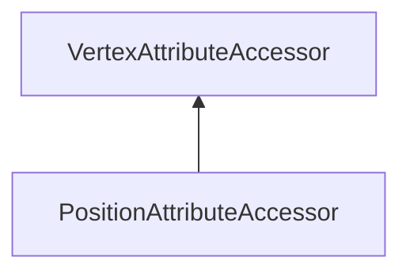

| public | abstract |
{:.api_label}

#### Inheritance Graph

## Description

 [PositionAttributeAccessor](classRendering_1_1PositionAttributeAccessor) |> [VertexAttributeAccessor](classRendering_1_1VertexAttributeAccessor) Accessor for float vertex positions.
> **Note**: If someday something else than vec3 is used for storing positions, this has to be implemented using new subclasses!

## Protected Functions

|
| ------: | ----------------- |
|  | |
|  | **[PositionAttributeAccessor](#classRendering_1_1PositionAttributeAccessor_1a2a4bcee2f48f0376f0ab31f193feaf4b)**( [MeshVertexData](classRendering_1_1MeshVertexData) & _vData, const [VertexAttribute](classRendering_1_1VertexAttribute) & _attribute) |
{: .nohead .nowrap1 .api_section }

## Public Static Functions

|
| ------: | ----------------- |
|  | |
| [Util::Reference](classUtil_1_1Reference) < [PositionAttributeAccessor](classRendering_1_1PositionAttributeAccessor) > | **[create](#classRendering_1_1PositionAttributeAccessor_1ac059556299abb998225569e525684d24)**( [MeshVertexData](classRendering_1_1MeshVertexData) & _vData,  [Util::StringIdentifier](classUtil_1_1StringIdentifier)  name) |
{: .nohead .nowrap1 .api_section }

## Public Functions

|
| ------: | ----------------- |
|  | |
|  | **[~PositionAttributeAccessor](#classRendering_1_1PositionAttributeAccessor_1ac8eb5929799d546960c7ff5facf6aa75)**() |
|  | |
| const [Geometry::Vec3](namespaceGeometry#namespaceGeometry_1ab29e4544da9b15b5bf224cbf5b691313) | **[getPosition](#classRendering_1_1PositionAttributeAccessor_1a2119fd10a4ddaba4008bc8983d999feb)**(uint32_t index) const |
|  | |
| void | **[setPosition](#classRendering_1_1PositionAttributeAccessor_1a90c18bb5af2f9c287c6c18b934fe58b7)**(uint32_t index, const [Geometry::Vec3](namespaceGeometry#namespaceGeometry_1ab29e4544da9b15b5bf224cbf5b691313) & p) |
{: .nohead .nowrap1 .api_section }

-------------------------------------------------------------------

## Documentation

### <small>function</small>  Rendering::PositionAttributeAccessor::PositionAttributeAccessor {#classRendering_1_1PositionAttributeAccessor_1a2a4bcee2f48f0376f0ab31f193feaf4b}

| protected | inline |
{:.api_label}

|
| ------: | ----------------- |
|  |
|  **[PositionAttributeAccessor](#classRendering_1_1PositionAttributeAccessor_1a2a4bcee2f48f0376f0ab31f193feaf4b)**( |  [MeshVertexData](classRendering_1_1MeshVertexData) & | **_vData**, |
| | const [VertexAttribute](classRendering_1_1VertexAttribute) & | **_attribute** |
|   ) |
{: .nohead .nowrap1 .api_doc }

Defined in `Rendering/Mesh/VertexAttributeAccessors.h:113`{:style="float: right"}

-------------------------------------------------------------------

### <small>function</small>  Rendering::PositionAttributeAccessor::create {#classRendering_1_1PositionAttributeAccessor_1ac059556299abb998225569e525684d24}

| public | static |
{:.api_label}

|
| ------: | ----------------- |
|  |
| [Util::Reference](classUtil_1_1Reference) < [PositionAttributeAccessor](classRendering_1_1PositionAttributeAccessor) > **[create](#classRendering_1_1PositionAttributeAccessor_1ac059556299abb998225569e525684d24)**( |  [MeshVertexData](classRendering_1_1MeshVertexData) & | **_vData**, |
| |  [Util::StringIdentifier](classUtil_1_1StringIdentifier)  | **name** |
|   ) |
{: .nohead .nowrap1 .api_doc }

(static factory) Create a [PositionAttributeAccessor](classRendering_1_1PositionAttributeAccessor) for the given [MeshVertexData](classRendering_1_1MeshVertexData) 's attribute having the given name. If no Accessor can be created, an std::invalid_argument exception is thrown.

Defined in `Rendering/Mesh/VertexAttributeAccessors.h:119`{:style="float: right"}

-------------------------------------------------------------------

### <small>function</small>  Rendering::PositionAttributeAccessor::~PositionAttributeAccessor {#classRendering_1_1PositionAttributeAccessor_1ac8eb5929799d546960c7ff5facf6aa75}

| public | inline | virtual |
{:.api_label}

|
| ------: | ----------------- |
|  |
|  **[~PositionAttributeAccessor](#classRendering_1_1PositionAttributeAccessor_1ac8eb5929799d546960c7ff5facf6aa75)**( |  ) |
{: .nohead .nowrap1 .api_doc }

Defined in `Rendering/Mesh/VertexAttributeAccessors.h:121`{:style="float: right"}

-------------------------------------------------------------------

### <small>function</small>  Rendering::PositionAttributeAccessor::getPosition {#classRendering_1_1PositionAttributeAccessor_1a2119fd10a4ddaba4008bc8983d999feb}

| public | const | virtual |
{:.api_label}

|
| ------: | ----------------- |
|  |
| const [Geometry::Vec3](namespaceGeometry#namespaceGeometry_1ab29e4544da9b15b5bf224cbf5b691313) **[getPosition](#classRendering_1_1PositionAttributeAccessor_1a2119fd10a4ddaba4008bc8983d999feb)**( | uint32_t | **index** ) const |
{: .nohead .nowrap1 .api_doc }

Defined in `Rendering/Mesh/VertexAttributeAccessors.h:123`{:style="float: right"}

-------------------------------------------------------------------

### <small>function</small>  Rendering::PositionAttributeAccessor::setPosition {#classRendering_1_1PositionAttributeAccessor_1a90c18bb5af2f9c287c6c18b934fe58b7}

| public | virtual |
{:.api_label}

|
| ------: | ----------------- |
|  |
| void **[setPosition](#classRendering_1_1PositionAttributeAccessor_1a90c18bb5af2f9c287c6c18b934fe58b7)**( | uint32_t | **index**, |
| | const [Geometry::Vec3](namespaceGeometry#namespaceGeometry_1ab29e4544da9b15b5bf224cbf5b691313) & | **p** |
|   ) |
{: .nohead .nowrap1 .api_doc }

Defined in `Rendering/Mesh/VertexAttributeAccessors.h:124`{:style="float: right"}

-------------------------------------------------------------------

