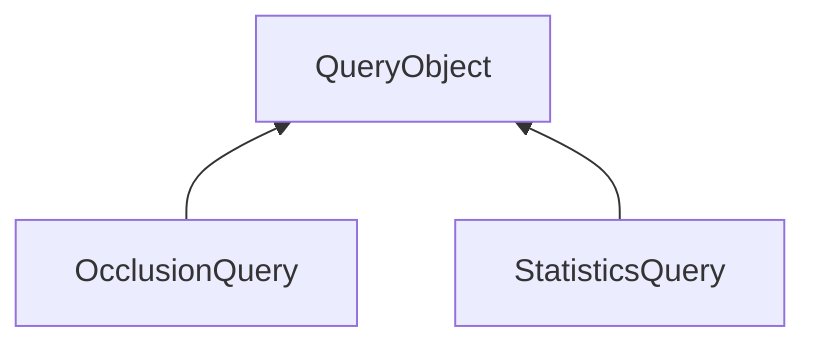

| public |
{:.api_label}

#### Inheritance Graph

## Description

Wrapper class for OpenGL queries.

*See also*:  [OcclusionQuery.h](OcclusionQuery_8h_source) 

**Author**: Benjamin Eikel, Claudius Jähn

**Date**: 2013-03-21

## Public Functions

|
| ------: | ----------------- |
|  | |
|  | **[QueryObject](#classRendering_1_1QueryObject_1a26470a6cb517c545f181262c3faacbfb)**(uint32_t _queryType)   Standard constructor. |
|  | |
|  | **[QueryObject](#classRendering_1_1QueryObject_1a02b80eb2580852f509a64c940acbbc3d)**(const [QueryObject](classRendering_1_1QueryObject) & other) |
|  | |
|  | **[QueryObject](#classRendering_1_1QueryObject_1a90d1c3de2ce4905cd46a95ae0cb15f03)**( [QueryObject](classRendering_1_1QueryObject) && other) |
|  | |
|  | **[~QueryObject](#classRendering_1_1QueryObject_1a45656355d38e6e7dc1621e23f05c9ba5)**()   Destructor frees the query identifier. |
|  | |
| [QueryObject](classRendering_1_1QueryObject) & | **[operator=](#classRendering_1_1QueryObject_1a53427027ec19243825729d3f97b56e0d)**(const [QueryObject](classRendering_1_1QueryObject) & void) |
|  | |
| [QueryObject](classRendering_1_1QueryObject) & | **[operator=](#classRendering_1_1QueryObject_1a8d52f848d4435f52912ceb9878929f63)**( [QueryObject](classRendering_1_1QueryObject) && other) |
|  | |
| bool | **[isResultAvailable](#classRendering_1_1QueryObject_1aac18d4343578dca12a3c99915a2c56a5)**() const |
|  | |
| uint32_t | **[getResult](#classRendering_1_1QueryObject_1a40088fac48692629a955026998ca1eae)**() const |
|  | |
| uint64_t | **[getResult64](#classRendering_1_1QueryObject_1a41727b26eec766b4158cd13f503138e1)**() const |
|  | |
| void | **[begin](#classRendering_1_1QueryObject_1acb5888624e444962c79161e0caf0e618)**() const   Start the query.* [end()](classRendering_1_1QueryObject#classRendering_1_1QueryObject_1a2495df860cb27046c5777a047801ba8e) *has to be called after the rendering was done. |
|  | |
| void | **[end](#classRendering_1_1QueryObject_1a2495df860cb27046c5777a047801ba8e)**() const   Stop the query. |
|  | |
| void | **[queryCounter](#classRendering_1_1QueryObject_1ae3eca0d279f70dee85e62a2094d2a018)**() const   Record the GL time; only used with GL_TIMESTAMP. |
|  | |
| bool | **[isValid](#classRendering_1_1QueryObject_1a26f08b56ee5a03335bcf9b321ec4a193)**() const |
|  | |
| uint32_t | **[_getQueryType](#classRendering_1_1QueryObject_1a9b3047d4fea678bf448d4c5f4616b03e)**() const   Returns the GL constant of the query's type. |
{: .nohead .nowrap1 .api_section }

-------------------------------------------------------------------

## Documentation

### <small>function</small>  Rendering::QueryObject::QueryObject {#classRendering_1_1QueryObject_1a26470a6cb517c545f181262c3faacbfb}

| public | inline | explicit |
{:.api_label}

|
| ------: | ----------------- |
|  |
|  **[QueryObject](#classRendering_1_1QueryObject_1a26470a6cb517c545f181262c3faacbfb)**( | uint32_t | **_queryType** ) |
{: .nohead .nowrap1 .api_doc }

Standard constructor.

Defined in `Rendering/QueryObject.h:28`{:style="float: right"}

-------------------------------------------------------------------

### <small>function</small>  Rendering::QueryObject::QueryObject {#classRendering_1_1QueryObject_1a02b80eb2580852f509a64c940acbbc3d}

| public |
{:.api_label}

|
| ------: | ----------------- |
|  |
|  **[QueryObject](#classRendering_1_1QueryObject_1a02b80eb2580852f509a64c940acbbc3d)**( | const [QueryObject](classRendering_1_1QueryObject) & | **other** ) |
{: .nohead .nowrap1 .api_doc }

Defined in `Rendering/QueryObject.h:30`{:style="float: right"}

-------------------------------------------------------------------

### <small>function</small>  Rendering::QueryObject::QueryObject {#classRendering_1_1QueryObject_1a90d1c3de2ce4905cd46a95ae0cb15f03}

| public | inline |
{:.api_label}

|
| ------: | ----------------- |
|  |
|  **[QueryObject](#classRendering_1_1QueryObject_1a90d1c3de2ce4905cd46a95ae0cb15f03)**( |  [QueryObject](classRendering_1_1QueryObject) && | **other** ) |
{: .nohead .nowrap1 .api_doc }

Defined in `Rendering/QueryObject.h:32`{:style="float: right"}

-------------------------------------------------------------------

### <small>function</small>  Rendering::QueryObject::~QueryObject {#classRendering_1_1QueryObject_1a45656355d38e6e7dc1621e23f05c9ba5}

| public | inline |
{:.api_label}

|
| ------: | ----------------- |
|  |
|  **[~QueryObject](#classRendering_1_1QueryObject_1a45656355d38e6e7dc1621e23f05c9ba5)**( |  ) |
{: .nohead .nowrap1 .api_doc }

Destructor frees the query identifier.

Defined in `Rendering/QueryObject.h:35`{:style="float: right"}

-------------------------------------------------------------------

### <small>function</small>  Rendering::QueryObject::operator= {#classRendering_1_1QueryObject_1a53427027ec19243825729d3f97b56e0d}

| public |
{:.api_label}

|
| ------: | ----------------- |
|  |
| [QueryObject](classRendering_1_1QueryObject) & **[operator=](#classRendering_1_1QueryObject_1a53427027ec19243825729d3f97b56e0d)**( | const [QueryObject](classRendering_1_1QueryObject) & | **void** ) |
{: .nohead .nowrap1 .api_doc }

Defined in `Rendering/QueryObject.h:37`{:style="float: right"}

-------------------------------------------------------------------

### <small>function</small>  Rendering::QueryObject::operator= {#classRendering_1_1QueryObject_1a8d52f848d4435f52912ceb9878929f63}

| public |
{:.api_label}

|
| ------: | ----------------- |
|  |
| [QueryObject](classRendering_1_1QueryObject) & **[operator=](#classRendering_1_1QueryObject_1a8d52f848d4435f52912ceb9878929f63)**( |  [QueryObject](classRendering_1_1QueryObject) && | **other** ) |
{: .nohead .nowrap1 .api_doc }

Defined in `Rendering/QueryObject.h:38`{:style="float: right"}

-------------------------------------------------------------------

### <small>function</small>  Rendering::QueryObject::isResultAvailable {#classRendering_1_1QueryObject_1aac18d4343578dca12a3c99915a2c56a5}

| public | const |
{:.api_label}

|
| ------: | ----------------- |
|  |
| bool **[isResultAvailable](#classRendering_1_1QueryObject_1aac18d4343578dca12a3c99915a2c56a5)**( |  ) const |
{: .nohead .nowrap1 .api_doc }

Check if the result of the last query is already available.
#### Returns
`true`if the test is finished, false otherwise.

Defined in `Rendering/QueryObject.h:43`{:style="float: right"}

-------------------------------------------------------------------

### <small>function</small>  Rendering::QueryObject::getResult {#classRendering_1_1QueryObject_1a40088fac48692629a955026998ca1eae}

| public | const |
{:.api_label}

|
| ------: | ----------------- |
|  |
| uint32_t **[getResult](#classRendering_1_1QueryObject_1a40088fac48692629a955026998ca1eae)**( |  ) const |
{: .nohead .nowrap1 .api_doc }

Return the result of the query.
#### Returns
result value (e.g. sample count )

Defined in `Rendering/QueryObject.h:48`{:style="float: right"}

-------------------------------------------------------------------

### <small>function</small>  Rendering::QueryObject::getResult64 {#classRendering_1_1QueryObject_1a41727b26eec766b4158cd13f503138e1}

| public | const |
{:.api_label}

|
| ------: | ----------------- |
|  |
| uint64_t **[getResult64](#classRendering_1_1QueryObject_1a41727b26eec766b4158cd13f503138e1)**( |  ) const |
{: .nohead .nowrap1 .api_doc }

Returns the result as 64bit value. If the used open gl driver does not support 'GL_ARB_timer_query', a warning is shown once and [getResult()](classRendering_1_1QueryObject#classRendering_1_1QueryObject_1a40088fac48692629a955026998ca1eae) is returned instead.

Defined in `Rendering/QueryObject.h:53`{:style="float: right"}

-------------------------------------------------------------------

### <small>function</small>  Rendering::QueryObject::begin {#classRendering_1_1QueryObject_1acb5888624e444962c79161e0caf0e618}

| public | const |
{:.api_label}

|
| ------: | ----------------- |
|  |
| void **[begin](#classRendering_1_1QueryObject_1acb5888624e444962c79161e0caf0e618)**( |  ) const |
{: .nohead .nowrap1 .api_doc }

Start the query.* [end()](classRendering_1_1QueryObject#classRendering_1_1QueryObject_1a2495df860cb27046c5777a047801ba8e) *has to be called after the rendering was done.

Defined in `Rendering/QueryObject.h:56`{:style="float: right"}

-------------------------------------------------------------------

### <small>function</small>  Rendering::QueryObject::end {#classRendering_1_1QueryObject_1a2495df860cb27046c5777a047801ba8e}

| public | const |
{:.api_label}

|
| ------: | ----------------- |
|  |
| void **[end](#classRendering_1_1QueryObject_1a2495df860cb27046c5777a047801ba8e)**( |  ) const |
{: .nohead .nowrap1 .api_doc }

Stop the query.

Defined in `Rendering/QueryObject.h:59`{:style="float: right"}

-------------------------------------------------------------------

### <small>function</small>  Rendering::QueryObject::queryCounter {#classRendering_1_1QueryObject_1ae3eca0d279f70dee85e62a2094d2a018}

| public | const |
{:.api_label}

|
| ------: | ----------------- |
|  |
| void **[queryCounter](#classRendering_1_1QueryObject_1ae3eca0d279f70dee85e62a2094d2a018)**( |  ) const |
{: .nohead .nowrap1 .api_doc }

Record the GL time; only used with GL_TIMESTAMP.

Defined in `Rendering/QueryObject.h:62`{:style="float: right"}

-------------------------------------------------------------------

### <small>function</small>  Rendering::QueryObject::isValid {#classRendering_1_1QueryObject_1a26f08b56ee5a03335bcf9b321ec4a193}

| public | const | inline |
{:.api_label}

|
| ------: | ----------------- |
|  |
| bool **[isValid](#classRendering_1_1QueryObject_1a26f08b56ee5a03335bcf9b321ec4a193)**( |  ) const |
{: .nohead .nowrap1 .api_doc }

Defined in `Rendering/QueryObject.h:64`{:style="float: right"}

-------------------------------------------------------------------

### <small>function</small>  Rendering::QueryObject::_getQueryType {#classRendering_1_1QueryObject_1a9b3047d4fea678bf448d4c5f4616b03e}

| public | const | inline |
{:.api_label}

|
| ------: | ----------------- |
|  |
| uint32_t **[_getQueryType](#classRendering_1_1QueryObject_1a9b3047d4fea678bf448d4c5f4616b03e)**( |  ) const |
{: .nohead .nowrap1 .api_doc }

Returns the GL constant of the query's type.

> **Note**: Don't rely on GL constants from outside of [Rendering](namespaceRendering) .

Defined in `Rendering/QueryObject.h:67`{:style="float: right"}

-------------------------------------------------------------------

