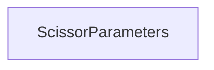

| public |
{:.api_label}

#### Inheritance Graph

## Description

## Public Functions

|
| ------: | ----------------- |
|  | |
|  | **[ScissorParameters](#classRendering_1_1ScissorParameters_1ae96dea99f891a58b3390d8de0d23dde6)**()   Disable the scissor test. |
|  | |
|  | **[ScissorParameters](#classRendering_1_1ScissorParameters_1a86d7f1c0ae2dd51638af7657520f7274)**( [Geometry::Rect_i](namespaceGeometry#namespaceGeometry_1a22750be67fc5d15a039c6db8ef7406ad)  scissorRect)   Enable the scissor test with the given rect. |
|  | |
| bool | **[operator!=](#classRendering_1_1ScissorParameters_1a96be9a20b014b94114d7141f0d060605)**(const [ScissorParameters](classRendering_1_1ScissorParameters) & other) const |
|  | |
| bool | **[operator==](#classRendering_1_1ScissorParameters_1a88dd96eef4f04df351ba2820695b66ea)**(const [ScissorParameters](classRendering_1_1ScissorParameters) & other) const |
|  | |
| const [Geometry::Rect_i](namespaceGeometry#namespaceGeometry_1a22750be67fc5d15a039c6db8ef7406ad) & | **[getRect](#classRendering_1_1ScissorParameters_1a05578b932eebe49e26d5cbf441aa2748)**() const |
|  | |
| bool | **[isEnabled](#classRendering_1_1ScissorParameters_1a7f4444870de0fb589376872c34c4afed)**() const |
|  | |
| void | **[enable](#classRendering_1_1ScissorParameters_1aabbda10394a8392ca6136664e902e35b)**() |
|  | |
| void | **[disable](#classRendering_1_1ScissorParameters_1a702b9dfcf67f3f7b6cceec52e967863f)**() |
{: .nohead .nowrap1 .api_section }

-------------------------------------------------------------------

## Documentation

### <small>function</small>  Rendering::ScissorParameters::ScissorParameters {#classRendering_1_1ScissorParameters_1ae96dea99f891a58b3390d8de0d23dde6}

| public | inline |
{:.api_label}

|
| ------: | ----------------- |
|  |
|  **[ScissorParameters](#classRendering_1_1ScissorParameters_1ae96dea99f891a58b3390d8de0d23dde6)**( |  ) |
{: .nohead .nowrap1 .api_doc }

Disable the scissor test.

Defined in `Rendering/RenderingContext/RenderingParameters.h:900`{:style="float: right"}

-------------------------------------------------------------------

### <small>function</small>  Rendering::ScissorParameters::ScissorParameters {#classRendering_1_1ScissorParameters_1a86d7f1c0ae2dd51638af7657520f7274}

| public | inline | explicit |
{:.api_label}

|
| ------: | ----------------- |
|  |
|  **[ScissorParameters](#classRendering_1_1ScissorParameters_1a86d7f1c0ae2dd51638af7657520f7274)**( |  [Geometry::Rect_i](namespaceGeometry#namespaceGeometry_1a22750be67fc5d15a039c6db8ef7406ad)  | **scissorRect** ) |
{: .nohead .nowrap1 .api_doc }

Enable the scissor test with the given rect.

Defined in `Rendering/RenderingContext/RenderingParameters.h:902`{:style="float: right"}

-------------------------------------------------------------------

### <small>function</small>  Rendering::ScissorParameters::operator!= {#classRendering_1_1ScissorParameters_1a96be9a20b014b94114d7141f0d060605}

| public | const | inline |
{:.api_label}

|
| ------: | ----------------- |
|  |
| bool **[operator!=](#classRendering_1_1ScissorParameters_1a96be9a20b014b94114d7141f0d060605)**( | const [ScissorParameters](classRendering_1_1ScissorParameters) & | **other** ) const |
{: .nohead .nowrap1 .api_doc }

Defined in `Rendering/RenderingContext/RenderingParameters.h:903`{:style="float: right"}

-------------------------------------------------------------------

### <small>function</small>  Rendering::ScissorParameters::operator== {#classRendering_1_1ScissorParameters_1a88dd96eef4f04df351ba2820695b66ea}

| public | const | inline |
{:.api_label}

|
| ------: | ----------------- |
|  |
| bool **[operator==](#classRendering_1_1ScissorParameters_1a88dd96eef4f04df351ba2820695b66ea)**( | const [ScissorParameters](classRendering_1_1ScissorParameters) & | **other** ) const |
{: .nohead .nowrap1 .api_doc }

Defined in `Rendering/RenderingContext/RenderingParameters.h:904`{:style="float: right"}

-------------------------------------------------------------------

### <small>function</small>  Rendering::ScissorParameters::getRect {#classRendering_1_1ScissorParameters_1a05578b932eebe49e26d5cbf441aa2748}

| public | const | inline |
{:.api_label}

|
| ------: | ----------------- |
|  |
| const [Geometry::Rect_i](namespaceGeometry#namespaceGeometry_1a22750be67fc5d15a039c6db8ef7406ad) & **[getRect](#classRendering_1_1ScissorParameters_1a05578b932eebe49e26d5cbf441aa2748)**( |  ) const |
{: .nohead .nowrap1 .api_doc }

Defined in `Rendering/RenderingContext/RenderingParameters.h:906`{:style="float: right"}

-------------------------------------------------------------------

### <small>function</small>  Rendering::ScissorParameters::isEnabled {#classRendering_1_1ScissorParameters_1a7f4444870de0fb589376872c34c4afed}

| public | const | inline |
{:.api_label}

|
| ------: | ----------------- |
|  |
| bool **[isEnabled](#classRendering_1_1ScissorParameters_1a7f4444870de0fb589376872c34c4afed)**( |  ) const |
{: .nohead .nowrap1 .api_doc }

Defined in `Rendering/RenderingContext/RenderingParameters.h:907`{:style="float: right"}

-------------------------------------------------------------------

### <small>function</small>  Rendering::ScissorParameters::enable {#classRendering_1_1ScissorParameters_1aabbda10394a8392ca6136664e902e35b}

| public | inline |
{:.api_label}

|
| ------: | ----------------- |
|  |
| void **[enable](#classRendering_1_1ScissorParameters_1aabbda10394a8392ca6136664e902e35b)**( |  ) |
{: .nohead .nowrap1 .api_doc }

Defined in `Rendering/RenderingContext/RenderingParameters.h:910`{:style="float: right"}

-------------------------------------------------------------------

### <small>function</small>  Rendering::ScissorParameters::disable {#classRendering_1_1ScissorParameters_1a702b9dfcf67f3f7b6cceec52e967863f}

| public | inline |
{:.api_label}

|
| ------: | ----------------- |
|  |
| void **[disable](#classRendering_1_1ScissorParameters_1a702b9dfcf67f3f7b6cceec52e967863f)**( |  ) |
{: .nohead .nowrap1 .api_doc }

Defined in `Rendering/RenderingContext/RenderingParameters.h:913`{:style="float: right"}

-------------------------------------------------------------------

