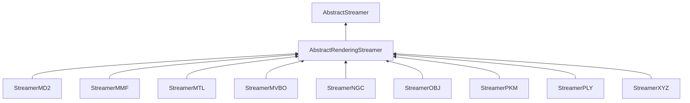

| public |
{:.api_label}

#### Inheritance Graph

## Description

Interface for classes that are capable of converting between meshes and streams, or textures and streams. Subclasses are allowed to implement only a subset of the functions.

**Author**: Benjamin Eikel

**Date**: 2011-09-08

## Public Static Attributes

|
| ------: | ----------------- |
|  | |
| const uint8_t | **[CAP_LOAD_MESH](#classRendering_1_1Serialization_1_1AbstractRenderingStreamer_1a434ff572baa8d21e2a93844d6ab164cd)**    Streamer supports the function*loadMesh*. |
|  | |
| const uint8_t | **[CAP_SAVE_MESH](#classRendering_1_1Serialization_1_1AbstractRenderingStreamer_1a57d2662930e3f5cbc57cac92d69735b5)**    Streamer supports the function*saveMesh*. |
|  | |
| const uint8_t | **[CAP_LOAD_TEXTURE](#classRendering_1_1Serialization_1_1AbstractRenderingStreamer_1a524ba875e29aa02390e5fa930c742019)**    Streamer supports the function*loadTexture*. |
|  | |
| const uint8_t | **[CAP_SAVE_TEXTURE](#classRendering_1_1Serialization_1_1AbstractRenderingStreamer_1a960970037cecaf9d4162a1c06cf0626e)**    Streamer supports the function*saveTexture*. |
{: .nohead .nowrap1 .api_section }

## Public Functions

|
| ------: | ----------------- |
|  | |
|  | **[~AbstractRenderingStreamer](#classRendering_1_1Serialization_1_1AbstractRenderingStreamer_1a11d02fee4f01042a2d4070eee5531078)**() |
|  | |
| [Mesh](classRendering_1_1Mesh) * | **[loadMesh](#classRendering_1_1Serialization_1_1AbstractRenderingStreamer_1a6d779b7e12c05edd5e07c0f050cbb94f)**(std::istream & void) |
|  | |
| bool | **[saveMesh](#classRendering_1_1Serialization_1_1AbstractRenderingStreamer_1a86e85332c89777412c4516bfd1a72675)**( [Mesh](classRendering_1_1Mesh) * void, std::ostream & void) |
|  | |
| [Util::Reference](classUtil_1_1Reference) < [Texture](classRendering_1_1Texture) > | **[loadTexture](#classRendering_1_1Serialization_1_1AbstractRenderingStreamer_1a815fec156d239fea249654c8c0b4bfb9)**(std::istream & void,  [TextureType](group%5F%5Ftexture#group%5F%5Ftexture_1gaa31df885ca7b633a7032d29050df5f12)  void, uint32_t void) |
|  | |
| bool | **[saveTexture](#classRendering_1_1Serialization_1_1AbstractRenderingStreamer_1af14857f5a9a65bc38f084f9d74da8f71)**( [Texture](classRendering_1_1Texture) * void, std::ostream & void) |
{: .nohead .nowrap1 .api_section }

## Public Static Functions

|
| ------: | ----------------- |
|  | |
| uint8_t | **[queryCapabilities](#classRendering_1_1Serialization_1_1AbstractRenderingStreamer_1af1d6f2dccbb16280f9405184442d4eb6)**(const std::string & void) |
{: .nohead .nowrap1 .api_section }

## Protected Functions

|
| ------: | ----------------- |
|  | |
|  | **[AbstractRenderingStreamer](#classRendering_1_1Serialization_1_1AbstractRenderingStreamer_1a613e276f1da030be7d85ec107d3a68c3)**()   Creation is only possible in subclasses. |
{: .nohead .nowrap1 .api_section }

-------------------------------------------------------------------

## Documentation

### <small>variable</small>  Rendering::Serialization::AbstractRenderingStreamer::CAP_LOAD_MESH {#classRendering_1_1Serialization_1_1AbstractRenderingStreamer_1a434ff572baa8d21e2a93844d6ab164cd}

| public | static |
{:.api_label}

|
| ------: | ----------------- |
|  |
| const uint8_t **[CAP_LOAD_MESH](#classRendering_1_1Serialization_1_1AbstractRenderingStreamer_1a434ff572baa8d21e2a93844d6ab164cd)**  |
{: .nohead .nowrap1 .api_doc }

Streamer supports the function*loadMesh*.

Defined in `Rendering/Serialization/AbstractRenderingStreamer.h:84`{:style="float: right"}

-------------------------------------------------------------------

### <small>variable</small>  Rendering::Serialization::AbstractRenderingStreamer::CAP_SAVE_MESH {#classRendering_1_1Serialization_1_1AbstractRenderingStreamer_1a57d2662930e3f5cbc57cac92d69735b5}

| public | static |
{:.api_label}

|
| ------: | ----------------- |
|  |
| const uint8_t **[CAP_SAVE_MESH](#classRendering_1_1Serialization_1_1AbstractRenderingStreamer_1a57d2662930e3f5cbc57cac92d69735b5)**  |
{: .nohead .nowrap1 .api_doc }

Streamer supports the function*saveMesh*.

Defined in `Rendering/Serialization/AbstractRenderingStreamer.h:85`{:style="float: right"}

-------------------------------------------------------------------

### <small>variable</small>  Rendering::Serialization::AbstractRenderingStreamer::CAP_LOAD_TEXTURE {#classRendering_1_1Serialization_1_1AbstractRenderingStreamer_1a524ba875e29aa02390e5fa930c742019}

| public | static |
{:.api_label}

|
| ------: | ----------------- |
|  |
| const uint8_t **[CAP_LOAD_TEXTURE](#classRendering_1_1Serialization_1_1AbstractRenderingStreamer_1a524ba875e29aa02390e5fa930c742019)**  |
{: .nohead .nowrap1 .api_doc }

Streamer supports the function*loadTexture*.

Defined in `Rendering/Serialization/AbstractRenderingStreamer.h:86`{:style="float: right"}

-------------------------------------------------------------------

### <small>variable</small>  Rendering::Serialization::AbstractRenderingStreamer::CAP_SAVE_TEXTURE {#classRendering_1_1Serialization_1_1AbstractRenderingStreamer_1a960970037cecaf9d4162a1c06cf0626e}

| public | static |
{:.api_label}

|
| ------: | ----------------- |
|  |
| const uint8_t **[CAP_SAVE_TEXTURE](#classRendering_1_1Serialization_1_1AbstractRenderingStreamer_1a960970037cecaf9d4162a1c06cf0626e)**  |
{: .nohead .nowrap1 .api_doc }

Streamer supports the function*saveTexture*.

Defined in `Rendering/Serialization/AbstractRenderingStreamer.h:87`{:style="float: right"}

-------------------------------------------------------------------

### <small>function</small>  Rendering::Serialization::AbstractRenderingStreamer::~AbstractRenderingStreamer {#classRendering_1_1Serialization_1_1AbstractRenderingStreamer_1a11d02fee4f01042a2d4070eee5531078}

| public | inline | virtual |
{:.api_label}

|
| ------: | ----------------- |
|  |
|  **[~AbstractRenderingStreamer](#classRendering_1_1Serialization_1_1AbstractRenderingStreamer_1a11d02fee4f01042a2d4070eee5531078)**( |  ) |
{: .nohead .nowrap1 .api_doc }

Defined in `Rendering/Serialization/AbstractRenderingStreamer.h:35`{:style="float: right"}

-------------------------------------------------------------------

### <small>function</small>  Rendering::Serialization::AbstractRenderingStreamer::loadMesh {#classRendering_1_1Serialization_1_1AbstractRenderingStreamer_1a6d779b7e12c05edd5e07c0f050cbb94f}

| public | inline | virtual |
{:.api_label}

|
| ------: | ----------------- |
|  |
| [Mesh](classRendering_1_1Mesh) * **[loadMesh](#classRendering_1_1Serialization_1_1AbstractRenderingStreamer_1a6d779b7e12c05edd5e07c0f050cbb94f)**( | std::istream & | **void** ) |
{: .nohead .nowrap1 .api_doc }

Load a mesh from the given stream.

#### Parameters
**input**
:  Use the data from the stream beginning at the preset position.

#### Returns
 [Mesh](classRendering_1_1Mesh) object. The caller is responsible for the memory deallocation.

Defined in `Rendering/Serialization/AbstractRenderingStreamer.h:44`{:style="float: right"}

-------------------------------------------------------------------

### <small>function</small>  Rendering::Serialization::AbstractRenderingStreamer::saveMesh {#classRendering_1_1Serialization_1_1AbstractRenderingStreamer_1a86e85332c89777412c4516bfd1a72675}

| public | inline | virtual |
{:.api_label}

|
| ------: | ----------------- |
|  |
| bool **[saveMesh](#classRendering_1_1Serialization_1_1AbstractRenderingStreamer_1a86e85332c89777412c4516bfd1a72675)**( |  [Mesh](classRendering_1_1Mesh) * | **void**, |
| | std::ostream & | **void** |
|   ) |
{: .nohead .nowrap1 .api_doc }

Save a mesh to the given stream.

#### Parameters
**mesh**
:   [Mesh](classRendering_1_1Mesh) object to save.

**output**
:  Use the stream for writing beginning at the preset position.

#### Returns
`true`if successful,`false`otherwise.

Defined in `Rendering/Serialization/AbstractRenderingStreamer.h:56`{:style="float: right"}

-------------------------------------------------------------------

### <small>function</small>  Rendering::Serialization::AbstractRenderingStreamer::loadTexture {#classRendering_1_1Serialization_1_1AbstractRenderingStreamer_1a815fec156d239fea249654c8c0b4bfb9}

| public | inline | virtual |
{:.api_label}

|
| ------: | ----------------- |
|  |
| [Util::Reference](classUtil_1_1Reference) < [Texture](classRendering_1_1Texture) > **[loadTexture](#classRendering_1_1Serialization_1_1AbstractRenderingStreamer_1a815fec156d239fea249654c8c0b4bfb9)**( | std::istream & | **void**, |
| |  [TextureType](group%5F%5Ftexture#group%5F%5Ftexture_1gaa31df885ca7b633a7032d29050df5f12)  | **void**, |
| | uint32_t | **void** |
|   ) |
{: .nohead .nowrap1 .api_doc }

Load a texture from the given stream.

#### Parameters
**input**
:  Use the data from the stream beginning at the preset position.

#### Returns
 [Texture](classRendering_1_1Texture) object. The caller is responsible for the memory deallocation.

Defined in `Rendering/Serialization/AbstractRenderingStreamer.h:67`{:style="float: right"}

-------------------------------------------------------------------

### <small>function</small>  Rendering::Serialization::AbstractRenderingStreamer::saveTexture {#classRendering_1_1Serialization_1_1AbstractRenderingStreamer_1af14857f5a9a65bc38f084f9d74da8f71}

| public | inline | virtual |
{:.api_label}

|
| ------: | ----------------- |
|  |
| bool **[saveTexture](#classRendering_1_1Serialization_1_1AbstractRenderingStreamer_1af14857f5a9a65bc38f084f9d74da8f71)**( |  [Texture](classRendering_1_1Texture) * | **void**, |
| | std::ostream & | **void** |
|   ) |
{: .nohead .nowrap1 .api_doc }

Save a texture to the given stream.

#### Parameters
**texture**
:   [Texture](classRendering_1_1Texture) object to save.

**output**
:  Use the stream for writing beginning at the preset position.

#### Returns
`true`if successful,`false`otherwise.

Defined in `Rendering/Serialization/AbstractRenderingStreamer.h:79`{:style="float: right"}

-------------------------------------------------------------------

### <small>function</small>  Rendering::Serialization::AbstractRenderingStreamer::queryCapabilities {#classRendering_1_1Serialization_1_1AbstractRenderingStreamer_1af1d6f2dccbb16280f9405184442d4eb6}

| public | static | inline |
{:.api_label}

|
| ------: | ----------------- |
|  |
| uint8_t **[queryCapabilities](#classRendering_1_1Serialization_1_1AbstractRenderingStreamer_1af1d6f2dccbb16280f9405184442d4eb6)**( | const std::string & | **void** ) |
{: .nohead .nowrap1 .api_doc }

Check which capabilities are supported for the given file extension.

#### Parameters
**extension**
:  File extension in lower case to check capabilities for.

#### Returns
Bitmask consisting of a combination of*CAP_LOAD_GENERIC*and*CAP_SAVE_GENERIC*,*CAP_LOAD_MESH*,*CAP_SAVE_MESH*,*CAP_LOAD_TEXTURE*,*CAP_SAVE_TEXTURE*, or zero.

Defined in `Rendering/Serialization/AbstractRenderingStreamer.h:95`{:style="float: right"}

-------------------------------------------------------------------

### <small>function</small>  Rendering::Serialization::AbstractRenderingStreamer::AbstractRenderingStreamer {#classRendering_1_1Serialization_1_1AbstractRenderingStreamer_1a613e276f1da030be7d85ec107d3a68c3}

| protected | inline |
{:.api_label}

|
| ------: | ----------------- |
|  |
|  **[AbstractRenderingStreamer](#classRendering_1_1Serialization_1_1AbstractRenderingStreamer_1a613e276f1da030be7d85ec107d3a68c3)**( |  ) |
{: .nohead .nowrap1 .api_doc }

Creation is only possible in subclasses.

Defined in `Rendering/Serialization/AbstractRenderingStreamer.h:101`{:style="float: right"}

-------------------------------------------------------------------

