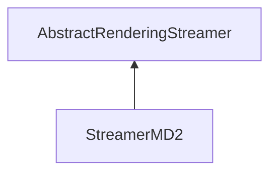

| public |
{:.api_label}

#### Inheritance Graph

## Description

## Public Types

|
| ------: | ----------------- |
|  | |
| typedef [Util::WrapperAttribute](classUtil_1_1WrapperAttribute) < std::vector< std::string > > | **[textureFilesWrapper](#classRendering_1_1Serialization_1_1StreamerMD2_1aef1c57e46b870f9ec41c127de18d3698)**  |
|  | |
| typedef [Util::WrapperAttribute](classUtil_1_1WrapperAttribute) < [MeshIndexData](classRendering_1_1MeshIndexData) > | **[indexDataWrapper](#classRendering_1_1Serialization_1_1StreamerMD2_1a6fe501670500f7f61c5692c07376b6f4)**  |
|  | |
| typedef [Util::WrapperAttribute](classUtil_1_1WrapperAttribute) < std::vector< [MeshVertexData](classRendering_1_1MeshVertexData) > > | **[framesDataWrapper](#classRendering_1_1Serialization_1_1StreamerMD2_1ab75bee1848ffba5dcd941f7009146ad6)**  |
|  | |
| typedef [Util::WrapperAttribute](classUtil_1_1WrapperAttribute) < std::map< std::string, std::vector< int > > > | **[animationDataWrapper](#classRendering_1_1Serialization_1_1StreamerMD2_1aa4364ad9273c50458652d31c34f8fee1)**  |
{: .nohead .nowrap1 .api_section }

## Public Static Attributes

|
| ------: | ----------------- |
|  | |
| const char *const | **[DESCRIPTION_TYPE_KEYFRAME_ANIMATION](#classRendering_1_1Serialization_1_1StreamerMD2_1aad36a034f10e78d89528b08073253260)**  |
|  | |
| const [Util::StringIdentifier](classUtil_1_1StringIdentifier) | **[DESCRIPTION_TEXTURE_FILES](#classRendering_1_1Serialization_1_1StreamerMD2_1aab1efa4b23ada391eca4d33725b9b9f3)**  |
|  | |
| const [Util::StringIdentifier](classUtil_1_1StringIdentifier) | **[DESCRIPTION_MESH_INDEX_DATA](#classRendering_1_1Serialization_1_1StreamerMD2_1aa5fad0bd77ff1c90d3ea5275dc4c41b1)**  |
|  | |
| const [Util::StringIdentifier](classUtil_1_1StringIdentifier) | **[DESCRIPTION_KEYFRAMES_DATA](#classRendering_1_1Serialization_1_1StreamerMD2_1a0963448950d3078732086447f07e3c22)**  |
|  | |
| const [Util::StringIdentifier](classUtil_1_1StringIdentifier) | **[DESCRIPTION_ANIMATIONS](#classRendering_1_1Serialization_1_1StreamerMD2_1a039bd3679da5033517b2f53f8064e69a)**  |
|  | |
| const float | **[normals](#classRendering_1_1Serialization_1_1StreamerMD2_1a4291c8f4395b14919ac0aae3c59fdb24)**  |
|  | |
| const char *const | **[fileExtension](#classRendering_1_1Serialization_1_1StreamerMD2_1a56afa8aa6ef346fa7a18556ccd8eaeee)**  |
{: .nohead .nowrap1 .api_section }

## Public Functions

|
| ------: | ----------------- |
|  | |
|  | **[StreamerMD2](#classRendering_1_1Serialization_1_1StreamerMD2_1afe4d69c71c84a6a2df8f52029acb3299)**() |
|  | |
|  | **[~StreamerMD2](#classRendering_1_1Serialization_1_1StreamerMD2_1a8bdaebae0f0fa999fe09f719b9e5a20c)**() |
|  | |
| [Util::GenericAttributeList](classUtil_1_1GenericAttributeList) * | **[loadGeneric](#classRendering_1_1Serialization_1_1StreamerMD2_1a30f2c5e9529c8be049d751962fecc878)**(std::istream & void) |
{: .nohead .nowrap1 .api_section }

## Public Static Functions

|
| ------: | ----------------- |
|  | |
| uint8_t | **[queryCapabilities](#classRendering_1_1Serialization_1_1StreamerMD2_1a9200a0fefe089252046153bfb39c8a67)**(const std::string & extension) |
{: .nohead .nowrap1 .api_section }

-------------------------------------------------------------------

## Documentation

### <small>typedef</small>  Rendering::Serialization::StreamerMD2::textureFilesWrapper {#classRendering_1_1Serialization_1_1StreamerMD2_1aef1c57e46b870f9ec41c127de18d3698}

| public |
{:.api_label}

|
| ------: | ----------------- |
|  |
| typedef [Util::WrapperAttribute](classUtil_1_1WrapperAttribute) < std::vector< std::string > > **[textureFilesWrapper](#classRendering_1_1Serialization_1_1StreamerMD2_1aef1c57e46b870f9ec41c127de18d3698)**  |
{: .nohead .nowrap1 .api_doc }

Defined in `Rendering/Serialization/StreamerMD2.h:91`{:style="float: right"}

-------------------------------------------------------------------

### <small>typedef</small>  Rendering::Serialization::StreamerMD2::indexDataWrapper {#classRendering_1_1Serialization_1_1StreamerMD2_1a6fe501670500f7f61c5692c07376b6f4}

| public |
{:.api_label}

|
| ------: | ----------------- |
|  |
| typedef [Util::WrapperAttribute](classUtil_1_1WrapperAttribute) < [MeshIndexData](classRendering_1_1MeshIndexData) > **[indexDataWrapper](#classRendering_1_1Serialization_1_1StreamerMD2_1a6fe501670500f7f61c5692c07376b6f4)**  |
{: .nohead .nowrap1 .api_doc }

Defined in `Rendering/Serialization/StreamerMD2.h:92`{:style="float: right"}

-------------------------------------------------------------------

### <small>typedef</small>  Rendering::Serialization::StreamerMD2::framesDataWrapper {#classRendering_1_1Serialization_1_1StreamerMD2_1ab75bee1848ffba5dcd941f7009146ad6}

| public |
{:.api_label}

|
| ------: | ----------------- |
|  |
| typedef [Util::WrapperAttribute](classUtil_1_1WrapperAttribute) < std::vector< [MeshVertexData](classRendering_1_1MeshVertexData) > > **[framesDataWrapper](#classRendering_1_1Serialization_1_1StreamerMD2_1ab75bee1848ffba5dcd941f7009146ad6)**  |
{: .nohead .nowrap1 .api_doc }

Defined in `Rendering/Serialization/StreamerMD2.h:93`{:style="float: right"}

-------------------------------------------------------------------

### <small>typedef</small>  Rendering::Serialization::StreamerMD2::animationDataWrapper {#classRendering_1_1Serialization_1_1StreamerMD2_1aa4364ad9273c50458652d31c34f8fee1}

| public |
{:.api_label}

|
| ------: | ----------------- |
|  |
| typedef [Util::WrapperAttribute](classUtil_1_1WrapperAttribute) < std::map< std::string, std::vector< int > > > **[animationDataWrapper](#classRendering_1_1Serialization_1_1StreamerMD2_1aa4364ad9273c50458652d31c34f8fee1)**  |
{: .nohead .nowrap1 .api_doc }

Defined in `Rendering/Serialization/StreamerMD2.h:94`{:style="float: right"}

-------------------------------------------------------------------

### <small>variable</small>  Rendering::Serialization::StreamerMD2::DESCRIPTION_TYPE_KEYFRAME_ANIMATION {#classRendering_1_1Serialization_1_1StreamerMD2_1aad36a034f10e78d89528b08073253260}

| public | static |
{:.api_label}

|
| ------: | ----------------- |
|  |
| const char *const **[DESCRIPTION_TYPE_KEYFRAME_ANIMATION](#classRendering_1_1Serialization_1_1StreamerMD2_1aad36a034f10e78d89528b08073253260)**  |
{: .nohead .nowrap1 .api_doc }

Defined in `Rendering/Serialization/StreamerMD2.h:97`{:style="float: right"}

-------------------------------------------------------------------

### <small>variable</small>  Rendering::Serialization::StreamerMD2::DESCRIPTION_TEXTURE_FILES {#classRendering_1_1Serialization_1_1StreamerMD2_1aab1efa4b23ada391eca4d33725b9b9f3}

| public | static |
{:.api_label}

|
| ------: | ----------------- |
|  |
| const [Util::StringIdentifier](classUtil_1_1StringIdentifier) **[DESCRIPTION_TEXTURE_FILES](#classRendering_1_1Serialization_1_1StreamerMD2_1aab1efa4b23ada391eca4d33725b9b9f3)**  |
{: .nohead .nowrap1 .api_doc }

Defined in `Rendering/Serialization/StreamerMD2.h:98`{:style="float: right"}

-------------------------------------------------------------------

### <small>variable</small>  Rendering::Serialization::StreamerMD2::DESCRIPTION_MESH_INDEX_DATA {#classRendering_1_1Serialization_1_1StreamerMD2_1aa5fad0bd77ff1c90d3ea5275dc4c41b1}

| public | static |
{:.api_label}

|
| ------: | ----------------- |
|  |
| const [Util::StringIdentifier](classUtil_1_1StringIdentifier) **[DESCRIPTION_MESH_INDEX_DATA](#classRendering_1_1Serialization_1_1StreamerMD2_1aa5fad0bd77ff1c90d3ea5275dc4c41b1)**  |
{: .nohead .nowrap1 .api_doc }

Defined in `Rendering/Serialization/StreamerMD2.h:99`{:style="float: right"}

-------------------------------------------------------------------

### <small>variable</small>  Rendering::Serialization::StreamerMD2::DESCRIPTION_KEYFRAMES_DATA {#classRendering_1_1Serialization_1_1StreamerMD2_1a0963448950d3078732086447f07e3c22}

| public | static |
{:.api_label}

|
| ------: | ----------------- |
|  |
| const [Util::StringIdentifier](classUtil_1_1StringIdentifier) **[DESCRIPTION_KEYFRAMES_DATA](#classRendering_1_1Serialization_1_1StreamerMD2_1a0963448950d3078732086447f07e3c22)**  |
{: .nohead .nowrap1 .api_doc }

Defined in `Rendering/Serialization/StreamerMD2.h:100`{:style="float: right"}

-------------------------------------------------------------------

### <small>variable</small>  Rendering::Serialization::StreamerMD2::DESCRIPTION_ANIMATIONS {#classRendering_1_1Serialization_1_1StreamerMD2_1a039bd3679da5033517b2f53f8064e69a}

| public | static |
{:.api_label}

|
| ------: | ----------------- |
|  |
| const [Util::StringIdentifier](classUtil_1_1StringIdentifier) **[DESCRIPTION_ANIMATIONS](#classRendering_1_1Serialization_1_1StreamerMD2_1a039bd3679da5033517b2f53f8064e69a)**  |
{: .nohead .nowrap1 .api_doc }

Defined in `Rendering/Serialization/StreamerMD2.h:102`{:style="float: right"}

-------------------------------------------------------------------

### <small>variable</small>  Rendering::Serialization::StreamerMD2::normals {#classRendering_1_1Serialization_1_1StreamerMD2_1a4291c8f4395b14919ac0aae3c59fdb24}

| public | static |
{:.api_label}

|
| ------: | ----------------- |
|  |
| const float **[normals](#classRendering_1_1Serialization_1_1StreamerMD2_1a4291c8f4395b14919ac0aae3c59fdb24)**  |
{: .nohead .nowrap1 .api_doc }

Defined in `Rendering/Serialization/StreamerMD2.h:110`{:style="float: right"}

-------------------------------------------------------------------

### <small>variable</small>  Rendering::Serialization::StreamerMD2::fileExtension {#classRendering_1_1Serialization_1_1StreamerMD2_1a56afa8aa6ef346fa7a18556ccd8eaeee}

| public | static |
{:.api_label}

|
| ------: | ----------------- |
|  |
| const char *const **[fileExtension](#classRendering_1_1Serialization_1_1StreamerMD2_1a56afa8aa6ef346fa7a18556ccd8eaeee)**  |
{: .nohead .nowrap1 .api_doc }

Defined in `Rendering/Serialization/StreamerMD2.h:132`{:style="float: right"}

-------------------------------------------------------------------

### <small>function</small>  Rendering::Serialization::StreamerMD2::StreamerMD2 {#classRendering_1_1Serialization_1_1StreamerMD2_1afe4d69c71c84a6a2df8f52029acb3299}

| public |
{:.api_label}

|
| ------: | ----------------- |
|  |
|  **[StreamerMD2](#classRendering_1_1Serialization_1_1StreamerMD2_1afe4d69c71c84a6a2df8f52029acb3299)**( |  ) |
{: .nohead .nowrap1 .api_doc }

Defined in `Rendering/Serialization/StreamerMD2.h:87`{:style="float: right"}

-------------------------------------------------------------------

### <small>function</small>  Rendering::Serialization::StreamerMD2::~StreamerMD2 {#classRendering_1_1Serialization_1_1StreamerMD2_1a8bdaebae0f0fa999fe09f719b9e5a20c}

| public | inline | virtual |
{:.api_label}

|
| ------: | ----------------- |
|  |
|  **[~StreamerMD2](#classRendering_1_1Serialization_1_1StreamerMD2_1a8bdaebae0f0fa999fe09f719b9e5a20c)**( |  ) |
{: .nohead .nowrap1 .api_doc }

Defined in `Rendering/Serialization/StreamerMD2.h:88`{:style="float: right"}

-------------------------------------------------------------------

### <small>function</small>  Rendering::Serialization::StreamerMD2::loadGeneric {#classRendering_1_1Serialization_1_1StreamerMD2_1a30f2c5e9529c8be049d751962fecc878}

| public | virtual |
{:.api_label}

|
| ------: | ----------------- |
|  |
| [Util::GenericAttributeList](classUtil_1_1GenericAttributeList) * **[loadGeneric](#classRendering_1_1Serialization_1_1StreamerMD2_1a30f2c5e9529c8be049d751962fecc878)**( | std::istream & | **void** ) |
{: .nohead .nowrap1 .api_doc }

Load generic data from the given stream.

#### Parameters
**input**
:  Use the data from the stream beginning at the preset position.

#### Returns
Description list containing the generic data. The caller is responsible for the memory deallocation.

Defined in `Rendering/Serialization/StreamerMD2.h:129`{:style="float: right"}

-------------------------------------------------------------------

### <small>function</small>  Rendering::Serialization::StreamerMD2::queryCapabilities {#classRendering_1_1Serialization_1_1StreamerMD2_1a9200a0fefe089252046153bfb39c8a67}

| public | static |
{:.api_label}

|
| ------: | ----------------- |
|  |
| uint8_t **[queryCapabilities](#classRendering_1_1Serialization_1_1StreamerMD2_1a9200a0fefe089252046153bfb39c8a67)**( | const std::string & | **extension** ) |
{: .nohead .nowrap1 .api_doc }

Defined in `Rendering/Serialization/StreamerMD2.h:131`{:style="float: right"}

-------------------------------------------------------------------

