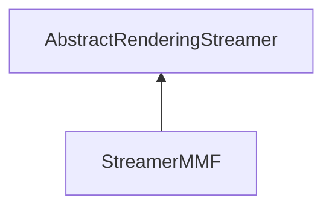

| public |
{:.api_label}

#### Inheritance Graph

## Description

## .mmf ( [MinSG](namespaceMinSG)  [Mesh](classRendering_1_1Mesh) Format)

Fileformat: binary little endian

MMF-File ::= Header (char[4] "mmf"+chr(13) ), uint32 version (currently 0x01), DataBlock * (one VertexBlock and one IndexBlock), EndMarker (uint32 0xFFFFFFFF)

DataBlock ::= uint32 dataType, uint32 dataSizenr of bytes to be jumped to skip the block (not including dataType and blockSize value), uint8 data[dataSize]

DataBlock ::= VertexBlock

DataBlock ::= IndexBlock

VertexBlock ::= Vertex-dataType (uint32 0x00), uint32 dataSize, VertexAttributeDescription *, EndMarker (uint32 0xFFFFFFFF), uint32 vertexCountthe number of vertices in the following datablock, uint8* vertexDatathe vertex data

VertexAttributeDescription ::= uint32 attrIdone of the constants: 0x00:POSITION (attribute name: "sg_Position") 0x01:NORMAL (attribute name: "sg_Normal") 0x02:COLOR (attribute name: "sg_Color") 0x06:TEX0 (attribute name: "sg_TexCoord0") 0x07:TEX1 (attribute name: "sg_TexCoord1") 0xff:custom attribute MMF_CUSTOM_ATTR_ID uint32 numValuesentrysize of the vertexattribute specified by index, uint32 (=GLuint) typetype of the vertexattribute specified by index, uint32 extLengthlength of the extension for future use, VertexAttributeExtension* (extensions for the vertex attribute)

VertexAttributeExtension ::= uint32 extension Type uint32 dataLength uint8 data[dataLength]

VertexAttributeExtension ::= VertexAttributeNameExtension

VertexAttributeNameExtension ::= uint32 extension Type 0x03 ( MMF_VERTEX_ATTR_EXT_NAME ) uint32 length of name string including padding zeros uint8* attrName (filled up with additional zeros until 32bit alignment is reached.

IndexBlock ::= Index-dataType (uint32 0x01), uint32 dataSize, uint32 indexCountthe number of indices in the following datablock, uint32 (=GLuint) indexModethe meaning of the indices (GL_TRIANGLES, GL_TRIANGLE_STRIP, ...), uint8* indexDatathe index data

## Classes

|
| ------ | ----------------------------------------------------------------------------------------------------------------- | 
| struct | [Rendering::Serialization::StreamerMMF::Reader](structRendering_1_1Serialization_1_1StreamerMMF_1_1Reader)    | 
{: .nohead }

## Public Static Attributes

|
| ------: | ----------------- |
|  | |
| const uint32_t | **[MMF_VERSION](#classRendering_1_1Serialization_1_1StreamerMMF_1a0648fb3d2267462387e5d274868bf95d)**  |
|  | |
| const uint32_t | **[MMF_HEADER](#classRendering_1_1Serialization_1_1StreamerMMF_1a9b820f3c992cb9558f9335e150bfd4b2)**  |
|  | |
| const uint32_t | **[MMF_VERTEX_DATA](#classRendering_1_1Serialization_1_1StreamerMMF_1a74042fb1a19893cb4685a6697fb1491c)**  |
|  | |
| const uint32_t | **[MMF_INDEX_DATA](#classRendering_1_1Serialization_1_1StreamerMMF_1a0117572b4dfcc637b9661e8a8b4441c0)**  |
|  | |
| const uint32_t | **[MMF_END](#classRendering_1_1Serialization_1_1StreamerMMF_1a2dfc42f3b659e3090142cff8bd150883)**  |
|  | |
| const uint32_t | **[MMF_CUSTOM_ATTR_ID](#classRendering_1_1Serialization_1_1StreamerMMF_1a2c91fdc5b56f9b2d2e8295a901e0e45c)**  |
|  | |
| const uint32_t | **[MMF_VERTEX_ATTR_EXT_NAME](#classRendering_1_1Serialization_1_1StreamerMMF_1abdd7aa153812ec556a1d1e628c7d4c0e)**  |
|  | |
| const char *const | **[fileExtension](#classRendering_1_1Serialization_1_1StreamerMMF_1a1dd65cf011f6535133d202dc41da04c4)**  |
{: .nohead .nowrap1 .api_section }

## Public Functions

|
| ------: | ----------------- |
|  | |
|  | **[StreamerMMF](#classRendering_1_1Serialization_1_1StreamerMMF_1ae202ae0d15f04ea7ef1ea6bd28f240ce)**() |
|  | |
|  | **[~StreamerMMF](#classRendering_1_1Serialization_1_1StreamerMMF_1a9041060fb86946601a4eb4324789a191)**() |
|  | |
| [Util::GenericAttributeList](classUtil_1_1GenericAttributeList) * | **[loadGeneric](#classRendering_1_1Serialization_1_1StreamerMMF_1a21d9d3be80a825a49c4d3f9af80ed771)**(std::istream & void) |
|  | |
| [Mesh](classRendering_1_1Mesh) * | **[loadMesh](#classRendering_1_1Serialization_1_1StreamerMMF_1afed880811c407ca8f615e160b14385ed)**(std::istream & void) |
|  | |
| bool | **[saveMesh](#classRendering_1_1Serialization_1_1StreamerMMF_1a2f86de7b9625c0f38e15097f52454ee0)**( [Mesh](classRendering_1_1Mesh) * void, std::ostream & void) |
{: .nohead .nowrap1 .api_section }

## Public Static Functions

|
| ------: | ----------------- |
|  | |
| uint8_t | **[queryCapabilities](#classRendering_1_1Serialization_1_1StreamerMMF_1a8f491fe4fc26b91b70c613bcfa573d9c)**(const std::string & extension) |
{: .nohead .nowrap1 .api_section }

-------------------------------------------------------------------

## Documentation

### <small>variable</small>  Rendering::Serialization::StreamerMMF::MMF_VERSION {#classRendering_1_1Serialization_1_1StreamerMMF_1a0648fb3d2267462387e5d274868bf95d}

| public | static |
{:.api_label}

|
| ------: | ----------------- |
|  |
| const uint32_t **[MMF_VERSION](#classRendering_1_1Serialization_1_1StreamerMMF_1a0648fb3d2267462387e5d274868bf95d)**  |
{: .nohead .nowrap1 .api_doc }

Defined in `Rendering/Serialization/StreamerMMF.h:82`{:style="float: right"}

-------------------------------------------------------------------

### <small>variable</small>  Rendering::Serialization::StreamerMMF::MMF_HEADER {#classRendering_1_1Serialization_1_1StreamerMMF_1a9b820f3c992cb9558f9335e150bfd4b2}

| public | static |
{:.api_label}

|
| ------: | ----------------- |
|  |
| const uint32_t **[MMF_HEADER](#classRendering_1_1Serialization_1_1StreamerMMF_1a9b820f3c992cb9558f9335e150bfd4b2)**  |
{: .nohead .nowrap1 .api_doc }

Defined in `Rendering/Serialization/StreamerMMF.h:83`{:style="float: right"}

-------------------------------------------------------------------

### <small>variable</small>  Rendering::Serialization::StreamerMMF::MMF_VERTEX_DATA {#classRendering_1_1Serialization_1_1StreamerMMF_1a74042fb1a19893cb4685a6697fb1491c}

| public | static |
{:.api_label}

|
| ------: | ----------------- |
|  |
| const uint32_t **[MMF_VERTEX_DATA](#classRendering_1_1Serialization_1_1StreamerMMF_1a74042fb1a19893cb4685a6697fb1491c)**  |
{: .nohead .nowrap1 .api_doc }

Defined in `Rendering/Serialization/StreamerMMF.h:85`{:style="float: right"}

-------------------------------------------------------------------

### <small>variable</small>  Rendering::Serialization::StreamerMMF::MMF_INDEX_DATA {#classRendering_1_1Serialization_1_1StreamerMMF_1a0117572b4dfcc637b9661e8a8b4441c0}

| public | static |
{:.api_label}

|
| ------: | ----------------- |
|  |
| const uint32_t **[MMF_INDEX_DATA](#classRendering_1_1Serialization_1_1StreamerMMF_1a0117572b4dfcc637b9661e8a8b4441c0)**  |
{: .nohead .nowrap1 .api_doc }

Defined in `Rendering/Serialization/StreamerMMF.h:86`{:style="float: right"}

-------------------------------------------------------------------

### <small>variable</small>  Rendering::Serialization::StreamerMMF::MMF_END {#classRendering_1_1Serialization_1_1StreamerMMF_1a2dfc42f3b659e3090142cff8bd150883}

| public | static |
{:.api_label}

|
| ------: | ----------------- |
|  |
| const uint32_t **[MMF_END](#classRendering_1_1Serialization_1_1StreamerMMF_1a2dfc42f3b659e3090142cff8bd150883)**  |
{: .nohead .nowrap1 .api_doc }

Defined in `Rendering/Serialization/StreamerMMF.h:87`{:style="float: right"}

-------------------------------------------------------------------

### <small>variable</small>  Rendering::Serialization::StreamerMMF::MMF_CUSTOM_ATTR_ID {#classRendering_1_1Serialization_1_1StreamerMMF_1a2c91fdc5b56f9b2d2e8295a901e0e45c}

| public | static |
{:.api_label}

|
| ------: | ----------------- |
|  |
| const uint32_t **[MMF_CUSTOM_ATTR_ID](#classRendering_1_1Serialization_1_1StreamerMMF_1a2c91fdc5b56f9b2d2e8295a901e0e45c)**  |
{: .nohead .nowrap1 .api_doc }

Defined in `Rendering/Serialization/StreamerMMF.h:89`{:style="float: right"}

-------------------------------------------------------------------

### <small>variable</small>  Rendering::Serialization::StreamerMMF::MMF_VERTEX_ATTR_EXT_NAME {#classRendering_1_1Serialization_1_1StreamerMMF_1abdd7aa153812ec556a1d1e628c7d4c0e}

| public | static |
{:.api_label}

|
| ------: | ----------------- |
|  |
| const uint32_t **[MMF_VERTEX_ATTR_EXT_NAME](#classRendering_1_1Serialization_1_1StreamerMMF_1abdd7aa153812ec556a1d1e628c7d4c0e)**  |
{: .nohead .nowrap1 .api_doc }

Defined in `Rendering/Serialization/StreamerMMF.h:90`{:style="float: right"}

-------------------------------------------------------------------

### <small>variable</small>  Rendering::Serialization::StreamerMMF::fileExtension {#classRendering_1_1Serialization_1_1StreamerMMF_1a1dd65cf011f6535133d202dc41da04c4}

| public | static |
{:.api_label}

|
| ------: | ----------------- |
|  |
| const char *const **[fileExtension](#classRendering_1_1Serialization_1_1StreamerMMF_1a1dd65cf011f6535133d202dc41da04c4)**  |
{: .nohead .nowrap1 .api_doc }

Defined in `Rendering/Serialization/StreamerMMF.h:103`{:style="float: right"}

-------------------------------------------------------------------

### <small>function</small>  Rendering::Serialization::StreamerMMF::StreamerMMF {#classRendering_1_1Serialization_1_1StreamerMMF_1ae202ae0d15f04ea7ef1ea6bd28f240ce}

| public | inline |
{:.api_label}

|
| ------: | ----------------- |
|  |
|  **[StreamerMMF](#classRendering_1_1Serialization_1_1StreamerMMF_1ae202ae0d15f04ea7ef1ea6bd28f240ce)**( |  ) |
{: .nohead .nowrap1 .api_doc }

Defined in `Rendering/Serialization/StreamerMMF.h:92`{:style="float: right"}

-------------------------------------------------------------------

### <small>function</small>  Rendering::Serialization::StreamerMMF::~StreamerMMF {#classRendering_1_1Serialization_1_1StreamerMMF_1a9041060fb86946601a4eb4324789a191}

| public | inline | virtual |
{:.api_label}

|
| ------: | ----------------- |
|  |
|  **[~StreamerMMF](#classRendering_1_1Serialization_1_1StreamerMMF_1a9041060fb86946601a4eb4324789a191)**( |  ) |
{: .nohead .nowrap1 .api_doc }

Defined in `Rendering/Serialization/StreamerMMF.h:95`{:style="float: right"}

-------------------------------------------------------------------

### <small>function</small>  Rendering::Serialization::StreamerMMF::loadGeneric {#classRendering_1_1Serialization_1_1StreamerMMF_1a21d9d3be80a825a49c4d3f9af80ed771}

| public | virtual |
{:.api_label}

|
| ------: | ----------------- |
|  |
| [Util::GenericAttributeList](classUtil_1_1GenericAttributeList) * **[loadGeneric](#classRendering_1_1Serialization_1_1StreamerMMF_1a21d9d3be80a825a49c4d3f9af80ed771)**( | std::istream & | **void** ) |
{: .nohead .nowrap1 .api_doc }

Load generic data from the given stream.

#### Parameters
**input**
:  Use the data from the stream beginning at the preset position.

#### Returns
Description list containing the generic data. The caller is responsible for the memory deallocation.

Defined in `Rendering/Serialization/StreamerMMF.h:98`{:style="float: right"}

-------------------------------------------------------------------

### <small>function</small>  Rendering::Serialization::StreamerMMF::loadMesh {#classRendering_1_1Serialization_1_1StreamerMMF_1afed880811c407ca8f615e160b14385ed}

| public | virtual |
{:.api_label}

|
| ------: | ----------------- |
|  |
| [Mesh](classRendering_1_1Mesh) * **[loadMesh](#classRendering_1_1Serialization_1_1StreamerMMF_1afed880811c407ca8f615e160b14385ed)**( | std::istream & | **void** ) |
{: .nohead .nowrap1 .api_doc }

Load a mesh from the given stream.

#### Parameters
**input**
:  Use the data from the stream beginning at the preset position.

#### Returns
 [Mesh](classRendering_1_1Mesh) object. The caller is responsible for the memory deallocation.

Defined in `Rendering/Serialization/StreamerMMF.h:99`{:style="float: right"}

-------------------------------------------------------------------

### <small>function</small>  Rendering::Serialization::StreamerMMF::saveMesh {#classRendering_1_1Serialization_1_1StreamerMMF_1a2f86de7b9625c0f38e15097f52454ee0}

| public | virtual |
{:.api_label}

|
| ------: | ----------------- |
|  |
| bool **[saveMesh](#classRendering_1_1Serialization_1_1StreamerMMF_1a2f86de7b9625c0f38e15097f52454ee0)**( |  [Mesh](classRendering_1_1Mesh) * | **void**, |
| | std::ostream & | **void** |
|   ) |
{: .nohead .nowrap1 .api_doc }

Save a mesh to the given stream.

#### Parameters
**mesh**
:   [Mesh](classRendering_1_1Mesh) object to save.

**output**
:  Use the stream for writing beginning at the preset position.

#### Returns
`true`if successful,`false`otherwise.

Defined in `Rendering/Serialization/StreamerMMF.h:100`{:style="float: right"}

-------------------------------------------------------------------

### <small>function</small>  Rendering::Serialization::StreamerMMF::queryCapabilities {#classRendering_1_1Serialization_1_1StreamerMMF_1a8f491fe4fc26b91b70c613bcfa573d9c}

| public | static |
{:.api_label}

|
| ------: | ----------------- |
|  |
| uint8_t **[queryCapabilities](#classRendering_1_1Serialization_1_1StreamerMMF_1a8f491fe4fc26b91b70c613bcfa573d9c)**( | const std::string & | **extension** ) |
{: .nohead .nowrap1 .api_doc }

Defined in `Rendering/Serialization/StreamerMMF.h:102`{:style="float: right"}

-------------------------------------------------------------------

