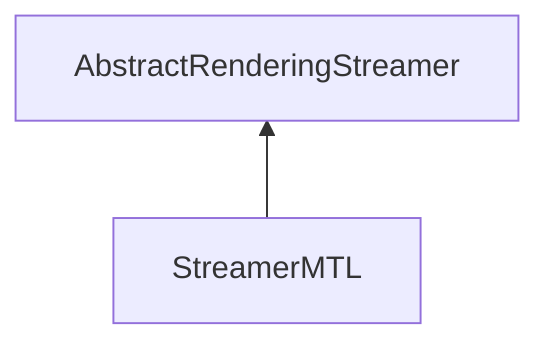

| public |
{:.api_label}

#### Inheritance Graph

## Description

## Public Static Attributes

|
| ------: | ----------------- |
|  | |
| const char *const | **[fileExtension](#classRendering_1_1Serialization_1_1StreamerMTL_1a80db0f82380f0410c7718cc422a13b03)**  |
{: .nohead .nowrap1 .api_section }

## Public Functions

|
| ------: | ----------------- |
|  | |
|  | **[StreamerMTL](#classRendering_1_1Serialization_1_1StreamerMTL_1a3c344adfa8a02cafa21b90530a2cb502)**() |
|  | |
|  | **[~StreamerMTL](#classRendering_1_1Serialization_1_1StreamerMTL_1a0fec33a35913d2117385e78d5f953df1)**() |
|  | |
| [Util::GenericAttributeList](classUtil_1_1GenericAttributeList) * | **[loadGeneric](#classRendering_1_1Serialization_1_1StreamerMTL_1af3163b22b697f5cecf21ea2e7ce6ef1d)**(std::istream & void) |
{: .nohead .nowrap1 .api_section }

## Public Static Functions

|
| ------: | ----------------- |
|  | |
| uint8_t | **[queryCapabilities](#classRendering_1_1Serialization_1_1StreamerMTL_1a393bcf4355ec6978c6d32ede29308eed)**(const std::string & extension) |
{: .nohead .nowrap1 .api_section }

-------------------------------------------------------------------

## Documentation

### <small>variable</small>  Rendering::Serialization::StreamerMTL::fileExtension {#classRendering_1_1Serialization_1_1StreamerMTL_1a80db0f82380f0410c7718cc422a13b03}

| public | static |
{:.api_label}

|
| ------: | ----------------- |
|  |
| const char *const **[fileExtension](#classRendering_1_1Serialization_1_1StreamerMTL_1a80db0f82380f0410c7718cc422a13b03)**  |
{: .nohead .nowrap1 .api_doc }

Defined in `Rendering/Serialization/StreamerMTL.h:30`{:style="float: right"}

-------------------------------------------------------------------

### <small>function</small>  Rendering::Serialization::StreamerMTL::StreamerMTL {#classRendering_1_1Serialization_1_1StreamerMTL_1a3c344adfa8a02cafa21b90530a2cb502}

| public | inline |
{:.api_label}

|
| ------: | ----------------- |
|  |
|  **[StreamerMTL](#classRendering_1_1Serialization_1_1StreamerMTL_1a3c344adfa8a02cafa21b90530a2cb502)**( |  ) |
{: .nohead .nowrap1 .api_doc }

Defined in `Rendering/Serialization/StreamerMTL.h:21`{:style="float: right"}

-------------------------------------------------------------------

### <small>function</small>  Rendering::Serialization::StreamerMTL::~StreamerMTL {#classRendering_1_1Serialization_1_1StreamerMTL_1a0fec33a35913d2117385e78d5f953df1}

| public | inline | virtual |
{:.api_label}

|
| ------: | ----------------- |
|  |
|  **[~StreamerMTL](#classRendering_1_1Serialization_1_1StreamerMTL_1a0fec33a35913d2117385e78d5f953df1)**( |  ) |
{: .nohead .nowrap1 .api_doc }

Defined in `Rendering/Serialization/StreamerMTL.h:24`{:style="float: right"}

-------------------------------------------------------------------

### <small>function</small>  Rendering::Serialization::StreamerMTL::loadGeneric {#classRendering_1_1Serialization_1_1StreamerMTL_1af3163b22b697f5cecf21ea2e7ce6ef1d}

| public | virtual |
{:.api_label}

|
| ------: | ----------------- |
|  |
| [Util::GenericAttributeList](classUtil_1_1GenericAttributeList) * **[loadGeneric](#classRendering_1_1Serialization_1_1StreamerMTL_1af3163b22b697f5cecf21ea2e7ce6ef1d)**( | std::istream & | **void** ) |
{: .nohead .nowrap1 .api_doc }

Load generic data from the given stream.

#### Parameters
**input**
:  Use the data from the stream beginning at the preset position.

#### Returns
Description list containing the generic data. The caller is responsible for the memory deallocation.

Defined in `Rendering/Serialization/StreamerMTL.h:27`{:style="float: right"}

-------------------------------------------------------------------

### <small>function</small>  Rendering::Serialization::StreamerMTL::queryCapabilities {#classRendering_1_1Serialization_1_1StreamerMTL_1a393bcf4355ec6978c6d32ede29308eed}

| public | static |
{:.api_label}

|
| ------: | ----------------- |
|  |
| uint8_t **[queryCapabilities](#classRendering_1_1Serialization_1_1StreamerMTL_1a393bcf4355ec6978c6d32ede29308eed)**( | const std::string & | **extension** ) |
{: .nohead .nowrap1 .api_doc }

Defined in `Rendering/Serialization/StreamerMTL.h:29`{:style="float: right"}

-------------------------------------------------------------------

