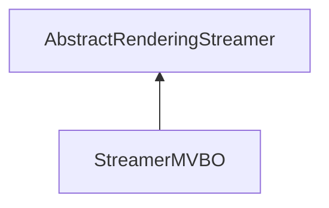

| public |
{:.api_label}

#### Inheritance Graph

## Description

## MVBO-Format: Tims Reliefboards

Die Daten sind wie folgt organisiert:

aVertex ist ein struct, dass so aussieht: struct aVertex{ Vector3f vertex; //3 float Vector4ub color; //4 unsigned char Vector4b normal; //4 char };

auch aFace ist ein struct:

struct aFace { uint32_t a; uint32_t b; uint32_t c; }

## Public Static Attributes

|
| ------: | ----------------- |
|  | |
| const char *const | **[fileExtension](#classRendering_1_1Serialization_1_1StreamerMVBO_1a2ec8813e93d73ed96b01c3d5877d5056)**  |
{: .nohead .nowrap1 .api_section }

## Public Functions

|
| ------: | ----------------- |
|  | |
|  | **[StreamerMVBO](#classRendering_1_1Serialization_1_1StreamerMVBO_1a4d73bf6ce3ea91519326ac54fb2ca3ee)**() |
|  | |
|  | **[~StreamerMVBO](#classRendering_1_1Serialization_1_1StreamerMVBO_1abc5e6a8c674471970bbe28db24ee2b12)**() |
|  | |
| [Util::GenericAttributeList](classUtil_1_1GenericAttributeList) * | **[loadGeneric](#classRendering_1_1Serialization_1_1StreamerMVBO_1af390e09ecfc2779f9dec5c9b23d8fde8)**(std::istream & void) |
|  | |
| [Mesh](classRendering_1_1Mesh) * | **[loadMesh](#classRendering_1_1Serialization_1_1StreamerMVBO_1a149b68c6a4264795d51cca4b2148d3e6)**(std::istream & void) |
{: .nohead .nowrap1 .api_section }

## Public Static Functions

|
| ------: | ----------------- |
|  | |
| uint8_t | **[queryCapabilities](#classRendering_1_1Serialization_1_1StreamerMVBO_1ad8ff21c2370ed2dbed0fb91aff015767)**(const std::string & extension) |
{: .nohead .nowrap1 .api_section }

-------------------------------------------------------------------

## Documentation

### <small>variable</small>  Rendering::Serialization::StreamerMVBO::fileExtension {#classRendering_1_1Serialization_1_1StreamerMVBO_1a2ec8813e93d73ed96b01c3d5877d5056}

| public | static |
{:.api_label}

|
| ------: | ----------------- |
|  |
| const char *const **[fileExtension](#classRendering_1_1Serialization_1_1StreamerMVBO_1a2ec8813e93d73ed96b01c3d5877d5056)**  |
{: .nohead .nowrap1 .api_doc }

Defined in `Rendering/Serialization/StreamerMVBO.h:59`{:style="float: right"}

-------------------------------------------------------------------

### <small>function</small>  Rendering::Serialization::StreamerMVBO::StreamerMVBO {#classRendering_1_1Serialization_1_1StreamerMVBO_1a4d73bf6ce3ea91519326ac54fb2ca3ee}

| public | inline |
{:.api_label}

|
| ------: | ----------------- |
|  |
|  **[StreamerMVBO](#classRendering_1_1Serialization_1_1StreamerMVBO_1a4d73bf6ce3ea91519326ac54fb2ca3ee)**( |  ) |
{: .nohead .nowrap1 .api_doc }

Defined in `Rendering/Serialization/StreamerMVBO.h:49`{:style="float: right"}

-------------------------------------------------------------------

### <small>function</small>  Rendering::Serialization::StreamerMVBO::~StreamerMVBO {#classRendering_1_1Serialization_1_1StreamerMVBO_1abc5e6a8c674471970bbe28db24ee2b12}

| public | inline | virtual |
{:.api_label}

|
| ------: | ----------------- |
|  |
|  **[~StreamerMVBO](#classRendering_1_1Serialization_1_1StreamerMVBO_1abc5e6a8c674471970bbe28db24ee2b12)**( |  ) |
{: .nohead .nowrap1 .api_doc }

Defined in `Rendering/Serialization/StreamerMVBO.h:52`{:style="float: right"}

-------------------------------------------------------------------

### <small>function</small>  Rendering::Serialization::StreamerMVBO::loadGeneric {#classRendering_1_1Serialization_1_1StreamerMVBO_1af390e09ecfc2779f9dec5c9b23d8fde8}

| public | virtual |
{:.api_label}

|
| ------: | ----------------- |
|  |
| [Util::GenericAttributeList](classUtil_1_1GenericAttributeList) * **[loadGeneric](#classRendering_1_1Serialization_1_1StreamerMVBO_1af390e09ecfc2779f9dec5c9b23d8fde8)**( | std::istream & | **void** ) |
{: .nohead .nowrap1 .api_doc }

Load generic data from the given stream.

#### Parameters
**input**
:  Use the data from the stream beginning at the preset position.

#### Returns
Description list containing the generic data. The caller is responsible for the memory deallocation.

Defined in `Rendering/Serialization/StreamerMVBO.h:55`{:style="float: right"}

-------------------------------------------------------------------

### <small>function</small>  Rendering::Serialization::StreamerMVBO::loadMesh {#classRendering_1_1Serialization_1_1StreamerMVBO_1a149b68c6a4264795d51cca4b2148d3e6}

| public | virtual |
{:.api_label}

|
| ------: | ----------------- |
|  |
| [Mesh](classRendering_1_1Mesh) * **[loadMesh](#classRendering_1_1Serialization_1_1StreamerMVBO_1a149b68c6a4264795d51cca4b2148d3e6)**( | std::istream & | **void** ) |
{: .nohead .nowrap1 .api_doc }

Load a mesh from the given stream.

#### Parameters
**input**
:  Use the data from the stream beginning at the preset position.

#### Returns
 [Mesh](classRendering_1_1Mesh) object. The caller is responsible for the memory deallocation.

Defined in `Rendering/Serialization/StreamerMVBO.h:56`{:style="float: right"}

-------------------------------------------------------------------

### <small>function</small>  Rendering::Serialization::StreamerMVBO::queryCapabilities {#classRendering_1_1Serialization_1_1StreamerMVBO_1ad8ff21c2370ed2dbed0fb91aff015767}

| public | static |
{:.api_label}

|
| ------: | ----------------- |
|  |
| uint8_t **[queryCapabilities](#classRendering_1_1Serialization_1_1StreamerMVBO_1ad8ff21c2370ed2dbed0fb91aff015767)**( | const std::string & | **extension** ) |
{: .nohead .nowrap1 .api_doc }

Defined in `Rendering/Serialization/StreamerMVBO.h:58`{:style="float: right"}

-------------------------------------------------------------------

