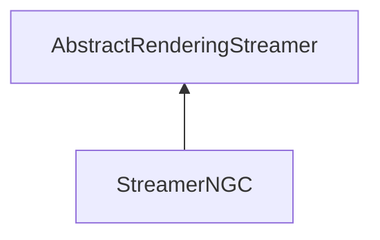

| public |
{:.api_label}

#### Inheritance Graph

## Description

## NGC-Format: Tims Containerformat (2010-09-22)

aIFS.read((char*) & aVBOData->colorComponentCount, sizeof (unsigned)); aIFS.read((char*) & aVBOData->colorOffset, sizeof (unsigned)); aIFS.read((char*) & aVBOData->colorType, sizeof (unsigned)); aIFS.read((char*) & aVBOData->normalComponentCount, sizeof (unsigned)); aIFS.read((char*) & aVBOData->normalOffset, sizeof (unsigned)); aIFS.read((char*) & aVBOData->normalType, sizeof (unsigned)); aIFS.read((char*) & aVBOData->texCoordComponentCount, sizeof (unsigned)); aIFS.read((char*) & aVBOData->texCoordOffset, sizeof (unsigned)); aIFS.read((char*) & aVBOData->texCoordType, sizeof (unsigned));

aIFS.read((char*) & aVBOData->jumpwidth, sizeof (unsigned));

aIFS.read((char*) & aVBOData->numOfVerts, sizeof (unsigned)); aIFS.read((char*) & aVBOData->numOfFaces, sizeof (unsigned))

aIFS.read(aVBOData->vertexData, aVBOData->numOfVerts * aVBOData->jumpwidth); aIFS.read((char*) aVBOData->facesData, aVBOData->numOfFaces * 3 * sizeof(unsigned));

## Public Static Attributes

|
| ------: | ----------------- |
|  | |
| const char *const | **[fileExtension](#classRendering_1_1Serialization_1_1StreamerNGC_1a491835966c400a5a955c99d546e8c8cc)**  |
{: .nohead .nowrap1 .api_section }

## Public Functions

|
| ------: | ----------------- |
|  | |
|  | **[StreamerNGC](#classRendering_1_1Serialization_1_1StreamerNGC_1a024d3a1774f7fe1c69e9a231a487b8d4)**() |
|  | |
|  | **[~StreamerNGC](#classRendering_1_1Serialization_1_1StreamerNGC_1acc0284320836188646518e2d072cf4c6)**() |
|  | |
| [Util::GenericAttributeList](classUtil_1_1GenericAttributeList) * | **[loadGeneric](#classRendering_1_1Serialization_1_1StreamerNGC_1a7b8329bbc0e67cc963ce866fac04478b)**(std::istream & void) |
|  | |
| [Mesh](classRendering_1_1Mesh) * | **[loadMesh](#classRendering_1_1Serialization_1_1StreamerNGC_1ab9da42a7adb77aea64057644a0c09ac8)**(std::istream & void) |
{: .nohead .nowrap1 .api_section }

## Public Static Functions

|
| ------: | ----------------- |
|  | |
| uint8_t | **[queryCapabilities](#classRendering_1_1Serialization_1_1StreamerNGC_1a5f978aaef9593a82433b764e1c227531)**(const std::string & extension) |
{: .nohead .nowrap1 .api_section }

-------------------------------------------------------------------

## Documentation

### <small>variable</small>  Rendering::Serialization::StreamerNGC::fileExtension {#classRendering_1_1Serialization_1_1StreamerNGC_1a491835966c400a5a955c99d546e8c8cc}

| public | static |
{:.api_label}

|
| ------: | ----------------- |
|  |
| const char *const **[fileExtension](#classRendering_1_1Serialization_1_1StreamerNGC_1a491835966c400a5a955c99d546e8c8cc)**  |
{: .nohead .nowrap1 .api_doc }

Defined in `Rendering/Serialization/StreamerNGC.h:56`{:style="float: right"}

-------------------------------------------------------------------

### <small>function</small>  Rendering::Serialization::StreamerNGC::StreamerNGC {#classRendering_1_1Serialization_1_1StreamerNGC_1a024d3a1774f7fe1c69e9a231a487b8d4}

| public | inline |
{:.api_label}

|
| ------: | ----------------- |
|  |
|  **[StreamerNGC](#classRendering_1_1Serialization_1_1StreamerNGC_1a024d3a1774f7fe1c69e9a231a487b8d4)**( |  ) |
{: .nohead .nowrap1 .api_doc }

Defined in `Rendering/Serialization/StreamerNGC.h:46`{:style="float: right"}

-------------------------------------------------------------------

### <small>function</small>  Rendering::Serialization::StreamerNGC::~StreamerNGC {#classRendering_1_1Serialization_1_1StreamerNGC_1acc0284320836188646518e2d072cf4c6}

| public | inline | virtual |
{:.api_label}

|
| ------: | ----------------- |
|  |
|  **[~StreamerNGC](#classRendering_1_1Serialization_1_1StreamerNGC_1acc0284320836188646518e2d072cf4c6)**( |  ) |
{: .nohead .nowrap1 .api_doc }

Defined in `Rendering/Serialization/StreamerNGC.h:49`{:style="float: right"}

-------------------------------------------------------------------

### <small>function</small>  Rendering::Serialization::StreamerNGC::loadGeneric {#classRendering_1_1Serialization_1_1StreamerNGC_1a7b8329bbc0e67cc963ce866fac04478b}

| public | virtual |
{:.api_label}

|
| ------: | ----------------- |
|  |
| [Util::GenericAttributeList](classUtil_1_1GenericAttributeList) * **[loadGeneric](#classRendering_1_1Serialization_1_1StreamerNGC_1a7b8329bbc0e67cc963ce866fac04478b)**( | std::istream & | **void** ) |
{: .nohead .nowrap1 .api_doc }

Load generic data from the given stream.

#### Parameters
**input**
:  Use the data from the stream beginning at the preset position.

#### Returns
Description list containing the generic data. The caller is responsible for the memory deallocation.

Defined in `Rendering/Serialization/StreamerNGC.h:52`{:style="float: right"}

-------------------------------------------------------------------

### <small>function</small>  Rendering::Serialization::StreamerNGC::loadMesh {#classRendering_1_1Serialization_1_1StreamerNGC_1ab9da42a7adb77aea64057644a0c09ac8}

| public | virtual |
{:.api_label}

|
| ------: | ----------------- |
|  |
| [Mesh](classRendering_1_1Mesh) * **[loadMesh](#classRendering_1_1Serialization_1_1StreamerNGC_1ab9da42a7adb77aea64057644a0c09ac8)**( | std::istream & | **void** ) |
{: .nohead .nowrap1 .api_doc }

Load a mesh from the given stream.

#### Parameters
**input**
:  Use the data from the stream beginning at the preset position.

#### Returns
 [Mesh](classRendering_1_1Mesh) object. The caller is responsible for the memory deallocation.

Defined in `Rendering/Serialization/StreamerNGC.h:53`{:style="float: right"}

-------------------------------------------------------------------

### <small>function</small>  Rendering::Serialization::StreamerNGC::queryCapabilities {#classRendering_1_1Serialization_1_1StreamerNGC_1a5f978aaef9593a82433b764e1c227531}

| public | static |
{:.api_label}

|
| ------: | ----------------- |
|  |
| uint8_t **[queryCapabilities](#classRendering_1_1Serialization_1_1StreamerNGC_1a5f978aaef9593a82433b764e1c227531)**( | const std::string & | **extension** ) |
{: .nohead .nowrap1 .api_doc }

Defined in `Rendering/Serialization/StreamerNGC.h:55`{:style="float: right"}

-------------------------------------------------------------------

