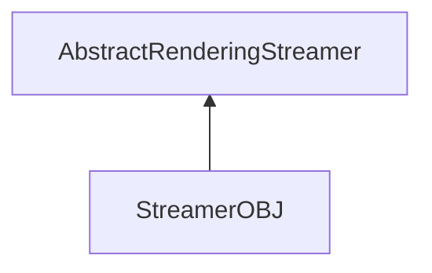

| public |
{:.api_label}

#### Inheritance Graph

## Description

## Public Static Attributes

|
| ------: | ----------------- |
|  | |
| const char *const | **[fileExtension](#classRendering_1_1Serialization_1_1StreamerOBJ_1a9cf53809d85f404278f94680837c8810)**  |
{: .nohead .nowrap1 .api_section }

## Public Functions

|
| ------: | ----------------- |
|  | |
|  | **[StreamerOBJ](#classRendering_1_1Serialization_1_1StreamerOBJ_1a9cb2fb3ded1ad1f242750f7473f3564d)**() |
|  | |
|  | **[~StreamerOBJ](#classRendering_1_1Serialization_1_1StreamerOBJ_1adc9660632fdd3b24afd76b2714ac6a18)**() |
|  | |
| [Util::GenericAttributeList](classUtil_1_1GenericAttributeList) * | **[loadGeneric](#classRendering_1_1Serialization_1_1StreamerOBJ_1a8159a7db92783cbc76bdcaca25c240da)**(std::istream & void) |
{: .nohead .nowrap1 .api_section }

## Public Static Functions

|
| ------: | ----------------- |
|  | |
| uint8_t | **[queryCapabilities](#classRendering_1_1Serialization_1_1StreamerOBJ_1ad37fd6cf1a4ab91c1dc237ec1282e56a)**(const std::string & extension) |
{: .nohead .nowrap1 .api_section }

-------------------------------------------------------------------

## Documentation

### <small>variable</small>  Rendering::Serialization::StreamerOBJ::fileExtension {#classRendering_1_1Serialization_1_1StreamerOBJ_1a9cf53809d85f404278f94680837c8810}

| public | static |
{:.api_label}

|
| ------: | ----------------- |
|  |
| const char *const **[fileExtension](#classRendering_1_1Serialization_1_1StreamerOBJ_1a9cf53809d85f404278f94680837c8810)**  |
{: .nohead .nowrap1 .api_doc }

Defined in `Rendering/Serialization/StreamerOBJ.h:30`{:style="float: right"}

-------------------------------------------------------------------

### <small>function</small>  Rendering::Serialization::StreamerOBJ::StreamerOBJ {#classRendering_1_1Serialization_1_1StreamerOBJ_1a9cb2fb3ded1ad1f242750f7473f3564d}

| public | inline |
{:.api_label}

|
| ------: | ----------------- |
|  |
|  **[StreamerOBJ](#classRendering_1_1Serialization_1_1StreamerOBJ_1a9cb2fb3ded1ad1f242750f7473f3564d)**( |  ) |
{: .nohead .nowrap1 .api_doc }

Defined in `Rendering/Serialization/StreamerOBJ.h:21`{:style="float: right"}

-------------------------------------------------------------------

### <small>function</small>  Rendering::Serialization::StreamerOBJ::~StreamerOBJ {#classRendering_1_1Serialization_1_1StreamerOBJ_1adc9660632fdd3b24afd76b2714ac6a18}

| public | inline | virtual |
{:.api_label}

|
| ------: | ----------------- |
|  |
|  **[~StreamerOBJ](#classRendering_1_1Serialization_1_1StreamerOBJ_1adc9660632fdd3b24afd76b2714ac6a18)**( |  ) |
{: .nohead .nowrap1 .api_doc }

Defined in `Rendering/Serialization/StreamerOBJ.h:24`{:style="float: right"}

-------------------------------------------------------------------

### <small>function</small>  Rendering::Serialization::StreamerOBJ::loadGeneric {#classRendering_1_1Serialization_1_1StreamerOBJ_1a8159a7db92783cbc76bdcaca25c240da}

| public | virtual |
{:.api_label}

|
| ------: | ----------------- |
|  |
| [Util::GenericAttributeList](classUtil_1_1GenericAttributeList) * **[loadGeneric](#classRendering_1_1Serialization_1_1StreamerOBJ_1a8159a7db92783cbc76bdcaca25c240da)**( | std::istream & | **void** ) |
{: .nohead .nowrap1 .api_doc }

Load generic data from the given stream.

#### Parameters
**input**
:  Use the data from the stream beginning at the preset position.

#### Returns
Description list containing the generic data. The caller is responsible for the memory deallocation.

Defined in `Rendering/Serialization/StreamerOBJ.h:27`{:style="float: right"}

-------------------------------------------------------------------

### <small>function</small>  Rendering::Serialization::StreamerOBJ::queryCapabilities {#classRendering_1_1Serialization_1_1StreamerOBJ_1ad37fd6cf1a4ab91c1dc237ec1282e56a}

| public | static |
{:.api_label}

|
| ------: | ----------------- |
|  |
| uint8_t **[queryCapabilities](#classRendering_1_1Serialization_1_1StreamerOBJ_1ad37fd6cf1a4ab91c1dc237ec1282e56a)**( | const std::string & | **extension** ) |
{: .nohead .nowrap1 .api_doc }

Defined in `Rendering/Serialization/StreamerOBJ.h:29`{:style="float: right"}

-------------------------------------------------------------------

