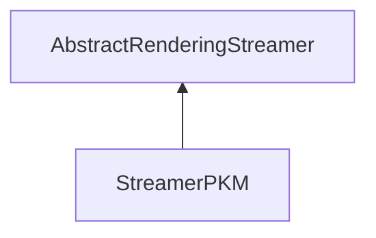

| public |
{:.api_label}

#### Inheritance Graph

## Description

Loader for the Ericsson [Texture](classRendering_1_1Texture) Compression (ETC) format (PKM 10).

*See also*: [http://devtools.ericsson.com/etc](http://devtools.ericsson.com/etc)

*See also*: [http://www.khronos.org/registry/gles/extensions/OES/OES_compressed_ETC1_RGB8_texture.txt](http://www.khronos.org/registry/gles/extensions/OES/OES_compressed_ETC1_RGB8_texture.txt)

**Author**: Benjamin Eikel

**Date**: 2011-05-25

## Public Static Attributes

|
| ------: | ----------------- |
|  | |
| const char *const | **[fileExtension](#classRendering_1_1Serialization_1_1StreamerPKM_1a132c534c338935285eb48403525dc57e)**  |
{: .nohead .nowrap1 .api_section }

## Public Functions

|
| ------: | ----------------- |
|  | |
|  | **[StreamerPKM](#classRendering_1_1Serialization_1_1StreamerPKM_1a74f8976a537e0f81574f7c014127b0ae)**() |
|  | |
|  | **[~StreamerPKM](#classRendering_1_1Serialization_1_1StreamerPKM_1aa0e903e255d745580523bc29beaca7c3)**() |
|  | |
| [Util::Reference](classUtil_1_1Reference) < [Texture](classRendering_1_1Texture) > | **[loadTexture](#classRendering_1_1Serialization_1_1StreamerPKM_1adda9183d82550f99800dfbf9f194c64a)**(std::istream & void,  [TextureType](group%5F%5Ftexture#group%5F%5Ftexture_1gaa31df885ca7b633a7032d29050df5f12)  void, uint32_t void) |
{: .nohead .nowrap1 .api_section }

## Public Static Functions

|
| ------: | ----------------- |
|  | |
| uint8_t | **[queryCapabilities](#classRendering_1_1Serialization_1_1StreamerPKM_1a661d405d198eb1649775a577937da3a5)**(const std::string & extension) |
{: .nohead .nowrap1 .api_section }

-------------------------------------------------------------------

## Documentation

### <small>variable</small>  Rendering::Serialization::StreamerPKM::fileExtension {#classRendering_1_1Serialization_1_1StreamerPKM_1a132c534c338935285eb48403525dc57e}

| public | static |
{:.api_label}

|
| ------: | ----------------- |
|  |
| const char *const **[fileExtension](#classRendering_1_1Serialization_1_1StreamerPKM_1a132c534c338935285eb48403525dc57e)**  |
{: .nohead .nowrap1 .api_doc }

Defined in `Rendering/Serialization/StreamerPKM.h:38`{:style="float: right"}

-------------------------------------------------------------------

### <small>function</small>  Rendering::Serialization::StreamerPKM::StreamerPKM {#classRendering_1_1Serialization_1_1StreamerPKM_1a74f8976a537e0f81574f7c014127b0ae}

| public | inline |
{:.api_label}

|
| ------: | ----------------- |
|  |
|  **[StreamerPKM](#classRendering_1_1Serialization_1_1StreamerPKM_1a74f8976a537e0f81574f7c014127b0ae)**( |  ) |
{: .nohead .nowrap1 .api_doc }

Defined in `Rendering/Serialization/StreamerPKM.h:29`{:style="float: right"}

-------------------------------------------------------------------

### <small>function</small>  Rendering::Serialization::StreamerPKM::~StreamerPKM {#classRendering_1_1Serialization_1_1StreamerPKM_1aa0e903e255d745580523bc29beaca7c3}

| public | inline | virtual |
{:.api_label}

|
| ------: | ----------------- |
|  |
|  **[~StreamerPKM](#classRendering_1_1Serialization_1_1StreamerPKM_1aa0e903e255d745580523bc29beaca7c3)**( |  ) |
{: .nohead .nowrap1 .api_doc }

Defined in `Rendering/Serialization/StreamerPKM.h:32`{:style="float: right"}

-------------------------------------------------------------------

### <small>function</small>  Rendering::Serialization::StreamerPKM::loadTexture {#classRendering_1_1Serialization_1_1StreamerPKM_1adda9183d82550f99800dfbf9f194c64a}

| public | virtual |
{:.api_label}

|
| ------: | ----------------- |
|  |
| [Util::Reference](classUtil_1_1Reference) < [Texture](classRendering_1_1Texture) > **[loadTexture](#classRendering_1_1Serialization_1_1StreamerPKM_1adda9183d82550f99800dfbf9f194c64a)**( | std::istream & | **void**, |
| |  [TextureType](group%5F%5Ftexture#group%5F%5Ftexture_1gaa31df885ca7b633a7032d29050df5f12)  | **void**, |
| | uint32_t | **void** |
|   ) |
{: .nohead .nowrap1 .api_doc }

Load a texture from the given stream.

#### Parameters
**input**
:  Use the data from the stream beginning at the preset position.

#### Returns
 [Texture](classRendering_1_1Texture) object. The caller is responsible for the memory deallocation.

Defined in `Rendering/Serialization/StreamerPKM.h:35`{:style="float: right"}

-------------------------------------------------------------------

### <small>function</small>  Rendering::Serialization::StreamerPKM::queryCapabilities {#classRendering_1_1Serialization_1_1StreamerPKM_1a661d405d198eb1649775a577937da3a5}

| public | static |
{:.api_label}

|
| ------: | ----------------- |
|  |
| uint8_t **[queryCapabilities](#classRendering_1_1Serialization_1_1StreamerPKM_1a661d405d198eb1649775a577937da3a5)**( | const std::string & | **extension** ) |
{: .nohead .nowrap1 .api_doc }

Defined in `Rendering/Serialization/StreamerPKM.h:37`{:style="float: right"}

-------------------------------------------------------------------

