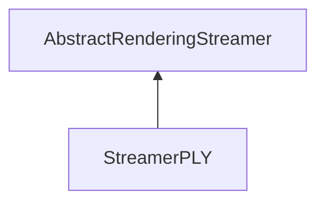

| public |
{:.api_label}

#### Inheritance Graph

## Description

## Public Static Attributes

|
| ------: | ----------------- |
|  | |
| const char *const | **[fileExtension](#classRendering_1_1Serialization_1_1StreamerPLY_1ad85e93ec7c6273672682f8a6f2eaaab2)**  |
{: .nohead .nowrap1 .api_section }

## Public Functions

|
| ------: | ----------------- |
|  | |
|  | **[StreamerPLY](#classRendering_1_1Serialization_1_1StreamerPLY_1a9725db8aae8cfa3e238153ed8eb66da1)**() |
|  | |
|  | **[~StreamerPLY](#classRendering_1_1Serialization_1_1StreamerPLY_1acb5f0e9101745bb49f909fd1964a664b)**() |
|  | |
| [Util::GenericAttributeList](classUtil_1_1GenericAttributeList) * | **[loadGeneric](#classRendering_1_1Serialization_1_1StreamerPLY_1ab011dd90e8adb17728c1bc51fb90a002)**(std::istream & void) |
|  | |
| [Mesh](classRendering_1_1Mesh) * | **[loadMesh](#classRendering_1_1Serialization_1_1StreamerPLY_1a636444514dc852b773cc12829993d118)**(std::istream & void) |
|  | |
| bool | **[saveMesh](#classRendering_1_1Serialization_1_1StreamerPLY_1ab33a39166c254d7be0aae27dfb6fc3d7)**( [Mesh](classRendering_1_1Mesh) * void, std::ostream & void) |
{: .nohead .nowrap1 .api_section }

## Public Static Functions

|
| ------: | ----------------- |
|  | |
| uint8_t | **[queryCapabilities](#classRendering_1_1Serialization_1_1StreamerPLY_1a706ce07665a4063af5f3f726df68efa9)**(const std::string & extension) |
{: .nohead .nowrap1 .api_section }

-------------------------------------------------------------------

## Documentation

### <small>variable</small>  Rendering::Serialization::StreamerPLY::fileExtension {#classRendering_1_1Serialization_1_1StreamerPLY_1ad85e93ec7c6273672682f8a6f2eaaab2}

| public | static |
{:.api_label}

|
| ------: | ----------------- |
|  |
| const char *const **[fileExtension](#classRendering_1_1Serialization_1_1StreamerPLY_1ad85e93ec7c6273672682f8a6f2eaaab2)**  |
{: .nohead .nowrap1 .api_doc }

Defined in `Rendering/Serialization/StreamerPLY.h:32`{:style="float: right"}

-------------------------------------------------------------------

### <small>function</small>  Rendering::Serialization::StreamerPLY::StreamerPLY {#classRendering_1_1Serialization_1_1StreamerPLY_1a9725db8aae8cfa3e238153ed8eb66da1}

| public | inline |
{:.api_label}

|
| ------: | ----------------- |
|  |
|  **[StreamerPLY](#classRendering_1_1Serialization_1_1StreamerPLY_1a9725db8aae8cfa3e238153ed8eb66da1)**( |  ) |
{: .nohead .nowrap1 .api_doc }

Defined in `Rendering/Serialization/StreamerPLY.h:21`{:style="float: right"}

-------------------------------------------------------------------

### <small>function</small>  Rendering::Serialization::StreamerPLY::~StreamerPLY {#classRendering_1_1Serialization_1_1StreamerPLY_1acb5f0e9101745bb49f909fd1964a664b}

| public | inline | virtual |
{:.api_label}

|
| ------: | ----------------- |
|  |
|  **[~StreamerPLY](#classRendering_1_1Serialization_1_1StreamerPLY_1acb5f0e9101745bb49f909fd1964a664b)**( |  ) |
{: .nohead .nowrap1 .api_doc }

Defined in `Rendering/Serialization/StreamerPLY.h:24`{:style="float: right"}

-------------------------------------------------------------------

### <small>function</small>  Rendering::Serialization::StreamerPLY::loadGeneric {#classRendering_1_1Serialization_1_1StreamerPLY_1ab011dd90e8adb17728c1bc51fb90a002}

| public | virtual |
{:.api_label}

|
| ------: | ----------------- |
|  |
| [Util::GenericAttributeList](classUtil_1_1GenericAttributeList) * **[loadGeneric](#classRendering_1_1Serialization_1_1StreamerPLY_1ab011dd90e8adb17728c1bc51fb90a002)**( | std::istream & | **void** ) |
{: .nohead .nowrap1 .api_doc }

Load generic data from the given stream.

#### Parameters
**input**
:  Use the data from the stream beginning at the preset position.

#### Returns
Description list containing the generic data. The caller is responsible for the memory deallocation.

Defined in `Rendering/Serialization/StreamerPLY.h:27`{:style="float: right"}

-------------------------------------------------------------------

### <small>function</small>  Rendering::Serialization::StreamerPLY::loadMesh {#classRendering_1_1Serialization_1_1StreamerPLY_1a636444514dc852b773cc12829993d118}

| public | virtual |
{:.api_label}

|
| ------: | ----------------- |
|  |
| [Mesh](classRendering_1_1Mesh) * **[loadMesh](#classRendering_1_1Serialization_1_1StreamerPLY_1a636444514dc852b773cc12829993d118)**( | std::istream & | **void** ) |
{: .nohead .nowrap1 .api_doc }

Load a mesh from the given stream.

#### Parameters
**input**
:  Use the data from the stream beginning at the preset position.

#### Returns
 [Mesh](classRendering_1_1Mesh) object. The caller is responsible for the memory deallocation.

Defined in `Rendering/Serialization/StreamerPLY.h:28`{:style="float: right"}

-------------------------------------------------------------------

### <small>function</small>  Rendering::Serialization::StreamerPLY::saveMesh {#classRendering_1_1Serialization_1_1StreamerPLY_1ab33a39166c254d7be0aae27dfb6fc3d7}

| public | virtual |
{:.api_label}

|
| ------: | ----------------- |
|  |
| bool **[saveMesh](#classRendering_1_1Serialization_1_1StreamerPLY_1ab33a39166c254d7be0aae27dfb6fc3d7)**( |  [Mesh](classRendering_1_1Mesh) * | **void**, |
| | std::ostream & | **void** |
|   ) |
{: .nohead .nowrap1 .api_doc }

Save a mesh to the given stream.

#### Parameters
**mesh**
:   [Mesh](classRendering_1_1Mesh) object to save.

**output**
:  Use the stream for writing beginning at the preset position.

#### Returns
`true`if successful,`false`otherwise.

Defined in `Rendering/Serialization/StreamerPLY.h:29`{:style="float: right"}

-------------------------------------------------------------------

### <small>function</small>  Rendering::Serialization::StreamerPLY::queryCapabilities {#classRendering_1_1Serialization_1_1StreamerPLY_1a706ce07665a4063af5f3f726df68efa9}

| public | static |
{:.api_label}

|
| ------: | ----------------- |
|  |
| uint8_t **[queryCapabilities](#classRendering_1_1Serialization_1_1StreamerPLY_1a706ce07665a4063af5f3f726df68efa9)**( | const std::string & | **extension** ) |
{: .nohead .nowrap1 .api_doc }

Defined in `Rendering/Serialization/StreamerPLY.h:31`{:style="float: right"}

-------------------------------------------------------------------

