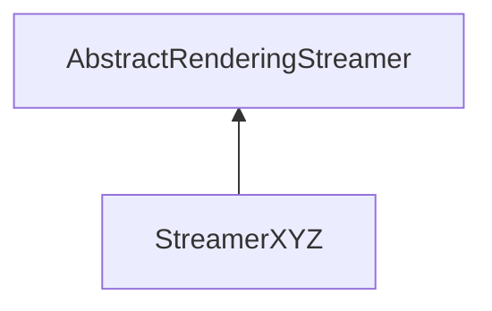

| public |
{:.api_label}

#### Inheritance Graph

## Description

## Public Static Attributes

|
| ------: | ----------------- |
|  | |
| const char *const | **[fileExtension](#classRendering_1_1Serialization_1_1StreamerXYZ_1ad7d6773124d0bc1feecce06b871fd991)**  |
{: .nohead .nowrap1 .api_section }

## Public Functions

|
| ------: | ----------------- |
|  | |
|  | **[StreamerXYZ](#classRendering_1_1Serialization_1_1StreamerXYZ_1a817fcd62fd2e119547c1d42d38bf4156)**() |
|  | |
|  | **[~StreamerXYZ](#classRendering_1_1Serialization_1_1StreamerXYZ_1a8ea9993beeb634ef1f24b73bf33631bc)**() |
|  | |
| [Mesh](classRendering_1_1Mesh) * | **[loadMesh](#classRendering_1_1Serialization_1_1StreamerXYZ_1a2c3ed8c35149f442999e37b18ab2027f)**(std::istream & void) |
|  | |
| [Mesh](classRendering_1_1Mesh) * | **[loadMesh](#classRendering_1_1Serialization_1_1StreamerXYZ_1a0625189fa2d3cc35ee37f0087ca32003)**(std::istream & input, std::size_t numPoints) |
|  | |
| [Util::GenericAttributeList](classUtil_1_1GenericAttributeList) * | **[loadGeneric](#classRendering_1_1Serialization_1_1StreamerXYZ_1af16aa44004b1706fd6303b4c7b75d2f3)**(std::istream & void) |
{: .nohead .nowrap1 .api_section }

## Public Static Functions

|
| ------: | ----------------- |
|  | |
| void | **[clusterPoints](#classRendering_1_1Serialization_1_1StreamerXYZ_1a17f4268c432be822ea9788da29eb6cc3)**(const [Util::FileName](classUtil_1_1FileName) & inputFile, size_t numberOfClusters) |
|  | |
| void | **[clusterPoints](#classRendering_1_1Serialization_1_1StreamerXYZ_1a111a0668651ee7d70060e06d64992bed)**(std::istream & input, std::vector< std::ostream * > & outputs) |
|  | |
| uint8_t | **[queryCapabilities](#classRendering_1_1Serialization_1_1StreamerXYZ_1adef7b0ed5eba3933721fed0fc74ecc95)**(const std::string & extension) |
{: .nohead .nowrap1 .api_section }

-------------------------------------------------------------------

## Documentation

### <small>variable</small>  Rendering::Serialization::StreamerXYZ::fileExtension {#classRendering_1_1Serialization_1_1StreamerXYZ_1ad7d6773124d0bc1feecce06b871fd991}

| public | static |
{:.api_label}

|
| ------: | ----------------- |
|  |
| const char *const **[fileExtension](#classRendering_1_1Serialization_1_1StreamerXYZ_1ad7d6773124d0bc1feecce06b871fd991)**  |
{: .nohead .nowrap1 .api_doc }

Defined in `Rendering/Serialization/StreamerXYZ.h:43`{:style="float: right"}

-------------------------------------------------------------------

### <small>function</small>  Rendering::Serialization::StreamerXYZ::StreamerXYZ {#classRendering_1_1Serialization_1_1StreamerXYZ_1a817fcd62fd2e119547c1d42d38bf4156}

| public | inline |
{:.api_label}

|
| ------: | ----------------- |
|  |
|  **[StreamerXYZ](#classRendering_1_1Serialization_1_1StreamerXYZ_1a817fcd62fd2e119547c1d42d38bf4156)**( |  ) |
{: .nohead .nowrap1 .api_doc }

Defined in `Rendering/Serialization/StreamerXYZ.h:23`{:style="float: right"}

-------------------------------------------------------------------

### <small>function</small>  Rendering::Serialization::StreamerXYZ::~StreamerXYZ {#classRendering_1_1Serialization_1_1StreamerXYZ_1a8ea9993beeb634ef1f24b73bf33631bc}

| public | inline | virtual |
{:.api_label}

|
| ------: | ----------------- |
|  |
|  **[~StreamerXYZ](#classRendering_1_1Serialization_1_1StreamerXYZ_1a8ea9993beeb634ef1f24b73bf33631bc)**( |  ) |
{: .nohead .nowrap1 .api_doc }

Defined in `Rendering/Serialization/StreamerXYZ.h:26`{:style="float: right"}

-------------------------------------------------------------------

### <small>function</small>  Rendering::Serialization::StreamerXYZ::loadMesh {#classRendering_1_1Serialization_1_1StreamerXYZ_1a2c3ed8c35149f442999e37b18ab2027f}

| public | inline | virtual |
{:.api_label}

|
| ------: | ----------------- |
|  |
| [Mesh](classRendering_1_1Mesh) * **[loadMesh](#classRendering_1_1Serialization_1_1StreamerXYZ_1a2c3ed8c35149f442999e37b18ab2027f)**( | std::istream & | **void** ) |
{: .nohead .nowrap1 .api_doc }

Load a mesh from the given stream.

#### Parameters
**input**
:  Use the data from the stream beginning at the preset position.

#### Returns
 [Mesh](classRendering_1_1Mesh) object. The caller is responsible for the memory deallocation.

Defined in `Rendering/Serialization/StreamerXYZ.h:29`{:style="float: right"}

-------------------------------------------------------------------

### <small>function</small>  Rendering::Serialization::StreamerXYZ::loadMesh {#classRendering_1_1Serialization_1_1StreamerXYZ_1a0625189fa2d3cc35ee37f0087ca32003}

| public |
{:.api_label}

|
| ------: | ----------------- |
|  |
| [Mesh](classRendering_1_1Mesh) * **[loadMesh](#classRendering_1_1Serialization_1_1StreamerXYZ_1a0625189fa2d3cc35ee37f0087ca32003)**( | std::istream & | **input**, |
| | std::size_t | **numPoints** |
|   ) |
{: .nohead .nowrap1 .api_doc }

Defined in `Rendering/Serialization/StreamerXYZ.h:32`{:style="float: right"}

-------------------------------------------------------------------

### <small>function</small>  Rendering::Serialization::StreamerXYZ::loadGeneric {#classRendering_1_1Serialization_1_1StreamerXYZ_1af16aa44004b1706fd6303b4c7b75d2f3}

| public | virtual |
{:.api_label}

|
| ------: | ----------------- |
|  |
| [Util::GenericAttributeList](classUtil_1_1GenericAttributeList) * **[loadGeneric](#classRendering_1_1Serialization_1_1StreamerXYZ_1af16aa44004b1706fd6303b4c7b75d2f3)**( | std::istream & | **void** ) |
{: .nohead .nowrap1 .api_doc }

Load generic data from the given stream.

#### Parameters
**input**
:  Use the data from the stream beginning at the preset position.

#### Returns
Description list containing the generic data. The caller is responsible for the memory deallocation.

Defined in `Rendering/Serialization/StreamerXYZ.h:33`{:style="float: right"}

-------------------------------------------------------------------

### <small>function</small>  Rendering::Serialization::StreamerXYZ::clusterPoints {#classRendering_1_1Serialization_1_1StreamerXYZ_1a17f4268c432be822ea9788da29eb6cc3}

| public | static |
{:.api_label}

|
| ------: | ----------------- |
|  |
| void **[clusterPoints](#classRendering_1_1Serialization_1_1StreamerXYZ_1a17f4268c432be822ea9788da29eb6cc3)**( | const [Util::FileName](classUtil_1_1FileName) & | **inputFile**, |
| | size_t | **numberOfClusters** |
|   ) |
{: .nohead .nowrap1 .api_doc }

Distributes the points in the given xyz-input file into`numberOfClusters`many .xyz-files in the same directory (having a number postfix). This function should handle files of arbitrary size.

Defined in `Rendering/Serialization/StreamerXYZ.h:39`{:style="float: right"}

-------------------------------------------------------------------

### <small>function</small>  Rendering::Serialization::StreamerXYZ::clusterPoints {#classRendering_1_1Serialization_1_1StreamerXYZ_1a111a0668651ee7d70060e06d64992bed}

| public | static |
{:.api_label}

|
| ------: | ----------------- |
|  |
| void **[clusterPoints](#classRendering_1_1Serialization_1_1StreamerXYZ_1a111a0668651ee7d70060e06d64992bed)**( | std::istream & | **input**, |
| | std::vector< std::ostream * > & | **outputs** |
|   ) |
{: .nohead .nowrap1 .api_doc }

Defined in `Rendering/Serialization/StreamerXYZ.h:40`{:style="float: right"}

-------------------------------------------------------------------

### <small>function</small>  Rendering::Serialization::StreamerXYZ::queryCapabilities {#classRendering_1_1Serialization_1_1StreamerXYZ_1adef7b0ed5eba3933721fed0fc74ecc95}

| public | static |
{:.api_label}

|
| ------: | ----------------- |
|  |
| uint8_t **[queryCapabilities](#classRendering_1_1Serialization_1_1StreamerXYZ_1adef7b0ed5eba3933721fed0fc74ecc95)**( | const std::string & | **extension** ) |
{: .nohead .nowrap1 .api_doc }

Defined in `Rendering/Serialization/StreamerXYZ.h:42`{:style="float: right"}

-------------------------------------------------------------------

