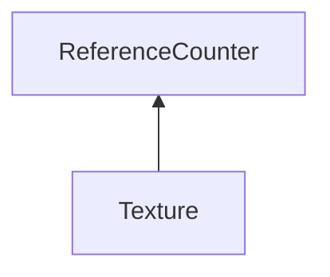

| public |
{:.api_label}

#### Inheritance Graph



## Description


 [Texture](classRendering_1_1Texture) 

```
Coordinates:
```


```
(0,sizeY-1,numLayers-1)             (sizeX,sizeY,numLayers-1)
              +---------------+  
              |               |  
              .     ...       .
              .               .
              |               |  
(0,0,1)       +---------------+ (sizeX-1,0,1)
(0,sizeY-1,0) +---------------+ (sizeX-1,sizeY-1,0)
              |      /\       |  
              |     /  \      |
              |      ||       |
              |      ||       |
              +---------------+
(0,0,0)                  (sizeX,0,0)
```

> **Note**: the coordinates are different to the ones used in [Util::Bitmap](classUtil_1_1Bitmap) 


## Classes

|
| ------ | ------------------------------------------------------------------------- | 
| struct | [Rendering::Texture::Format](structRendering_1_1Texture_1_1Format) <br/>  | 
{: .nohead }

## Mipmaps

|
| ------: | ----------------- |
|  | |
| void | **[planMipmapCreation](#classRendering_1_1Texture_1a639ce68242b35f8571b0292ff3fb7542)**() |
|  | |
| void | **[createMipmaps](#classRendering_1_1Texture_1af8b219dfe63939ebbc38eee28150b5f1)**( [RenderingContext](classRendering_1_1RenderingContext) & context) |
|  | |
| bool | **[getHasMipmaps](#classRendering_1_1Texture_1a5190fd982b9a1327618f80e6dfc7801e)**() const |
{: .nohead .nowrap1 .api_section }


## BufferObject (tType == TEXTURE_BUFFER)

|
| ------: | ----------------- |
|  | |
| [BufferObject](classRendering_1_1BufferObject) * | **[getBufferObject](#classRendering_1_1Texture_1a873b2e24552b71a3630ffbcfae89b730)**() const |
{: .nohead .nowrap1 .api_section }


## Filename

|
| ------: | ----------------- |
|  | |
| const [Util::FileName](classUtil_1_1FileName) & | **[getFileName](#classRendering_1_1Texture_1aecddc234d5407e73d07c3928027bb797)**() const |
|  | |
| void | **[setFileName](#classRendering_1_1Texture_1a91aa4746401c1905cfcf7a4a7a35d9ff)**(const [Util::FileName](classUtil_1_1FileName) & f) |
{: .nohead .nowrap1 .api_section }


## Public Functions

|
| ------: | ----------------- |
|  | |
|  | **[Texture](#classRendering_1_1Texture_1ab9d422b972722e5d6665fec60da4d56f)**( [Format](structRendering_1_1Texture_1_1Format)  format) |
|  | |
|  | **[~Texture](#classRendering_1_1Texture_1a84528e2ddf1163a522595ed88cb45b49)**() |
|  | |
| uint32_t | **[getDataSize](#classRendering_1_1Texture_1a965ed3a62cdca2b33b5b1df979cb3c3e)**() const |
|  | |
| const [Format](structRendering_1_1Texture_1_1Format) & | **[getFormat](#classRendering_1_1Texture_1a6196c2c0e0e4374e0e8b86a91ffcd1d4)**() const |
|  | |
| uint32_t | **[getGLTextureType](#classRendering_1_1Texture_1af64c038f49580a83d3e5e9e94d1b9ff7)**() const |
|  | |
| uint32_t | **[getGLId](#classRendering_1_1Texture_1ac41443e22d8f3766e2b683b9b6682545)**() const |
|  | |
| uint32_t | **[getNumLayers](#classRendering_1_1Texture_1a2c7f7ed8a480dcdd13fd1d4ecd9adfb4)**() const |
|  | |
| uint32_t | **[getHeight](#classRendering_1_1Texture_1a366dbe4f2b925f75a5c0c802dd9eef9e)**() const |
|  | |
| uint32_t | **[getWidth](#classRendering_1_1Texture_1a43ec4061caba1e9af3504ae1346e69d1)**() const |
|  | |
| [TextureType](group%5F%5Ftexture#group%5F%5Ftexture_1gaa31df885ca7b633a7032d29050df5f12) | **[getTextureType](#classRendering_1_1Texture_1a01a0bfa82d0477481472cf3ef213112a)**() const |
|  | |
| bool | **[getUseLinearMinFilter](#classRendering_1_1Texture_1a1668b06b3506a2cbe2fcb3f9a85dfe53)**() const |
|  | |
| bool | **[getUseLinearMagFilter](#classRendering_1_1Texture_1a0d3673b5eb950498a9da59dfd4364038)**() const |
|  | |
| void | **[_createGLID](#classRendering_1_1Texture_1a981d4d502748c92e21bcaf5ab8fabc4f)**( [RenderingContext](classRendering_1_1RenderingContext) & context) |
|  | |
| void | **[_uploadGLTexture](#classRendering_1_1Texture_1a96b550e8970a77e6d9ff2947e1e3782f)**( [RenderingContext](classRendering_1_1RenderingContext) & context, int level) |
|  | |
| void | **[downloadGLTexture](#classRendering_1_1Texture_1a8aa37675632160074f1d63ea8fc00e7e)**( [RenderingContext](classRendering_1_1RenderingContext) & context) |
|  | |
| void | **[removeGLData](#classRendering_1_1Texture_1aaf4a563bbc6a6fc884828111406993df)**() |
|  | |
| void | **[clearGLData](#classRendering_1_1Texture_1a79ee9bb469ebb13992a06e2c1669c1cc)**(const [Util::Color4f](classUtil_1_1Color4f) & color) |
|  | |
| void | **[allocateLocalData](#classRendering_1_1Texture_1a14b790558f05080e089633f703c2e0ed)**() |
|  | |
| uint8_t * | **[openLocalData](#classRendering_1_1Texture_1ade4adfceb43d17b8a803dd13bec2806a)**( [RenderingContext](classRendering_1_1RenderingContext) & context) |
|  | |
| uint8_t * | **[getLocalData](#classRendering_1_1Texture_1ab46a85f4ec6fade63cd5c7eea813ce63)**() |
|  | |
| const uint8_t * | **[getLocalData](#classRendering_1_1Texture_1a8dd422e33ce868f7d7f1718dd5775097)**() const |
|  | |
| void | **[dataChanged](#classRendering_1_1Texture_1aa2fca7bd70d315781f2030eaac18f679)**() |
|  | |
| uint32_t | **[_prepareForBinding](#classRendering_1_1Texture_1a97343a5457adffe2c4397e1dca33b0c1)**( [RenderingContext](classRendering_1_1RenderingContext) & context) <br/> (internal) uploads the texture if necessary; returns the glId or 0 if the texture is invalid. |
|  | |
| bool | **[isGLTextureValid](#classRendering_1_1Texture_1ad9d8358e539fbd0225ff145853a50892)**() const |
|  | |
| bool | **[isGLTextureResident](#classRendering_1_1Texture_1a1643154dc302d734b6b8a8e2f8f4ca93)**() const |
|  | |
| [Util::Bitmap](classUtil_1_1Bitmap) * | **[getLocalBitmap](#classRendering_1_1Texture_1a96bd36c3bf3a049dade16ba72a6fdc67)**() const |
|  | |
| void | **[_setGLId](#classRendering_1_1Texture_1a44873122fba3f15bbcdd83efacd23156)**(uint32_t glId) |
|  | |
| void | **[enableComparision](#classRendering_1_1Texture_1ace0e95c4e9274a346f194ac964c8379a)**( [RenderingContext](classRendering_1_1RenderingContext) & context,  [Comparison::function_t](namespaceRendering_1_1Comparison#namespaceRendering_1_1Comparison_1a16931e86f2034b760a8a74283dddc1d5)  func) |
{: .nohead .nowrap1 .api_section }


-------------------------------------------------------------------

## Documentation

### <small>function</small><br/> Rendering::Texture::planMipmapCreation {#classRendering_1_1Texture_1a639ce68242b35f8571b0292ff3fb7542}

| public | inline |
{:.api_label}

|
| ------: | ----------------- |
|  |
| void **[planMipmapCreation](#classRendering_1_1Texture_1a639ce68242b35f8571b0292ff3fb7542)**( |  ) |
{: .nohead .nowrap1 .api_doc }


<sub>Defined in `Rendering/Texture/Texture.h:147`</sub>{:style="float: right"}

-------------------------------------------------------------------

### <small>function</small><br/> Rendering::Texture::createMipmaps {#classRendering_1_1Texture_1af8b219dfe63939ebbc38eee28150b5f1}

| public |
{:.api_label}

|
| ------: | ----------------- |
|  |
| void **[createMipmaps](#classRendering_1_1Texture_1af8b219dfe63939ebbc38eee28150b5f1)**( |  [RenderingContext](classRendering_1_1RenderingContext) & | **context** ) |
{: .nohead .nowrap1 .api_doc }


<sub>Defined in `Rendering/Texture/Texture.h:148`</sub>{:style="float: right"}

-------------------------------------------------------------------

### <small>function</small><br/> Rendering::Texture::getHasMipmaps {#classRendering_1_1Texture_1a5190fd982b9a1327618f80e6dfc7801e}

| public | const | inline |
{:.api_label}

|
| ------: | ----------------- |
|  |
| bool **[getHasMipmaps](#classRendering_1_1Texture_1a5190fd982b9a1327618f80e6dfc7801e)**( |  ) const |
{: .nohead .nowrap1 .api_doc }


<sub>Defined in `Rendering/Texture/Texture.h:149`</sub>{:style="float: right"}

-------------------------------------------------------------------

### <small>function</small><br/> Rendering::Texture::getBufferObject {#classRendering_1_1Texture_1a873b2e24552b71a3630ffbcfae89b730}

| public | const | inline |
{:.api_label}

|
| ------: | ----------------- |
|  |
| [BufferObject](classRendering_1_1BufferObject) * **[getBufferObject](#classRendering_1_1Texture_1a873b2e24552b71a3630ffbcfae89b730)**( |  ) const |
{: .nohead .nowrap1 .api_doc }


<sub>Defined in `Rendering/Texture/Texture.h:156`</sub>{:style="float: right"}

-------------------------------------------------------------------

### <small>function</small><br/> Rendering::Texture::getFileName {#classRendering_1_1Texture_1aecddc234d5407e73d07c3928027bb797}

| public | const | inline |
{:.api_label}

|
| ------: | ----------------- |
|  |
| const [Util::FileName](classUtil_1_1FileName) & **[getFileName](#classRendering_1_1Texture_1aecddc234d5407e73d07c3928027bb797)**( |  ) const |
{: .nohead .nowrap1 .api_doc }


<sub>Defined in `Rendering/Texture/Texture.h:164`</sub>{:style="float: right"}

-------------------------------------------------------------------

### <small>function</small><br/> Rendering::Texture::setFileName {#classRendering_1_1Texture_1a91aa4746401c1905cfcf7a4a7a35d9ff}

| public | inline |
{:.api_label}

|
| ------: | ----------------- |
|  |
| void **[setFileName](#classRendering_1_1Texture_1a91aa4746401c1905cfcf7a4a7a35d9ff)**( | const [Util::FileName](classUtil_1_1FileName) & | **f** ) |
{: .nohead .nowrap1 .api_doc }


<sub>Defined in `Rendering/Texture/Texture.h:165`</sub>{:style="float: right"}

-------------------------------------------------------------------

### <small>function</small><br/> Rendering::Texture::Texture {#classRendering_1_1Texture_1ab9d422b972722e5d6665fec60da4d56f}

| public |
{:.api_label}

|
| ------: | ----------------- |
|  |
|  **[Texture](#classRendering_1_1Texture_1ab9d422b972722e5d6665fec60da4d56f)**( |  [Format](structRendering_1_1Texture_1_1Format)  | **format** ) |
{: .nohead .nowrap1 .api_doc }


<sub>Defined in `Rendering/Texture/Texture.h:100`</sub>{:style="float: right"}

-------------------------------------------------------------------

### <small>function</small><br/> Rendering::Texture::~Texture {#classRendering_1_1Texture_1a84528e2ddf1163a522595ed88cb45b49}

| public |
{:.api_label}

|
| ------: | ----------------- |
|  |
|  **[~Texture](#classRendering_1_1Texture_1a84528e2ddf1163a522595ed88cb45b49)**( |  ) |
{: .nohead .nowrap1 .api_doc }


<sub>Defined in `Rendering/Texture/Texture.h:101`</sub>{:style="float: right"}

-------------------------------------------------------------------

### <small>function</small><br/> Rendering::Texture::getDataSize {#classRendering_1_1Texture_1a965ed3a62cdca2b33b5b1df979cb3c3e}

| public | const | inline |
{:.api_label}

|
| ------: | ----------------- |
|  |
| uint32_t **[getDataSize](#classRendering_1_1Texture_1a965ed3a62cdca2b33b5b1df979cb3c3e)**( |  ) const |
{: .nohead .nowrap1 .api_doc }


<sub>Defined in `Rendering/Texture/Texture.h:103`</sub>{:style="float: right"}

-------------------------------------------------------------------

### <small>function</small><br/> Rendering::Texture::getFormat {#classRendering_1_1Texture_1a6196c2c0e0e4374e0e8b86a91ffcd1d4}

| public | const | inline |
{:.api_label}

|
| ------: | ----------------- |
|  |
| const [Format](structRendering_1_1Texture_1_1Format) & **[getFormat](#classRendering_1_1Texture_1a6196c2c0e0e4374e0e8b86a91ffcd1d4)**( |  ) const |
{: .nohead .nowrap1 .api_doc }


<sub>Defined in `Rendering/Texture/Texture.h:104`</sub>{:style="float: right"}

-------------------------------------------------------------------

### <small>function</small><br/> Rendering::Texture::getGLTextureType {#classRendering_1_1Texture_1af64c038f49580a83d3e5e9e94d1b9ff7}

| public | const | inline |
{:.api_label}

|
| ------: | ----------------- |
|  |
| uint32_t **[getGLTextureType](#classRendering_1_1Texture_1af64c038f49580a83d3e5e9e94d1b9ff7)**( |  ) const |
{: .nohead .nowrap1 .api_doc }


<sub>Defined in `Rendering/Texture/Texture.h:105`</sub>{:style="float: right"}

-------------------------------------------------------------------

### <small>function</small><br/> Rendering::Texture::getGLId {#classRendering_1_1Texture_1ac41443e22d8f3766e2b683b9b6682545}

| public | const | inline |
{:.api_label}

|
| ------: | ----------------- |
|  |
| uint32_t **[getGLId](#classRendering_1_1Texture_1ac41443e22d8f3766e2b683b9b6682545)**( |  ) const |
{: .nohead .nowrap1 .api_doc }


<sub>Defined in `Rendering/Texture/Texture.h:106`</sub>{:style="float: right"}

-------------------------------------------------------------------

### <small>function</small><br/> Rendering::Texture::getNumLayers {#classRendering_1_1Texture_1a2c7f7ed8a480dcdd13fd1d4ecd9adfb4}

| public | const | inline |
{:.api_label}

|
| ------: | ----------------- |
|  |
| uint32_t **[getNumLayers](#classRendering_1_1Texture_1a2c7f7ed8a480dcdd13fd1d4ecd9adfb4)**( |  ) const |
{: .nohead .nowrap1 .api_doc }


<sub>Defined in `Rendering/Texture/Texture.h:107`</sub>{:style="float: right"}

-------------------------------------------------------------------

### <small>function</small><br/> Rendering::Texture::getHeight {#classRendering_1_1Texture_1a366dbe4f2b925f75a5c0c802dd9eef9e}

| public | const | inline |
{:.api_label}

|
| ------: | ----------------- |
|  |
| uint32_t **[getHeight](#classRendering_1_1Texture_1a366dbe4f2b925f75a5c0c802dd9eef9e)**( |  ) const |
{: .nohead .nowrap1 .api_doc }


<sub>Defined in `Rendering/Texture/Texture.h:108`</sub>{:style="float: right"}

-------------------------------------------------------------------

### <small>function</small><br/> Rendering::Texture::getWidth {#classRendering_1_1Texture_1a43ec4061caba1e9af3504ae1346e69d1}

| public | const | inline |
{:.api_label}

|
| ------: | ----------------- |
|  |
| uint32_t **[getWidth](#classRendering_1_1Texture_1a43ec4061caba1e9af3504ae1346e69d1)**( |  ) const |
{: .nohead .nowrap1 .api_doc }


<sub>Defined in `Rendering/Texture/Texture.h:109`</sub>{:style="float: right"}

-------------------------------------------------------------------

### <small>function</small><br/> Rendering::Texture::getTextureType {#classRendering_1_1Texture_1a01a0bfa82d0477481472cf3ef213112a}

| public | const | inline |
{:.api_label}

|
| ------: | ----------------- |
|  |
| [TextureType](group%5F%5Ftexture#group%5F%5Ftexture_1gaa31df885ca7b633a7032d29050df5f12) **[getTextureType](#classRendering_1_1Texture_1a01a0bfa82d0477481472cf3ef213112a)**( |  ) const |
{: .nohead .nowrap1 .api_doc }


<sub>Defined in `Rendering/Texture/Texture.h:110`</sub>{:style="float: right"}

-------------------------------------------------------------------

### <small>function</small><br/> Rendering::Texture::getUseLinearMinFilter {#classRendering_1_1Texture_1a1668b06b3506a2cbe2fcb3f9a85dfe53}

| public | const | inline |
{:.api_label}

|
| ------: | ----------------- |
|  |
| bool **[getUseLinearMinFilter](#classRendering_1_1Texture_1a1668b06b3506a2cbe2fcb3f9a85dfe53)**( |  ) const |
{: .nohead .nowrap1 .api_doc }


<sub>Defined in `Rendering/Texture/Texture.h:111`</sub>{:style="float: right"}

-------------------------------------------------------------------

### <small>function</small><br/> Rendering::Texture::getUseLinearMagFilter {#classRendering_1_1Texture_1a0d3673b5eb950498a9da59dfd4364038}

| public | const | inline |
{:.api_label}

|
| ------: | ----------------- |
|  |
| bool **[getUseLinearMagFilter](#classRendering_1_1Texture_1a0d3673b5eb950498a9da59dfd4364038)**( |  ) const |
{: .nohead .nowrap1 .api_doc }


<sub>Defined in `Rendering/Texture/Texture.h:112`</sub>{:style="float: right"}

-------------------------------------------------------------------

### <small>function</small><br/> Rendering::Texture::_createGLID {#classRendering_1_1Texture_1a981d4d502748c92e21bcaf5ab8fabc4f}

| public |
{:.api_label}

|
| ------: | ----------------- |
|  |
| void **[_createGLID](#classRendering_1_1Texture_1a981d4d502748c92e21bcaf5ab8fabc4f)**( |  [RenderingContext](classRendering_1_1RenderingContext) & | **context** ) |
{: .nohead .nowrap1 .api_doc }


<sub>Defined in `Rendering/Texture/Texture.h:114`</sub>{:style="float: right"}

-------------------------------------------------------------------

### <small>function</small><br/> Rendering::Texture::_uploadGLTexture {#classRendering_1_1Texture_1a96b550e8970a77e6d9ff2947e1e3782f}

| public |
{:.api_label}

|
| ------: | ----------------- |
|  |
| void **[_uploadGLTexture](#classRendering_1_1Texture_1a96b550e8970a77e6d9ff2947e1e3782f)**( |  [RenderingContext](classRendering_1_1RenderingContext) & | **context**, |
| | int | **level** |
|   ) |
{: .nohead .nowrap1 .api_doc }


<sub>Defined in `Rendering/Texture/Texture.h:115`</sub>{:style="float: right"}

-------------------------------------------------------------------

### <small>function</small><br/> Rendering::Texture::downloadGLTexture {#classRendering_1_1Texture_1a8aa37675632160074f1d63ea8fc00e7e}

| public |
{:.api_label}

|
| ------: | ----------------- |
|  |
| void **[downloadGLTexture](#classRendering_1_1Texture_1a8aa37675632160074f1d63ea8fc00e7e)**( |  [RenderingContext](classRendering_1_1RenderingContext) & | **context** ) |
{: .nohead .nowrap1 .api_doc }


<sub>Defined in `Rendering/Texture/Texture.h:116`</sub>{:style="float: right"}

-------------------------------------------------------------------

### <small>function</small><br/> Rendering::Texture::removeGLData {#classRendering_1_1Texture_1aaf4a563bbc6a6fc884828111406993df}

| public |
{:.api_label}

|
| ------: | ----------------- |
|  |
| void **[removeGLData](#classRendering_1_1Texture_1aaf4a563bbc6a6fc884828111406993df)**( |  ) |
{: .nohead .nowrap1 .api_doc }


<sub>Defined in `Rendering/Texture/Texture.h:117`</sub>{:style="float: right"}

-------------------------------------------------------------------

### <small>function</small><br/> Rendering::Texture::clearGLData {#classRendering_1_1Texture_1a79ee9bb469ebb13992a06e2c1669c1cc}

| public |
{:.api_label}

|
| ------: | ----------------- |
|  |
| void **[clearGLData](#classRendering_1_1Texture_1a79ee9bb469ebb13992a06e2c1669c1cc)**( | const [Util::Color4f](classUtil_1_1Color4f) & | **color** ) |
{: .nohead .nowrap1 .api_doc }


<sub>Defined in `Rendering/Texture/Texture.h:118`</sub>{:style="float: right"}

-------------------------------------------------------------------

### <small>function</small><br/> Rendering::Texture::allocateLocalData {#classRendering_1_1Texture_1a14b790558f05080e089633f703c2e0ed}

| public |
{:.api_label}

|
| ------: | ----------------- |
|  |
| void **[allocateLocalData](#classRendering_1_1Texture_1a14b790558f05080e089633f703c2e0ed)**( |  ) |
{: .nohead .nowrap1 .api_doc }


<sub>Defined in `Rendering/Texture/Texture.h:120`</sub>{:style="float: right"}

-------------------------------------------------------------------

### <small>function</small><br/> Rendering::Texture::openLocalData {#classRendering_1_1Texture_1ade4adfceb43d17b8a803dd13bec2806a}

| public |
{:.api_label}

|
| ------: | ----------------- |
|  |
| uint8_t * **[openLocalData](#classRendering_1_1Texture_1ade4adfceb43d17b8a803dd13bec2806a)**( |  [RenderingContext](classRendering_1_1RenderingContext) & | **context** ) |
{: .nohead .nowrap1 .api_doc }


Returns a pointer to the local data.
> **Note**: if the texture has no local data, it is downloaded automatically


<sub>Defined in `Rendering/Texture/Texture.h:124`</sub>{:style="float: right"}

-------------------------------------------------------------------

### <small>function</small><br/> Rendering::Texture::getLocalData {#classRendering_1_1Texture_1ab46a85f4ec6fade63cd5c7eea813ce63}

| public |
{:.api_label}

|
| ------: | ----------------- |
|  |
| uint8_t * **[getLocalData](#classRendering_1_1Texture_1ab46a85f4ec6fade63cd5c7eea813ce63)**( |  ) |
{: .nohead .nowrap1 .api_doc }


<sub>Defined in `Rendering/Texture/Texture.h:126`</sub>{:style="float: right"}

-------------------------------------------------------------------

### <small>function</small><br/> Rendering::Texture::getLocalData {#classRendering_1_1Texture_1a8dd422e33ce868f7d7f1718dd5775097}

| public | const |
{:.api_label}

|
| ------: | ----------------- |
|  |
| const uint8_t * **[getLocalData](#classRendering_1_1Texture_1a8dd422e33ce868f7d7f1718dd5775097)**( |  ) const |
{: .nohead .nowrap1 .api_doc }


<sub>Defined in `Rendering/Texture/Texture.h:127`</sub>{:style="float: right"}

-------------------------------------------------------------------

### <small>function</small><br/> Rendering::Texture::dataChanged {#classRendering_1_1Texture_1aa2fca7bd70d315781f2030eaac18f679}

| public | inline |
{:.api_label}

|
| ------: | ----------------- |
|  |
| void **[dataChanged](#classRendering_1_1Texture_1aa2fca7bd70d315781f2030eaac18f679)**( |  ) |
{: .nohead .nowrap1 .api_doc }


<sub>Defined in `Rendering/Texture/Texture.h:129`</sub>{:style="float: right"}

-------------------------------------------------------------------

### <small>function</small><br/> Rendering::Texture::_prepareForBinding {#classRendering_1_1Texture_1a97343a5457adffe2c4397e1dca33b0c1}

| public | inline |
{:.api_label}

|
| ------: | ----------------- |
|  |
| uint32_t **[_prepareForBinding](#classRendering_1_1Texture_1a97343a5457adffe2c4397e1dca33b0c1)**( |  [RenderingContext](classRendering_1_1RenderingContext) & | **context** ) |
{: .nohead .nowrap1 .api_doc }

(internal) uploads the texture if necessary; returns the glId or 0 if the texture is invalid.


<sub>Defined in `Rendering/Texture/Texture.h:132`</sub>{:style="float: right"}

-------------------------------------------------------------------

### <small>function</small><br/> Rendering::Texture::isGLTextureValid {#classRendering_1_1Texture_1ad9d8358e539fbd0225ff145853a50892}

| public | const |
{:.api_label}

|
| ------: | ----------------- |
|  |
| bool **[isGLTextureValid](#classRendering_1_1Texture_1ad9d8358e539fbd0225ff145853a50892)**( |  ) const |
{: .nohead .nowrap1 .api_doc }


<sub>Defined in `Rendering/Texture/Texture.h:140`</sub>{:style="float: right"}

-------------------------------------------------------------------

### <small>function</small><br/> Rendering::Texture::isGLTextureResident {#classRendering_1_1Texture_1a1643154dc302d734b6b8a8e2f8f4ca93}

| public | const |
{:.api_label}

|
| ------: | ----------------- |
|  |
| bool **[isGLTextureResident](#classRendering_1_1Texture_1a1643154dc302d734b6b8a8e2f8f4ca93)**( |  ) const |
{: .nohead .nowrap1 .api_doc }


<sub>Defined in `Rendering/Texture/Texture.h:141`</sub>{:style="float: right"}

-------------------------------------------------------------------

### <small>function</small><br/> Rendering::Texture::getLocalBitmap {#classRendering_1_1Texture_1a96bd36c3bf3a049dade16ba72a6fdc67}

| public | const | inline |
{:.api_label}

|
| ------: | ----------------- |
|  |
| [Util::Bitmap](classUtil_1_1Bitmap) * **[getLocalBitmap](#classRendering_1_1Texture_1a96bd36c3bf3a049dade16ba72a6fdc67)**( |  ) const |
{: .nohead .nowrap1 .api_doc }


<sub>Defined in `Rendering/Texture/Texture.h:143`</sub>{:style="float: right"}

-------------------------------------------------------------------

### <small>function</small><br/> Rendering::Texture::_setGLId {#classRendering_1_1Texture_1a44873122fba3f15bbcdd83efacd23156}

| public |
{:.api_label}

|
| ------: | ----------------- |
|  |
| void **[_setGLId](#classRendering_1_1Texture_1a44873122fba3f15bbcdd83efacd23156)**( | uint32_t | **glId** ) |
{: .nohead .nowrap1 .api_doc }


(internal) sets the glId of the texture. Used for creating textures from existing gl textures. WARNING: The format is not updated and needs to fit the gl texture.


<sub>Defined in `Rendering/Texture/Texture.h:174`</sub>{:style="float: right"}

-------------------------------------------------------------------

### <small>function</small><br/> Rendering::Texture::enableComparision {#classRendering_1_1Texture_1ace0e95c4e9274a346f194ac964c8379a}

| public |
{:.api_label}

|
| ------: | ----------------- |
|  |
| void **[enableComparision](#classRendering_1_1Texture_1ace0e95c4e9274a346f194ac964c8379a)**( |  [RenderingContext](classRendering_1_1RenderingContext) & | **context**, |
| |  [Comparison::function_t](namespaceRendering_1_1Comparison#namespaceRendering_1_1Comparison_1a16931e86f2034b760a8a74283dddc1d5)  | **func** |
|   ) |
{: .nohead .nowrap1 .api_doc }


<sub>Defined in `Rendering/Texture/Texture.h:176`</sub>{:style="float: right"}

-------------------------------------------------------------------

