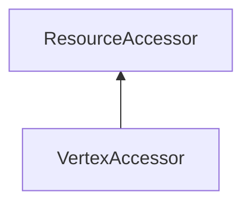

| public |
{:.api_label}

#### Inheritance Graph

## Description

Utility class to access all vertex attributes of a mesh. Directly maps the vertex data of a mesh in GPU memory if it uploaded.

> **Note**: Do not upload or render the mesh while the Accessor is active.

*See also*:  [VertexAttributeAccessor](classRendering_1_1VertexAttributeAccessor) 

## Public Functions

|
| ------: | ----------------- |
|  | |
|  | **[~VertexAccessor](#classRendering_1_1VertexAccessor_1ae993c31431418b646abc466413e8482e)**() |
|  | |
| [Geometry::Vec3](namespaceGeometry#namespaceGeometry_1ab29e4544da9b15b5bf224cbf5b691313) | **[getPosition](#classRendering_1_1VertexAccessor_1ad1394259c902f106aaa777104546fea2)**(uint32_t index,  [Util::StringIdentifier](classUtil_1_1StringIdentifier)  name) const |
|  | |
| [Geometry::Vec3](namespaceGeometry#namespaceGeometry_1ab29e4544da9b15b5bf224cbf5b691313) | **[getPosition](#classRendering_1_1VertexAccessor_1af04ef19172938629ea151a05350e0f64)**(uint32_t index, uint16_t location) const |
|  | |
| void | **[setPosition](#classRendering_1_1VertexAccessor_1ae9a90486da0207bfc725e18bf656310a)**(uint32_t index, const [Geometry::Vec3](namespaceGeometry#namespaceGeometry_1ab29e4544da9b15b5bf224cbf5b691313) & p,  [Util::StringIdentifier](classUtil_1_1StringIdentifier)  name) |
|  | |
| void | **[setPosition](#classRendering_1_1VertexAccessor_1af5323d2be3ef669adf9c42e76ee647fa)**(uint32_t index, const [Geometry::Vec3](namespaceGeometry#namespaceGeometry_1ab29e4544da9b15b5bf224cbf5b691313) & p, uint16_t location) |
|  | |
| [Geometry::Vec3](namespaceGeometry#namespaceGeometry_1ab29e4544da9b15b5bf224cbf5b691313) | **[getNormal](#classRendering_1_1VertexAccessor_1a18888276a98bd700cf5ebd0bc389e489)**(uint32_t index,  [Util::StringIdentifier](classUtil_1_1StringIdentifier)  name) const |
|  | |
| [Geometry::Vec3](namespaceGeometry#namespaceGeometry_1ab29e4544da9b15b5bf224cbf5b691313) | **[getNormal](#classRendering_1_1VertexAccessor_1aa729eb2bcb88ce7098ee9470118d8e6c)**(uint32_t index, uint16_t location) const |
|  | |
| void | **[setNormal](#classRendering_1_1VertexAccessor_1ad3cd74511ef55978b069d9574473ef05)**(uint32_t index, const [Geometry::Vec3](namespaceGeometry#namespaceGeometry_1ab29e4544da9b15b5bf224cbf5b691313) & n,  [Util::StringIdentifier](classUtil_1_1StringIdentifier)  name) |
|  | |
| void | **[setNormal](#classRendering_1_1VertexAccessor_1a3076d37835851030e5dc849b4528e6bb)**(uint32_t index, const [Geometry::Vec3](namespaceGeometry#namespaceGeometry_1ab29e4544da9b15b5bf224cbf5b691313) & n, uint16_t location) |
|  | |
| [Util::Color4f](classUtil_1_1Color4f) | **[getColor4f](#classRendering_1_1VertexAccessor_1ae9cddc32278b298415dbe79fcc136b9d)**(uint32_t index,  [Util::StringIdentifier](classUtil_1_1StringIdentifier)  name) const |
|  | |
| [Util::Color4f](classUtil_1_1Color4f) | **[getColor4ub](#classRendering_1_1VertexAccessor_1abd6123fed214a320dd095a62a9e9db25)**(uint32_t index,  [Util::StringIdentifier](classUtil_1_1StringIdentifier)  name) const |
|  | |
| [Util::Color4f](classUtil_1_1Color4f) | **[getColor4f](#classRendering_1_1VertexAccessor_1a8b6c35f7739129717c1723fa175c2a5c)**(uint32_t index, uint16_t location) const |
|  | |
| [Util::Color4f](classUtil_1_1Color4f) | **[getColor4ub](#classRendering_1_1VertexAccessor_1a7e3baf14ad56312f8ac7a86a32f71cf1)**(uint32_t index, uint16_t location) const |
|  | |
| void | **[setColor](#classRendering_1_1VertexAccessor_1a9d84b5fc75e08ac9464c314211a6b0cb)**(uint32_t index, const [Util::Color4f](classUtil_1_1Color4f) & c,  [Util::StringIdentifier](classUtil_1_1StringIdentifier)  name) |
|  | |
| void | **[setColor](#classRendering_1_1VertexAccessor_1a317bb1a8eb1289915bc9bffe328a9a22)**(uint32_t index, const [Util::Color4ub](classUtil_1_1Color4ub) & c,  [Util::StringIdentifier](classUtil_1_1StringIdentifier)  name) |
|  | |
| void | **[setColor](#classRendering_1_1VertexAccessor_1afbe12201fdf7ca7cb0e94853f8ac8f61)**(uint32_t index, const [Util::Color4f](classUtil_1_1Color4f) & c, uint16_t location) |
|  | |
| void | **[setColor](#classRendering_1_1VertexAccessor_1ab3d9be42d7a846819647a09d7916de39)**(uint32_t index, const [Util::Color4ub](classUtil_1_1Color4ub) & c, uint16_t location) |
|  | |
| [Geometry::Vec2](namespaceGeometry#namespaceGeometry_1aa9c56320691770d4bc53916868f15e6d) | **[getTexCoord](#classRendering_1_1VertexAccessor_1a510df6a33b4042c6eaf47d7d01f0dda9)**(uint32_t index,  [Util::StringIdentifier](classUtil_1_1StringIdentifier)  name) const |
|  | |
| [Geometry::Vec2](namespaceGeometry#namespaceGeometry_1aa9c56320691770d4bc53916868f15e6d) | **[getTexCoord](#classRendering_1_1VertexAccessor_1a92aae8bf72d5579b029c1ffe6faed5ef)**(uint32_t index, uint16_t location) const |
|  | |
| void | **[setTexCoord](#classRendering_1_1VertexAccessor_1a81bcb232d97c748a5194836e9780c958)**(uint32_t index, const [Geometry::Vec2](namespaceGeometry#namespaceGeometry_1aa9c56320691770d4bc53916868f15e6d) & p,  [Util::StringIdentifier](classUtil_1_1StringIdentifier)  name) |
|  | |
| void | **[setTexCoord](#classRendering_1_1VertexAccessor_1a6697251ca83ae3c2b7adf8bd57473268)**(uint32_t index, const [Geometry::Vec2](namespaceGeometry#namespaceGeometry_1aa9c56320691770d4bc53916868f15e6d) & p, uint16_t location) |
|  | |
| [Geometry::Vec4](namespaceGeometry#namespaceGeometry_1a614faae341f42d801f11bc4485771860) | **[getVec4](#classRendering_1_1VertexAccessor_1a71693ce7af3c318bfee72a4fbbc24151)**(uint32_t index,  [Util::StringIdentifier](classUtil_1_1StringIdentifier)  name) const |
|  | |
| [Geometry::Vec4](namespaceGeometry#namespaceGeometry_1a614faae341f42d801f11bc4485771860) | **[getVec4](#classRendering_1_1VertexAccessor_1a971db2558e2d809083f678798403eee0)**(uint32_t index, uint16_t location) const |
|  | |
| void | **[setVec4](#classRendering_1_1VertexAccessor_1a9ac1f0bf86b97730c40026e979503ee8)**(uint32_t index, const [Geometry::Vec4](namespaceGeometry#namespaceGeometry_1a614faae341f42d801f11bc4485771860) & p,  [Util::StringIdentifier](classUtil_1_1StringIdentifier)  name) |
|  | |
| void | **[setVec4](#classRendering_1_1VertexAccessor_1ab9d5b3ada7656a85068b8bd368e265f3)**(uint32_t index, const [Geometry::Vec4](namespaceGeometry#namespaceGeometry_1a614faae341f42d801f11bc4485771860) & p, uint16_t location) |
{: .nohead .nowrap1 .api_section }

## Public Static Functions

|
| ------: | ----------------- |
|  | |
| [Util::Reference](classUtil_1_1Reference) < [VertexAccessor](classRendering_1_1VertexAccessor) > | **[create](#classRendering_1_1VertexAccessor_1a37c4406e63912bbdef734cd6c6b315a4)**( [MeshVertexData](classRendering_1_1MeshVertexData) & _vData) |
|  | |
| [Util::Reference](classUtil_1_1Reference) < [VertexAccessor](classRendering_1_1VertexAccessor) > | **[create](#classRendering_1_1VertexAccessor_1a5d270a0c99d0dd7facde33043687cae2)**( [Mesh](classRendering_1_1Mesh) * mesh) |
{: .nohead .nowrap1 .api_section }

-------------------------------------------------------------------

## Documentation

### <small>function</small>  Rendering::VertexAccessor::~VertexAccessor {#classRendering_1_1VertexAccessor_1ae993c31431418b646abc466413e8482e}

| public | virtual |
{:.api_label}

|
| ------: | ----------------- |
|  |
|  **[~VertexAccessor](#classRendering_1_1VertexAccessor_1ae993c31431418b646abc466413e8482e)**( |  ) |
{: .nohead .nowrap1 .api_doc }

Defined in `Rendering/Mesh/VertexAccessor.h:52`{:style="float: right"}

-------------------------------------------------------------------

### <small>function</small>  Rendering::VertexAccessor::getPosition {#classRendering_1_1VertexAccessor_1ad1394259c902f106aaa777104546fea2}

| public | const | inline |
{:.api_label}

|
| ------: | ----------------- |
|  |
| [Geometry::Vec3](namespaceGeometry#namespaceGeometry_1ab29e4544da9b15b5bf224cbf5b691313) **[getPosition](#classRendering_1_1VertexAccessor_1ad1394259c902f106aaa777104546fea2)**( | uint32_t | **index**, |
| |  [Util::StringIdentifier](classUtil_1_1StringIdentifier)  | **name** |
|   ) const |
{: .nohead .nowrap1 .api_doc }

Defined in `Rendering/Mesh/VertexAccessor.h:57`{:style="float: right"}

-------------------------------------------------------------------

### <small>function</small>  Rendering::VertexAccessor::getPosition {#classRendering_1_1VertexAccessor_1af04ef19172938629ea151a05350e0f64}

| public | const | inline |
{:.api_label}

|
| ------: | ----------------- |
|  |
| [Geometry::Vec3](namespaceGeometry#namespaceGeometry_1ab29e4544da9b15b5bf224cbf5b691313) **[getPosition](#classRendering_1_1VertexAccessor_1af04ef19172938629ea151a05350e0f64)**( | uint32_t | **index**, |
| | uint16_t | **location** |
|   ) const |
{: .nohead .nowrap1 .api_doc }

Defined in `Rendering/Mesh/VertexAccessor.h:62`{:style="float: right"}

-------------------------------------------------------------------

### <small>function</small>  Rendering::VertexAccessor::setPosition {#classRendering_1_1VertexAccessor_1ae9a90486da0207bfc725e18bf656310a}

| public | inline |
{:.api_label}

|
| ------: | ----------------- |
|  |
| void **[setPosition](#classRendering_1_1VertexAccessor_1ae9a90486da0207bfc725e18bf656310a)**( | uint32_t | **index**, |
| | const [Geometry::Vec3](namespaceGeometry#namespaceGeometry_1ab29e4544da9b15b5bf224cbf5b691313) & | **p**, |
| |  [Util::StringIdentifier](classUtil_1_1StringIdentifier)  | **name** |
|   ) |
{: .nohead .nowrap1 .api_doc }

Defined in `Rendering/Mesh/VertexAccessor.h:67`{:style="float: right"}

-------------------------------------------------------------------

### <small>function</small>  Rendering::VertexAccessor::setPosition {#classRendering_1_1VertexAccessor_1af5323d2be3ef669adf9c42e76ee647fa}

| public | inline |
{:.api_label}

|
| ------: | ----------------- |
|  |
| void **[setPosition](#classRendering_1_1VertexAccessor_1af5323d2be3ef669adf9c42e76ee647fa)**( | uint32_t | **index**, |
| | const [Geometry::Vec3](namespaceGeometry#namespaceGeometry_1ab29e4544da9b15b5bf224cbf5b691313) & | **p**, |
| | uint16_t | **location** |
|   ) |
{: .nohead .nowrap1 .api_doc }

Defined in `Rendering/Mesh/VertexAccessor.h:70`{:style="float: right"}

-------------------------------------------------------------------

### <small>function</small>  Rendering::VertexAccessor::getNormal {#classRendering_1_1VertexAccessor_1a18888276a98bd700cf5ebd0bc389e489}

| public | const | inline |
{:.api_label}

|
| ------: | ----------------- |
|  |
| [Geometry::Vec3](namespaceGeometry#namespaceGeometry_1ab29e4544da9b15b5bf224cbf5b691313) **[getNormal](#classRendering_1_1VertexAccessor_1a18888276a98bd700cf5ebd0bc389e489)**( | uint32_t | **index**, |
| |  [Util::StringIdentifier](classUtil_1_1StringIdentifier)  | **name** |
|   ) const |
{: .nohead .nowrap1 .api_doc }

Defined in `Rendering/Mesh/VertexAccessor.h:74`{:style="float: right"}

-------------------------------------------------------------------

### <small>function</small>  Rendering::VertexAccessor::getNormal {#classRendering_1_1VertexAccessor_1aa729eb2bcb88ce7098ee9470118d8e6c}

| public | const | inline |
{:.api_label}

|
| ------: | ----------------- |
|  |
| [Geometry::Vec3](namespaceGeometry#namespaceGeometry_1ab29e4544da9b15b5bf224cbf5b691313) **[getNormal](#classRendering_1_1VertexAccessor_1aa729eb2bcb88ce7098ee9470118d8e6c)**( | uint32_t | **index**, |
| | uint16_t | **location** |
|   ) const |
{: .nohead .nowrap1 .api_doc }

Defined in `Rendering/Mesh/VertexAccessor.h:77`{:style="float: right"}

-------------------------------------------------------------------

### <small>function</small>  Rendering::VertexAccessor::setNormal {#classRendering_1_1VertexAccessor_1ad3cd74511ef55978b069d9574473ef05}

| public | inline |
{:.api_label}

|
| ------: | ----------------- |
|  |
| void **[setNormal](#classRendering_1_1VertexAccessor_1ad3cd74511ef55978b069d9574473ef05)**( | uint32_t | **index**, |
| | const [Geometry::Vec3](namespaceGeometry#namespaceGeometry_1ab29e4544da9b15b5bf224cbf5b691313) & | **n**, |
| |  [Util::StringIdentifier](classUtil_1_1StringIdentifier)  | **name** |
|   ) |
{: .nohead .nowrap1 .api_doc }

Defined in `Rendering/Mesh/VertexAccessor.h:80`{:style="float: right"}

-------------------------------------------------------------------

### <small>function</small>  Rendering::VertexAccessor::setNormal {#classRendering_1_1VertexAccessor_1a3076d37835851030e5dc849b4528e6bb}

| public | inline |
{:.api_label}

|
| ------: | ----------------- |
|  |
| void **[setNormal](#classRendering_1_1VertexAccessor_1a3076d37835851030e5dc849b4528e6bb)**( | uint32_t | **index**, |
| | const [Geometry::Vec3](namespaceGeometry#namespaceGeometry_1ab29e4544da9b15b5bf224cbf5b691313) & | **n**, |
| | uint16_t | **location** |
|   ) |
{: .nohead .nowrap1 .api_doc }

Defined in `Rendering/Mesh/VertexAccessor.h:83`{:style="float: right"}

-------------------------------------------------------------------

### <small>function</small>  Rendering::VertexAccessor::getColor4f {#classRendering_1_1VertexAccessor_1ae9cddc32278b298415dbe79fcc136b9d}

| public | const | inline |
{:.api_label}

|
| ------: | ----------------- |
|  |
| [Util::Color4f](classUtil_1_1Color4f) **[getColor4f](#classRendering_1_1VertexAccessor_1ae9cddc32278b298415dbe79fcc136b9d)**( | uint32_t | **index**, |
| |  [Util::StringIdentifier](classUtil_1_1StringIdentifier)  | **name** |
|   ) const |
{: .nohead .nowrap1 .api_doc }

Defined in `Rendering/Mesh/VertexAccessor.h:87`{:style="float: right"}

-------------------------------------------------------------------

### <small>function</small>  Rendering::VertexAccessor::getColor4ub {#classRendering_1_1VertexAccessor_1abd6123fed214a320dd095a62a9e9db25}

| public | const | inline |
{:.api_label}

|
| ------: | ----------------- |
|  |
| [Util::Color4f](classUtil_1_1Color4f) **[getColor4ub](#classRendering_1_1VertexAccessor_1abd6123fed214a320dd095a62a9e9db25)**( | uint32_t | **index**, |
| |  [Util::StringIdentifier](classUtil_1_1StringIdentifier)  | **name** |
|   ) const |
{: .nohead .nowrap1 .api_doc }

Defined in `Rendering/Mesh/VertexAccessor.h:91`{:style="float: right"}

-------------------------------------------------------------------

### <small>function</small>  Rendering::VertexAccessor::getColor4f {#classRendering_1_1VertexAccessor_1a8b6c35f7739129717c1723fa175c2a5c}

| public | const | inline |
{:.api_label}

|
| ------: | ----------------- |
|  |
| [Util::Color4f](classUtil_1_1Color4f) **[getColor4f](#classRendering_1_1VertexAccessor_1a8b6c35f7739129717c1723fa175c2a5c)**( | uint32_t | **index**, |
| | uint16_t | **location** |
|   ) const |
{: .nohead .nowrap1 .api_doc }

Defined in `Rendering/Mesh/VertexAccessor.h:94`{:style="float: right"}

-------------------------------------------------------------------

### <small>function</small>  Rendering::VertexAccessor::getColor4ub {#classRendering_1_1VertexAccessor_1a7e3baf14ad56312f8ac7a86a32f71cf1}

| public | const | inline |
{:.api_label}

|
| ------: | ----------------- |
|  |
| [Util::Color4f](classUtil_1_1Color4f) **[getColor4ub](#classRendering_1_1VertexAccessor_1a7e3baf14ad56312f8ac7a86a32f71cf1)**( | uint32_t | **index**, |
| | uint16_t | **location** |
|   ) const |
{: .nohead .nowrap1 .api_doc }

Defined in `Rendering/Mesh/VertexAccessor.h:98`{:style="float: right"}

-------------------------------------------------------------------

### <small>function</small>  Rendering::VertexAccessor::setColor {#classRendering_1_1VertexAccessor_1a9d84b5fc75e08ac9464c314211a6b0cb}

| public | inline |
{:.api_label}

|
| ------: | ----------------- |
|  |
| void **[setColor](#classRendering_1_1VertexAccessor_1a9d84b5fc75e08ac9464c314211a6b0cb)**( | uint32_t | **index**, |
| | const [Util::Color4f](classUtil_1_1Color4f) & | **c**, |
| |  [Util::StringIdentifier](classUtil_1_1StringIdentifier)  | **name** |
|   ) |
{: .nohead .nowrap1 .api_doc }

Defined in `Rendering/Mesh/VertexAccessor.h:101`{:style="float: right"}

-------------------------------------------------------------------

### <small>function</small>  Rendering::VertexAccessor::setColor {#classRendering_1_1VertexAccessor_1a317bb1a8eb1289915bc9bffe328a9a22}

| public | inline |
{:.api_label}

|
| ------: | ----------------- |
|  |
| void **[setColor](#classRendering_1_1VertexAccessor_1a317bb1a8eb1289915bc9bffe328a9a22)**( | uint32_t | **index**, |
| | const [Util::Color4ub](classUtil_1_1Color4ub) & | **c**, |
| |  [Util::StringIdentifier](classUtil_1_1StringIdentifier)  | **name** |
|   ) |
{: .nohead .nowrap1 .api_doc }

Defined in `Rendering/Mesh/VertexAccessor.h:104`{:style="float: right"}

-------------------------------------------------------------------

### <small>function</small>  Rendering::VertexAccessor::setColor {#classRendering_1_1VertexAccessor_1afbe12201fdf7ca7cb0e94853f8ac8f61}

| public | inline |
{:.api_label}

|
| ------: | ----------------- |
|  |
| void **[setColor](#classRendering_1_1VertexAccessor_1afbe12201fdf7ca7cb0e94853f8ac8f61)**( | uint32_t | **index**, |
| | const [Util::Color4f](classUtil_1_1Color4f) & | **c**, |
| | uint16_t | **location** |
|   ) |
{: .nohead .nowrap1 .api_doc }

Defined in `Rendering/Mesh/VertexAccessor.h:107`{:style="float: right"}

-------------------------------------------------------------------

### <small>function</small>  Rendering::VertexAccessor::setColor {#classRendering_1_1VertexAccessor_1ab3d9be42d7a846819647a09d7916de39}

| public | inline |
{:.api_label}

|
| ------: | ----------------- |
|  |
| void **[setColor](#classRendering_1_1VertexAccessor_1ab3d9be42d7a846819647a09d7916de39)**( | uint32_t | **index**, |
| | const [Util::Color4ub](classUtil_1_1Color4ub) & | **c**, |
| | uint16_t | **location** |
|   ) |
{: .nohead .nowrap1 .api_doc }

Defined in `Rendering/Mesh/VertexAccessor.h:110`{:style="float: right"}

-------------------------------------------------------------------

### <small>function</small>  Rendering::VertexAccessor::getTexCoord {#classRendering_1_1VertexAccessor_1a510df6a33b4042c6eaf47d7d01f0dda9}

| public | const | inline |
{:.api_label}

|
| ------: | ----------------- |
|  |
| [Geometry::Vec2](namespaceGeometry#namespaceGeometry_1aa9c56320691770d4bc53916868f15e6d) **[getTexCoord](#classRendering_1_1VertexAccessor_1a510df6a33b4042c6eaf47d7d01f0dda9)**( | uint32_t | **index**, |
| |  [Util::StringIdentifier](classUtil_1_1StringIdentifier)  | **name** |
|   ) const |
{: .nohead .nowrap1 .api_doc }

Defined in `Rendering/Mesh/VertexAccessor.h:114`{:style="float: right"}

-------------------------------------------------------------------

### <small>function</small>  Rendering::VertexAccessor::getTexCoord {#classRendering_1_1VertexAccessor_1a92aae8bf72d5579b029c1ffe6faed5ef}

| public | const | inline |
{:.api_label}

|
| ------: | ----------------- |
|  |
| [Geometry::Vec2](namespaceGeometry#namespaceGeometry_1aa9c56320691770d4bc53916868f15e6d) **[getTexCoord](#classRendering_1_1VertexAccessor_1a92aae8bf72d5579b029c1ffe6faed5ef)**( | uint32_t | **index**, |
| | uint16_t | **location** |
|   ) const |
{: .nohead .nowrap1 .api_doc }

Defined in `Rendering/Mesh/VertexAccessor.h:119`{:style="float: right"}

-------------------------------------------------------------------

### <small>function</small>  Rendering::VertexAccessor::setTexCoord {#classRendering_1_1VertexAccessor_1a81bcb232d97c748a5194836e9780c958}

| public | inline |
{:.api_label}

|
| ------: | ----------------- |
|  |
| void **[setTexCoord](#classRendering_1_1VertexAccessor_1a81bcb232d97c748a5194836e9780c958)**( | uint32_t | **index**, |
| | const [Geometry::Vec2](namespaceGeometry#namespaceGeometry_1aa9c56320691770d4bc53916868f15e6d) & | **p**, |
| |  [Util::StringIdentifier](classUtil_1_1StringIdentifier)  | **name** |
|   ) |
{: .nohead .nowrap1 .api_doc }

Defined in `Rendering/Mesh/VertexAccessor.h:124`{:style="float: right"}

-------------------------------------------------------------------

### <small>function</small>  Rendering::VertexAccessor::setTexCoord {#classRendering_1_1VertexAccessor_1a6697251ca83ae3c2b7adf8bd57473268}

| public | inline |
{:.api_label}

|
| ------: | ----------------- |
|  |
| void **[setTexCoord](#classRendering_1_1VertexAccessor_1a6697251ca83ae3c2b7adf8bd57473268)**( | uint32_t | **index**, |
| | const [Geometry::Vec2](namespaceGeometry#namespaceGeometry_1aa9c56320691770d4bc53916868f15e6d) & | **p**, |
| | uint16_t | **location** |
|   ) |
{: .nohead .nowrap1 .api_doc }

Defined in `Rendering/Mesh/VertexAccessor.h:127`{:style="float: right"}

-------------------------------------------------------------------

### <small>function</small>  Rendering::VertexAccessor::getVec4 {#classRendering_1_1VertexAccessor_1a71693ce7af3c318bfee72a4fbbc24151}

| public | const | inline |
{:.api_label}

|
| ------: | ----------------- |
|  |
| [Geometry::Vec4](namespaceGeometry#namespaceGeometry_1a614faae341f42d801f11bc4485771860) **[getVec4](#classRendering_1_1VertexAccessor_1a71693ce7af3c318bfee72a4fbbc24151)**( | uint32_t | **index**, |
| |  [Util::StringIdentifier](classUtil_1_1StringIdentifier)  | **name** |
|   ) const |
{: .nohead .nowrap1 .api_doc }

Defined in `Rendering/Mesh/VertexAccessor.h:131`{:style="float: right"}

-------------------------------------------------------------------

### <small>function</small>  Rendering::VertexAccessor::getVec4 {#classRendering_1_1VertexAccessor_1a971db2558e2d809083f678798403eee0}

| public | const | inline |
{:.api_label}

|
| ------: | ----------------- |
|  |
| [Geometry::Vec4](namespaceGeometry#namespaceGeometry_1a614faae341f42d801f11bc4485771860) **[getVec4](#classRendering_1_1VertexAccessor_1a971db2558e2d809083f678798403eee0)**( | uint32_t | **index**, |
| | uint16_t | **location** |
|   ) const |
{: .nohead .nowrap1 .api_doc }

Defined in `Rendering/Mesh/VertexAccessor.h:136`{:style="float: right"}

-------------------------------------------------------------------

### <small>function</small>  Rendering::VertexAccessor::setVec4 {#classRendering_1_1VertexAccessor_1a9ac1f0bf86b97730c40026e979503ee8}

| public | inline |
{:.api_label}

|
| ------: | ----------------- |
|  |
| void **[setVec4](#classRendering_1_1VertexAccessor_1a9ac1f0bf86b97730c40026e979503ee8)**( | uint32_t | **index**, |
| | const [Geometry::Vec4](namespaceGeometry#namespaceGeometry_1a614faae341f42d801f11bc4485771860) & | **p**, |
| |  [Util::StringIdentifier](classUtil_1_1StringIdentifier)  | **name** |
|   ) |
{: .nohead .nowrap1 .api_doc }

Defined in `Rendering/Mesh/VertexAccessor.h:141`{:style="float: right"}

-------------------------------------------------------------------

### <small>function</small>  Rendering::VertexAccessor::setVec4 {#classRendering_1_1VertexAccessor_1ab9d5b3ada7656a85068b8bd368e265f3}

| public | inline |
{:.api_label}

|
| ------: | ----------------- |
|  |
| void **[setVec4](#classRendering_1_1VertexAccessor_1ab9d5b3ada7656a85068b8bd368e265f3)**( | uint32_t | **index**, |
| | const [Geometry::Vec4](namespaceGeometry#namespaceGeometry_1a614faae341f42d801f11bc4485771860) & | **p**, |
| | uint16_t | **location** |
|   ) |
{: .nohead .nowrap1 .api_doc }

Defined in `Rendering/Mesh/VertexAccessor.h:144`{:style="float: right"}

-------------------------------------------------------------------

### <small>function</small>  Rendering::VertexAccessor::create {#classRendering_1_1VertexAccessor_1a37c4406e63912bbdef734cd6c6b315a4}

| public | static |
{:.api_label}

|
| ------: | ----------------- |
|  |
| [Util::Reference](classUtil_1_1Reference) < [VertexAccessor](classRendering_1_1VertexAccessor) > **[create](#classRendering_1_1VertexAccessor_1a37c4406e63912bbdef734cd6c6b315a4)**( |  [MeshVertexData](classRendering_1_1MeshVertexData) & | **_vData** ) |
{: .nohead .nowrap1 .api_doc }

Defined in `Rendering/Mesh/VertexAccessor.h:54`{:style="float: right"}

-------------------------------------------------------------------

### <small>function</small>  Rendering::VertexAccessor::create {#classRendering_1_1VertexAccessor_1a5d270a0c99d0dd7facde33043687cae2}

| public | static |
{:.api_label}

|
| ------: | ----------------- |
|  |
| [Util::Reference](classUtil_1_1Reference) < [VertexAccessor](classRendering_1_1VertexAccessor) > **[create](#classRendering_1_1VertexAccessor_1a5d270a0c99d0dd7facde33043687cae2)**( |  [Mesh](classRendering_1_1Mesh) * | **mesh** ) |
{: .nohead .nowrap1 .api_doc }

Defined in `Rendering/Mesh/VertexAccessor.h:55`{:style="float: right"}

-------------------------------------------------------------------

