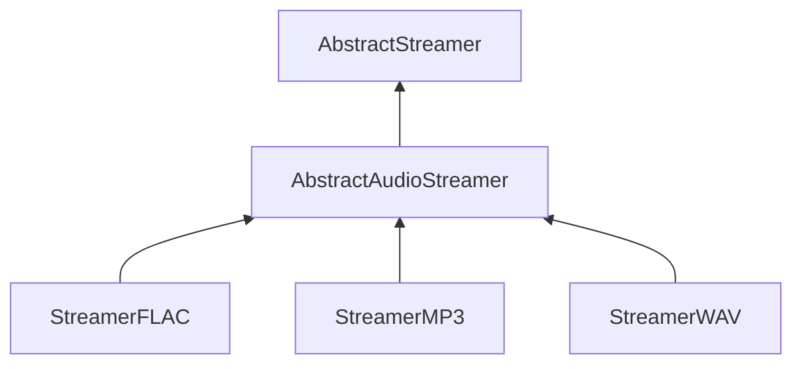

| public | abstract |
{:.api_label}

#### Inheritance Graph

## Description

Interface for classes that are capable of converting between audio data and streams.

## Public Functions

|
| ------: | ----------------- |
|  | |
|  | **[~AbstractAudioStreamer](#classSound_1_1AbstractAudioStreamer_1adbf490e6c7ca0ed8f0058bb2f0284aa7)**() |
|  | |
| [Util::Reference](classUtil_1_1Reference) < [Buffer](classSound_1_1Buffer) > | **[loadAudio](#classSound_1_1AbstractAudioStreamer_1ab1f85df371d4c5a471931dfd5870cc5e)**(std::istream & void) |
{: .nohead .nowrap1 .api_section }

## Protected Functions

|
| ------: | ----------------- |
|  | |
|  | **[AbstractAudioStreamer](#classSound_1_1AbstractAudioStreamer_1a698fa34761ef49fdc5700b9c45594a35)**()   Creation is only possible in subclasses. |
{: .nohead .nowrap1 .api_section }

-------------------------------------------------------------------

## Documentation

### <small>function</small>  Sound::AbstractAudioStreamer::~AbstractAudioStreamer {#classSound_1_1AbstractAudioStreamer_1adbf490e6c7ca0ed8f0058bb2f0284aa7}

| public | inline | virtual |
{:.api_label}

|
| ------: | ----------------- |
|  |
|  **[~AbstractAudioStreamer](#classSound_1_1AbstractAudioStreamer_1adbf490e6c7ca0ed8f0058bb2f0284aa7)**( |  ) |
{: .nohead .nowrap1 .api_doc }

Defined in `Sound/Serialization/AbstractAudioStreamer.h:27`{:style="float: right"}

-------------------------------------------------------------------

### <small>function</small>  Sound::AbstractAudioStreamer::loadAudio {#classSound_1_1AbstractAudioStreamer_1ab1f85df371d4c5a471931dfd5870cc5e}

| public | virtual |
{:.api_label}

|
| ------: | ----------------- |
|  |
| [Util::Reference](classUtil_1_1Reference) < [Buffer](classSound_1_1Buffer) > **[loadAudio](#classSound_1_1AbstractAudioStreamer_1ab1f85df371d4c5a471931dfd5870cc5e)**( | std::istream & | **void** ) |
{: .nohead .nowrap1 .api_doc }

Load audio data from the given stream.

#### Parameters
**input**
:  Use the data from the stream beginning at the preset position.

#### Returns
 [Buffer](classSound_1_1Buffer) object. The caller is responsible for the memory deallocation.

Defined in `Sound/Serialization/AbstractAudioStreamer.h:36`{:style="float: right"}

-------------------------------------------------------------------

### <small>function</small>  Sound::AbstractAudioStreamer::AbstractAudioStreamer {#classSound_1_1AbstractAudioStreamer_1a698fa34761ef49fdc5700b9c45594a35}

| protected | inline |
{:.api_label}

|
| ------: | ----------------- |
|  |
|  **[AbstractAudioStreamer](#classSound_1_1AbstractAudioStreamer_1a698fa34761ef49fdc5700b9c45594a35)**( |  ) |
{: .nohead .nowrap1 .api_doc }

Creation is only possible in subclasses.

Defined in `Sound/Serialization/AbstractAudioStreamer.h:40`{:style="float: right"}

-------------------------------------------------------------------

