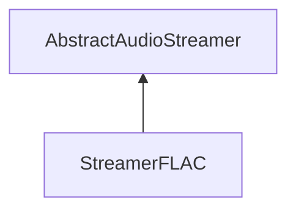

| public |
{:.api_label}

#### Inheritance Graph

## Description

## Public Functions

|
| ------: | ----------------- |
|  | |
|  | **[StreamerFLAC](#classSound_1_1StreamerFLAC_1a9cc34aeced5c93c26e557e5e67952afb)**() |
|  | |
|  | **[~StreamerFLAC](#classSound_1_1StreamerFLAC_1a54d654432fe2d47c6532ca3be30e0dde)**() |
|  | |
| [Util::Reference](classUtil_1_1Reference) < [Buffer](classSound_1_1Buffer) > | **[loadAudio](#classSound_1_1StreamerFLAC_1a525e8e2addb1e136e3545267a483cec8)**(std::istream & void) |
{: .nohead .nowrap1 .api_section }

## Public Static Functions

|
| ------: | ----------------- |
|  | |
| bool | **[init](#classSound_1_1StreamerFLAC_1aaeae2956b2e24f1af1a699cc8f7a9d16)**() |
{: .nohead .nowrap1 .api_section }

-------------------------------------------------------------------

## Documentation

### <small>function</small>  Sound::StreamerFLAC::StreamerFLAC {#classSound_1_1StreamerFLAC_1a9cc34aeced5c93c26e557e5e67952afb}

| public | inline |
{:.api_label}

|
| ------: | ----------------- |
|  |
|  **[StreamerFLAC](#classSound_1_1StreamerFLAC_1a9cc34aeced5c93c26e557e5e67952afb)**( |  ) |
{: .nohead .nowrap1 .api_doc }

Defined in `Sound/Serialization/StreamerFLAC.h:22`{:style="float: right"}

-------------------------------------------------------------------

### <small>function</small>  Sound::StreamerFLAC::~StreamerFLAC {#classSound_1_1StreamerFLAC_1a54d654432fe2d47c6532ca3be30e0dde}

| public | virtual |
{:.api_label}

|
| ------: | ----------------- |
|  |
|  **[~StreamerFLAC](#classSound_1_1StreamerFLAC_1a54d654432fe2d47c6532ca3be30e0dde)**( |  ) |
{: .nohead .nowrap1 .api_doc }

Defined in `Sound/Serialization/StreamerFLAC.h:23`{:style="float: right"}

-------------------------------------------------------------------

### <small>function</small>  Sound::StreamerFLAC::loadAudio {#classSound_1_1StreamerFLAC_1a525e8e2addb1e136e3545267a483cec8}

| public | virtual |
{:.api_label}

|
| ------: | ----------------- |
|  |
| [Util::Reference](classUtil_1_1Reference) < [Buffer](classSound_1_1Buffer) > **[loadAudio](#classSound_1_1StreamerFLAC_1a525e8e2addb1e136e3545267a483cec8)**( | std::istream & | **void** ) |
{: .nohead .nowrap1 .api_doc }

Load audio data from the given stream.

#### Parameters
**input**
:  Use the data from the stream beginning at the preset position.

#### Returns
 [Buffer](classSound_1_1Buffer) object. The caller is responsible for the memory deallocation.

Defined in `Sound/Serialization/StreamerFLAC.h:25`{:style="float: right"}

-------------------------------------------------------------------

### <small>function</small>  Sound::StreamerFLAC::init {#classSound_1_1StreamerFLAC_1aaeae2956b2e24f1af1a699cc8f7a9d16}

| public | static |
{:.api_label}

|
| ------: | ----------------- |
|  |
| bool **[init](#classSound_1_1StreamerFLAC_1aaeae2956b2e24f1af1a699cc8f7a9d16)**( |  ) |
{: .nohead .nowrap1 .api_doc }

Defined in `Sound/Serialization/StreamerFLAC.h:27`{:style="float: right"}

-------------------------------------------------------------------

