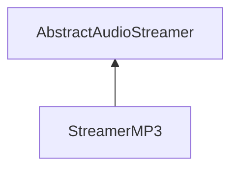

| public |
{:.api_label}

#### Inheritance Graph

## Description

## Public Functions

|
| ------: | ----------------- |
|  | |
|  | **[StreamerMP3](#classSound_1_1StreamerMP3_1a58d3af335d6c2c76cc842aa8ef3cf180)**() |
|  | |
|  | **[~StreamerMP3](#classSound_1_1StreamerMP3_1a16be0f304619e859919a4f4d287bb7a8)**() |
|  | |
| [Util::Reference](classUtil_1_1Reference) < [Buffer](classSound_1_1Buffer) > | **[loadAudio](#classSound_1_1StreamerMP3_1a2c35c48fabfb9409698b435c2c76ef03)**(std::istream & void) |
{: .nohead .nowrap1 .api_section }

## Public Static Functions

|
| ------: | ----------------- |
|  | |
| bool | **[init](#classSound_1_1StreamerMP3_1a9498189544a7e7215d5f56f2bc42fa5d)**() |
{: .nohead .nowrap1 .api_section }

-------------------------------------------------------------------

## Documentation

### <small>function</small>  Sound::StreamerMP3::StreamerMP3 {#classSound_1_1StreamerMP3_1a58d3af335d6c2c76cc842aa8ef3cf180}

| public | inline |
{:.api_label}

|
| ------: | ----------------- |
|  |
|  **[StreamerMP3](#classSound_1_1StreamerMP3_1a58d3af335d6c2c76cc842aa8ef3cf180)**( |  ) |
{: .nohead .nowrap1 .api_doc }

Defined in `Sound/Serialization/StreamerMP3.h:22`{:style="float: right"}

-------------------------------------------------------------------

### <small>function</small>  Sound::StreamerMP3::~StreamerMP3 {#classSound_1_1StreamerMP3_1a16be0f304619e859919a4f4d287bb7a8}

| public | virtual |
{:.api_label}

|
| ------: | ----------------- |
|  |
|  **[~StreamerMP3](#classSound_1_1StreamerMP3_1a16be0f304619e859919a4f4d287bb7a8)**( |  ) |
{: .nohead .nowrap1 .api_doc }

Defined in `Sound/Serialization/StreamerMP3.h:23`{:style="float: right"}

-------------------------------------------------------------------

### <small>function</small>  Sound::StreamerMP3::loadAudio {#classSound_1_1StreamerMP3_1a2c35c48fabfb9409698b435c2c76ef03}

| public | virtual |
{:.api_label}

|
| ------: | ----------------- |
|  |
| [Util::Reference](classUtil_1_1Reference) < [Buffer](classSound_1_1Buffer) > **[loadAudio](#classSound_1_1StreamerMP3_1a2c35c48fabfb9409698b435c2c76ef03)**( | std::istream & | **void** ) |
{: .nohead .nowrap1 .api_doc }

Load audio data from the given stream.

#### Parameters
**input**
:  Use the data from the stream beginning at the preset position.

#### Returns
 [Buffer](classSound_1_1Buffer) object. The caller is responsible for the memory deallocation.

Defined in `Sound/Serialization/StreamerMP3.h:25`{:style="float: right"}

-------------------------------------------------------------------

### <small>function</small>  Sound::StreamerMP3::init {#classSound_1_1StreamerMP3_1a9498189544a7e7215d5f56f2bc42fa5d}

| public | static |
{:.api_label}

|
| ------: | ----------------- |
|  |
| bool **[init](#classSound_1_1StreamerMP3_1a9498189544a7e7215d5f56f2bc42fa5d)**( |  ) |
{: .nohead .nowrap1 .api_doc }

Defined in `Sound/Serialization/StreamerMP3.h:27`{:style="float: right"}

-------------------------------------------------------------------

