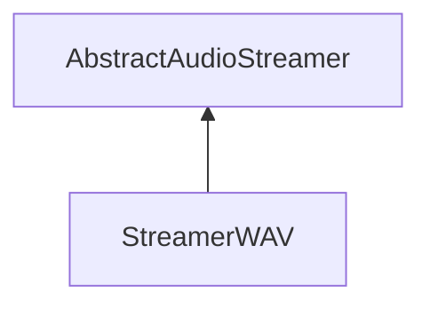

| public |
{:.api_label}

#### Inheritance Graph

## Description

## Public Functions

|
| ------: | ----------------- |
|  | |
|  | **[StreamerWAV](#classSound_1_1StreamerWAV_1a05acbb96ce35133fff7e5f90231f8078)**() |
|  | |
|  | **[~StreamerWAV](#classSound_1_1StreamerWAV_1a1b9f7a14be5c37d7668bfb90630179a6)**() |
|  | |
| [Util::Reference](classUtil_1_1Reference) < [Buffer](classSound_1_1Buffer) > | **[loadAudio](#classSound_1_1StreamerWAV_1a32f53514563b451d50bb7419b3dc8cc6)**(std::istream & void) |
{: .nohead .nowrap1 .api_section }

## Public Static Functions

|
| ------: | ----------------- |
|  | |
| bool | **[init](#classSound_1_1StreamerWAV_1a0174a60fef1eff0dc7d60159071e7a5d)**() |
{: .nohead .nowrap1 .api_section }

-------------------------------------------------------------------

## Documentation

### <small>function</small>  Sound::StreamerWAV::StreamerWAV {#classSound_1_1StreamerWAV_1a05acbb96ce35133fff7e5f90231f8078}

| public | inline |
{:.api_label}

|
| ------: | ----------------- |
|  |
|  **[StreamerWAV](#classSound_1_1StreamerWAV_1a05acbb96ce35133fff7e5f90231f8078)**( |  ) |
{: .nohead .nowrap1 .api_doc }

Defined in `Sound/Serialization/StreamerWAV.h:22`{:style="float: right"}

-------------------------------------------------------------------

### <small>function</small>  Sound::StreamerWAV::~StreamerWAV {#classSound_1_1StreamerWAV_1a1b9f7a14be5c37d7668bfb90630179a6}

| public | virtual |
{:.api_label}

|
| ------: | ----------------- |
|  |
|  **[~StreamerWAV](#classSound_1_1StreamerWAV_1a1b9f7a14be5c37d7668bfb90630179a6)**( |  ) |
{: .nohead .nowrap1 .api_doc }

Defined in `Sound/Serialization/StreamerWAV.h:23`{:style="float: right"}

-------------------------------------------------------------------

### <small>function</small>  Sound::StreamerWAV::loadAudio {#classSound_1_1StreamerWAV_1a32f53514563b451d50bb7419b3dc8cc6}

| public | virtual |
{:.api_label}

|
| ------: | ----------------- |
|  |
| [Util::Reference](classUtil_1_1Reference) < [Buffer](classSound_1_1Buffer) > **[loadAudio](#classSound_1_1StreamerWAV_1a32f53514563b451d50bb7419b3dc8cc6)**( | std::istream & | **void** ) |
{: .nohead .nowrap1 .api_doc }

Load audio data from the given stream.

#### Parameters
**input**
:  Use the data from the stream beginning at the preset position.

#### Returns
 [Buffer](classSound_1_1Buffer) object. The caller is responsible for the memory deallocation.

Defined in `Sound/Serialization/StreamerWAV.h:25`{:style="float: right"}

-------------------------------------------------------------------

### <small>function</small>  Sound::StreamerWAV::init {#classSound_1_1StreamerWAV_1a0174a60fef1eff0dc7d60159071e7a5d}

| public | static |
{:.api_label}

|
| ------: | ----------------- |
|  |
| bool **[init](#classSound_1_1StreamerWAV_1a0174a60fef1eff0dc7d60159071e7a5d)**( |  ) |
{: .nohead .nowrap1 .api_doc }

Defined in `Sound/Serialization/StreamerWAV.h:27`{:style="float: right"}

-------------------------------------------------------------------

