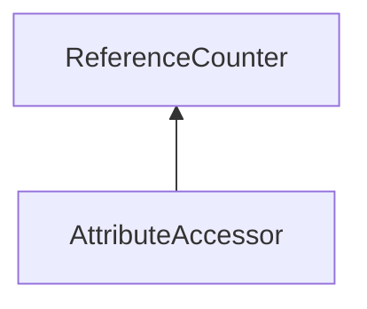

| public | abstract |
{:.api_label}

#### Inheritance Graph

## Description

 [AttributeAccessor](classUtil_1_1AttributeAccessor)  [Generic](classUtil_1_1Generic) accessor for attributes of a resource format.

## Protected Functions

|
| ------: | ----------------- |
|  | |
|  | **[AttributeAccessor](#classUtil_1_1AttributeAccessor_1a2d097686f574832072b298f5a5a716f7)**(uint8_t * ptr, size_t size, const [ResourceFormat::Attribute](classUtil_1_1ResourceFormat#classUtil_1_1ResourceFormat_1a6420883062ceced01731fe5b078be93f) & attr, size_t stride) |
|  | |
| void | **[assertRange](#classUtil_1_1AttributeAccessor_1ab1e61d86c5374f04466524852e51fca0)**(uint32_t index) const |
{: .nohead .nowrap1 .api_section }

## Public Functions

|
| ------: | ----------------- |
|  | |
|  | **[~AttributeAccessor](#classUtil_1_1AttributeAccessor_1a93ca7af83d1d27faec59dcc4c3cf4c6e)**() |
|  | |
| void | **[readValues](#classUtil_1_1AttributeAccessor_1a73cb8899bfd53743bc064b0da51260bc)**(size_t index, int8_t * values, size_t count) const |
|  | |
| void | **[readValues](#classUtil_1_1AttributeAccessor_1a8442e27059c517c029a65dc973a369d1)**(size_t index, int16_t * values, size_t count) const |
|  | |
| void | **[readValues](#classUtil_1_1AttributeAccessor_1a5069c23e85cd2c9b9dd7b6aeaa8f5e84)**(size_t index, int32_t * values, size_t count) const |
|  | |
| void | **[readValues](#classUtil_1_1AttributeAccessor_1a91610a2fcd7ce243e7682fce9a2099b0)**(size_t index, int64_t * values, size_t count) const |
|  | |
| void | **[readValues](#classUtil_1_1AttributeAccessor_1a27290151102fb1745cac073c2fa8ec6d)**(size_t index, uint8_t * values, size_t count) const |
|  | |
| void | **[readValues](#classUtil_1_1AttributeAccessor_1a2b8bc96e32837c0635df2a1c03ea3f87)**(size_t index, uint16_t * values, size_t count) const |
|  | |
| void | **[readValues](#classUtil_1_1AttributeAccessor_1a3099adf4b247646cdc6434e665837166)**(size_t index, uint32_t * values, size_t count) const |
|  | |
| void | **[readValues](#classUtil_1_1AttributeAccessor_1a4b688fef6d22aace425b7b26c6401365)**(size_t index, uint64_t * values, size_t count) const |
|  | |
| void | **[readValues](#classUtil_1_1AttributeAccessor_1ae7517a57212a15d82f6a6ddcdde17bce)**(size_t index, float * values, size_t count) const |
|  | |
| void | **[readValues](#classUtil_1_1AttributeAccessor_1af276589b0ddce2f558d872cf16b236f9)**(size_t index, double * values, size_t count) const |
| template< typename T  >  | |
| T | **[readValue](#classUtil_1_1AttributeAccessor_1a2f5f4bb6cc55affdfa9ee0d72f90b2a7)**(size_t index) |
| template< typename T  >  | |
| std::vector< T > | **[readValues](#classUtil_1_1AttributeAccessor_1ad3ddb46eec451e1c6dbd5c67aea56013)**(size_t index) |
|  | |
| void | **[writeValues](#classUtil_1_1AttributeAccessor_1affed5bf45c2eea933e6b42949bb3c02b)**(size_t index, const int8_t * values, size_t count) const |
|  | |
| void | **[writeValues](#classUtil_1_1AttributeAccessor_1aff0e4b981f62a3d0c20bd091221a44d7)**(size_t index, const int16_t * values, size_t count) const |
|  | |
| void | **[writeValues](#classUtil_1_1AttributeAccessor_1aaadd5b73dffb38c37db0d5548a3dea10)**(size_t index, const int32_t * values, size_t count) const |
|  | |
| void | **[writeValues](#classUtil_1_1AttributeAccessor_1a86562eb21911529d354a9058a42fe6bb)**(size_t index, const int64_t * values, size_t count) const |
|  | |
| void | **[writeValues](#classUtil_1_1AttributeAccessor_1a3fab573d2d444ee0c65cf08b232365e1)**(size_t index, const uint8_t * values, size_t count) const |
|  | |
| void | **[writeValues](#classUtil_1_1AttributeAccessor_1adad96f0d1ed66d9f7b72cad5ea02eb78)**(size_t index, const uint16_t * values, size_t count) const |
|  | |
| void | **[writeValues](#classUtil_1_1AttributeAccessor_1a37af35c6c51518b1c2fe96b1785f7db1)**(size_t index, const uint32_t * values, size_t count) const |
|  | |
| void | **[writeValues](#classUtil_1_1AttributeAccessor_1ad86ba153df235aad4c153e01264a3be0)**(size_t index, const uint64_t * values, size_t count) const |
|  | |
| void | **[writeValues](#classUtil_1_1AttributeAccessor_1a276da352567c6b41edd11a14758a7e2b)**(size_t index, const float * values, size_t count) const |
|  | |
| void | **[writeValues](#classUtil_1_1AttributeAccessor_1ad496483dde5694e66384d99095c796fd)**(size_t index, const double * values, size_t count) const |
| template< typename T  >  | |
| void | **[writeValue](#classUtil_1_1AttributeAccessor_1ac50f8dfd7088b5ce0619a8b856eaee8d)**(size_t index, const T & value) |
| template< typename T  >  | |
| void | **[writeValues](#classUtil_1_1AttributeAccessor_1a49cc3f0e2e28cf1f08637fff2e58ffdf)**(size_t index, const std::vector< T > & values) |
|  | |
| const [ResourceFormat::Attribute](classUtil_1_1ResourceFormat#classUtil_1_1ResourceFormat_1a6420883062ceced01731fe5b078be93f) & | **[getAttribute](#classUtil_1_1AttributeAccessor_1adbb712320bdf8ee664acf37d333d0735)**() const |
| template< typename number_t  >  | |
| number_t * | **[_ptr](#classUtil_1_1AttributeAccessor_1a45d7761e14f8072869cf2f20b5a99dd9)**(size_t index) const |
{: .nohead .nowrap1 .api_section }

## Public Static Functions

|
| ------: | ----------------- |
|  | |
| [Reference](classUtil_1_1Reference) < [AttributeAccessor](classUtil_1_1AttributeAccessor) > | **[create](#classUtil_1_1AttributeAccessor_1a13716041093c9a10c3f60aa226bbbe24)**(uint8_t * ptr, size_t size, const [ResourceFormat::Attribute](classUtil_1_1ResourceFormat#classUtil_1_1ResourceFormat_1a6420883062ceced01731fe5b078be93f) & attr, size_t stride) |
|  | |
| [Reference](classUtil_1_1Reference) < [AttributeAccessor](classUtil_1_1AttributeAccessor) > | **[create](#classUtil_1_1AttributeAccessor_1aad71ddb0cfcaffc0ee1f8657c88d8e73)**(uint8_t * ptr, size_t size, const [ResourceFormat](classUtil_1_1ResourceFormat) & format, const [StringIdentifier](classUtil_1_1StringIdentifier) & name) |
{: .nohead .nowrap1 .api_section }

-------------------------------------------------------------------

## Documentation

### <small>function</small>  Util::AttributeAccessor::AttributeAccessor {#classUtil_1_1AttributeAccessor_1a2d097686f574832072b298f5a5a716f7}

| protected | inline |
{:.api_label}

|
| ------: | ----------------- |
|  |
|  **[AttributeAccessor](#classUtil_1_1AttributeAccessor_1a2d097686f574832072b298f5a5a716f7)**( | uint8_t * | **ptr**, |
| | size_t | **size**, |
| | const [ResourceFormat::Attribute](classUtil_1_1ResourceFormat#classUtil_1_1ResourceFormat_1a6420883062ceced01731fe5b078be93f) & | **attr**, |
| | size_t | **stride** |
|   ) |
{: .nohead .nowrap1 .api_doc }

Defined in `Util/Resources/AttributeAccessor.h:28`{:style="float: right"}

-------------------------------------------------------------------

### <small>function</small>  Util::AttributeAccessor::assertRange {#classUtil_1_1AttributeAccessor_1ab1e61d86c5374f04466524852e51fca0}

| protected | const | inline |
{:.api_label}

|
| ------: | ----------------- |
|  |
| void **[assertRange](#classUtil_1_1AttributeAccessor_1ab1e61d86c5374f04466524852e51fca0)**( | uint32_t | **index** ) const |
{: .nohead .nowrap1 .api_doc }

Defined in `Util/Resources/AttributeAccessor.h:31`{:style="float: right"}

-------------------------------------------------------------------

### <small>function</small>  Util::AttributeAccessor::~AttributeAccessor {#classUtil_1_1AttributeAccessor_1a93ca7af83d1d27faec59dcc4c3cf4c6e}

| public | virtual |
{:.api_label}

|
| ------: | ----------------- |
|  |
|  **[~AttributeAccessor](#classUtil_1_1AttributeAccessor_1a93ca7af83d1d27faec59dcc4c3cf4c6e)**( |  ) |
{: .nohead .nowrap1 .api_doc }

Defined in `Util/Resources/AttributeAccessor.h:33`{:style="float: right"}

-------------------------------------------------------------------

### <small>function</small>  Util::AttributeAccessor::readValues {#classUtil_1_1AttributeAccessor_1a73cb8899bfd53743bc064b0da51260bc}

| public | const | virtual |
{:.api_label}

|
| ------: | ----------------- |
|  |
| void **[readValues](#classUtil_1_1AttributeAccessor_1a73cb8899bfd53743bc064b0da51260bc)**( | size_t | **index**, |
| | int8_t * | **values**, |
| | size_t | **count** |
|   ) const |
{: .nohead .nowrap1 .api_doc }

Defined in `Util/Resources/AttributeAccessor.h:46`{:style="float: right"}

-------------------------------------------------------------------

### <small>function</small>  Util::AttributeAccessor::readValues {#classUtil_1_1AttributeAccessor_1a8442e27059c517c029a65dc973a369d1}

| public | const | virtual |
{:.api_label}

|
| ------: | ----------------- |
|  |
| void **[readValues](#classUtil_1_1AttributeAccessor_1a8442e27059c517c029a65dc973a369d1)**( | size_t | **index**, |
| | int16_t * | **values**, |
| | size_t | **count** |
|   ) const |
{: .nohead .nowrap1 .api_doc }

Defined in `Util/Resources/AttributeAccessor.h:47`{:style="float: right"}

-------------------------------------------------------------------

### <small>function</small>  Util::AttributeAccessor::readValues {#classUtil_1_1AttributeAccessor_1a5069c23e85cd2c9b9dd7b6aeaa8f5e84}

| public | const | virtual |
{:.api_label}

|
| ------: | ----------------- |
|  |
| void **[readValues](#classUtil_1_1AttributeAccessor_1a5069c23e85cd2c9b9dd7b6aeaa8f5e84)**( | size_t | **index**, |
| | int32_t * | **values**, |
| | size_t | **count** |
|   ) const |
{: .nohead .nowrap1 .api_doc }

Defined in `Util/Resources/AttributeAccessor.h:48`{:style="float: right"}

-------------------------------------------------------------------

### <small>function</small>  Util::AttributeAccessor::readValues {#classUtil_1_1AttributeAccessor_1a91610a2fcd7ce243e7682fce9a2099b0}

| public | const | virtual |
{:.api_label}

|
| ------: | ----------------- |
|  |
| void **[readValues](#classUtil_1_1AttributeAccessor_1a91610a2fcd7ce243e7682fce9a2099b0)**( | size_t | **index**, |
| | int64_t * | **values**, |
| | size_t | **count** |
|   ) const |
{: .nohead .nowrap1 .api_doc }

Defined in `Util/Resources/AttributeAccessor.h:49`{:style="float: right"}

-------------------------------------------------------------------

### <small>function</small>  Util::AttributeAccessor::readValues {#classUtil_1_1AttributeAccessor_1a27290151102fb1745cac073c2fa8ec6d}

| public | const | virtual |
{:.api_label}

|
| ------: | ----------------- |
|  |
| void **[readValues](#classUtil_1_1AttributeAccessor_1a27290151102fb1745cac073c2fa8ec6d)**( | size_t | **index**, |
| | uint8_t * | **values**, |
| | size_t | **count** |
|   ) const |
{: .nohead .nowrap1 .api_doc }

Defined in `Util/Resources/AttributeAccessor.h:50`{:style="float: right"}

-------------------------------------------------------------------

### <small>function</small>  Util::AttributeAccessor::readValues {#classUtil_1_1AttributeAccessor_1a2b8bc96e32837c0635df2a1c03ea3f87}

| public | const | virtual |
{:.api_label}

|
| ------: | ----------------- |
|  |
| void **[readValues](#classUtil_1_1AttributeAccessor_1a2b8bc96e32837c0635df2a1c03ea3f87)**( | size_t | **index**, |
| | uint16_t * | **values**, |
| | size_t | **count** |
|   ) const |
{: .nohead .nowrap1 .api_doc }

Defined in `Util/Resources/AttributeAccessor.h:51`{:style="float: right"}

-------------------------------------------------------------------

### <small>function</small>  Util::AttributeAccessor::readValues {#classUtil_1_1AttributeAccessor_1a3099adf4b247646cdc6434e665837166}

| public | const | virtual |
{:.api_label}

|
| ------: | ----------------- |
|  |
| void **[readValues](#classUtil_1_1AttributeAccessor_1a3099adf4b247646cdc6434e665837166)**( | size_t | **index**, |
| | uint32_t * | **values**, |
| | size_t | **count** |
|   ) const |
{: .nohead .nowrap1 .api_doc }

Defined in `Util/Resources/AttributeAccessor.h:52`{:style="float: right"}

-------------------------------------------------------------------

### <small>function</small>  Util::AttributeAccessor::readValues {#classUtil_1_1AttributeAccessor_1a4b688fef6d22aace425b7b26c6401365}

| public | const | virtual |
{:.api_label}

|
| ------: | ----------------- |
|  |
| void **[readValues](#classUtil_1_1AttributeAccessor_1a4b688fef6d22aace425b7b26c6401365)**( | size_t | **index**, |
| | uint64_t * | **values**, |
| | size_t | **count** |
|   ) const |
{: .nohead .nowrap1 .api_doc }

Defined in `Util/Resources/AttributeAccessor.h:53`{:style="float: right"}

-------------------------------------------------------------------

### <small>function</small>  Util::AttributeAccessor::readValues {#classUtil_1_1AttributeAccessor_1ae7517a57212a15d82f6a6ddcdde17bce}

| public | const | virtual |
{:.api_label}

|
| ------: | ----------------- |
|  |
| void **[readValues](#classUtil_1_1AttributeAccessor_1ae7517a57212a15d82f6a6ddcdde17bce)**( | size_t | **index**, |
| | float * | **values**, |
| | size_t | **count** |
|   ) const |
{: .nohead .nowrap1 .api_doc }

Defined in `Util/Resources/AttributeAccessor.h:54`{:style="float: right"}

-------------------------------------------------------------------

### <small>function</small>  Util::AttributeAccessor::readValues {#classUtil_1_1AttributeAccessor_1af276589b0ddce2f558d872cf16b236f9}

| public | const | virtual |
{:.api_label}

|
| ------: | ----------------- |
|  |
| void **[readValues](#classUtil_1_1AttributeAccessor_1af276589b0ddce2f558d872cf16b236f9)**( | size_t | **index**, |
| | double * | **values**, |
| | size_t | **count** |
|   ) const |
{: .nohead .nowrap1 .api_doc }

Defined in `Util/Resources/AttributeAccessor.h:55`{:style="float: right"}

-------------------------------------------------------------------

### <small>function</small>  Util::AttributeAccessor::readValue {#classUtil_1_1AttributeAccessor_1a2f5f4bb6cc55affdfa9ee0d72f90b2a7}

| public | inline |
{:.api_label}

|
| ------: | ----------------- |
| template< typename T  > |
| T **[readValue](#classUtil_1_1AttributeAccessor_1a2f5f4bb6cc55affdfa9ee0d72f90b2a7)**( | size_t | **index** ) |
{: .nohead .nowrap1 .api_doc }

Reads a single value of any primitive type from the resource, starting at the given index. The value is internally converted to the correct type.

Defined in `Util/Resources/AttributeAccessor.h:62`{:style="float: right"}

-------------------------------------------------------------------

### <small>function</small>  Util::AttributeAccessor::readValues {#classUtil_1_1AttributeAccessor_1ad3ddb46eec451e1c6dbd5c67aea56013}

| public | inline |
{:.api_label}

|
| ------: | ----------------- |
| template< typename T  > |
| std::vector< T > **[readValues](#classUtil_1_1AttributeAccessor_1ad3ddb46eec451e1c6dbd5c67aea56013)**( | size_t | **index** ) |
{: .nohead .nowrap1 .api_doc }

Reads multiple values of any primitive type from the resource, starting at the given index. The values are internally converted to the correct type.

Defined in `Util/Resources/AttributeAccessor.h:73`{:style="float: right"}

-------------------------------------------------------------------

### <small>function</small>  Util::AttributeAccessor::writeValues {#classUtil_1_1AttributeAccessor_1affed5bf45c2eea933e6b42949bb3c02b}

| public | const | virtual |
{:.api_label}

|
| ------: | ----------------- |
|  |
| void **[writeValues](#classUtil_1_1AttributeAccessor_1affed5bf45c2eea933e6b42949bb3c02b)**( | size_t | **index**, |
| | const int8_t * | **values**, |
| | size_t | **count** |
|   ) const |
{: .nohead .nowrap1 .api_doc }

Defined in `Util/Resources/AttributeAccessor.h:79`{:style="float: right"}

-------------------------------------------------------------------

### <small>function</small>  Util::AttributeAccessor::writeValues {#classUtil_1_1AttributeAccessor_1aff0e4b981f62a3d0c20bd091221a44d7}

| public | const | virtual |
{:.api_label}

|
| ------: | ----------------- |
|  |
| void **[writeValues](#classUtil_1_1AttributeAccessor_1aff0e4b981f62a3d0c20bd091221a44d7)**( | size_t | **index**, |
| | const int16_t * | **values**, |
| | size_t | **count** |
|   ) const |
{: .nohead .nowrap1 .api_doc }

Defined in `Util/Resources/AttributeAccessor.h:80`{:style="float: right"}

-------------------------------------------------------------------

### <small>function</small>  Util::AttributeAccessor::writeValues {#classUtil_1_1AttributeAccessor_1aaadd5b73dffb38c37db0d5548a3dea10}

| public | const | virtual |
{:.api_label}

|
| ------: | ----------------- |
|  |
| void **[writeValues](#classUtil_1_1AttributeAccessor_1aaadd5b73dffb38c37db0d5548a3dea10)**( | size_t | **index**, |
| | const int32_t * | **values**, |
| | size_t | **count** |
|   ) const |
{: .nohead .nowrap1 .api_doc }

Defined in `Util/Resources/AttributeAccessor.h:81`{:style="float: right"}

-------------------------------------------------------------------

### <small>function</small>  Util::AttributeAccessor::writeValues {#classUtil_1_1AttributeAccessor_1a86562eb21911529d354a9058a42fe6bb}

| public | const | virtual |
{:.api_label}

|
| ------: | ----------------- |
|  |
| void **[writeValues](#classUtil_1_1AttributeAccessor_1a86562eb21911529d354a9058a42fe6bb)**( | size_t | **index**, |
| | const int64_t * | **values**, |
| | size_t | **count** |
|   ) const |
{: .nohead .nowrap1 .api_doc }

Defined in `Util/Resources/AttributeAccessor.h:82`{:style="float: right"}

-------------------------------------------------------------------

### <small>function</small>  Util::AttributeAccessor::writeValues {#classUtil_1_1AttributeAccessor_1a3fab573d2d444ee0c65cf08b232365e1}

| public | const | virtual |
{:.api_label}

|
| ------: | ----------------- |
|  |
| void **[writeValues](#classUtil_1_1AttributeAccessor_1a3fab573d2d444ee0c65cf08b232365e1)**( | size_t | **index**, |
| | const uint8_t * | **values**, |
| | size_t | **count** |
|   ) const |
{: .nohead .nowrap1 .api_doc }

Defined in `Util/Resources/AttributeAccessor.h:83`{:style="float: right"}

-------------------------------------------------------------------

### <small>function</small>  Util::AttributeAccessor::writeValues {#classUtil_1_1AttributeAccessor_1adad96f0d1ed66d9f7b72cad5ea02eb78}

| public | const | virtual |
{:.api_label}

|
| ------: | ----------------- |
|  |
| void **[writeValues](#classUtil_1_1AttributeAccessor_1adad96f0d1ed66d9f7b72cad5ea02eb78)**( | size_t | **index**, |
| | const uint16_t * | **values**, |
| | size_t | **count** |
|   ) const |
{: .nohead .nowrap1 .api_doc }

Defined in `Util/Resources/AttributeAccessor.h:84`{:style="float: right"}

-------------------------------------------------------------------

### <small>function</small>  Util::AttributeAccessor::writeValues {#classUtil_1_1AttributeAccessor_1a37af35c6c51518b1c2fe96b1785f7db1}

| public | const | virtual |
{:.api_label}

|
| ------: | ----------------- |
|  |
| void **[writeValues](#classUtil_1_1AttributeAccessor_1a37af35c6c51518b1c2fe96b1785f7db1)**( | size_t | **index**, |
| | const uint32_t * | **values**, |
| | size_t | **count** |
|   ) const |
{: .nohead .nowrap1 .api_doc }

Defined in `Util/Resources/AttributeAccessor.h:85`{:style="float: right"}

-------------------------------------------------------------------

### <small>function</small>  Util::AttributeAccessor::writeValues {#classUtil_1_1AttributeAccessor_1ad86ba153df235aad4c153e01264a3be0}

| public | const | virtual |
{:.api_label}

|
| ------: | ----------------- |
|  |
| void **[writeValues](#classUtil_1_1AttributeAccessor_1ad86ba153df235aad4c153e01264a3be0)**( | size_t | **index**, |
| | const uint64_t * | **values**, |
| | size_t | **count** |
|   ) const |
{: .nohead .nowrap1 .api_doc }

Defined in `Util/Resources/AttributeAccessor.h:86`{:style="float: right"}

-------------------------------------------------------------------

### <small>function</small>  Util::AttributeAccessor::writeValues {#classUtil_1_1AttributeAccessor_1a276da352567c6b41edd11a14758a7e2b}

| public | const | virtual |
{:.api_label}

|
| ------: | ----------------- |
|  |
| void **[writeValues](#classUtil_1_1AttributeAccessor_1a276da352567c6b41edd11a14758a7e2b)**( | size_t | **index**, |
| | const float * | **values**, |
| | size_t | **count** |
|   ) const |
{: .nohead .nowrap1 .api_doc }

Defined in `Util/Resources/AttributeAccessor.h:87`{:style="float: right"}

-------------------------------------------------------------------

### <small>function</small>  Util::AttributeAccessor::writeValues {#classUtil_1_1AttributeAccessor_1ad496483dde5694e66384d99095c796fd}

| public | const | virtual |
{:.api_label}

|
| ------: | ----------------- |
|  |
| void **[writeValues](#classUtil_1_1AttributeAccessor_1ad496483dde5694e66384d99095c796fd)**( | size_t | **index**, |
| | const double * | **values**, |
| | size_t | **count** |
|   ) const |
{: .nohead .nowrap1 .api_doc }

Defined in `Util/Resources/AttributeAccessor.h:88`{:style="float: right"}

-------------------------------------------------------------------

### <small>function</small>  Util::AttributeAccessor::writeValue {#classUtil_1_1AttributeAccessor_1ac50f8dfd7088b5ce0619a8b856eaee8d}

| public | inline |
{:.api_label}

|
| ------: | ----------------- |
| template< typename T  > |
| void **[writeValue](#classUtil_1_1AttributeAccessor_1ac50f8dfd7088b5ce0619a8b856eaee8d)**( | size_t | **index**, |
| | const T & | **value** |
|   ) |
{: .nohead .nowrap1 .api_doc }

Writes a single value of any primitive type into the resource, starting at the given index. The value is internally converted to the correct type.

Defined in `Util/Resources/AttributeAccessor.h:95`{:style="float: right"}

-------------------------------------------------------------------

### <small>function</small>  Util::AttributeAccessor::writeValues {#classUtil_1_1AttributeAccessor_1a49cc3f0e2e28cf1f08637fff2e58ffdf}

| public | inline |
{:.api_label}

|
| ------: | ----------------- |
| template< typename T  > |
| void **[writeValues](#classUtil_1_1AttributeAccessor_1a49cc3f0e2e28cf1f08637fff2e58ffdf)**( | size_t | **index**, |
| | const std::vector< T > & | **values** |
|   ) |
{: .nohead .nowrap1 .api_doc }

Writes multiple values of any primitive type into the resource, starting at the given index. The values are internally converted to the correct type.

Defined in `Util/Resources/AttributeAccessor.h:104`{:style="float: right"}

-------------------------------------------------------------------

### <small>function</small>  Util::AttributeAccessor::getAttribute {#classUtil_1_1AttributeAccessor_1adbb712320bdf8ee664acf37d333d0735}

| public | const | inline |
{:.api_label}

|
| ------: | ----------------- |
|  |
| const [ResourceFormat::Attribute](classUtil_1_1ResourceFormat#classUtil_1_1ResourceFormat_1a6420883062ceced01731fe5b078be93f) & **[getAttribute](#classUtil_1_1AttributeAccessor_1adbb712320bdf8ee664acf37d333d0735)**( |  ) const |
{: .nohead .nowrap1 .api_doc }

Returns the resource format attribute this accessor is associated with.

Defined in `Util/Resources/AttributeAccessor.h:111`{:style="float: right"}

-------------------------------------------------------------------

### <small>function</small>  Util::AttributeAccessor::_ptr {#classUtil_1_1AttributeAccessor_1a45d7761e14f8072869cf2f20b5a99dd9}

| public | const | inline |
{:.api_label}

|
| ------: | ----------------- |
| template< typename number_t  > |
| number_t * **[_ptr](#classUtil_1_1AttributeAccessor_1a45d7761e14f8072869cf2f20b5a99dd9)**( | size_t | **index** ) const |
{: .nohead .nowrap1 .api_doc }

Returns the raw data pointer to the resource attribute at the given index.

Defined in `Util/Resources/AttributeAccessor.h:117`{:style="float: right"}

-------------------------------------------------------------------

### <small>function</small>  Util::AttributeAccessor::create {#classUtil_1_1AttributeAccessor_1a13716041093c9a10c3f60aa226bbbe24}

| public | static |
{:.api_label}

|
| ------: | ----------------- |
|  |
| [Reference](classUtil_1_1Reference) < [AttributeAccessor](classUtil_1_1AttributeAccessor) > **[create](#classUtil_1_1AttributeAccessor_1a13716041093c9a10c3f60aa226bbbe24)**( | uint8_t * | **ptr**, |
| | size_t | **size**, |
| | const [ResourceFormat::Attribute](classUtil_1_1ResourceFormat#classUtil_1_1ResourceFormat_1a6420883062ceced01731fe5b078be93f) & | **attr**, |
| | size_t | **stride** |
|   ) |
{: .nohead .nowrap1 .api_doc }

Creates a new attribute accessor for the given data using the specified resource format.

Defined in `Util/Resources/AttributeAccessor.h:38`{:style="float: right"}

-------------------------------------------------------------------

### <small>function</small>  Util::AttributeAccessor::create {#classUtil_1_1AttributeAccessor_1aad71ddb0cfcaffc0ee1f8657c88d8e73}

| public | static | inline |
{:.api_label}

|
| ------: | ----------------- |
|  |
| [Reference](classUtil_1_1Reference) < [AttributeAccessor](classUtil_1_1AttributeAccessor) > **[create](#classUtil_1_1AttributeAccessor_1aad71ddb0cfcaffc0ee1f8657c88d8e73)**( | uint8_t * | **ptr**, |
| | size_t | **size**, |
| | const [ResourceFormat](classUtil_1_1ResourceFormat) & | **format**, |
| | const [StringIdentifier](classUtil_1_1StringIdentifier) & | **name** |
|   ) |
{: .nohead .nowrap1 .api_doc }

Defined in `Util/Resources/AttributeAccessor.h:39`{:style="float: right"}

-------------------------------------------------------------------

