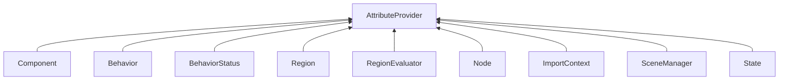

| public |
{:.api_label}

#### Inheritance Graph

## Description

Mixin class to provide a [GenericAttributeMap](classUtil_1_1GenericAttributeMap) including access functions for classes inheriting it. The map itself is created when the first attribute is added; so that the minimal memory overhead is of the size of a single pointer.

## Public Functions

|
| ------: | ----------------- |
|  | |
|  | **[AttributeProvider](#classUtil_1_1AttributeProvider_1a50fbd09b1533fc2d2e4b039d959c67ad)**() |
|  | |
|  | **[AttributeProvider](#classUtil_1_1AttributeProvider_1abf9e4e63d7cbf7996fe1705dd4cf8ddd)**(const [AttributeProvider](classUtil_1_1AttributeProvider) & other) |
|  | |
|  | **[AttributeProvider](#classUtil_1_1AttributeProvider_1a48b18764c6ed69e812c15b5b54c4690d)**( [AttributeProvider](classUtil_1_1AttributeProvider) && void) |
|  | |
| [AttributeProvider](classUtil_1_1AttributeProvider) & | **[operator=](#classUtil_1_1AttributeProvider_1a1d9e46cdc42fda5b44e9456948ab2ac6)**(const [AttributeProvider](classUtil_1_1AttributeProvider) & other) |
|  | |
| [AttributeProvider](classUtil_1_1AttributeProvider) & | **[operator=](#classUtil_1_1AttributeProvider_1ac4fffd1ec3d4ec6d3f23604f506daaa8)**( [AttributeProvider](classUtil_1_1AttributeProvider) && void) |
|  | |
|  | **[~AttributeProvider](#classUtil_1_1AttributeProvider_1a411d2f4005ebe32f1def517b5e96ebec)**() |
|  | |
| void | **[copyAttributesFrom](#classUtil_1_1AttributeProvider_1a3c2abb817e73d2f69346caa1ad04586e)**(const [AttributeProvider](classUtil_1_1AttributeProvider) & other) |
|  | |
| [GenericAttribute](classUtil_1_1GenericAttribute) * | **[getAttribute](#classUtil_1_1AttributeProvider_1a2c7059bff9d259da1b32101d66aec7f9)**(const [StringIdentifier](classUtil_1_1StringIdentifier) & key) const |
| template< class AttrType  >  | |
| AttrType * | **[getAttribute](#classUtil_1_1AttributeProvider_1ace67646097db5d0f91808150f7e4289e)**(const [StringIdentifier](classUtil_1_1StringIdentifier) & key) const |
|  | |
| [GenericAttributeMap](classUtil_1_1GenericAttributeMap) * | **[getAttributes](#classUtil_1_1AttributeProvider_1a2d95014a5e509879a09bdfb95b73d530)**() const |
|  | |
| bool | **[hasAttributes](#classUtil_1_1AttributeProvider_1a5faf059b1bb8d6a19235f6664f6a24c0)**() const |
|  | |
| bool | **[isAttributeSet](#classUtil_1_1AttributeProvider_1a94876f9371cb00413f76e6900a5309d4)**(const [StringIdentifier](classUtil_1_1StringIdentifier) & key) const |
|  | |
| void | **[removeAttributes](#classUtil_1_1AttributeProvider_1ad8ca5392db2a8b959b825e3f9db57087)**() |
|  | |
| void | **[setAttributes](#classUtil_1_1AttributeProvider_1aab94c6be34e571295bcce972fd8b7d93)**( [GenericAttributeMap](classUtil_1_1GenericAttributeMap) * newAttributes) |
|  | |
| void | **[setAttribute](#classUtil_1_1AttributeProvider_1a732cdd4eef8b78e5a635c319ce306f06)**(const [StringIdentifier](classUtil_1_1StringIdentifier) & key,  [GenericAttribute](classUtil_1_1GenericAttribute) * value) |
|  | |
| bool | **[unsetAttribute](#classUtil_1_1AttributeProvider_1a063ddf26f859803aa05be10246d531bf)**(const [StringIdentifier](classUtil_1_1StringIdentifier) & key) |
{: .nohead .nowrap1 .api_section }

-------------------------------------------------------------------

## Documentation

### <small>function</small>  Util::AttributeProvider::AttributeProvider {#classUtil_1_1AttributeProvider_1a50fbd09b1533fc2d2e4b039d959c67ad}

| public | inline |
{:.api_label}

|
| ------: | ----------------- |
|  |
|  **[AttributeProvider](#classUtil_1_1AttributeProvider_1a50fbd09b1533fc2d2e4b039d959c67ad)**( |  ) |
{: .nohead .nowrap1 .api_doc }

Defined in `Util/AttributeProvider.h:35`{:style="float: right"}

-------------------------------------------------------------------

### <small>function</small>  Util::AttributeProvider::AttributeProvider {#classUtil_1_1AttributeProvider_1abf9e4e63d7cbf7996fe1705dd4cf8ddd}

| public | inline |
{:.api_label}

|
| ------: | ----------------- |
|  |
|  **[AttributeProvider](#classUtil_1_1AttributeProvider_1abf9e4e63d7cbf7996fe1705dd4cf8ddd)**( | const [AttributeProvider](classUtil_1_1AttributeProvider) & | **other** ) |
{: .nohead .nowrap1 .api_doc }

Defined in `Util/AttributeProvider.h:37`{:style="float: right"}

-------------------------------------------------------------------

### <small>function</small>  Util::AttributeProvider::AttributeProvider {#classUtil_1_1AttributeProvider_1a48b18764c6ed69e812c15b5b54c4690d}

| public |
{:.api_label}

|
| ------: | ----------------- |
|  |
|  **[AttributeProvider](#classUtil_1_1AttributeProvider_1a48b18764c6ed69e812c15b5b54c4690d)**( |  [AttributeProvider](classUtil_1_1AttributeProvider) && | **void** ) |
{: .nohead .nowrap1 .api_doc }

Defined in `Util/AttributeProvider.h:40`{:style="float: right"}

-------------------------------------------------------------------

### <small>function</small>  Util::AttributeProvider::operator= {#classUtil_1_1AttributeProvider_1a1d9e46cdc42fda5b44e9456948ab2ac6}

| public | inline |
{:.api_label}

|
| ------: | ----------------- |
|  |
| [AttributeProvider](classUtil_1_1AttributeProvider) & **[operator=](#classUtil_1_1AttributeProvider_1a1d9e46cdc42fda5b44e9456948ab2ac6)**( | const [AttributeProvider](classUtil_1_1AttributeProvider) & | **other** ) |
{: .nohead .nowrap1 .api_doc }

Defined in `Util/AttributeProvider.h:41`{:style="float: right"}

-------------------------------------------------------------------

### <small>function</small>  Util::AttributeProvider::operator= {#classUtil_1_1AttributeProvider_1ac4fffd1ec3d4ec6d3f23604f506daaa8}

| public |
{:.api_label}

|
| ------: | ----------------- |
|  |
| [AttributeProvider](classUtil_1_1AttributeProvider) & **[operator=](#classUtil_1_1AttributeProvider_1ac4fffd1ec3d4ec6d3f23604f506daaa8)**( |  [AttributeProvider](classUtil_1_1AttributeProvider) && | **void** ) |
{: .nohead .nowrap1 .api_doc }

Defined in `Util/AttributeProvider.h:46`{:style="float: right"}

-------------------------------------------------------------------

### <small>function</small>  Util::AttributeProvider::~AttributeProvider {#classUtil_1_1AttributeProvider_1a411d2f4005ebe32f1def517b5e96ebec}

| public |
{:.api_label}

|
| ------: | ----------------- |
|  |
|  **[~AttributeProvider](#classUtil_1_1AttributeProvider_1a411d2f4005ebe32f1def517b5e96ebec)**( |  ) |
{: .nohead .nowrap1 .api_doc }

Defined in `Util/AttributeProvider.h:47`{:style="float: right"}

-------------------------------------------------------------------

### <small>function</small>  Util::AttributeProvider::copyAttributesFrom {#classUtil_1_1AttributeProvider_1a3c2abb817e73d2f69346caa1ad04586e}

| public | inline |
{:.api_label}

|
| ------: | ----------------- |
|  |
| void **[copyAttributesFrom](#classUtil_1_1AttributeProvider_1a3c2abb817e73d2f69346caa1ad04586e)**( | const [AttributeProvider](classUtil_1_1AttributeProvider) & | **other** ) |
{: .nohead .nowrap1 .api_doc }

Defined in `Util/AttributeProvider.h:49`{:style="float: right"}

-------------------------------------------------------------------

### <small>function</small>  Util::AttributeProvider::getAttribute {#classUtil_1_1AttributeProvider_1a2c7059bff9d259da1b32101d66aec7f9}

| public | const | inline |
{:.api_label}

|
| ------: | ----------------- |
|  |
| [GenericAttribute](classUtil_1_1GenericAttribute) * **[getAttribute](#classUtil_1_1AttributeProvider_1a2c7059bff9d259da1b32101d66aec7f9)**( | const [StringIdentifier](classUtil_1_1StringIdentifier) & | **key** ) const |
{: .nohead .nowrap1 .api_doc }

Defined in `Util/AttributeProvider.h:54`{:style="float: right"}

-------------------------------------------------------------------

### <small>function</small>  Util::AttributeProvider::getAttribute {#classUtil_1_1AttributeProvider_1ace67646097db5d0f91808150f7e4289e}

| public | const | inline |
{:.api_label}

|
| ------: | ----------------- |
| template< class AttrType  > |
| AttrType * **[getAttribute](#classUtil_1_1AttributeProvider_1ace67646097db5d0f91808150f7e4289e)**( | const [StringIdentifier](classUtil_1_1StringIdentifier) & | **key** ) const |
{: .nohead .nowrap1 .api_doc }

Defined in `Util/AttributeProvider.h:58`{:style="float: right"}

-------------------------------------------------------------------

### <small>function</small>  Util::AttributeProvider::getAttributes {#classUtil_1_1AttributeProvider_1a2d95014a5e509879a09bdfb95b73d530}

| public | const | inline |
{:.api_label}

|
| ------: | ----------------- |
|  |
| [GenericAttributeMap](classUtil_1_1GenericAttributeMap) * **[getAttributes](#classUtil_1_1AttributeProvider_1a2d95014a5e509879a09bdfb95b73d530)**( |  ) const |
{: .nohead .nowrap1 .api_doc }

Defined in `Util/AttributeProvider.h:61`{:style="float: right"}

-------------------------------------------------------------------

### <small>function</small>  Util::AttributeProvider::hasAttributes {#classUtil_1_1AttributeProvider_1a5faf059b1bb8d6a19235f6664f6a24c0}

| public | const | inline |
{:.api_label}

|
| ------: | ----------------- |
|  |
| bool **[hasAttributes](#classUtil_1_1AttributeProvider_1a5faf059b1bb8d6a19235f6664f6a24c0)**( |  ) const |
{: .nohead .nowrap1 .api_doc }

Defined in `Util/AttributeProvider.h:64`{:style="float: right"}

-------------------------------------------------------------------

### <small>function</small>  Util::AttributeProvider::isAttributeSet {#classUtil_1_1AttributeProvider_1a94876f9371cb00413f76e6900a5309d4}

| public | const | inline |
{:.api_label}

|
| ------: | ----------------- |
|  |
| bool **[isAttributeSet](#classUtil_1_1AttributeProvider_1a94876f9371cb00413f76e6900a5309d4)**( | const [StringIdentifier](classUtil_1_1StringIdentifier) & | **key** ) const |
{: .nohead .nowrap1 .api_doc }

Defined in `Util/AttributeProvider.h:67`{:style="float: right"}

-------------------------------------------------------------------

### <small>function</small>  Util::AttributeProvider::removeAttributes {#classUtil_1_1AttributeProvider_1ad8ca5392db2a8b959b825e3f9db57087}

| public | inline |
{:.api_label}

|
| ------: | ----------------- |
|  |
| void **[removeAttributes](#classUtil_1_1AttributeProvider_1ad8ca5392db2a8b959b825e3f9db57087)**( |  ) |
{: .nohead .nowrap1 .api_doc }

Defined in `Util/AttributeProvider.h:70`{:style="float: right"}

-------------------------------------------------------------------

### <small>function</small>  Util::AttributeProvider::setAttributes {#classUtil_1_1AttributeProvider_1aab94c6be34e571295bcce972fd8b7d93}

| public | inline |
{:.api_label}

|
| ------: | ----------------- |
|  |
| void **[setAttributes](#classUtil_1_1AttributeProvider_1aab94c6be34e571295bcce972fd8b7d93)**( |  [GenericAttributeMap](classUtil_1_1GenericAttributeMap) * | **newAttributes** ) |
{: .nohead .nowrap1 .api_doc }

Defined in `Util/AttributeProvider.h:73`{:style="float: right"}

-------------------------------------------------------------------

### <small>function</small>  Util::AttributeProvider::setAttribute {#classUtil_1_1AttributeProvider_1a732cdd4eef8b78e5a635c319ce306f06}

| public | inline |
{:.api_label}

|
| ------: | ----------------- |
|  |
| void **[setAttribute](#classUtil_1_1AttributeProvider_1a732cdd4eef8b78e5a635c319ce306f06)**( | const [StringIdentifier](classUtil_1_1StringIdentifier) & | **key**, |
| |  [GenericAttribute](classUtil_1_1GenericAttribute) * | **value** |
|   ) |
{: .nohead .nowrap1 .api_doc }

Defined in `Util/AttributeProvider.h:76`{:style="float: right"}

-------------------------------------------------------------------

### <small>function</small>  Util::AttributeProvider::unsetAttribute {#classUtil_1_1AttributeProvider_1a063ddf26f859803aa05be10246d531bf}

| public | inline |
{:.api_label}

|
| ------: | ----------------- |
|  |
| bool **[unsetAttribute](#classUtil_1_1AttributeProvider_1a063ddf26f859803aa05be10246d531bf)**( | const [StringIdentifier](classUtil_1_1StringIdentifier) & | **key** ) |
{: .nohead .nowrap1 .api_doc }

Defined in `Util/AttributeProvider.h:82`{:style="float: right"}

-------------------------------------------------------------------

