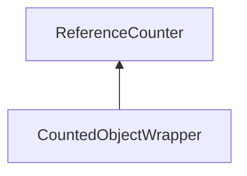

| public |
{:.api_label}

#### Inheritance Graph

## Description

## Public Functions

|
| ------: | ----------------- |
| template< typename... args >  | |
|  | **[CountedObjectWrapper](#classUtil_1_1CountedObjectWrapper_1aec616f6cf048460f62b69d5a6e0d8c54)**(args &&... params) |
|  | |
|  | **[~CountedObjectWrapper](#classUtil_1_1CountedObjectWrapper_1aca7648b999a4c137b4bad815caeade98)**() |
|  | |
| [CountedObjectWrapper](classUtil_1_1CountedObjectWrapper) & | **[operator=](#classUtil_1_1CountedObjectWrapper_1a046c3c7814ad972275b72cf2fc14dde3)**( [CountedObjectWrapper](classUtil_1_1CountedObjectWrapper) & void) |
|  | |
| _T & | **[operator*](#classUtil_1_1CountedObjectWrapper_1a0d8f90820ab8c6b680d33029d439c25d)**() |
|  | |
| const _T & | **[operator*](#classUtil_1_1CountedObjectWrapper_1adf4557f7bb72f455081bd70470e7fd70)**() const |
|  | |
| _T * | **[operator-&gt;](#classUtil_1_1CountedObjectWrapper_1a083929d3c64e5ccaeaa1d56b5f249095)**() |
|  | |
| const _T * | **[operator-&gt;](#classUtil_1_1CountedObjectWrapper_1add07c711f8cd2f4dbfa773e140c2f10b)**() const |
|  | |
| _T & | **[get](#classUtil_1_1CountedObjectWrapper_1aaeb9ab1b73022b69642a253ee78488cc)**() |
|  | |
| const _T & | **[get](#classUtil_1_1CountedObjectWrapper_1a89c1c073f1b0b2b1c75740281947ddba)**() const |
{: .nohead .nowrap1 .api_section }

-------------------------------------------------------------------

## Documentation

### <small>function</small>  Util::CountedObjectWrapper::CountedObjectWrapper {#classUtil_1_1CountedObjectWrapper_1aec616f6cf048460f62b69d5a6e0d8c54}

| public | inline | explicit |
{:.api_label}

|
| ------: | ----------------- |
| template< typename... args > |
|  **[CountedObjectWrapper](#classUtil_1_1CountedObjectWrapper_1aec616f6cf048460f62b69d5a6e0d8c54)**( | args &&... | **params** ) |
{: .nohead .nowrap1 .api_doc }

Defined in `Util/CountedObjectWrapper.h:24`{:style="float: right"}

-------------------------------------------------------------------

### <small>function</small>  Util::CountedObjectWrapper::~CountedObjectWrapper {#classUtil_1_1CountedObjectWrapper_1aca7648b999a4c137b4bad815caeade98}

| public |
{:.api_label}

|
| ------: | ----------------- |
|  |
|  **[~CountedObjectWrapper](#classUtil_1_1CountedObjectWrapper_1aca7648b999a4c137b4bad815caeade98)**( |  ) |
{: .nohead .nowrap1 .api_doc }

Defined in `Util/CountedObjectWrapper.h:25`{:style="float: right"}

-------------------------------------------------------------------

### <small>function</small>  Util::CountedObjectWrapper::operator= {#classUtil_1_1CountedObjectWrapper_1a046c3c7814ad972275b72cf2fc14dde3}

| public |
{:.api_label}

|
| ------: | ----------------- |
|  |
| [CountedObjectWrapper](classUtil_1_1CountedObjectWrapper) & **[operator=](#classUtil_1_1CountedObjectWrapper_1a046c3c7814ad972275b72cf2fc14dde3)**( |  [CountedObjectWrapper](classUtil_1_1CountedObjectWrapper) & | **void** ) |
{: .nohead .nowrap1 .api_doc }

Defined in `Util/CountedObjectWrapper.h:26`{:style="float: right"}

-------------------------------------------------------------------

### <small>function</small>  Util::CountedObjectWrapper::operator* {#classUtil_1_1CountedObjectWrapper_1a0d8f90820ab8c6b680d33029d439c25d}

| public | inline |
{:.api_label}

|
| ------: | ----------------- |
|  |
| _T & **[operator*](#classUtil_1_1CountedObjectWrapper_1a0d8f90820ab8c6b680d33029d439c25d)**( |  ) |
{: .nohead .nowrap1 .api_doc }

Defined in `Util/CountedObjectWrapper.h:28`{:style="float: right"}

-------------------------------------------------------------------

### <small>function</small>  Util::CountedObjectWrapper::operator* {#classUtil_1_1CountedObjectWrapper_1adf4557f7bb72f455081bd70470e7fd70}

| public | const | inline |
{:.api_label}

|
| ------: | ----------------- |
|  |
| const _T & **[operator*](#classUtil_1_1CountedObjectWrapper_1adf4557f7bb72f455081bd70470e7fd70)**( |  ) const |
{: .nohead .nowrap1 .api_doc }

Defined in `Util/CountedObjectWrapper.h:29`{:style="float: right"}

-------------------------------------------------------------------

### <small>function</small>  Util::CountedObjectWrapper::operator-&gt; {#classUtil_1_1CountedObjectWrapper_1a083929d3c64e5ccaeaa1d56b5f249095}

| public | inline |
{:.api_label}

|
| ------: | ----------------- |
|  |
| _T * **[operator-&gt;](#classUtil_1_1CountedObjectWrapper_1a083929d3c64e5ccaeaa1d56b5f249095)**( |  ) |
{: .nohead .nowrap1 .api_doc }

Defined in `Util/CountedObjectWrapper.h:30`{:style="float: right"}

-------------------------------------------------------------------

### <small>function</small>  Util::CountedObjectWrapper::operator-&gt; {#classUtil_1_1CountedObjectWrapper_1add07c711f8cd2f4dbfa773e140c2f10b}

| public | const | inline |
{:.api_label}

|
| ------: | ----------------- |
|  |
| const _T * **[operator-&gt;](#classUtil_1_1CountedObjectWrapper_1add07c711f8cd2f4dbfa773e140c2f10b)**( |  ) const |
{: .nohead .nowrap1 .api_doc }

Defined in `Util/CountedObjectWrapper.h:31`{:style="float: right"}

-------------------------------------------------------------------

### <small>function</small>  Util::CountedObjectWrapper::get {#classUtil_1_1CountedObjectWrapper_1aaeb9ab1b73022b69642a253ee78488cc}

| public | inline |
{:.api_label}

|
| ------: | ----------------- |
|  |
| _T & **[get](#classUtil_1_1CountedObjectWrapper_1aaeb9ab1b73022b69642a253ee78488cc)**( |  ) |
{: .nohead .nowrap1 .api_doc }

Defined in `Util/CountedObjectWrapper.h:32`{:style="float: right"}

-------------------------------------------------------------------

### <small>function</small>  Util::CountedObjectWrapper::get {#classUtil_1_1CountedObjectWrapper_1a89c1c073f1b0b2b1c75740281947ddba}

| public | const | inline |
{:.api_label}

|
| ------: | ----------------- |
|  |
| const _T & **[get](#classUtil_1_1CountedObjectWrapper_1a89c1c073f1b0b2b1c75740281947ddba)**( |  ) const |
{: .nohead .nowrap1 .api_doc }

Defined in `Util/CountedObjectWrapper.h:33`{:style="float: right"}

-------------------------------------------------------------------

