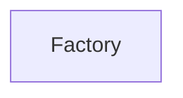

| public |
{:.api_label}

#### Inheritance Graph

## Description

[Generic](classUtil_1_1Generic) factory for objects.

The factory template can be instaniated to generate different kinds of factories. The generated factory generates objects of type*ObjectType*.

#### Parameters
**ObjectType**
:  Base type for all objects that are generated by the factory

**IdentifierType**
:  Type of the identifier that specifies which object creator to call

** [ObjectCreator](classUtil_1_1ObjectCreator) **
:  Type for callable entities that generate an object of type*WrapperType*

**FallbackPolicy**
:  Template with a function*onUnknownType()*that handles the case that the requested object type was not found

**Author**: Benjamin Eikel

**Date**: 2012-02-07

*See also*: Patterns from Chapter 8 in Andrei Alexandrescu: Modern C++ Design. Addison-Wesley, 2001.

## Public Types

|
| ------: | ----------------- |
|  | |
| typedef FallbackPolicy< ObjectType, IdentifierType > | **[fallbackPolicy_t](#classUtil_1_1Factory_1a158623e2a2e82b899192e666a55bd992)**  |
{: .nohead .nowrap1 .api_section }

## Public Attributes

|
| ------: | ----------------- |
|  | |
| [fallbackPolicy_t](classUtil_1_1Factory#classUtil_1_1Factory_1a158623e2a2e82b899192e666a55bd992) | **[fallbackPolicy](#classUtil_1_1Factory_1a8e7118628b3ccb014a2618195ee29566)**  |
{: .nohead .nowrap1 .api_section }

## Public Functions

|
| ------: | ----------------- |
|  | |
|  | **[Factory](#classUtil_1_1Factory_1a4baea3aa67ad7a3bb726eaf35ca0d203)**() |
|  | |
|  | **[Factory](#classUtil_1_1Factory_1ab2d85f8ed08f6863ce5cdca5d00f4a6e)**( [fallbackPolicy_t](classUtil_1_1Factory#classUtil_1_1Factory_1a158623e2a2e82b899192e666a55bd992)  policy) |
|  | |
| bool | **[registerType](#classUtil_1_1Factory_1a6a32ada3794287bb442d9efc6ad4cdd1)**(const IdentifierType & id,  [ObjectCreator](classUtil_1_1ObjectCreator)  creator) |
|  | |
| bool | **[unregisterType](#classUtil_1_1Factory_1a385e1c6ee54f29be23fd5eb97a2d86f7)**(const IdentifierType & id) |
|  | |
| ObjectType | **[create](#classUtil_1_1Factory_1a7983e863bdac6910d2e11c092fba9901)**(const IdentifierType & id) |
{: .nohead .nowrap1 .api_section }

-------------------------------------------------------------------

## Documentation

### <small>typedef</small>  Util::Factory::fallbackPolicy_t {#classUtil_1_1Factory_1a158623e2a2e82b899192e666a55bd992}

| public |
{:.api_label}

|
| ------: | ----------------- |
|  |
| typedef FallbackPolicy< ObjectType, IdentifierType > **[fallbackPolicy_t](#classUtil_1_1Factory_1a158623e2a2e82b899192e666a55bd992)**  |
{: .nohead .nowrap1 .api_doc }

Defined in `Util/Factory/Factory.h:48`{:style="float: right"}

-------------------------------------------------------------------

### <small>variable</small>  Util::Factory::fallbackPolicy {#classUtil_1_1Factory_1a8e7118628b3ccb014a2618195ee29566}

| public |
{:.api_label}

|
| ------: | ----------------- |
|  |
| [fallbackPolicy_t](classUtil_1_1Factory#classUtil_1_1Factory_1a158623e2a2e82b899192e666a55bd992) **[fallbackPolicy](#classUtil_1_1Factory_1a8e7118628b3ccb014a2618195ee29566)**  |
{: .nohead .nowrap1 .api_doc }

Defined in `Util/Factory/Factory.h:49`{:style="float: right"}

-------------------------------------------------------------------

### <small>function</small>  Util::Factory::Factory {#classUtil_1_1Factory_1a4baea3aa67ad7a3bb726eaf35ca0d203}

| public | inline |
{:.api_label}

|
| ------: | ----------------- |
|  |
|  **[Factory](#classUtil_1_1Factory_1a4baea3aa67ad7a3bb726eaf35ca0d203)**( |  ) |
{: .nohead .nowrap1 .api_doc }

Defined in `Util/Factory/Factory.h:50`{:style="float: right"}

-------------------------------------------------------------------

### <small>function</small>  Util::Factory::Factory {#classUtil_1_1Factory_1ab2d85f8ed08f6863ce5cdca5d00f4a6e}

| public | inline |
{:.api_label}

|
| ------: | ----------------- |
|  |
|  **[Factory](#classUtil_1_1Factory_1ab2d85f8ed08f6863ce5cdca5d00f4a6e)**( |  [fallbackPolicy_t](classUtil_1_1Factory#classUtil_1_1Factory_1a158623e2a2e82b899192e666a55bd992)  | **policy** ) |
{: .nohead .nowrap1 .api_doc }

Defined in `Util/Factory/Factory.h:52`{:style="float: right"}

-------------------------------------------------------------------

### <small>function</small>  Util::Factory::registerType {#classUtil_1_1Factory_1a6a32ada3794287bb442d9efc6ad4cdd1}

| public | inline |
{:.api_label}

|
| ------: | ----------------- |
|  |
| bool **[registerType](#classUtil_1_1Factory_1a6a32ada3794287bb442d9efc6ad4cdd1)**( | const IdentifierType & | **id**, |
| |  [ObjectCreator](classUtil_1_1ObjectCreator)  | **creator** |
|   ) |
{: .nohead .nowrap1 .api_doc }

Defined in `Util/Factory/Factory.h:55`{:style="float: right"}

-------------------------------------------------------------------

### <small>function</small>  Util::Factory::unregisterType {#classUtil_1_1Factory_1a385e1c6ee54f29be23fd5eb97a2d86f7}

| public | inline |
{:.api_label}

|
| ------: | ----------------- |
|  |
| bool **[unregisterType](#classUtil_1_1Factory_1a385e1c6ee54f29be23fd5eb97a2d86f7)**( | const IdentifierType & | **id** ) |
{: .nohead .nowrap1 .api_doc }

Defined in `Util/Factory/Factory.h:59`{:style="float: right"}

-------------------------------------------------------------------

### <small>function</small>  Util::Factory::create {#classUtil_1_1Factory_1a7983e863bdac6910d2e11c092fba9901}

| public | inline |
{:.api_label}

|
| ------: | ----------------- |
|  |
| ObjectType **[create](#classUtil_1_1Factory_1a7983e863bdac6910d2e11c092fba9901)**( | const IdentifierType & | **id** ) |
{: .nohead .nowrap1 .api_doc }

Defined in `Util/Factory/Factory.h:63`{:style="float: right"}

-------------------------------------------------------------------

