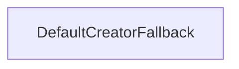

| public |
{:.api_label}

#### Inheritance Graph

## Description

Possible fallback policy for a factory.

In case of an unknown type, a default object is constructed. The default object is requested from the factory by using the specified identifier. An error message is output to the given stream.

*See also*:  [Factory](classUtil_1_1Factory) or [WrapperFactory](classUtil_1_1WrapperFactory) for description of template parameters

**Author**: Benjamin Eikel

**Date**: 2012-02-01

## Public Types

|
| ------: | ----------------- |
|  | |
| typedef std::function< ObjectType(const IdentifierType &)> | **[FactoryCall](#classUtil_1_1FallbackPolicies_1_1DefaultCreatorFallback_1a970431035824c35fa9dcd47c7fc6c9ce)**    Type of a function object that encapsulates a call to the factory that uses this fallback. |
{: .nohead .nowrap1 .api_section }

## Public Functions

|
| ------: | ----------------- |
|  | |
|  | **[DefaultCreatorFallback](#classUtil_1_1FallbackPolicies_1_1DefaultCreatorFallback_1a08a5a8f38a5782a57406040084a0b3af)**(const IdentifierType & id, std::ostream & outputStream) |
|  | |
| ObjectType | **[onUnknownType](#classUtil_1_1FallbackPolicies_1_1DefaultCreatorFallback_1ab40841a8134e912aa75a4b8530065210)**( [FactoryCall](classUtil_1_1FallbackPolicies_1_1DefaultCreatorFallback#classUtil_1_1FallbackPolicies_1_1DefaultCreatorFallback_1a970431035824c35fa9dcd47c7fc6c9ce)  functor, const IdentifierType & id) |
{: .nohead .nowrap1 .api_section }

-------------------------------------------------------------------

## Documentation

### <small>typedef</small>  Util::FallbackPolicies::DefaultCreatorFallback::FactoryCall {#classUtil_1_1FallbackPolicies_1_1DefaultCreatorFallback_1a970431035824c35fa9dcd47c7fc6c9ce}

| public |
{:.api_label}

|
| ------: | ----------------- |
|  |
| typedef std::function< ObjectType(const IdentifierType &)> **[FactoryCall](#classUtil_1_1FallbackPolicies_1_1DefaultCreatorFallback_1a970431035824c35fa9dcd47c7fc6c9ce)**  |
{: .nohead .nowrap1 .api_doc }

Type of a function object that encapsulates a call to the factory that uses this fallback.

Defined in `Util/Factory/FallbackPolicies.h:101`{:style="float: right"}

-------------------------------------------------------------------

### <small>function</small>  Util::FallbackPolicies::DefaultCreatorFallback::DefaultCreatorFallback {#classUtil_1_1FallbackPolicies_1_1DefaultCreatorFallback_1a08a5a8f38a5782a57406040084a0b3af}

| public | inline |
{:.api_label}

|
| ------: | ----------------- |
|  |
|  **[DefaultCreatorFallback](#classUtil_1_1FallbackPolicies_1_1DefaultCreatorFallback_1a08a5a8f38a5782a57406040084a0b3af)**( | const IdentifierType & | **id**, |
| | std::ostream & | **outputStream** |
|   ) |
{: .nohead .nowrap1 .api_doc }

Defined in `Util/Factory/FallbackPolicies.h:96`{:style="float: right"}

-------------------------------------------------------------------

### <small>function</small>  Util::FallbackPolicies::DefaultCreatorFallback::onUnknownType {#classUtil_1_1FallbackPolicies_1_1DefaultCreatorFallback_1ab40841a8134e912aa75a4b8530065210}

| public | inline |
{:.api_label}

|
| ------: | ----------------- |
|  |
| ObjectType **[onUnknownType](#classUtil_1_1FallbackPolicies_1_1DefaultCreatorFallback_1ab40841a8134e912aa75a4b8530065210)**( |  [FactoryCall](classUtil_1_1FallbackPolicies_1_1DefaultCreatorFallback#classUtil_1_1FallbackPolicies_1_1DefaultCreatorFallback_1a970431035824c35fa9dcd47c7fc6c9ce)  | **functor**, |
| | const IdentifierType & | **id** |
|   ) |
{: .nohead .nowrap1 .api_doc }

Use the given function object calling the create function of the factory. Give the default identifier to the create function to create a default object.

Defined in `Util/Factory/FallbackPolicies.h:107`{:style="float: right"}

-------------------------------------------------------------------

