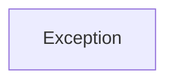

| public |
{:.api_label}

#### Inheritance Graph

## Description

## Public Functions

|
| ------: | ----------------- |
|  | |
|  | **[Exception](#classUtil_1_1FallbackPolicies_1_1ExceptionFallback_1_1Exception_1ae42ea5c34ecb392041ab9b63f4412deb)**(IdentifierType unknownId) |
|  | |
|  | **[~Exception](#classUtil_1_1FallbackPolicies_1_1ExceptionFallback_1_1Exception_1a40d974b73b0916924c48ab5c30be3f62)**() |
|  | |
| const char * | **[what](#classUtil_1_1FallbackPolicies_1_1ExceptionFallback_1_1Exception_1ab31fb77e4aa098b58f6e49aee3524595)**() const |
|  | |
| const IdentifierType & | **[getIdentifier](#classUtil_1_1FallbackPolicies_1_1ExceptionFallback_1_1Exception_1ad1e2653ec3180b185cace0dc282706de)**() const |
{: .nohead .nowrap1 .api_section }

-------------------------------------------------------------------

## Documentation

### <small>function</small>  Util::FallbackPolicies::ExceptionFallback::Exception::Exception {#classUtil_1_1FallbackPolicies_1_1ExceptionFallback_1_1Exception_1ae42ea5c34ecb392041ab9b63f4412deb}

| public | inline |
{:.api_label}

|
| ------: | ----------------- |
|  |
|  **[Exception](#classUtil_1_1FallbackPolicies_1_1ExceptionFallback_1_1Exception_1ae42ea5c34ecb392041ab9b63f4412deb)**( | IdentifierType | **unknownId** ) |
{: .nohead .nowrap1 .api_doc }

Defined in `Util/Factory/FallbackPolicies.h:41`{:style="float: right"}

-------------------------------------------------------------------

### <small>function</small>  Util::FallbackPolicies::ExceptionFallback::Exception::~Exception {#classUtil_1_1FallbackPolicies_1_1ExceptionFallback_1_1Exception_1a40d974b73b0916924c48ab5c30be3f62}

| public | inline | virtual |
{:.api_label}

|
| ------: | ----------------- |
|  |
|  **[~Exception](#classUtil_1_1FallbackPolicies_1_1ExceptionFallback_1_1Exception_1a40d974b73b0916924c48ab5c30be3f62)**( |  ) |
{: .nohead .nowrap1 .api_doc }

Defined in `Util/Factory/FallbackPolicies.h:43`{:style="float: right"}

-------------------------------------------------------------------

### <small>function</small>  Util::FallbackPolicies::ExceptionFallback::Exception::what {#classUtil_1_1FallbackPolicies_1_1ExceptionFallback_1_1Exception_1ab31fb77e4aa098b58f6e49aee3524595}

| public | const | inline |
{:.api_label}

|
| ------: | ----------------- |
|  |
| const char * **[what](#classUtil_1_1FallbackPolicies_1_1ExceptionFallback_1_1Exception_1ab31fb77e4aa098b58f6e49aee3524595)**( |  ) const |
{: .nohead .nowrap1 .api_doc }

Defined in `Util/Factory/FallbackPolicies.h:45`{:style="float: right"}

-------------------------------------------------------------------

### <small>function</small>  Util::FallbackPolicies::ExceptionFallback::Exception::getIdentifier {#classUtil_1_1FallbackPolicies_1_1ExceptionFallback_1_1Exception_1ad1e2653ec3180b185cace0dc282706de}

| public | const | inline |
{:.api_label}

|
| ------: | ----------------- |
|  |
| const IdentifierType & **[getIdentifier](#classUtil_1_1FallbackPolicies_1_1ExceptionFallback_1_1Exception_1ad1e2653ec3180b185cace0dc282706de)**( |  ) const |
{: .nohead .nowrap1 .api_doc }

Defined in `Util/Factory/FallbackPolicies.h:48`{:style="float: right"}

-------------------------------------------------------------------

