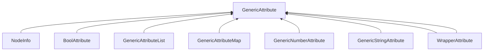

| public | abstract |
{:.api_label}

#### Inheritance Graph

## Description

Abstract base class of all generic attributes. A generic attribute is used to store arbitrary types of data into a location.

## Public Types

|
| ------: | ----------------- |
|  | |
| typedef [GenericAttributeMap](classUtil_1_1GenericAttributeMap) | **[Map](#classUtil_1_1GenericAttribute_1a68c44829cb179639aaa2893e43a94fc1)**  |
|  | |
| typedef [GenericAttributeList](classUtil_1_1GenericAttributeList) | **[List](#classUtil_1_1GenericAttribute_1a900a55cc6b704c70553e0c3b5f8b3365)**  |
|  | |
| typedef [GenericAttribute](classUtil_1_1GenericAttribute) | **[attr_t](#classUtil_1_1GenericAttribute_1a5379a828be73ce58bb05e4ef27e8a3e7)**  |
{: .nohead .nowrap1 .api_section }

## Public Static Functions

|
| ------: | ----------------- |
| template< typename value_t  >  | |
| std::enable_if< std::is_same< typename std::decay< value_t >::type, bool >::value, [BoolAttribute](classUtil_1_1BoolAttribute) * >::type | **[create](#classUtil_1_1GenericAttribute_1a7fa33e6e49529a41a000e186a5bc42b0)**(value_t && value) |
| template< typename value_t  >  | |
| std::enable_if<(std::is_integral< typename std::decay< value_t >::type >::value||std::is_floating_point< typename std::decay< value_t >::type >::value)&&!std::is_same< typename std::decay< value_t >::type, bool >::value, [_NumberAttribute](classUtil_1_1%5F%5FNumberAttribute) < typename std::decay< value_t >::type > * >::type | **[create](#classUtil_1_1GenericAttribute_1a5212f81b6176bf9ebfc25a14362dd759)**(value_t && value) |
| template< typename value_t  >  | |
| std::enable_if< std::is_same< typename std::decay< value_t >::type, std::string >::value, [_StringAttribute](classUtil_1_1%5F%5FStringAttribute) < std::string > * >::type | **[create](#classUtil_1_1GenericAttribute_1a4c793e8e2bf48f54b72ab5b91cd1e496)**(value_t && value) |
|  | |
| [StringAttribute](namespaceUtil#namespaceUtil_1a6fb02caa1400f7669c94bcbaa9413587) * | **[createString](#group%5F%5Fgeneric%5F%5Fattr_1gaf4b9d8f2bdb6833509c5f08e449477a7)**(const std::string & s) |
|  | |
| [StringAttribute](namespaceUtil#namespaceUtil_1a6fb02caa1400f7669c94bcbaa9413587) * | **[createString](#group%5F%5Fgeneric%5F%5Fattr_1ga0af5ffa3b546ca5df5dabf1c7eb5a761)**(std::string && s) |
|  | |
| [StringAttribute](namespaceUtil#namespaceUtil_1a6fb02caa1400f7669c94bcbaa9413587) * | **[createString](#classUtil_1_1GenericAttribute_1a6fa3aaffb1e043c75319696ae204a138)**( [GenericAttribute](classUtil_1_1GenericAttribute) * a) |
| template< typename Number  >  | |
| [_NumberAttribute](classUtil_1_1%5F%5FNumberAttribute) < Number > * | **[createNumber](#classUtil_1_1GenericAttribute_1a7671114f8ee2f56664f2ba54b073d22b)**(Number f) |
|  | |
| [BoolAttribute](classUtil_1_1BoolAttribute) * | **[createBool](#classUtil_1_1GenericAttribute_1a49c0c65f68ad964f693696411db7d370)**(bool b) |
| template< typename ObjType  >  | |
| [GenericAttribute](classUtil_1_1GenericAttribute) * | **[createCountedReference](#classUtil_1_1GenericAttribute_1a8861f84d3961b1f788cd1f452394f40e)**(ObjType * obj) |
| template< typename Type  >  | |
| [GenericAttribute](classUtil_1_1GenericAttribute) * | **[createUndefined](#classUtil_1_1GenericAttribute_1aacd9f22e115052f1c699861d91cfb715)**(const Type & value) |
{: .nohead .nowrap1 .api_section }

## Public Functions

|
| ------: | ----------------- |
|  | |
|  | **[~GenericAttribute](#classUtil_1_1GenericAttribute_1a2684f3056dcb860c9b9b6f0bdd28a1b7)**() |
|  | |
| [attr_t](classUtil_1_1GenericAttribute#classUtil_1_1GenericAttribute_1a5379a828be73ce58bb05e4ef27e8a3e7) * | **[clone](#classUtil_1_1GenericAttribute_1af0994d884c098a6b08c5215879e252ad)**() const |
| template< class specificAttr_t  >  | |
| bool | **[isA](#classUtil_1_1GenericAttribute_1a51e095774adbce14b20cdc54bae3e8eb)**() const   returns true iff the object is of the given type. |
|  | |
| std::string | **[toString](#classUtil_1_1GenericAttribute_1a1fbbdf9b6b26b4e60789558e412b4915)**() const |
|  | |
| double | **[toDouble](#classUtil_1_1GenericAttribute_1ad4b61a1cf465b4a75ef760bf783523bd)**() const |
|  | |
| float | **[toFloat](#classUtil_1_1GenericAttribute_1a1ce34bf3daa136a7b465fecd3c19b19f)**() const |
|  | |
| int | **[toInt](#classUtil_1_1GenericAttribute_1a684b361b5c21c01476cca9e6aebbe139)**() const |
|  | |
| unsigned int | **[toUnsignedInt](#classUtil_1_1GenericAttribute_1a8239a4a167216dfdacd0621648480fca)**() const |
|  | |
| bool | **[toBool](#classUtil_1_1GenericAttribute_1a80fb07493a9cc08873e9df4bd31930f0)**() const |
|  | |
| std::string | **[toJSON](#classUtil_1_1GenericAttribute_1a40f83f7c0222d176ba310977976a536d)**() const |
| template< class specificAttr_t  >  | |
| specificAttr_t * | **[toType](#classUtil_1_1GenericAttribute_1aa9ae74a9813b590587c9bf579ab63622)**() |
| template< class specificAttr_t  >  | |
| const specificAttr_t * | **[toType](#classUtil_1_1GenericAttribute_1a7da2ee3a2f1e1f0064360ebaa0645f19)**() const |
|  | |
| bool | **[operator==](#classUtil_1_1GenericAttribute_1a474b84767d773c0bfec27005d2e38b0d)**(const [GenericAttribute](classUtil_1_1GenericAttribute) & void) const   Per default, the comparison returns false for unspecified types. |
|  | |
| bool | **[operator!=](#classUtil_1_1GenericAttribute_1a8c7607f71b6fa235139726ddb96b12e7)**(const [GenericAttribute](classUtil_1_1GenericAttribute) & other) const |
{: .nohead .nowrap1 .api_section }

## Protected Static Functions

|
| ------: | ----------------- |
| template< class specificAttr_t  >  | |
| bool | **[_defaultIsEqual](#classUtil_1_1GenericAttribute_1a7589f608d4de9f628c5d4af06759de61)**(const specificAttr_t * first, const [GenericAttribute](classUtil_1_1GenericAttribute) * second) |
{: .nohead .nowrap1 .api_section }

## Protected Functions

|
| ------: | ----------------- |
|  | |
|  | **[GenericAttribute](#classUtil_1_1GenericAttribute_1a2e5a0668ea3241002f4b4823a0421d56)**() |
|  | |
|  | **[GenericAttribute](#classUtil_1_1GenericAttribute_1ad230f8fc5e0d0a9efaf7a3243b8afd7d)**(const [GenericAttribute](classUtil_1_1GenericAttribute) & void) |
|  | |
|  | **[GenericAttribute](#classUtil_1_1GenericAttribute_1ab51b184c5312c459724e8aab81413995)**( [GenericAttribute](classUtil_1_1GenericAttribute) && void) |
|  | |
| [GenericAttribute](classUtil_1_1GenericAttribute) & | **[operator=](#classUtil_1_1GenericAttribute_1a130252b33b0c993cb2fc65349299269a)**(const [GenericAttribute](classUtil_1_1GenericAttribute) & void) |
|  | |
| [GenericAttribute](classUtil_1_1GenericAttribute) & | **[operator=](#classUtil_1_1GenericAttribute_1aded5103db0667f8294e0f2d7d00f4d23)**( [GenericAttribute](classUtil_1_1GenericAttribute) && void) |
{: .nohead .nowrap1 .api_section }

-------------------------------------------------------------------

## Documentation

### <small>typedef</small>  Util::GenericAttribute::Map {#classUtil_1_1GenericAttribute_1a68c44829cb179639aaa2893e43a94fc1}

| public |
{:.api_label}

|
| ------: | ----------------- |
|  |
| typedef [GenericAttributeMap](classUtil_1_1GenericAttributeMap) **[Map](#classUtil_1_1GenericAttribute_1a68c44829cb179639aaa2893e43a94fc1)**  |
{: .nohead .nowrap1 .api_doc }

Defined in `Util/GenericAttribute.h:45`{:style="float: right"}

-------------------------------------------------------------------

### <small>typedef</small>  Util::GenericAttribute::List {#classUtil_1_1GenericAttribute_1a900a55cc6b704c70553e0c3b5f8b3365}

| public |
{:.api_label}

|
| ------: | ----------------- |
|  |
| typedef [GenericAttributeList](classUtil_1_1GenericAttributeList) **[List](#classUtil_1_1GenericAttribute_1a900a55cc6b704c70553e0c3b5f8b3365)**  |
{: .nohead .nowrap1 .api_doc }

Defined in `Util/GenericAttribute.h:46`{:style="float: right"}

-------------------------------------------------------------------

### <small>typedef</small>  Util::GenericAttribute::attr_t {#classUtil_1_1GenericAttribute_1a5379a828be73ce58bb05e4ef27e8a3e7}

| public |
{:.api_label}

|
| ------: | ----------------- |
|  |
| typedef [GenericAttribute](classUtil_1_1GenericAttribute) **[attr_t](#classUtil_1_1GenericAttribute_1a5379a828be73ce58bb05e4ef27e8a3e7)**  |
{: .nohead .nowrap1 .api_doc }

Defined in `Util/GenericAttribute.h:47`{:style="float: right"}

-------------------------------------------------------------------

### <small>function</small>  Util::GenericAttribute::create {#classUtil_1_1GenericAttribute_1a7fa33e6e49529a41a000e186a5bc42b0}

| public | static | inline |
{:.api_label}

|
| ------: | ----------------- |
| template< typename value_t  > |
| std::enable_if< std::is_same< typename std::decay< value_t >::type, bool >::value, [BoolAttribute](classUtil_1_1BoolAttribute) * >::type **[create](#classUtil_1_1GenericAttribute_1a7fa33e6e49529a41a000e186a5bc42b0)**( | value_t && | **value** ) |
{: .nohead .nowrap1 .api_doc }

 [Factory](classUtil_1_1Factory) function to create an appropriate [GenericAttribute](classUtil_1_1GenericAttribute) for the type of the given value.

#### Parameters
**value_t**
:  Template parameter that decides which type of [GenericAttribute](classUtil_1_1GenericAttribute) is constructed

**value**
:  Value that is stored in the newly created [GenericAttribute](classUtil_1_1GenericAttribute) 

Defined in `Util/GenericAttribute.h:60`{:style="float: right"}

-------------------------------------------------------------------

### <small>function</small>  Util::GenericAttribute::create {#classUtil_1_1GenericAttribute_1a5212f81b6176bf9ebfc25a14362dd759}

| public | static | inline |
{:.api_label}

|
| ------: | ----------------- |
| template< typename value_t  > |
| std::enable_if<(std::is_integral< typename std::decay< value_t >::type >::value||std::is_floating_point< typename std::decay< value_t >::type >::value)&&!std::is_same< typename std::decay< value_t >::type, bool >::value, [_NumberAttribute](classUtil_1_1%5F%5FNumberAttribute) < typename std::decay< value_t >::type > * >::type **[create](#classUtil_1_1GenericAttribute_1a5212f81b6176bf9ebfc25a14362dd759)**( | value_t && | **value** ) |
{: .nohead .nowrap1 .api_doc }

Defined in `Util/GenericAttribute.h:67`{:style="float: right"}

-------------------------------------------------------------------

### <small>function</small>  Util::GenericAttribute::create {#classUtil_1_1GenericAttribute_1a4c793e8e2bf48f54b72ab5b91cd1e496}

| public | static | inline |
{:.api_label}

|
| ------: | ----------------- |
| template< typename value_t  > |
| std::enable_if< std::is_same< typename std::decay< value_t >::type, std::string >::value, [_StringAttribute](classUtil_1_1%5F%5FStringAttribute) < std::string > * >::type **[create](#classUtil_1_1GenericAttribute_1a4c793e8e2bf48f54b72ab5b91cd1e496)**( | value_t && | **value** ) |
{: .nohead .nowrap1 .api_doc }

Defined in `Util/GenericAttribute.h:72`{:style="float: right"}

-------------------------------------------------------------------

### <small>function</small>  Util::GenericAttribute::createString {#group__generic__attr_1gaf4b9d8f2bdb6833509c5f08e449477a7}

| public | static | inline |
{:.api_label}

|
| ------: | ----------------- |
|  |
| [StringAttribute](namespaceUtil#namespaceUtil_1a6fb02caa1400f7669c94bcbaa9413587) * **[createString](#group%5F%5Fgeneric%5F%5Fattr_1gaf4b9d8f2bdb6833509c5f08e449477a7)**( | const std::string & | **s** ) |
{: .nohead .nowrap1 .api_doc }

Encapsulate a standard string into a generic attribute.

#### Parameters
**s**
:  Standard string

#### Returns
String encapsulated into a generic string attribute

Defined in `Util/GenericAttribute.h:82`{:style="float: right"}

-------------------------------------------------------------------

### <small>function</small>  Util::GenericAttribute::createString {#group__generic__attr_1ga0af5ffa3b546ca5df5dabf1c7eb5a761}

| public | static | inline |
{:.api_label}

|
| ------: | ----------------- |
|  |
| [StringAttribute](namespaceUtil#namespaceUtil_1a6fb02caa1400f7669c94bcbaa9413587) * **[createString](#group%5F%5Fgeneric%5F%5Fattr_1ga0af5ffa3b546ca5df5dabf1c7eb5a761)**( | std::string && | **s** ) |
{: .nohead .nowrap1 .api_doc }

Defined in `Util/GenericAttribute.h:83`{:style="float: right"}

-------------------------------------------------------------------

### <small>function</small>  Util::GenericAttribute::createString {#classUtil_1_1GenericAttribute_1a6fa3aaffb1e043c75319696ae204a138}

| public | static |
{:.api_label}

|
| ------: | ----------------- |
|  |
| [StringAttribute](namespaceUtil#namespaceUtil_1a6fb02caa1400f7669c94bcbaa9413587) * **[createString](#classUtil_1_1GenericAttribute_1a6fa3aaffb1e043c75319696ae204a138)**( |  [GenericAttribute](classUtil_1_1GenericAttribute) * | **a** ) |
{: .nohead .nowrap1 .api_doc }

Convert a generic attribute to a string and encapsulate that string into a generic attribute.

#### Parameters
**a**
:  Arbitrary generic attribute

#### Returns
String representation of the generic attribute

Defined in `Util/GenericAttribute.h:92`{:style="float: right"}

-------------------------------------------------------------------

### <small>function</small>  Util::GenericAttribute::createNumber {#classUtil_1_1GenericAttribute_1a7671114f8ee2f56664f2ba54b073d22b}

| public | static | inline |
{:.api_label}

|
| ------: | ----------------- |
| template< typename Number  > |
| [_NumberAttribute](classUtil_1_1%5F%5FNumberAttribute) < Number > * **[createNumber](#classUtil_1_1GenericAttribute_1a7671114f8ee2f56664f2ba54b073d22b)**( | Number | **f** ) |
{: .nohead .nowrap1 .api_doc }

Encapsulate a standard number into a generic attribute.

#### Parameters
**f**
:  Standard number

#### Returns
Number encapsulated into a generic number attribute

Defined in `Util/GenericAttribute.h:100`{:style="float: right"}

-------------------------------------------------------------------

### <small>function</small>  Util::GenericAttribute::createBool {#classUtil_1_1GenericAttribute_1a49c0c65f68ad964f693696411db7d370}

| public | static |
{:.api_label}

|
| ------: | ----------------- |
|  |
| [BoolAttribute](classUtil_1_1BoolAttribute) * **[createBool](#classUtil_1_1GenericAttribute_1a49c0c65f68ad964f693696411db7d370)**( | bool | **b** ) |
{: .nohead .nowrap1 .api_doc }

Encapsulate a standard bool into a generic attribute.

#### Parameters
**f**
:  Standard bool

#### Returns
Number encapsulated into a generic bool attribute

Defined in `Util/GenericAttribute.h:109`{:style="float: right"}

-------------------------------------------------------------------

### <small>function</small>  Util::GenericAttribute::createCountedReference {#classUtil_1_1GenericAttribute_1a8861f84d3961b1f788cd1f452394f40e}

| public | static | inline |
{:.api_label}

|
| ------: | ----------------- |
| template< typename ObjType  > |
| [GenericAttribute](classUtil_1_1GenericAttribute) * **[createCountedReference](#classUtil_1_1GenericAttribute_1a8861f84d3961b1f788cd1f452394f40e)**( | ObjType * | **obj** ) |
{: .nohead .nowrap1 .api_doc }

Encapsulate a [Util::Reference](classUtil_1_1Reference) to an object into a generic attribute.

#### Parameters
**f**
:  Standard pointer

#### Returns
Pointer encapsulated into a generic counted object attribute

Defined in `Util/GenericAttribute.h:117`{:style="float: right"}

-------------------------------------------------------------------

### <small>function</small>  Util::GenericAttribute::createUndefined {#classUtil_1_1GenericAttribute_1aacd9f22e115052f1c699861d91cfb715}

| public | static | inline |
{:.api_label}

|
| ------: | ----------------- |
| template< typename Type  > |
| [GenericAttribute](classUtil_1_1GenericAttribute) * **[createUndefined](#classUtil_1_1GenericAttribute_1aacd9f22e115052f1c699861d91cfb715)**( | const Type & | **value** ) |
{: .nohead .nowrap1 .api_doc }

Encapsulate an arbitrary type into a generic attribute.

#### Parameters
**value**
:  Standard number

#### Returns
Arbitrary type encapsulated into a generic undefined attribute

Defined in `Util/GenericAttribute.h:126`{:style="float: right"}

-------------------------------------------------------------------

### <small>function</small>  Util::GenericAttribute::~GenericAttribute {#classUtil_1_1GenericAttribute_1a2684f3056dcb860c9b9b6f0bdd28a1b7}

| public | inline | virtual |
{:.api_label}

|
| ------: | ----------------- |
|  |
|  **[~GenericAttribute](#classUtil_1_1GenericAttribute_1a2684f3056dcb860c9b9b6f0bdd28a1b7)**( |  ) |
{: .nohead .nowrap1 .api_doc }

Defined in `Util/GenericAttribute.h:131`{:style="float: right"}

-------------------------------------------------------------------

### <small>function</small>  Util::GenericAttribute::clone {#classUtil_1_1GenericAttribute_1af0994d884c098a6b08c5215879e252ad}

| public | const | virtual |
{:.api_label}

|
| ------: | ----------------- |
|  |
| [attr_t](classUtil_1_1GenericAttribute#classUtil_1_1GenericAttribute_1a5379a828be73ce58bb05e4ef27e8a3e7) * **[clone](#classUtil_1_1GenericAttribute_1af0994d884c098a6b08c5215879e252ad)**( |  ) const |
{: .nohead .nowrap1 .api_doc }

Create a copy of this object.

#### Returns
Exact copy.

Defined in `Util/GenericAttribute.h:139`{:style="float: right"}

-------------------------------------------------------------------

### <small>function</small>  Util::GenericAttribute::isA {#classUtil_1_1GenericAttribute_1a51e095774adbce14b20cdc54bae3e8eb}

| public | const | inline |
{:.api_label}

|
| ------: | ----------------- |
| template< class specificAttr_t  > |
| bool **[isA](#classUtil_1_1GenericAttribute_1a51e095774adbce14b20cdc54bae3e8eb)**( |  ) const |
{: .nohead .nowrap1 .api_doc }

returns true iff the object is of the given type.

Defined in `Util/GenericAttribute.h:143`{:style="float: right"}

-------------------------------------------------------------------

### <small>function</small>  Util::GenericAttribute::toString {#classUtil_1_1GenericAttribute_1a1fbbdf9b6b26b4e60789558e412b4915}

| public | const | inline | virtual |
{:.api_label}

|
| ------: | ----------------- |
|  |
| std::string **[toString](#classUtil_1_1GenericAttribute_1a1fbbdf9b6b26b4e60789558e412b4915)**( |  ) const |
{: .nohead .nowrap1 .api_doc }

Convert the object to a human-readable string.

#### Returns
String representation.

Defined in `Util/GenericAttribute.h:149`{:style="float: right"}

-------------------------------------------------------------------

### <small>function</small>  Util::GenericAttribute::toDouble {#classUtil_1_1GenericAttribute_1ad4b61a1cf465b4a75ef760bf783523bd}

| public | const | inline | virtual |
{:.api_label}

|
| ------: | ----------------- |
|  |
| double **[toDouble](#classUtil_1_1GenericAttribute_1ad4b61a1cf465b4a75ef760bf783523bd)**( |  ) const |
{: .nohead .nowrap1 .api_doc }

Convert the object to a floating-point value with double precision.

#### Returns
Floating-point representation with double precision.

Defined in `Util/GenericAttribute.h:155`{:style="float: right"}

-------------------------------------------------------------------

### <small>function</small>  Util::GenericAttribute::toFloat {#classUtil_1_1GenericAttribute_1a1ce34bf3daa136a7b465fecd3c19b19f}

| public | const | inline | virtual |
{:.api_label}

|
| ------: | ----------------- |
|  |
| float **[toFloat](#classUtil_1_1GenericAttribute_1a1ce34bf3daa136a7b465fecd3c19b19f)**( |  ) const |
{: .nohead .nowrap1 .api_doc }

Convert the object to a floating-point value.

#### Returns
Floating-point representation.

Defined in `Util/GenericAttribute.h:161`{:style="float: right"}

-------------------------------------------------------------------

### <small>function</small>  Util::GenericAttribute::toInt {#classUtil_1_1GenericAttribute_1a684b361b5c21c01476cca9e6aebbe139}

| public | const | inline | virtual |
{:.api_label}

|
| ------: | ----------------- |
|  |
| int **[toInt](#classUtil_1_1GenericAttribute_1a684b361b5c21c01476cca9e6aebbe139)**( |  ) const |
{: .nohead .nowrap1 .api_doc }

Convert the object to an integer value.

#### Returns
Integer representation.

Defined in `Util/GenericAttribute.h:167`{:style="float: right"}

-------------------------------------------------------------------

### <small>function</small>  Util::GenericAttribute::toUnsignedInt {#classUtil_1_1GenericAttribute_1a8239a4a167216dfdacd0621648480fca}

| public | const | inline | virtual |
{:.api_label}

|
| ------: | ----------------- |
|  |
| unsigned int **[toUnsignedInt](#classUtil_1_1GenericAttribute_1a8239a4a167216dfdacd0621648480fca)**( |  ) const |
{: .nohead .nowrap1 .api_doc }

Convert the object to an unsigned integer value.

#### Returns
Unsigned integer representation.

Defined in `Util/GenericAttribute.h:173`{:style="float: right"}

-------------------------------------------------------------------

### <small>function</small>  Util::GenericAttribute::toBool {#classUtil_1_1GenericAttribute_1a80fb07493a9cc08873e9df4bd31930f0}

| public | const | inline | virtual |
{:.api_label}

|
| ------: | ----------------- |
|  |
| bool **[toBool](#classUtil_1_1GenericAttribute_1a80fb07493a9cc08873e9df4bd31930f0)**( |  ) const |
{: .nohead .nowrap1 .api_doc }

Convert the object to an boolean value.

#### Returns
Boolean representation.

Defined in `Util/GenericAttribute.h:179`{:style="float: right"}

-------------------------------------------------------------------

### <small>function</small>  Util::GenericAttribute::toJSON {#classUtil_1_1GenericAttribute_1a40f83f7c0222d176ba310977976a536d}

| public | const | inline | virtual |
{:.api_label}

|
| ------: | ----------------- |
|  |
| std::string **[toJSON](#classUtil_1_1GenericAttribute_1a40f83f7c0222d176ba310977976a536d)**( |  ) const |
{: .nohead .nowrap1 .api_doc }

Convert the object to JavaScript Object Notation (JSON).

#### Returns
JSON representation;

Defined in `Util/GenericAttribute.h:185`{:style="float: right"}

-------------------------------------------------------------------

### <small>function</small>  Util::GenericAttribute::toType {#classUtil_1_1GenericAttribute_1aa9ae74a9813b590587c9bf579ab63622}

| public | inline |
{:.api_label}

|
| ------: | ----------------- |
| template< class specificAttr_t  > |
| specificAttr_t * **[toType](#classUtil_1_1GenericAttribute_1aa9ae74a9813b590587c9bf579ab63622)**( |  ) |
{: .nohead .nowrap1 .api_doc }

Defined in `Util/GenericAttribute.h:188`{:style="float: right"}

-------------------------------------------------------------------

### <small>function</small>  Util::GenericAttribute::toType {#classUtil_1_1GenericAttribute_1a7da2ee3a2f1e1f0064360ebaa0645f19}

| public | const | inline |
{:.api_label}

|
| ------: | ----------------- |
| template< class specificAttr_t  > |
| const specificAttr_t * **[toType](#classUtil_1_1GenericAttribute_1a7da2ee3a2f1e1f0064360ebaa0645f19)**( |  ) const |
{: .nohead .nowrap1 .api_doc }

Defined in `Util/GenericAttribute.h:192`{:style="float: right"}

-------------------------------------------------------------------

### <small>function</small>  Util::GenericAttribute::operator== {#classUtil_1_1GenericAttribute_1a474b84767d773c0bfec27005d2e38b0d}

| public | const | inline | virtual |
{:.api_label}

|
| ------: | ----------------- |
|  |
| bool **[operator==](#classUtil_1_1GenericAttribute_1a474b84767d773c0bfec27005d2e38b0d)**( | const [GenericAttribute](classUtil_1_1GenericAttribute) & | **void** ) const |
{: .nohead .nowrap1 .api_doc }

Per default, the comparison returns false for unspecified types.

Defined in `Util/GenericAttribute.h:197`{:style="float: right"}

-------------------------------------------------------------------

### <small>function</small>  Util::GenericAttribute::operator!= {#classUtil_1_1GenericAttribute_1a8c7607f71b6fa235139726ddb96b12e7}

| public | const | inline |
{:.api_label}

|
| ------: | ----------------- |
|  |
| bool **[operator!=](#classUtil_1_1GenericAttribute_1a8c7607f71b6fa235139726ddb96b12e7)**( | const [GenericAttribute](classUtil_1_1GenericAttribute) & | **other** ) const |
{: .nohead .nowrap1 .api_doc }

Defined in `Util/GenericAttribute.h:198`{:style="float: right"}

-------------------------------------------------------------------

### <small>function</small>  Util::GenericAttribute::_defaultIsEqual {#classUtil_1_1GenericAttribute_1a7589f608d4de9f628c5d4af06759de61}

| protected | static | inline |
{:.api_label}

|
| ------: | ----------------- |
| template< class specificAttr_t  > |
| bool **[_defaultIsEqual](#classUtil_1_1GenericAttribute_1a7589f608d4de9f628c5d4af06759de61)**( | const specificAttr_t * | **first**, |
| | const [GenericAttribute](classUtil_1_1GenericAttribute) * | **second** |
|   ) |
{: .nohead .nowrap1 .api_doc }

Defined in `Util/GenericAttribute.h:202`{:style="float: right"}

-------------------------------------------------------------------

### <small>function</small>  Util::GenericAttribute::GenericAttribute {#classUtil_1_1GenericAttribute_1a2e5a0668ea3241002f4b4823a0421d56}

| protected |
{:.api_label}

|
| ------: | ----------------- |
|  |
|  **[GenericAttribute](#classUtil_1_1GenericAttribute_1a2e5a0668ea3241002f4b4823a0421d56)**( |  ) |
{: .nohead .nowrap1 .api_doc }

Defined in `Util/GenericAttribute.h:206`{:style="float: right"}

-------------------------------------------------------------------

### <small>function</small>  Util::GenericAttribute::GenericAttribute {#classUtil_1_1GenericAttribute_1ad230f8fc5e0d0a9efaf7a3243b8afd7d}

| protected |
{:.api_label}

|
| ------: | ----------------- |
|  |
|  **[GenericAttribute](#classUtil_1_1GenericAttribute_1ad230f8fc5e0d0a9efaf7a3243b8afd7d)**( | const [GenericAttribute](classUtil_1_1GenericAttribute) & | **void** ) |
{: .nohead .nowrap1 .api_doc }

Defined in `Util/GenericAttribute.h:207`{:style="float: right"}

-------------------------------------------------------------------

### <small>function</small>  Util::GenericAttribute::GenericAttribute {#classUtil_1_1GenericAttribute_1ab51b184c5312c459724e8aab81413995}

| protected |
{:.api_label}

|
| ------: | ----------------- |
|  |
|  **[GenericAttribute](#classUtil_1_1GenericAttribute_1ab51b184c5312c459724e8aab81413995)**( |  [GenericAttribute](classUtil_1_1GenericAttribute) && | **void** ) |
{: .nohead .nowrap1 .api_doc }

Defined in `Util/GenericAttribute.h:208`{:style="float: right"}

-------------------------------------------------------------------

### <small>function</small>  Util::GenericAttribute::operator= {#classUtil_1_1GenericAttribute_1a130252b33b0c993cb2fc65349299269a}

| protected |
{:.api_label}

|
| ------: | ----------------- |
|  |
| [GenericAttribute](classUtil_1_1GenericAttribute) & **[operator=](#classUtil_1_1GenericAttribute_1a130252b33b0c993cb2fc65349299269a)**( | const [GenericAttribute](classUtil_1_1GenericAttribute) & | **void** ) |
{: .nohead .nowrap1 .api_doc }

Defined in `Util/GenericAttribute.h:209`{:style="float: right"}

-------------------------------------------------------------------

### <small>function</small>  Util::GenericAttribute::operator= {#classUtil_1_1GenericAttribute_1aded5103db0667f8294e0f2d7d00f4d23}

| protected |
{:.api_label}

|
| ------: | ----------------- |
|  |
| [GenericAttribute](classUtil_1_1GenericAttribute) & **[operator=](#classUtil_1_1GenericAttribute_1aded5103db0667f8294e0f2d7d00f4d23)**( |  [GenericAttribute](classUtil_1_1GenericAttribute) && | **void** ) |
{: .nohead .nowrap1 .api_doc }

Defined in `Util/GenericAttribute.h:210`{:style="float: right"}

-------------------------------------------------------------------

