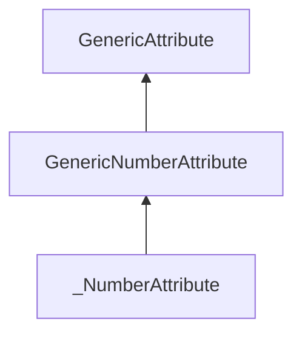

| public |
{:.api_label}

#### Inheritance Graph

## Description

Empty base class for [_NumberAttribute](classUtil_1_1%5F%5FNumberAttribute) to allow dynamic casting

**Author**: Benjamin Eikel

**Date**: 2011-06-10

## Public Types

|
| ------: | ----------------- |
|  | |
| typedef [GenericNumberAttribute](classUtil_1_1GenericNumberAttribute) | **[attr_t](#classUtil_1_1GenericNumberAttribute_1a25184f320514963b948c8c03bfec3e84)**  |
{: .nohead .nowrap1 .api_section }

## Protected Functions

|
| ------: | ----------------- |
|  | |
|  | **[~GenericNumberAttribute](#classUtil_1_1GenericNumberAttribute_1a8097f1999d38977bdbe824fcf4362bd8)**() |
{: .nohead .nowrap1 .api_section }

-------------------------------------------------------------------

## Documentation

### <small>typedef</small>  Util::GenericNumberAttribute::attr_t {#classUtil_1_1GenericNumberAttribute_1a25184f320514963b948c8c03bfec3e84}

| public |
{:.api_label}

|
| ------: | ----------------- |
|  |
| typedef [GenericNumberAttribute](classUtil_1_1GenericNumberAttribute) **[attr_t](#classUtil_1_1GenericNumberAttribute_1a25184f320514963b948c8c03bfec3e84)**  |
{: .nohead .nowrap1 .api_doc }

Defined in `Util/GenericAttribute.h:300`{:style="float: right"}

-------------------------------------------------------------------

### <small>function</small>  Util::GenericNumberAttribute::~GenericNumberAttribute {#classUtil_1_1GenericNumberAttribute_1a8097f1999d38977bdbe824fcf4362bd8}

| protected | inline | virtual |
{:.api_label}

|
| ------: | ----------------- |
|  |
|  **[~GenericNumberAttribute](#classUtil_1_1GenericNumberAttribute_1a8097f1999d38977bdbe824fcf4362bd8)**( |  ) |
{: .nohead .nowrap1 .api_doc }

Defined in `Util/GenericAttribute.h:302`{:style="float: right"}

-------------------------------------------------------------------

