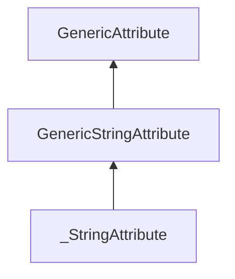

| public |
{:.api_label}

#### Inheritance Graph

## Description

Empty base class for [_StringAttribute](classUtil_1_1%5F%5FStringAttribute) to allow dynamic casting

**Author**: Benjamin Eikel

**Date**: 2011-06-10

## Public Types

|
| ------: | ----------------- |
|  | |
| typedef [GenericStringAttribute](classUtil_1_1GenericStringAttribute) | **[attr_t](#classUtil_1_1GenericStringAttribute_1a0598b547a972bfc4d578c1fda3de7bd7)**  |
{: .nohead .nowrap1 .api_section }

## Protected Functions

|
| ------: | ----------------- |
|  | |
|  | **[~GenericStringAttribute](#classUtil_1_1GenericStringAttribute_1afe6be51e0d9faea5c9812f065770b0c9)**() |
{: .nohead .nowrap1 .api_section }

-------------------------------------------------------------------

## Documentation

### <small>typedef</small>  Util::GenericStringAttribute::attr_t {#classUtil_1_1GenericStringAttribute_1a0598b547a972bfc4d578c1fda3de7bd7}

| public |
{:.api_label}

|
| ------: | ----------------- |
|  |
| typedef [GenericStringAttribute](classUtil_1_1GenericStringAttribute) **[attr_t](#classUtil_1_1GenericStringAttribute_1a0598b547a972bfc4d578c1fda3de7bd7)**  |
{: .nohead .nowrap1 .api_doc }

Defined in `Util/GenericAttribute.h:406`{:style="float: right"}

-------------------------------------------------------------------

### <small>function</small>  Util::GenericStringAttribute::~GenericStringAttribute {#classUtil_1_1GenericStringAttribute_1afe6be51e0d9faea5c9812f065770b0c9}

| protected | inline | virtual |
{:.api_label}

|
| ------: | ----------------- |
|  |
|  **[~GenericStringAttribute](#classUtil_1_1GenericStringAttribute_1afe6be51e0d9faea5c9812f065770b0c9)**( |  ) |
{: .nohead .nowrap1 .api_doc }

Defined in `Util/GenericAttribute.h:408`{:style="float: right"}

-------------------------------------------------------------------

