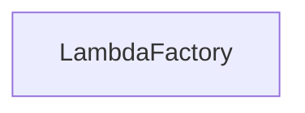

| public |
{:.api_label}

#### Inheritance Graph

## Description

[Generic](classUtil_1_1Generic) factory for objects allowing lambdas with variable number of arguments as creator functions.

The factory template can be instaniated to generate different kinds of factories. The generated factory generates objects of type*ObjectType*.

#### Parameters
**ObjectType**
:  Base type for all objects that are generated by the factory

**IdentifierType**
:  Type of the identifier that specifies which object creator to call

**FallbackPolicy**
:  Template with a function*onUnknownType()*that handles the case that the requested object type was not found

**Author**: Sascha Brandt

**Date**: 2015-05-22

*See also*: [http://meh.schizofreni.co/programming/magic/2013/01/23/function-pointer-from-lambda.html](http://meh.schizofreni.co/programming/magic/2013/01/23/function-pointer-from-lambda.html)

## Classes

|
| ------ | ----------------------------------------------------------------------------- | 
| struct | [Util::LambdaFactory::Creator](structUtil_1_1LambdaFactory_1_1Creator)    | 
{: .nohead }

## Public Types

|
| ------: | ----------------- |
|  | |
| typedef FallbackPolicy< ObjectType, IdentifierType > | **[fallbackPolicy_t](#classUtil_1_1LambdaFactory_1ac76a294288030436c3e5d4c3aeabf2ba)**  |
{: .nohead .nowrap1 .api_section }

## Public Attributes

|
| ------: | ----------------- |
|  | |
| [fallbackPolicy_t](classUtil_1_1LambdaFactory#classUtil_1_1LambdaFactory_1ac76a294288030436c3e5d4c3aeabf2ba) | **[fallbackPolicy](#classUtil_1_1LambdaFactory_1a604142d7453ddbf4010a20ea6085c726)**  |
{: .nohead .nowrap1 .api_section }

## Public Functions

|
| ------: | ----------------- |
|  | |
|  | **[LambdaFactory](#classUtil_1_1LambdaFactory_1a7f97ca069ee34bfbed108fbb9f8780bf)**() |
|  | |
|  | **[LambdaFactory](#classUtil_1_1LambdaFactory_1aa9f53e7c2c2ff44822386f8437987f53)**( [fallbackPolicy_t](classUtil_1_1LambdaFactory#classUtil_1_1LambdaFactory_1ac76a294288030436c3e5d4c3aeabf2ba)  policy) |
|  | |
|  | **[~LambdaFactory](#classUtil_1_1LambdaFactory_1ab841238824fa5eae49cb7e749850e4c5)**() |
| template< typename [ObjectCreator](classUtil_1_1ObjectCreator)   >  | |
| void | **[registerType](#classUtil_1_1LambdaFactory_1adaae1a2bc92fb486039b9c83ccec2020)**(const IdentifierType & id,  [ObjectCreator](classUtil_1_1ObjectCreator)  creator) |
|  | |
| void | **[unregisterType](#classUtil_1_1LambdaFactory_1a7eb67e41ec8ac105e860191e9e654fea)**(const IdentifierType & id) |
| template< typename... Args >  | |
| ObjectType | **[create](#classUtil_1_1LambdaFactory_1a8b59cb9bbeb40c5ad1b815cd1f6e8893)**(const IdentifierType & id, Args... args) |
{: .nohead .nowrap1 .api_section }

-------------------------------------------------------------------

## Documentation

### <small>typedef</small>  Util::LambdaFactory::fallbackPolicy_t {#classUtil_1_1LambdaFactory_1ac76a294288030436c3e5d4c3aeabf2ba}

| public |
{:.api_label}

|
| ------: | ----------------- |
|  |
| typedef FallbackPolicy< ObjectType, IdentifierType > **[fallbackPolicy_t](#classUtil_1_1LambdaFactory_1ac76a294288030436c3e5d4c3aeabf2ba)**  |
{: .nohead .nowrap1 .api_doc }

Defined in `Util/Factory/LambdaFactory.h:75`{:style="float: right"}

-------------------------------------------------------------------

### <small>variable</small>  Util::LambdaFactory::fallbackPolicy {#classUtil_1_1LambdaFactory_1a604142d7453ddbf4010a20ea6085c726}

| public |
{:.api_label}

|
| ------: | ----------------- |
|  |
| [fallbackPolicy_t](classUtil_1_1LambdaFactory#classUtil_1_1LambdaFactory_1ac76a294288030436c3e5d4c3aeabf2ba) **[fallbackPolicy](#classUtil_1_1LambdaFactory_1a604142d7453ddbf4010a20ea6085c726)**  |
{: .nohead .nowrap1 .api_doc }

Defined in `Util/Factory/LambdaFactory.h:76`{:style="float: right"}

-------------------------------------------------------------------

### <small>function</small>  Util::LambdaFactory::LambdaFactory {#classUtil_1_1LambdaFactory_1a7f97ca069ee34bfbed108fbb9f8780bf}

| public | inline |
{:.api_label}

|
| ------: | ----------------- |
|  |
|  **[LambdaFactory](#classUtil_1_1LambdaFactory_1a7f97ca069ee34bfbed108fbb9f8780bf)**( |  ) |
{: .nohead .nowrap1 .api_doc }

Defined in `Util/Factory/LambdaFactory.h:77`{:style="float: right"}

-------------------------------------------------------------------

### <small>function</small>  Util::LambdaFactory::LambdaFactory {#classUtil_1_1LambdaFactory_1aa9f53e7c2c2ff44822386f8437987f53}

| public | inline |
{:.api_label}

|
| ------: | ----------------- |
|  |
|  **[LambdaFactory](#classUtil_1_1LambdaFactory_1aa9f53e7c2c2ff44822386f8437987f53)**( |  [fallbackPolicy_t](classUtil_1_1LambdaFactory#classUtil_1_1LambdaFactory_1ac76a294288030436c3e5d4c3aeabf2ba)  | **policy** ) |
{: .nohead .nowrap1 .api_doc }

Defined in `Util/Factory/LambdaFactory.h:79`{:style="float: right"}

-------------------------------------------------------------------

### <small>function</small>  Util::LambdaFactory::~LambdaFactory {#classUtil_1_1LambdaFactory_1ab841238824fa5eae49cb7e749850e4c5}

| public | inline |
{:.api_label}

|
| ------: | ----------------- |
|  |
|  **[~LambdaFactory](#classUtil_1_1LambdaFactory_1ab841238824fa5eae49cb7e749850e4c5)**( |  ) |
{: .nohead .nowrap1 .api_doc }

Defined in `Util/Factory/LambdaFactory.h:81`{:style="float: right"}

-------------------------------------------------------------------

### <small>function</small>  Util::LambdaFactory::registerType {#classUtil_1_1LambdaFactory_1adaae1a2bc92fb486039b9c83ccec2020}

| public | inline |
{:.api_label}

|
| ------: | ----------------- |
| template< typename [ObjectCreator](classUtil_1_1ObjectCreator)   > |
| void **[registerType](#classUtil_1_1LambdaFactory_1adaae1a2bc92fb486039b9c83ccec2020)**( | const IdentifierType & | **id**, |
| |  [ObjectCreator](classUtil_1_1ObjectCreator)  | **creator** |
|   ) |
{: .nohead .nowrap1 .api_doc }

Defined in `Util/Factory/LambdaFactory.h:87`{:style="float: right"}

-------------------------------------------------------------------

### <small>function</small>  Util::LambdaFactory::unregisterType {#classUtil_1_1LambdaFactory_1a7eb67e41ec8ac105e860191e9e654fea}

| public | inline |
{:.api_label}

|
| ------: | ----------------- |
|  |
| void **[unregisterType](#classUtil_1_1LambdaFactory_1a7eb67e41ec8ac105e860191e9e654fea)**( | const IdentifierType & | **id** ) |
{: .nohead .nowrap1 .api_doc }

Defined in `Util/Factory/LambdaFactory.h:97`{:style="float: right"}

-------------------------------------------------------------------

### <small>function</small>  Util::LambdaFactory::create {#classUtil_1_1LambdaFactory_1a8b59cb9bbeb40c5ad1b815cd1f6e8893}

| public | inline |
{:.api_label}

|
| ------: | ----------------- |
| template< typename... Args > |
| ObjectType **[create](#classUtil_1_1LambdaFactory_1a8b59cb9bbeb40c5ad1b815cd1f6e8893)**( | const IdentifierType & | **id**, |
| | Args... | **args** |
|   ) |
{: .nohead .nowrap1 .api_doc }

Defined in `Util/Factory/LambdaFactory.h:105`{:style="float: right"}

-------------------------------------------------------------------

