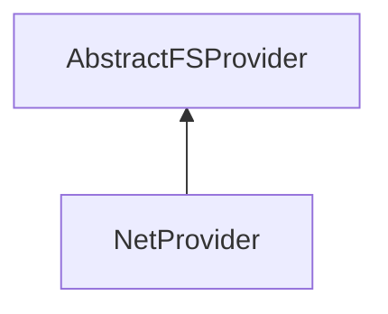

| public |
{:.api_label}

#### Inheritance Graph

## Description

File system provider for network protocols (FTP, HTTP, etc.) using libcurl.

**Author**: Benjamin Eikel

**Date**: 2011-01-21

## Public Static Functions

|
| ------: | ----------------- |
|  | |
| bool | **[init](#classUtil_1_1NetProvider_1aa0b329747f0226fe8ba03e851937fca7)**() |
{: .nohead .nowrap1 .api_section }

## Public Functions

|
| ------: | ----------------- |
|  | |
|  | **[NetProvider](#classUtil_1_1NetProvider_1a0fd5c2b685b0ba3611d9390d90978af5)**() |
|  | |
|  | **[~NetProvider](#classUtil_1_1NetProvider_1a819655900802aa6958296fffb8e17936)**() |
|  | |
| [status_t](classUtil_1_1AbstractFSProvider#classUtil_1_1AbstractFSProvider_1ac1f19c7bea3fe510a6edc3f2b0db3cae) | **[readFile](#classUtil_1_1NetProvider_1a407852f178c06c4aeda675b96d2e6eb1)**(const [FileName](classUtil_1_1FileName) & url, std::vector< uint8_t > & data) |
|  | |
| bool | **[isFile](#classUtil_1_1NetProvider_1ad0c364ee9e29fd7382268e1b1bbe8d1a)**(const [FileName](classUtil_1_1FileName) & url) |
{: .nohead .nowrap1 .api_section }

-------------------------------------------------------------------

## Documentation

### <small>function</small>  Util::NetProvider::init {#classUtil_1_1NetProvider_1aa0b329747f0226fe8ba03e851937fca7}

| public | static |
{:.api_label}

|
| ------: | ----------------- |
|  |
| bool **[init](#classUtil_1_1NetProvider_1aa0b329747f0226fe8ba03e851937fca7)**( |  ) |
{: .nohead .nowrap1 .api_doc }

Defined in `Util/IO/NetProvider.h:32`{:style="float: right"}

-------------------------------------------------------------------

### <small>function</small>  Util::NetProvider::NetProvider {#classUtil_1_1NetProvider_1a0fd5c2b685b0ba3611d9390d90978af5}

| public |
{:.api_label}

|
| ------: | ----------------- |
|  |
|  **[NetProvider](#classUtil_1_1NetProvider_1a0fd5c2b685b0ba3611d9390d90978af5)**( |  ) |
{: .nohead .nowrap1 .api_doc }

Defined in `Util/IO/NetProvider.h:34`{:style="float: right"}

-------------------------------------------------------------------

### <small>function</small>  Util::NetProvider::~NetProvider {#classUtil_1_1NetProvider_1a819655900802aa6958296fffb8e17936}

| public | virtual |
{:.api_label}

|
| ------: | ----------------- |
|  |
|  **[~NetProvider](#classUtil_1_1NetProvider_1a819655900802aa6958296fffb8e17936)**( |  ) |
{: .nohead .nowrap1 .api_doc }

Defined in `Util/IO/NetProvider.h:35`{:style="float: right"}

-------------------------------------------------------------------

### <small>function</small>  Util::NetProvider::readFile {#classUtil_1_1NetProvider_1a407852f178c06c4aeda675b96d2e6eb1}

| public | virtual |
{:.api_label}

|
| ------: | ----------------- |
|  |
| [status_t](classUtil_1_1AbstractFSProvider#classUtil_1_1AbstractFSProvider_1ac1f19c7bea3fe510a6edc3f2b0db3cae) **[readFile](#classUtil_1_1NetProvider_1a407852f178c06c4aeda675b96d2e6eb1)**( | const [FileName](classUtil_1_1FileName) & | **url**, |
| | std::vector< uint8_t > & | **data** |
|   ) |
{: .nohead .nowrap1 .api_doc }

Defined in `Util/IO/NetProvider.h:37`{:style="float: right"}

-------------------------------------------------------------------

### <small>function</small>  Util::NetProvider::isFile {#classUtil_1_1NetProvider_1ad0c364ee9e29fd7382268e1b1bbe8d1a}

| public | virtual |
{:.api_label}

|
| ------: | ----------------- |
|  |
| bool **[isFile](#classUtil_1_1NetProvider_1ad0c364ee9e29fd7382268e1b1bbe8d1a)**( | const [FileName](classUtil_1_1FileName) & | **url** ) |
{: .nohead .nowrap1 .api_doc }

Defined in `Util/IO/NetProvider.h:39`{:style="float: right"}

-------------------------------------------------------------------

