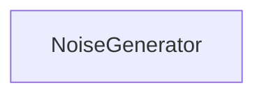

| public |
{:.api_label}

#### Inheritance Graph

## Description

Based on noise function by Ken Perlin

*See also*: [http://www.noisemachine.com/talk1/](http://www.noisemachine.com/talk1/)

Improved Noise reference implementation[http://mrl.nyu.edu/~perlin/noise/](http://mrl.nyu.edu/~perlin/noise/)

## Public Functions

|
| ------: | ----------------- |
|  | |
|  | **[NoiseGenerator](#classUtil_1_1NoiseGenerator_1a35aba0918aa8e3cc19d04268e184f293)**(uint32_t seed) |
|  | |
|  | **[~NoiseGenerator](#classUtil_1_1NoiseGenerator_1ac8963d4691f72e35e773518aab6f8f3f)**() |
|  | |
| float | **[get](#classUtil_1_1NoiseGenerator_1abc6f6fb1a1437ea50ffa4c49efe4c109)**(const float x, const float y, const float z) const |
{: .nohead .nowrap1 .api_section }

-------------------------------------------------------------------

## Documentation

### <small>function</small>  Util::NoiseGenerator::NoiseGenerator {#classUtil_1_1NoiseGenerator_1a35aba0918aa8e3cc19d04268e184f293}

| public |
{:.api_label}

|
| ------: | ----------------- |
|  |
|  **[NoiseGenerator](#classUtil_1_1NoiseGenerator_1a35aba0918aa8e3cc19d04268e184f293)**( | uint32_t | **seed** ) |
{: .nohead .nowrap1 .api_doc }

Defined in `Util/Graphics/NoiseGenerator.h:26`{:style="float: right"}

-------------------------------------------------------------------

### <small>function</small>  Util::NoiseGenerator::~NoiseGenerator {#classUtil_1_1NoiseGenerator_1ac8963d4691f72e35e773518aab6f8f3f}

| public | inline |
{:.api_label}

|
| ------: | ----------------- |
|  |
|  **[~NoiseGenerator](#classUtil_1_1NoiseGenerator_1ac8963d4691f72e35e773518aab6f8f3f)**( |  ) |
{: .nohead .nowrap1 .api_doc }

Defined in `Util/Graphics/NoiseGenerator.h:27`{:style="float: right"}

-------------------------------------------------------------------

### <small>function</small>  Util::NoiseGenerator::get {#classUtil_1_1NoiseGenerator_1abc6f6fb1a1437ea50ffa4c49efe4c109}

| public | const |
{:.api_label}

|
| ------: | ----------------- |
|  |
| float **[get](#classUtil_1_1NoiseGenerator_1abc6f6fb1a1437ea50ffa4c49efe4c109)**( | const float | **x**, |
| | const float | **y**, |
| | const float | **z** |
|   ) const |
{: .nohead .nowrap1 .api_doc }

Evaluate Perlin's noise function for the given coordinates.

> **Note**: The noise is always zero for integer values.

#### Parameters
**x**
:  Input coordinate for the first dimension.

**y**
:  Input coordinate for the second dimension.

**z**
:  Input coordinate for the third dimension.

#### Returns
Noise value from [-1.0f, 1.0f].

Defined in `Util/Graphics/NoiseGenerator.h:39`{:style="float: right"}

-------------------------------------------------------------------

