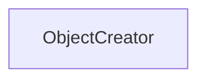

| public |
{:.api_label}

#### Inheritance Graph

## Description

[Generic](classUtil_1_1Generic) creator for objects.

This functor returns a new object of type*ObjectType*.

#### Parameters
**ObjectType**
:  Concrete type of object that will be created

**Author**: Benjamin Eikel

**Date**: 2012-02-07

## Public Functions

|
| ------: | ----------------- |
|  | |
| ObjectType * | **[operator()](#classUtil_1_1ObjectCreator_1a07583762901f20125ee46c9141cfe0fb)**() |
{: .nohead .nowrap1 .api_section }

-------------------------------------------------------------------

## Documentation

### <small>function</small>  Util::ObjectCreator::operator() {#classUtil_1_1ObjectCreator_1a07583762901f20125ee46c9141cfe0fb}

| public | inline |
{:.api_label}

|
| ------: | ----------------- |
|  |
| ObjectType * **[operator()](#classUtil_1_1ObjectCreator_1a07583762901f20125ee46c9141cfe0fb)**( |  ) |
{: .nohead .nowrap1 .api_doc }

Defined in `Util/Factory/Factory.h:84`{:style="float: right"}

-------------------------------------------------------------------

