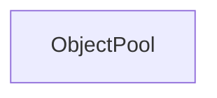

| public |
{:.api_label}

#### Inheritance Graph

## Description

[Generic](classUtil_1_1Generic) object pool for objects.

The pool template can be instaniated to generate different kinds of pools. The generated pool generates and pools objects of type*ObjectType*. It hashes the parameters used to create an object and stores it in a map. If an object with the same hash already exists, it is returned instead of creating a new one.

#### Parameters
**ObjectType**
:  Base type for all objects that are generated by the factory

**IdentifierType**
:  Type of the identifier that specifies which object pool to call

**FallbackPolicy**
:  Template with a function*onUnknownType()*that handles the case that the requested object type was not found

## Classes

|
| ------ | ----------------------------------------------------------------- | 
| struct | [Util::ObjectPool::Pool](structUtil_1_1ObjectPool_1_1Pool)    | 
{: .nohead }

## Public Types

|
| ------: | ----------------- |
|  | |
| typedef FallbackPolicy< ObjectType, IdentifierType > | **[fallbackPolicy_t](#classUtil_1_1ObjectPool_1a233950d4d367e30823633c7946150655)**  |
{: .nohead .nowrap1 .api_section }

## Public Attributes

|
| ------: | ----------------- |
|  | |
| [fallbackPolicy_t](classUtil_1_1ObjectPool#classUtil_1_1ObjectPool_1a233950d4d367e30823633c7946150655) | **[fallbackPolicy](#classUtil_1_1ObjectPool_1addb9d28dc5581f29b9df6e7214c6245c)**  |
{: .nohead .nowrap1 .api_section }

## Public Functions

|
| ------: | ----------------- |
|  | |
|  | **[ObjectPool](#classUtil_1_1ObjectPool_1a479fb67db11168d5fe362bd6a9cfa986)**() |
|  | |
|  | **[ObjectPool](#classUtil_1_1ObjectPool_1a34ea8bb7987204b073ec8096b616cfd6)**( [fallbackPolicy_t](classUtil_1_1ObjectPool#classUtil_1_1ObjectPool_1a233950d4d367e30823633c7946150655)  policy) |
|  | |
|  | **[~ObjectPool](#classUtil_1_1ObjectPool_1a702456183dc9fee58018c0522cef7a78)**() |
|  | |
| void | **[registerType](#classUtil_1_1ObjectPool_1a27e8ab000cda20989b5c52baa09f0b7a)**(const IdentifierType & id,  [ObjectCreator](classUtil_1_1ObjectCreator)  creator) |
|  | |
| void | **[unregisterType](#classUtil_1_1ObjectPool_1a36004f38f5855a5fb9ee5d5fc7af5aff)**(const IdentifierType & id) |
|  | |
| ObjectType | **[create](#classUtil_1_1ObjectPool_1a418603ed0f515362ef21ebb9c6b91992)**(const IdentifierType & id) |
|  | |
| void | **[free](#classUtil_1_1ObjectPool_1afbd491c4476468e5c0afc27ce7b83aa4)**(const IdentifierType & id, const ObjectType & obj) |
|  | |
| void | **[reset](#classUtil_1_1ObjectPool_1a82e39fb6530323b1d481c89402826fc7)**() |
{: .nohead .nowrap1 .api_section }

-------------------------------------------------------------------

## Documentation

### <small>typedef</small>  Util::ObjectPool::fallbackPolicy_t {#classUtil_1_1ObjectPool_1a233950d4d367e30823633c7946150655}

| public |
{:.api_label}

|
| ------: | ----------------- |
|  |
| typedef FallbackPolicy< ObjectType, IdentifierType > **[fallbackPolicy_t](#classUtil_1_1ObjectPool_1a233950d4d367e30823633c7946150655)**  |
{: .nohead .nowrap1 .api_doc }

Defined in `Util/Factory/ObjectPool.h:50`{:style="float: right"}

-------------------------------------------------------------------

### <small>variable</small>  Util::ObjectPool::fallbackPolicy {#classUtil_1_1ObjectPool_1addb9d28dc5581f29b9df6e7214c6245c}

| public |
{:.api_label}

|
| ------: | ----------------- |
|  |
| [fallbackPolicy_t](classUtil_1_1ObjectPool#classUtil_1_1ObjectPool_1a233950d4d367e30823633c7946150655) **[fallbackPolicy](#classUtil_1_1ObjectPool_1addb9d28dc5581f29b9df6e7214c6245c)**  |
{: .nohead .nowrap1 .api_doc }

Defined in `Util/Factory/ObjectPool.h:51`{:style="float: right"}

-------------------------------------------------------------------

### <small>function</small>  Util::ObjectPool::ObjectPool {#classUtil_1_1ObjectPool_1a479fb67db11168d5fe362bd6a9cfa986}

| public | inline |
{:.api_label}

|
| ------: | ----------------- |
|  |
|  **[ObjectPool](#classUtil_1_1ObjectPool_1a479fb67db11168d5fe362bd6a9cfa986)**( |  ) |
{: .nohead .nowrap1 .api_doc }

Defined in `Util/Factory/ObjectPool.h:52`{:style="float: right"}

-------------------------------------------------------------------

### <small>function</small>  Util::ObjectPool::ObjectPool {#classUtil_1_1ObjectPool_1a34ea8bb7987204b073ec8096b616cfd6}

| public | inline |
{:.api_label}

|
| ------: | ----------------- |
|  |
|  **[ObjectPool](#classUtil_1_1ObjectPool_1a34ea8bb7987204b073ec8096b616cfd6)**( |  [fallbackPolicy_t](classUtil_1_1ObjectPool#classUtil_1_1ObjectPool_1a233950d4d367e30823633c7946150655)  | **policy** ) |
{: .nohead .nowrap1 .api_doc }

Defined in `Util/Factory/ObjectPool.h:53`{:style="float: right"}

-------------------------------------------------------------------

### <small>function</small>  Util::ObjectPool::~ObjectPool {#classUtil_1_1ObjectPool_1a702456183dc9fee58018c0522cef7a78}

| public |
{:.api_label}

|
| ------: | ----------------- |
|  |
|  **[~ObjectPool](#classUtil_1_1ObjectPool_1a702456183dc9fee58018c0522cef7a78)**( |  ) |
{: .nohead .nowrap1 .api_doc }

Defined in `Util/Factory/ObjectPool.h:54`{:style="float: right"}

-------------------------------------------------------------------

### <small>function</small>  Util::ObjectPool::registerType {#classUtil_1_1ObjectPool_1a27e8ab000cda20989b5c52baa09f0b7a}

| public | inline |
{:.api_label}

|
| ------: | ----------------- |
|  |
| void **[registerType](#classUtil_1_1ObjectPool_1a27e8ab000cda20989b5c52baa09f0b7a)**( | const IdentifierType & | **id**, |
| |  [ObjectCreator](classUtil_1_1ObjectCreator)  | **creator** |
|   ) |
{: .nohead .nowrap1 .api_doc }

Defined in `Util/Factory/ObjectPool.h:56`{:style="float: right"}

-------------------------------------------------------------------

### <small>function</small>  Util::ObjectPool::unregisterType {#classUtil_1_1ObjectPool_1a36004f38f5855a5fb9ee5d5fc7af5aff}

| public | inline |
{:.api_label}

|
| ------: | ----------------- |
|  |
| void **[unregisterType](#classUtil_1_1ObjectPool_1a36004f38f5855a5fb9ee5d5fc7af5aff)**( | const IdentifierType & | **id** ) |
{: .nohead .nowrap1 .api_doc }

Defined in `Util/Factory/ObjectPool.h:63`{:style="float: right"}

-------------------------------------------------------------------

### <small>function</small>  Util::ObjectPool::create {#classUtil_1_1ObjectPool_1a418603ed0f515362ef21ebb9c6b91992}

| public | inline |
{:.api_label}

|
| ------: | ----------------- |
|  |
| ObjectType **[create](#classUtil_1_1ObjectPool_1a418603ed0f515362ef21ebb9c6b91992)**( | const IdentifierType & | **id** ) |
{: .nohead .nowrap1 .api_doc }

Defined in `Util/Factory/ObjectPool.h:67`{:style="float: right"}

-------------------------------------------------------------------

### <small>function</small>  Util::ObjectPool::free {#classUtil_1_1ObjectPool_1afbd491c4476468e5c0afc27ce7b83aa4}

| public | inline |
{:.api_label}

|
| ------: | ----------------- |
|  |
| void **[free](#classUtil_1_1ObjectPool_1afbd491c4476468e5c0afc27ce7b83aa4)**( | const IdentifierType & | **id**, |
| | const ObjectType & | **obj** |
|   ) |
{: .nohead .nowrap1 .api_doc }

Defined in `Util/Factory/ObjectPool.h:78`{:style="float: right"}

-------------------------------------------------------------------

### <small>function</small>  Util::ObjectPool::reset {#classUtil_1_1ObjectPool_1a82e39fb6530323b1d481c89402826fc7}

| public | inline |
{:.api_label}

|
| ------: | ----------------- |
|  |
| void **[reset](#classUtil_1_1ObjectPool_1a82e39fb6530323b1d481c89402826fc7)**( |  ) |
{: .nohead .nowrap1 .api_doc }

Defined in `Util/Factory/ObjectPool.h:84`{:style="float: right"}

-------------------------------------------------------------------

