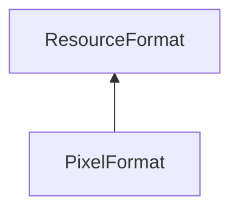

| public |
{:.api_label}

#### Inheritance Graph

## Description

Representation of the pixel data format.
> **Note**: if a color component (r,g,b or a) is not set, its byteOffset is set to the constant NONE.

## Public Static Attributes

|
| ------: | ----------------- |
|  | |
| const uint8_t | **[NONE](#classUtil_1_1PixelFormat_1a4cdb7deddf942fd796649349d87dbfa4)**  |
|  | |
| const [StringIdentifier](classUtil_1_1StringIdentifier) | **[COLOR](#classUtil_1_1PixelFormat_1a1020df290a462f33bb20dab3bb2b8d3e)**  |
|  | |
| const [PixelFormat](classUtil_1_1PixelFormat) | **[RGB](#classUtil_1_1PixelFormat_1a548cfd20f5c9dc4617e26c3f9e9230e4)**  |
|  | |
| const [PixelFormat](classUtil_1_1PixelFormat) | **[RGB_FLOAT](#classUtil_1_1PixelFormat_1a88c221b9c18cf516699072e62dc00544)**  |
|  | |
| const [PixelFormat](classUtil_1_1PixelFormat) | **[BGR](#classUtil_1_1PixelFormat_1a3fdc277afc5f6e6869aa12faae2c19d9)**  |
|  | |
| const [PixelFormat](classUtil_1_1PixelFormat) | **[BGR_FLOAT](#classUtil_1_1PixelFormat_1ae58457f679ce79a946a555a4ef392863)**  |
|  | |
| const [PixelFormat](classUtil_1_1PixelFormat) | **[RGBA](#classUtil_1_1PixelFormat_1af8a98b63f0f9b9702279fbd2c9ec1d16)**  |
|  | |
| const [PixelFormat](classUtil_1_1PixelFormat) | **[RGBA_FLOAT](#classUtil_1_1PixelFormat_1a2e3a4542d517bb2573e9fb88f073d2c5)**  |
|  | |
| const [PixelFormat](classUtil_1_1PixelFormat) | **[BGRA](#classUtil_1_1PixelFormat_1ab1e85f0c17aea7ad74a275131c362964)**  |
|  | |
| const [PixelFormat](classUtil_1_1PixelFormat) | **[BGRA_FLOAT](#classUtil_1_1PixelFormat_1ac6030ffbf67a67e54c06573d1b72ea8b)**  |
|  | |
| const [PixelFormat](classUtil_1_1PixelFormat) | **[MONO](#classUtil_1_1PixelFormat_1af36acb40f7a24a25b5b50c830471474a)**  |
|  | |
| const [PixelFormat](classUtil_1_1PixelFormat) | **[MONO_FLOAT](#classUtil_1_1PixelFormat_1a03b396c8765981d9af7e955671ae288b)**  |
|  | |
| const [PixelFormat](classUtil_1_1PixelFormat) | **[UNKNOWN](#classUtil_1_1PixelFormat_1afe4ff8bb8c64371a0919002bb4240439)**  |
{: .nohead .nowrap1 .api_section }

## Public Functions

|
| ------: | ----------------- |
|  | |
|  | **[PixelFormat](#classUtil_1_1PixelFormat_1a64276390b78239b9481e7dffc2294a40)**( [TypeConstant](group%5F%5Futil%5F%5Fhelper#group%5F%5Futil%5F%5Fhelper_1ga1a435620d3040a5fff9aa70ec2be94a1)  valueType, uint8_t _byteOffset_r, uint8_t _byteOffset_g, uint8_t _byteOffset_b, uint8_t _byteOffset_a) |
|  | |
| uint8_t | **[getByteOffset_r](#classUtil_1_1PixelFormat_1aece7cb54676fd3445b6f0299db199431)**() const |
|  | |
| uint8_t | **[getByteOffset_g](#classUtil_1_1PixelFormat_1aa30c298b3f5b2a7a9fedaae76a35f747)**() const |
|  | |
| uint8_t | **[getByteOffset_b](#classUtil_1_1PixelFormat_1a077cb0117f6c54f07eabc39a5b8bce96)**() const |
|  | |
| uint8_t | **[getByteOffset_a](#classUtil_1_1PixelFormat_1a95a84793b531412a2136986ba6e8cf65)**() const |
|  | |
| uint16_t | **[getBytesPerPixel](#classUtil_1_1PixelFormat_1afb82f7dae3fac59ef0adbcf4f03b805c)**() const |
|  | |
| uint8_t | **[getNumComponents](#classUtil_1_1PixelFormat_1a504d0e7b7438e042254cf85bdf36de8a)**() const |
|  | |
| uint8_t | **[getBytesPerComponent](#classUtil_1_1PixelFormat_1a09cdc5b6342a9404a84c557956c531b9)**() const |
|  | |
| [TypeConstant](group%5F%5Futil%5F%5Fhelper#group%5F%5Futil%5F%5Fhelper_1ga1a435620d3040a5fff9aa70ec2be94a1) | **[getValueType](#classUtil_1_1PixelFormat_1a21b01bfc6b9fd548c87e88d991ba6d8a)**() const |
|  | |
| bool | **[isValid](#classUtil_1_1PixelFormat_1a7b71c060ad86d6367fe2ef12cb3276be)**() const |
{: .nohead .nowrap1 .api_section }

-------------------------------------------------------------------

## Documentation

### <small>variable</small>  Util::PixelFormat::NONE {#classUtil_1_1PixelFormat_1a4cdb7deddf942fd796649349d87dbfa4}

| public | static |
{:.api_label}

|
| ------: | ----------------- |
|  |
| const uint8_t **[NONE](#classUtil_1_1PixelFormat_1a4cdb7deddf942fd796649349d87dbfa4)**  |
{: .nohead .nowrap1 .api_doc }

Defined in `Util/Graphics/PixelFormat.h:37`{:style="float: right"}

-------------------------------------------------------------------

### <small>variable</small>  Util::PixelFormat::COLOR {#classUtil_1_1PixelFormat_1a1020df290a462f33bb20dab3bb2b8d3e}

| public | static |
{:.api_label}

|
| ------: | ----------------- |
|  |
| const [StringIdentifier](classUtil_1_1StringIdentifier) **[COLOR](#classUtil_1_1PixelFormat_1a1020df290a462f33bb20dab3bb2b8d3e)**  |
{: .nohead .nowrap1 .api_doc }

Defined in `Util/Graphics/PixelFormat.h:38`{:style="float: right"}

-------------------------------------------------------------------

### <small>variable</small>  Util::PixelFormat::RGB {#classUtil_1_1PixelFormat_1a548cfd20f5c9dc4617e26c3f9e9230e4}

| public | static |
{:.api_label}

|
| ------: | ----------------- |
|  |
| const [PixelFormat](classUtil_1_1PixelFormat) **[RGB](#classUtil_1_1PixelFormat_1a548cfd20f5c9dc4617e26c3f9e9230e4)**  |
{: .nohead .nowrap1 .api_doc }

Defined in `Util/Graphics/PixelFormat.h:57`{:style="float: right"}

-------------------------------------------------------------------

### <small>variable</small>  Util::PixelFormat::RGB_FLOAT {#classUtil_1_1PixelFormat_1a88c221b9c18cf516699072e62dc00544}

| public | static |
{:.api_label}

|
| ------: | ----------------- |
|  |
| const [PixelFormat](classUtil_1_1PixelFormat) **[RGB_FLOAT](#classUtil_1_1PixelFormat_1a88c221b9c18cf516699072e62dc00544)**  |
{: .nohead .nowrap1 .api_doc }

Defined in `Util/Graphics/PixelFormat.h:58`{:style="float: right"}

-------------------------------------------------------------------

### <small>variable</small>  Util::PixelFormat::BGR {#classUtil_1_1PixelFormat_1a3fdc277afc5f6e6869aa12faae2c19d9}

| public | static |
{:.api_label}

|
| ------: | ----------------- |
|  |
| const [PixelFormat](classUtil_1_1PixelFormat) **[BGR](#classUtil_1_1PixelFormat_1a3fdc277afc5f6e6869aa12faae2c19d9)**  |
{: .nohead .nowrap1 .api_doc }

Defined in `Util/Graphics/PixelFormat.h:59`{:style="float: right"}

-------------------------------------------------------------------

### <small>variable</small>  Util::PixelFormat::BGR_FLOAT {#classUtil_1_1PixelFormat_1ae58457f679ce79a946a555a4ef392863}

| public | static |
{:.api_label}

|
| ------: | ----------------- |
|  |
| const [PixelFormat](classUtil_1_1PixelFormat) **[BGR_FLOAT](#classUtil_1_1PixelFormat_1ae58457f679ce79a946a555a4ef392863)**  |
{: .nohead .nowrap1 .api_doc }

Defined in `Util/Graphics/PixelFormat.h:60`{:style="float: right"}

-------------------------------------------------------------------

### <small>variable</small>  Util::PixelFormat::RGBA {#classUtil_1_1PixelFormat_1af8a98b63f0f9b9702279fbd2c9ec1d16}

| public | static |
{:.api_label}

|
| ------: | ----------------- |
|  |
| const [PixelFormat](classUtil_1_1PixelFormat) **[RGBA](#classUtil_1_1PixelFormat_1af8a98b63f0f9b9702279fbd2c9ec1d16)**  |
{: .nohead .nowrap1 .api_doc }

Defined in `Util/Graphics/PixelFormat.h:61`{:style="float: right"}

-------------------------------------------------------------------

### <small>variable</small>  Util::PixelFormat::RGBA_FLOAT {#classUtil_1_1PixelFormat_1a2e3a4542d517bb2573e9fb88f073d2c5}

| public | static |
{:.api_label}

|
| ------: | ----------------- |
|  |
| const [PixelFormat](classUtil_1_1PixelFormat) **[RGBA_FLOAT](#classUtil_1_1PixelFormat_1a2e3a4542d517bb2573e9fb88f073d2c5)**  |
{: .nohead .nowrap1 .api_doc }

Defined in `Util/Graphics/PixelFormat.h:62`{:style="float: right"}

-------------------------------------------------------------------

### <small>variable</small>  Util::PixelFormat::BGRA {#classUtil_1_1PixelFormat_1ab1e85f0c17aea7ad74a275131c362964}

| public | static |
{:.api_label}

|
| ------: | ----------------- |
|  |
| const [PixelFormat](classUtil_1_1PixelFormat) **[BGRA](#classUtil_1_1PixelFormat_1ab1e85f0c17aea7ad74a275131c362964)**  |
{: .nohead .nowrap1 .api_doc }

Defined in `Util/Graphics/PixelFormat.h:63`{:style="float: right"}

-------------------------------------------------------------------

### <small>variable</small>  Util::PixelFormat::BGRA_FLOAT {#classUtil_1_1PixelFormat_1ac6030ffbf67a67e54c06573d1b72ea8b}

| public | static |
{:.api_label}

|
| ------: | ----------------- |
|  |
| const [PixelFormat](classUtil_1_1PixelFormat) **[BGRA_FLOAT](#classUtil_1_1PixelFormat_1ac6030ffbf67a67e54c06573d1b72ea8b)**  |
{: .nohead .nowrap1 .api_doc }

Defined in `Util/Graphics/PixelFormat.h:64`{:style="float: right"}

-------------------------------------------------------------------

### <small>variable</small>  Util::PixelFormat::MONO {#classUtil_1_1PixelFormat_1af36acb40f7a24a25b5b50c830471474a}

| public | static |
{:.api_label}

|
| ------: | ----------------- |
|  |
| const [PixelFormat](classUtil_1_1PixelFormat) **[MONO](#classUtil_1_1PixelFormat_1af36acb40f7a24a25b5b50c830471474a)**  |
{: .nohead .nowrap1 .api_doc }

Defined in `Util/Graphics/PixelFormat.h:65`{:style="float: right"}

-------------------------------------------------------------------

### <small>variable</small>  Util::PixelFormat::MONO_FLOAT {#classUtil_1_1PixelFormat_1a03b396c8765981d9af7e955671ae288b}

| public | static |
{:.api_label}

|
| ------: | ----------------- |
|  |
| const [PixelFormat](classUtil_1_1PixelFormat) **[MONO_FLOAT](#classUtil_1_1PixelFormat_1a03b396c8765981d9af7e955671ae288b)**  |
{: .nohead .nowrap1 .api_doc }

Defined in `Util/Graphics/PixelFormat.h:66`{:style="float: right"}

-------------------------------------------------------------------

### <small>variable</small>  Util::PixelFormat::UNKNOWN {#classUtil_1_1PixelFormat_1afe4ff8bb8c64371a0919002bb4240439}

| public | static |
{:.api_label}

|
| ------: | ----------------- |
|  |
| const [PixelFormat](classUtil_1_1PixelFormat) **[UNKNOWN](#classUtil_1_1PixelFormat_1afe4ff8bb8c64371a0919002bb4240439)**  |
{: .nohead .nowrap1 .api_doc }

Defined in `Util/Graphics/PixelFormat.h:67`{:style="float: right"}

-------------------------------------------------------------------

### <small>function</small>  Util::PixelFormat::PixelFormat {#classUtil_1_1PixelFormat_1a64276390b78239b9481e7dffc2294a40}

| public | inline |
{:.api_label}

|
| ------: | ----------------- |
|  |
|  **[PixelFormat](#classUtil_1_1PixelFormat_1a64276390b78239b9481e7dffc2294a40)**( |  [TypeConstant](group%5F%5Futil%5F%5Fhelper#group%5F%5Futil%5F%5Fhelper_1ga1a435620d3040a5fff9aa70ec2be94a1)  | **valueType**, |
| | uint8_t | **_byteOffset_r**, |
| | uint8_t | **_byteOffset_g**, |
| | uint8_t | **_byteOffset_b**, |
| | uint8_t | **_byteOffset_a** |
|   ) |
{: .nohead .nowrap1 .api_doc }

Defined in `Util/Graphics/PixelFormat.h:40`{:style="float: right"}

-------------------------------------------------------------------

### <small>function</small>  Util::PixelFormat::getByteOffset_r {#classUtil_1_1PixelFormat_1aece7cb54676fd3445b6f0299db199431}

| public | const | inline |
{:.api_label}

|
| ------: | ----------------- |
|  |
| uint8_t **[getByteOffset_r](#classUtil_1_1PixelFormat_1aece7cb54676fd3445b6f0299db199431)**( |  ) const |
{: .nohead .nowrap1 .api_doc }

Defined in `Util/Graphics/PixelFormat.h:45`{:style="float: right"}

-------------------------------------------------------------------

### <small>function</small>  Util::PixelFormat::getByteOffset_g {#classUtil_1_1PixelFormat_1aa30c298b3f5b2a7a9fedaae76a35f747}

| public | const | inline |
{:.api_label}

|
| ------: | ----------------- |
|  |
| uint8_t **[getByteOffset_g](#classUtil_1_1PixelFormat_1aa30c298b3f5b2a7a9fedaae76a35f747)**( |  ) const |
{: .nohead .nowrap1 .api_doc }

Defined in `Util/Graphics/PixelFormat.h:46`{:style="float: right"}

-------------------------------------------------------------------

### <small>function</small>  Util::PixelFormat::getByteOffset_b {#classUtil_1_1PixelFormat_1a077cb0117f6c54f07eabc39a5b8bce96}

| public | const | inline |
{:.api_label}

|
| ------: | ----------------- |
|  |
| uint8_t **[getByteOffset_b](#classUtil_1_1PixelFormat_1a077cb0117f6c54f07eabc39a5b8bce96)**( |  ) const |
{: .nohead .nowrap1 .api_doc }

Defined in `Util/Graphics/PixelFormat.h:47`{:style="float: right"}

-------------------------------------------------------------------

### <small>function</small>  Util::PixelFormat::getByteOffset_a {#classUtil_1_1PixelFormat_1a95a84793b531412a2136986ba6e8cf65}

| public | const | inline |
{:.api_label}

|
| ------: | ----------------- |
|  |
| uint8_t **[getByteOffset_a](#classUtil_1_1PixelFormat_1a95a84793b531412a2136986ba6e8cf65)**( |  ) const |
{: .nohead .nowrap1 .api_doc }

Defined in `Util/Graphics/PixelFormat.h:48`{:style="float: right"}

-------------------------------------------------------------------

### <small>function</small>  Util::PixelFormat::getBytesPerPixel {#classUtil_1_1PixelFormat_1afb82f7dae3fac59ef0adbcf4f03b805c}

| public | const | inline |
{:.api_label}

|
| ------: | ----------------- |
|  |
| uint16_t **[getBytesPerPixel](#classUtil_1_1PixelFormat_1afb82f7dae3fac59ef0adbcf4f03b805c)**( |  ) const |
{: .nohead .nowrap1 .api_doc }

Defined in `Util/Graphics/PixelFormat.h:49`{:style="float: right"}

-------------------------------------------------------------------

### <small>function</small>  Util::PixelFormat::getNumComponents {#classUtil_1_1PixelFormat_1a504d0e7b7438e042254cf85bdf36de8a}

| public | const | inline |
{:.api_label}

|
| ------: | ----------------- |
|  |
| uint8_t **[getNumComponents](#classUtil_1_1PixelFormat_1a504d0e7b7438e042254cf85bdf36de8a)**( |  ) const |
{: .nohead .nowrap1 .api_doc }

Defined in `Util/Graphics/PixelFormat.h:50`{:style="float: right"}

-------------------------------------------------------------------

### <small>function</small>  Util::PixelFormat::getBytesPerComponent {#classUtil_1_1PixelFormat_1a09cdc5b6342a9404a84c557956c531b9}

| public | const | inline |
{:.api_label}

|
| ------: | ----------------- |
|  |
| uint8_t **[getBytesPerComponent](#classUtil_1_1PixelFormat_1a09cdc5b6342a9404a84c557956c531b9)**( |  ) const |
{: .nohead .nowrap1 .api_doc }

Defined in `Util/Graphics/PixelFormat.h:51`{:style="float: right"}

-------------------------------------------------------------------

### <small>function</small>  Util::PixelFormat::getValueType {#classUtil_1_1PixelFormat_1a21b01bfc6b9fd548c87e88d991ba6d8a}

| public | const | inline |
{:.api_label}

|
| ------: | ----------------- |
|  |
| [TypeConstant](group%5F%5Futil%5F%5Fhelper#group%5F%5Futil%5F%5Fhelper_1ga1a435620d3040a5fff9aa70ec2be94a1) **[getValueType](#classUtil_1_1PixelFormat_1a21b01bfc6b9fd548c87e88d991ba6d8a)**( |  ) const |
{: .nohead .nowrap1 .api_doc }

Defined in `Util/Graphics/PixelFormat.h:52`{:style="float: right"}

-------------------------------------------------------------------

### <small>function</small>  Util::PixelFormat::isValid {#classUtil_1_1PixelFormat_1a7b71c060ad86d6367fe2ef12cb3276be}

| public | const | inline |
{:.api_label}

|
| ------: | ----------------- |
|  |
| bool **[isValid](#classUtil_1_1PixelFormat_1a7b71c060ad86d6367fe2ef12cb3276be)**( |  ) const |
{: .nohead .nowrap1 .api_doc }

Defined in `Util/Graphics/PixelFormat.h:53`{:style="float: right"}

-------------------------------------------------------------------

