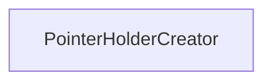

| public |
{:.api_label}

#### Inheritance Graph

## Description

Creator for objects that holds a single instance.

This functor stores a pointer to a single instance of type*ObjectType*. It returns that pointer every time a creation is requested.

#### Parameters
**ObjectType**
:  Concrete type of object that will be pointed to

**Author**: Benjamin Eikel

**Date**: 2012-02-08

## Public Functions

|
| ------: | ----------------- |
|  | |
|  | **[PointerHolderCreator](#classUtil_1_1PointerHolderCreator_1abc96d9ed4d67035c0b5e63ccfb2ac6d2)**(ObjectType * ptr) |
|  | |
| ObjectType * | **[operator()](#classUtil_1_1PointerHolderCreator_1a00e67df175d8ce6aba5dc99bf18a5d49)**() |
{: .nohead .nowrap1 .api_section }

-------------------------------------------------------------------

## Documentation

### <small>function</small>  Util::PointerHolderCreator::PointerHolderCreator {#classUtil_1_1PointerHolderCreator_1abc96d9ed4d67035c0b5e63ccfb2ac6d2}

| public | inline |
{:.api_label}

|
| ------: | ----------------- |
|  |
|  **[PointerHolderCreator](#classUtil_1_1PointerHolderCreator_1abc96d9ed4d67035c0b5e63ccfb2ac6d2)**( | ObjectType * | **ptr** ) |
{: .nohead .nowrap1 .api_doc }

Defined in `Util/Factory/Factory.h:104`{:style="float: right"}

-------------------------------------------------------------------

### <small>function</small>  Util::PointerHolderCreator::operator() {#classUtil_1_1PointerHolderCreator_1a00e67df175d8ce6aba5dc99bf18a5d49}

| public | inline |
{:.api_label}

|
| ------: | ----------------- |
|  |
| ObjectType * **[operator()](#classUtil_1_1PointerHolderCreator_1a00e67df175d8ce6aba5dc99bf18a5d49)**( |  ) |
{: .nohead .nowrap1 .api_doc }

Defined in `Util/Factory/Factory.h:106`{:style="float: right"}

-------------------------------------------------------------------

